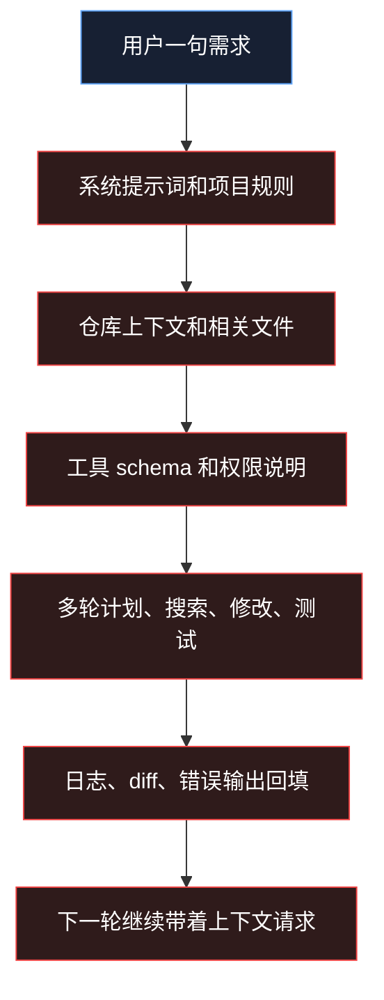
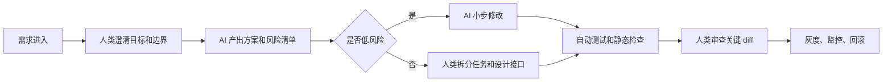

我现在越来越觉得，AI 写代码越快，程序员越要问自己一个很不舒服的问题：

如果“写出代码”这件事越来越便宜，我到底还值钱在哪？

这个问题真正把它推到台面上的，是最近越来越刺眼的 Token 账单。过去我们讨论 AI 编程，喜欢谈“效率提升了多少”“一个人能不能顶一个团队”“AI 会不会替代程序员”。但公司真正做预算时，问法会冷很多：一个功能交给 AI agent 跑，最后到底花了多少钱？这些钱换来了多少可上线、可维护、可审计的结果？

我的判断很直接：**AI 编程不会让工程成本消失，它只是把成本从“人写代码的时间”，转移到 Token、上下文、工具调用、重试、审查和事故风险上。**

所以程序员真正要保住的，不是敲代码这件事本身，而是更上游、更难量化、也更难被 AI 直接接管的能力：定义问题、设计边界、控制成本、验收结果、承担长期后果。

## 130 万美元账单，吓人的不是数字本身


上周 OpenClaw 创始人 Peter Steinberger 贴出了一张 CodexBar 130 万美元的使用截图。一个很抓眼球的数字：30 天内约 6030 亿 tokens、760 万次请求。

这个数字当然很夸张。Tom's Hardware 的报道里还提到，这些请求大约来自 100 个 Codex 实例，由一个 3 人团队围绕 OpenClaw 项目使用。PC Gamer 的报道则补了一点背景：这更像是 API 价格等价的内部消耗，不等于他个人真实掏了 130 万美元。

所以我不建议把这个案例理解成“一个程序员每月烧掉 130 万美元”。那样容易爽，但不够准。

真正值得认真看的，是另一个数字：

```text
6030 亿 tokens / 760 万次请求 ≈ 每次请求 7.9 万 tokens
```

普通聊天里，你问一句，模型答一句。AI 编程 agent 不是这样。它要读规则、读仓库、查文件、理解上下文、调用工具、看日志、生成 patch、再根据结果继续修改。你以为你是在买“写一段代码”，实际买的是一整套自动化工程循环。



我之前在[一句 hi，为什么让 Codex 吃掉 14770 个输入 token](https://huzhihui.com/blog/codex-hi-14770-input-tokens)里拆过一次真实请求。一个 `hi` 看起来只有两个字符，但真正送进模型的，是系统指令、工具定义、仓库环境、权限规则和历史上下文。那篇文章讲的是一次小请求，这次 OpenClaw 的数字讲的是大规模 agent 并发以后会发生什么。

结论很朴素：**AI 编程最贵的地方，不是“输出代码”，而是让模型每一轮都重新进入一个复杂工程现场。**

## Token 费用难以负担，因为它不是线性增长

很多人第一次算 AI 编程成本，会犯一个错误：只看模型单价。

比如 OpenAI 官网 API 价格页在 2026 年 5 月 29 日显示，GPT-5.5 标准价格是输入 5 美元/百万 token、缓存输入 0.5 美元/百万 token、输出 30 美元/百万 token；GPT-5.4 是输入 2.5 美元/百万 token、缓存输入 0.25 美元/百万 token、输出 15 美元/百万 token。

看起来只要模型降价，问题就解决了。

但 AI 编程的成本不只由单价决定。更关键的是这几个乘数：

```text
月成本 ≈
每个任务的平均输入 tokens
× 每个任务的平均轮数
× 每天任务数
× 工程师人数
× 失败重试率
× 所用模型单价
```

这里最容易失控的，不是最后一项“模型单价”，而是前面几项。

一个需求说清楚了，AI 可能两轮就能改完。一个需求边界模糊，AI 会先猜，再改，再跑，再报错，再读更多文件，再补更多 patch。每一轮都可能把规则、上下文、工具结果和历史对话重新带进去。你看到的是“它好努力”，账单看到的是“它一直在吞上下文”。

所以我不太认同一个流行说法：等模型便宜了，AI 编程成本就不是问题。

便宜当然有用，但便宜会带来另一个问题：大家会用得更多。过去舍不得让 agent 跑 20 分钟，降价以后可能就让它跑一晚上。过去一个任务开一个 agent，降价以后可能开 5 个 agent 并行对比。最后单次调用降价了，总消耗反而上去了。

这也是为什么我更关心“工程约束”，而不只关心“模型价格”。

## 大公司也会被账单教育

如果只是个人开发者抱怨 API 贵，这事还可以理解成个体消费能力问题。但最近几个信号说明，真正被 Token 成本拷问的是公司。

Fortune 在 2026 年 5 月 26 日报道，Uber COO Andrew Macdonald 在 Rapid Response 播客里谈到 AI spending 时说，很难把 Claude Code 使用量和“多交付 25% 有用的消费者功能”之间画出清晰连线。报道还引用此前消息称，Uber 到 4 月已经用完了 2026 年 AI 编程工具预算。

这句话比“预算花完了”更关键。

预算花完只是财务事件，真正刺痛管理层的是：使用量上去了，但价值证明没跟上。

微软的信号也类似。Windows Central、TechRadar 等媒体援引 The Verge 报道称，微软 Experiences + Devices 部门计划在 2026 年 6 月 30 日前收紧 Claude Code，推动团队转向 GitHub Copilot CLI。这个动作不一定只是成本原因，也有自家工具链、安全、合规、可控性等考虑。但它说明了一件事：即使是微软这样的公司，也不会把“工程师爱用”自动等同于“组织应该无限量买单”。

GitHub 自己的计费变化也很说明问题。GitHub Docs 明确写着，从 2026 年 6 月 1 日开始，Copilot 会从 request-based billing 转向 usage-based billing。换句话说，平台也在承认：一次快速聊天和一次长时间自主编码任务，不能永远按同一种单位粗略计价。

Anthropic 的 Claude Code 成本文档也写得很直白：团队使用按 API token 消耗计费，管理员需要查看历史用量，并给 workspace 设置 spend limits。

这些信号放在一起，我看到的不是“AI 编程不行”。

我看到的是：**AI 编程正在从尝鲜期进入财务约束期。**

尝鲜期看谁用得猛，财务约束期看谁用得值。

## AI 不是替代程序员，而是替代一部分低判断力劳动

所以回到那个最容易引战的问题：AI 会替代程序员吗？

我的答案是：会替代一部分，但不是按“岗位名称”替代，而是按“工作含金量”替代。

如果一个程序员的主要价值，是把已经明确的字段、页面、接口、CRUD、测试样例照着写出来，那 AI 的冲击会非常大。因为这类工作有清晰输入、清晰输出、低上下文依赖、低责任边界。AI 不一定每次都写得完美，但它足够快，足够便宜，也足够容易重试。

但真实项目里更贵的部分，往往不是这一层。

真正贵的是这些问题：

- 这个需求到底该不该做？
- 这个边界放在前端、后端、网关还是任务系统？
- 这次为了快加的字段，下个月会不会变成全链路债务？
- 这个 AI patch 改了 12 个文件，哪 2 个地方最可能出事故？
- 这段逻辑能不能上线后被观测、回滚、限流和审计？
- 这个方案今天省了两小时，会不会明年多出两个月维护成本？

AI 很擅长回答“给我写一版”。

但它不会天然替你承担“这一版进入系统以后，后果由谁负责”。

这就是程序员价值重新定价的地方。

我在[设计模式和管理能力，才是 AI Vibe Coding 时代真正的自救](https://huzhihui.com/blog/design-patterns-and-management-self-rescue-in-ai-vibe-coding-era)里说过，AI 最容易制造的不是明显错代码，而是“局部都对，整体开始散”。Token 成本又把这个问题往前推了一步：局部越快，整体越需要有人踩刹车。

## 程序员真正值钱的五种能力

如果代码产量越来越不稀缺，那程序员要把自己的价值从“我能写”迁移到“我能管”。这里的“管”不是管理岗位，而是管理复杂度。

第一种能力，是定义问题。

很多 AI 编程浪费，都是从一个模糊需求开始的。人说“帮我优化一下这个页面”，AI 就开始读文件、改样式、调组件、跑测试。问题是，优化什么？首屏速度？交互路径？视觉层级？移动端适配？可访问性？如果人类自己没有把目标收敛，AI 只会把模糊性变成多轮 token 消耗。

第二种能力，是设计边界。

AI 写代码很快，但它对边界的尊重取决于你有没有给边界。没有适配层，它就直接读供应商字段。没有状态机，它就加布尔值。没有统一入口，它就复制一条相似链路。会设计边界的人，能让 AI 在正确范围内提速。不会设计边界的人，只是在加速系统变乱。

第三种能力，是压缩上下文。

以后优秀程序员会越来越像“上下文编辑器”。他知道该给 AI 哪些文件，不该给哪些日志；知道什么时候贴最后 200 行，什么时候让工具搜索；知道什么时候该开新会话，什么时候保留历史；知道什么时候用大模型，什么时候用便宜模型。我在[看完 Claude Code 源码，这几条少烧 token 的方法你一定要知道](https://huzhihui.com/blog/claude-code-token-saving-must-know)里写过，很多时候最贵的不是问题，而是你把整个垃圾堆都塞给了模型。

第四种能力，是验收结果。

AI 生成代码以后，真正的问题才开始：它有没有改错边界？有没有吞异常？有没有破坏缓存？有没有绕过权限？有没有让测试只是“为了通过而通过”？会验收的人，可以把 AI 当杠杆。不会验收的人，只能把 AI 当老虎机。

第五种能力，是计算成本。

过去程序员很少需要关心“这次写代码本身花了多少推理成本”。以后不行了。你要知道一次 agent 任务大概多少轮、多少输入、多少输出、多少失败率；要知道什么时候该停，什么时候该换小模型，什么时候该让人直接接手。能把工程决策和财务约束连起来的人，会越来越稀缺。

## 一张表判断：这件事该不该交给 AI

我建议团队不要简单规定“能用 AI”或“不能用 AI”。更实际的做法，是按任务风险分级。

| 任务类型                       | 适合程度 | 推荐做法                           | 人的关键职责               |
| ------------------------------ | -------- | ---------------------------------- | -------------------------- |
| 补全样板代码                   | 高       | 直接用补全或小模型                 | 快速检查命名和边界         |
| 写脚本、转换格式、生成测试数据 | 高       | 给清晰输入输出，让 AI 一次性完成   | 验证结果是否覆盖异常       |
| 修局部 bug                     | 中高     | 限定文件范围，先让 AI 解释原因再改 | 判断根因是否真的成立       |
| 多文件重构                     | 中       | 先产出计划，分批执行，每批测试     | 控制变更半径和回滚路径     |
| 核心链路架构调整               | 低       | AI 只能辅助列选项和风险            | 人负责方案、边界和最终决策 |
| 安全、权限、支付、数据删除     | 很低     | 只让 AI 做审查清单和测试建议       | 人必须逐行审查和上线把关   |

这张表的重点不是保守。

重点是别把所有任务都看成“让 AI 写一下”。任务风险不同，AI 的角色也不同。有些任务 AI 可以直接执行，有些任务 AI 只能当顾问，有些任务 AI 最好只参与测试和审查。

如果团队没有这层分级，就很容易出现两种极端：要么全面禁用 AI，错过效率；要么全面放开 AI，账单和风险一起炸。

## 管 AI，比会用 AI 更值钱

未来公司真正需要的，不是“会打开 Claude Code / Codex / Cursor 的程序员”。

这会变成基本功。

真正值钱的是能把 AI 放进工程流程里的人。

比如，一个成熟的 AI 编程流程不应该是：

```text
需求来了 -> 丢给 AI -> AI 改完 -> 人看一眼 -> 合并
```

更合理的流程应该是：



这套流程里，AI 当然重要。

但更重要的是人类把问题变小、把边界画清、把风险显性化、把验收标准提前写出来。

我甚至觉得，以后高级程序员的工作会有一部分像“AI 工程调度员”：

- 给任务定预算
- 给模型定级别
- 给上下文做裁剪
- 给 agent 限权限
- 给输出设验收
- 给系统留回滚

这不是退回手工时代。

恰好相反，这是 AI 真正进入工程生产以后必然出现的新职责。

## 个人开发者更要小心“无限量错觉”

对个人来说，包月工具很容易制造一种错觉：反正我已经付钱了，不用白不用。

但包月不等于无限成本，更多时候只是供应商暂时替你平滑了成本。GitHub Copilot 从 2026 年 6 月 1 日开始转向 usage-based billing，就是一个很明显的行业方向。OpenAI API 价格页的 FAQ 也提醒，API 与 ChatGPT Plus、Business、Enterprise、Edu 是分开计费的；它支持设置预算和提醒，但限制执行可能有延迟，超额部分仍然由用户负责。

这句话翻译成人话就是：别等到账单来了才开始学成本控制。

如果你是个人开发者，我建议从今天开始养成三个习惯。

第一，任务开始前写验收标准。

不要只说“帮我改好”。你要写清楚：改哪个模块，不改哪个模块；通过哪些测试；哪些行为不能变；最多接受几个文件变更。

第二，大任务先让 AI 写计划。

不要一上来就让它改。先让它列影响面、风险点、文件清单和执行顺序。你确认以后，再让它分批动手。

第三，任务结束后复盘成本。

不用精确到每个 token，但至少要知道：这次用了几轮？是不是反复走偏？是不是因为我没说清楚导致它读了太多无关文件？下次能不能把上下文提前收窄？

这三件事看起来不像“AI 技巧”，但它们才是真正省钱、也真正提高质量的地方。

## 结语：AI 越快，人越要值钱在慢的地方

AI 会继续变快，模型也会继续降价。

但我不认为这会让程序员价值消失。

它会让一部分价值消失，尤其是那些只建立在“我能把明确需求翻译成代码”上的价值。与此同时，它也会放大另一部分价值：谁能定义问题，谁能设计边界，谁能控制成本，谁能验收结果，谁能对长期维护负责。

未来公司不会只问：你会不会用 AI？

更可能会问：

```text
你怎么保证 AI 写出来的东西值得合并？
你怎么证明这笔 Token 花得值？
你怎么防止代码越写越快，系统越改越乱？
```

这才是 AI 写代码越来越快以后，程序员最该认真回答的问题。

如果让我用一句话总结：

**AI 让写代码变便宜，但让判断力变贵了。**

谁还只把自己定位成“代码生产者”，谁就会被拿来和模型比速度、比价格、比耐力。

谁能把自己升级成“复杂度和成本的负责人”，谁才是在 AI 编程时代真正变贵的那类程序员。

## FAQ

### AI 编程是不是一定比真人程序员贵？

不一定。低风险、短上下文、边界清晰的任务，AI 编程通常很划算。真正贵的是长上下文、多轮工具调用、多 agent 并发、失败重试和人工返工叠加起来的任务。不要只看单次模型价格，要看整条工程链路的总成本。

### 公司应该禁止程序员使用 Claude Code、Codex 这类工具吗？

不应该一刀切禁止。更合理的是分级管理：低风险任务放开，高风险任务限制权限，核心链路必须有人类方案评审和 diff 审查。禁止会损失效率，放任会带来账单和质量风险。

### 程序员应该怎么证明自己在 AI 时代仍然有价值？

不要只证明自己写得快，而要证明自己能让团队少返工、少事故、少浪费 token。最有效的方式，是把需求拆清楚，把上下文压小，把 AI 输出验收好，并能解释为什么这个方案长期可维护。

### 本地模型能不能解决 Token 费用问题？

能解决一部分，但不是全部。本地模型适合隐私敏感、重复稳定、低风险的任务。复杂重构、长上下文 agent、多工具协作仍然需要很强的模型、硬件和工程调度。省掉 API 账单以后，你还要支付机器、调参、维护和效果波动的成本。

## 参考资料

- [OpenClaw creator burned through $1.3 million in OpenAI API tokens in a single month](https://www.tomshardware.com/tech-industry/artificial-intelligence/openclaw-creator-burns-through-1-3-million-in-openai-api-tokens-in-a-single-month)
- [The creator of OpenClaw used $1,300,000+ of OpenAI tokens in 30 days](https://www.pcgamer.com/software/ai/the-creator-of-openclaw-used-usd1-300-000-of-openai-tokens-in-30-days-which-is-a-hell-of-a-perk/)
- [OpenAI API pricing](https://openai.com/id-ID/api/pricing/)
- [Uber burned through its entire 2026 AI budget in four months](https://fortune.com/2026/05/26/uber-coo-ai-spending-tokens-claude-code/)
- [Microsoft cancels Claude Code licenses, shifting developers to GitHub Copilot CLI](https://www.windowscentral.com/microsoft/microsoft-cancels-claude-code-licenses-shifting-developers-to-github-copilot-cli-a-move-likely-driven-by-financial-motives)
- [GitHub Copilot billing](https://docs.github.com/en/copilot/concepts/billing)
- [Manage costs effectively: Claude Code](https://docs.anthropic.com/en/docs/claude-code/costs)

## 相关阅读

- [一句 hi，为什么让 Codex 吃掉 14770 个输入 token：逐字段拆解一次真实请求](https://huzhihui.com/blog/codex-hi-14770-input-tokens)
- [看完 Claude Code 源码，这几条少烧 token 的方法你一定要知道](https://huzhihui.com/blog/claude-code-token-saving-must-know)
- [本地 AI 编码助手从 0 配起来：先选模型，再接 Ollama、VS Code、Claude Code 和 Codex](https://huzhihui.com/blog/local-ai-coding-assistant-ollama-vscode-claude-code-codex)
- [设计模式和管理能力，才是 AI Vibe Coding 时代真正的自救](https://huzhihui.com/blog/design-patterns-and-management-self-rescue-in-ai-vibe-coding-era)
- [普通程序员最容易废掉的学习方式：什么火学什么](https://huzhihui.com/blog/ordinary-programmer-learning-trap-chasing-hot-tech)
