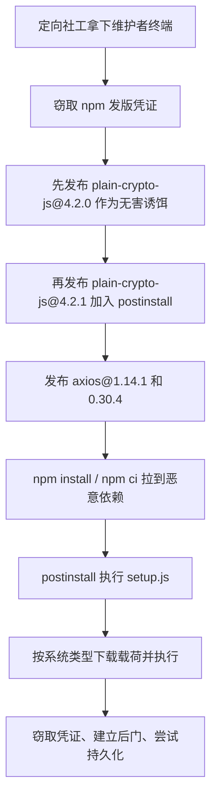

我把这次 Axios 投毒的几份公开材料连着看完，最不舒服的地方，不是有人改了多少源码。

而是几乎没改源码。

按 StepSecurity 的公开取证，`axios@1.14.1` 和上一版 `1.14.0` 做二进制对比，除去 source map，**86 个文件里只有一个文件变了：`package.json`**。库代码、类型定义、README、dist 产物，基本都没动。攻击者只是往依赖里塞了一个看起来很像加密库的东西，然后把武器放在安装阶段引爆。

这就解释了为什么官方清除建议会这么重。

如果你在 **2026 年 3 月 31 日 08:21 到 11:15（北京时间）**，也就是 **UTC 00:21 到 03:15** 之间，拉到了 `axios@1.14.1` 或 `0.30.4`，并且真的跑过一次安装流程，那这就不是“升级一下就没事”的级别。Axios 官方 post mortem 说得很直：**把那台机器上的所有 secret、token 和凭证都轮换掉，按失陷主机处理。**

一句话概括这次 Axios 供应链攻击：

不是 axios 代码本身被悄悄埋雷。

是维护者先被定向社工打穿，npm 发版链路随后失守，最后由一个伪装依赖在 `postinstall` 阶段把 RAT 送进了开发机和 CI。

先把时间线压缩到一眼能看懂：

```txt
2026-03-30 05:57 UTC   plain-crypto-js@4.2.0 发布，表面无害，用来铺路
2026-03-30 23:59 UTC   plain-crypto-js@4.2.1 发布，加入 postinstall 恶意载荷
2026-03-31 00:21 UTC   axios@1.14.1 发布，注入 plain-crypto-js@4.2.1
2026-03-31 ~01:00 UTC  axios@0.30.4 发布，同样注入
2026-03-31 03:15 UTC   两个恶意 axios 版本从 npm 下架
2026-03-31 03:29 UTC   plain-crypto-js 从 npm 下架
```

## Axios 投毒，官方已经确认了什么

先只看 Axios 官方 post mortem 和腾讯云安全通告，能确认的事实有这些：

- 受影响版本是 `axios@1.14.1` 和 `axios@0.30.4`。
- 两个版本都注入了恶意依赖 `plain-crypto-js@4.2.1`。
- 这个依赖会在安装时通过 `postinstall` 执行 `setup.js`，然后给 macOS、Windows、Linux 下发远程后门。
- 官方确认，攻击者是先通过一轮定向社会工程和 RAT 拿到了首席维护者的电脑，再利用拿到的 npm 凭证发布恶意版本。
- 官方给出的应急建议不是“删包重装”这么简单，而是：
  - 回退到 `axios@1.14.0` 或 `0.30.3`
  - 删除 `node_modules/plain-crypto-js/`
  - 轮换该机器上的所有密钥、令牌和凭证
  - 排查是否访问过 `sfrclak[.]com` 或 `142.11.206.73:8000`
  - 如果命中过 CI runner，轮换那次构建中注入过的所有 secret

这已经足够说明事情不轻。

它不是“axios 代码里冒出一个漏洞”，而是“axios 的发版链路被拿来发木马”。

## 这不是代码漏洞，是发布链路被劫持

Axios 官方在 2026 年 4 月 2 日发布的 post mortem 里写得很明确：攻击者先通过 **targeted social engineering campaign and RAT malware** 拿到了维护者电脑，然后才利用 npm 账号发布恶意版本。

官方确认到这里为止。

更戏剧化的细节，来自 Jason Saayman 后续公开描述。阮一峰在 2026 年 4 月 10 日的周刊里做了中文整理，大意是：攻击者先伪装成一家公司的人接触他，再把他拉进看起来很真的 Slack 工作区，最后安排 Teams 会议，诱导他安装一个“缺失组件”，结果那就是 RAT。

这段故事当然很像电影。

但我觉得重点不是“骗子有多会演”，而是另一件更现实的事：**高价值开源维护者，现在会被当成真正的定向攻击目标来打。**

以前大家谈供应链安全，脑子里容易想到依赖漏洞、恶意 PR、被劫持的 CDN。

这次不一样。

这次是先把“人”打穿，再借人去打发版系统。

## 为什么说攻击者几乎只改了一个 `package.json`

StepSecurity 这次公开取证里有个细节特别值得记。

他们把 `axios@1.14.0` 和 `1.14.1` 做了完整对比，结论是：**只有 `package.json` 变了。**

核心 diff 大概就是这样：

```diff
- "version": "1.14.0",
+ "version": "1.14.1",
  "dependencies": {
    "follow-redirects": "^2.1.0",
    "form-data": "^4.0.1",
    "proxy-from-env": "^2.1.0",
+   "plain-crypto-js": "^4.2.1"
  }
```

这里有两个点特别危险。

第一，它绕开了很多人最习惯看的地方。

很多团队做依赖审计、版本升级 review，第一反应还是看源码 diff、看 API 变更、看 changelog。可这次真正带毒的地方，不在业务代码，也不在 axios 的 HTTP 逻辑里，而是在 **安装阶段**。

第二，它说明现代供应链攻击根本不需要“重写一个库”。

你只要：

- 拿到发版权
- 往依赖树里塞一个伪装包
- 让这个包在 `postinstall` 里自动执行

就够了。

安装这一下，本身就是执行入口。

更细一点看，这次还有个很强的取证信号。StepSecurity 发现，正常的 axios 1.x 版本是通过 GitHub Actions + npm OIDC Trusted Publisher 发出去的，但 `1.14.1` 的 npm 元数据里没有这个 OIDC 绑定，也没有对应的 `gitHead`，发布邮箱还变成了 `ifstap@proton.me`。也就是说，这个版本看起来像“官方发版”，实际上已经偏离了原本的可信流水线。

这类信号以后会越来越重要。

因为很多攻击，不会先从你的代码审查里露馅，而是先从 **provenance 断裂** 里露馅。

## 这条攻击链是怎么跑起来的

如果把这次事情按执行顺序拆开，链路大概是这样：



这张图里，有三步尤其值得盯住。

### 第一步，攻击者先铺了一个“看起来正常”的垫子

根据 StepSecurity 时间线，`plain-crypto-js@4.2.0` 比恶意版本早大约 18 小时发布，而且内容基本就是合法 `crypto-js` 的拷贝，没有 `postinstall`。

这不是失误。

这是伪装。

一个完全没有历史的新包，直接突然出现在热门库依赖里，太扎眼了。先发一个无害版本，等于先给这个名字造一点“存在感”，再发 `4.2.1` 下毒，审计难度会高不少。

### 第二步，真正带毒的点不在 import，而在 install

`plain-crypto-js@4.2.1` 最核心的恶意动作，是在 `package.json` 里加了一句：

```json
"postinstall": "node setup.js"
```

这意味着你不用 `require` 它，不用 `import` 它，甚至业务代码根本不会主动碰它。

只要安装。

它就跑。

腾讯云通告和 StepSecurity 的公开分析都指出，这个 `setup.js` 会去连攻击者控制的 C2 `http://sfrclak[.]com:8000/6202033`，然后按操作系统下发不同载荷：

- macOS 会落到 `/Library/Caches/com.apple.act.mond`
- Linux 会落到 `/tmp/ld.py`
- Windows 会用 `%TEMP%` 下的脚本和 `%PROGRAMDATA%\\wt.exe` 之类的路径继续执行

这已经不是“依赖里有段奇怪 JS”了，而是标准的跨平台投递链。

### 第三步，它还顺手做了反取证

这次最阴的一笔，不是下载 RAT。

是下载完之后，它还试图把自己伪装回“没那么可疑”的样子。

StepSecurity 还原出一个细节：`plain-crypto-js@4.2.1` 执行后，会把一个预先放好的 `package.md` 改名成 `package.json`。这个伪装后的文件里，版本号写的是 **4.2.0**，不是 4.2.1。

于是会发生一个很烦的事：

你跑 `npm list plain-crypto-js`，结果可能看到的是 `plain-crypto-js@4.2.0`。

如果你只盯着“官方说恶意版本是 4.2.1”，就很容易误判成“那我机器上这个应该没事”。

所以这次排查里，**目录是否存在比版本号更可靠**。因为 `plain-crypto-js` 这个包压根就不该出现在任何合法的 axios 版本里。

## 怎么排查，别只看 `npm list`

如果你们团队这两天在补这件事，我会建议排查顺序直接照下面来。

先查 lockfile 和依赖目录：

```bash
grep -E "axios@(1\.14\.1|0\.30\.4)|plain-crypto-js" package-lock.json yarn.lock 2>/dev/null
ls node_modules/plain-crypto-js 2>/dev/null && echo "AFFECTED"
```

如果你们用的是 pnpm，也顺手查一下 `pnpm-lock.yaml` 以及本地 store 里有没有 `plain-crypto-js`：

```bash
grep -E "axios@(1\\.14\\.1|0\\.30\\.4)|plain-crypto-js" pnpm-lock.yaml 2>/dev/null
pnpm store path 2>/dev/null
```

然后查落地文件和历史流量：

```bash
# macOS
ls -la /Library/Caches/com.apple.act.mond 2>/dev/null && echo "COMPROMISED"

# Linux
ls -la /tmp/ld.py 2>/dev/null && echo "COMPROMISED"

# 再看历史网络流量
# sfrclak[.]com
# callnrwise[.]com
# 142.11.206.73
# 142.11.196.73
# 142.11.199.73
```

这里有个判断我建议别心软。

只要命中了受影响版本，又确实在那个时间窗内执行过安装，尤其是 CI 机器、开发机、构建机，那就别把它当成“某个 node_modules 脏了”。

要当成“那台主机的信任已经破了”。

该做的动作应该是：

- 立即回退到 `axios@1.14.0` 或 `0.30.3`
- 删除 `node_modules/plain-crypto-js`
- 清理已经落地的恶意文件
- 轮换云平台密钥、Git 凭证、npm token、SSH key、数据库密码、K8s 配置等所有可能经过该机的凭证
- 回看那段时间内的构建产物、发版记录和异常登录

这套动作看起来重。

但官方就是按这个级别在建议，你最好也按这个级别执行。

## 这次真正该补的洞，不只是“升级依赖”

很多文章写到这里会停在“请尽快升级安全版本”。

这句话当然没错，但它其实没碰到问题的核心。

Axios 这次真正暴露出来的，是三层风险。

### 1. 发版系统不能再靠个人终端硬扛

官方 post mortem 里已经写了，后续要补的包括：

- immutable release setup
- OIDC publishing
- 整体安全姿态提升
- GitHub Actions 最佳实践更新

这几个词翻译成人话，就是：**别再让一个长期有效的个人账号令牌，直接决定热门包能不能发版。**

发版这件事，应该越来越像生产环境变更，而不是“某个维护者电脑上敲个 publish”。

### 2. install scripts 该收口了

不是所有项目都能直接全局 `--ignore-scripts`，这我知道。

但这次事件至少说明，团队应该把“哪些依赖允许在安装时执行脚本”当成明确策略，而不是默认全开。尤其在 CI 里，如果某条流水线其实不需要跑 native build 或额外安装脚本，那就应该收得更紧一点。

很多时候，大家把运行时代码看得很严，反而对安装时代码太宽松。

可攻击者现在已经很会钻这条缝了。

### 3. 新版本不是越快跟越安全

这条是我的判断，不是 Axios 官方原话。

对下载量极高、传播面极广的基础库，我现在会更愿意给生产环境加一个很短的“冷静期”。比如新版本出来先过镜像、过沙箱、过行为扫描，再决定是否进入正式构建。

你可以把它理解成依赖版的 release age gate。

它不能解决所有问题，但能挡掉一部分“刚发出去几小时就出事”的供应链事故。

这次恶意版本在 npm 上总共也就活了大约 3 小时。对很多团队来说，这恰好就是能不能躲过去的差别。

## FAQ：这次 Axios 投毒，团队最容易误判的 3 个问题

### 1. 只要装过 `axios@1.14.1`，就一定中招了吗

不完全是。

真正危险的是“**在恶意版本在线的时间窗里，实际执行过安装**”。如果 lockfile、镜像缓存或者私有代理源把你固定在别的版本上，风险会低一些。

但这里别抱侥幸。

因为很多团队不是手动 `npm install axios`，而是在 CI、自动化构建、镜像更新、依赖刷新里被动拉到新版本。你以为自己没动，它其实已经装过了。

### 2. 我查到的 `plain-crypto-js` 版本是 `4.2.0`，是不是就安全了

不一定。

这次公开分析已经指出，恶意包有反取证动作，会把本地版本信息伪装回 `4.2.0`。所以排查时别只盯版本号，**先看这个目录存不存在，再看安装时间、锁文件和主机落地文件**。

说白了，`plain-crypto-js` 出现在 axios 依赖树里，本身就已经很不正常。

### 3. CI runner 为什么也要按失陷处理

因为 CI 机器往往正好握着最值钱的那批 secret。

比如 npm token、云平台 Access Key、容器镜像推送凭证、GitHub Actions secrets、部署证书、Kubernetes 配置。这类机器平时不一定有人登录，但权限往往比开发机更集中。

所以这次如果命中 CI，问题不是“这次构建有没有失败”，而是“那次构建过程中暴露过哪些凭证，它们现在是不是都该换”。

## 最后

Axios 这次事件，不是在提醒我们“npm 上偶尔会有坏包”。

它真正提醒的是另一件事：

**今天的软件供应链，已经不是代码仓库到生产环境这一条线了。**

中间还站着维护者终端、发版身份、安装脚本、CI runner、本地凭证、镜像同步策略。

攻击者也早就不只盯着源码。

谁握着发版权，谁的电脑最值钱。

如果你们团队现在还把依赖安全主要理解成“扫 CVE”，那这次 axios 投毒应该足够把这件事讲明白了。CVE 只是其中一类问题。真正更麻烦的，是有人拿着官方身份，把恶意代码当正式版本发给你。

这两者不是一个难度级别。

如果你愿意，也可以顺手回头看一眼自己团队的发版链路和安装策略。

很多时候，问题不是没人扫漏洞。

是默认信任的地方，实在太多了。

## 参考资料

- [Axios 官方 post mortem](https://github.com/axios/axios/issues/10636)
- [腾讯云安全通告：Axios 供应链投毒风险通告](https://cloud.tencent.com/announce/detail/2249)
- [StepSecurity 技术分析：axios Compromised on npm](https://www.stepsecurity.io/blog/axios-compromised-on-npm-malicious-versions-drop-remote-access-trojan)
- [阮一峰周刊：axios 投毒与好莱坞式骗术](https://www.ruanyifeng.com/blog/2026/04/weekly-issue-392.html)
