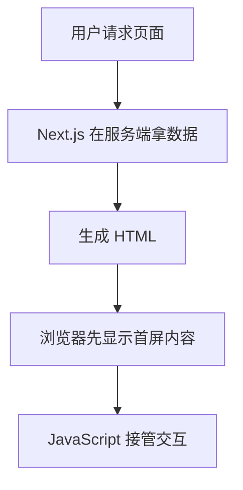

很多人第一次认真研究 SSR，不是因为突然对渲染原理有兴趣了。

而是站点开始要流量了。

官网要收录，博客要拿搜索点击，商品详情页希望标题和价格能更快被搜索引擎读到。这个时候大家才会发现，一个页面“浏览器里最后能显示出来”，和“搜索引擎第一次请求时就能高效理解它”，其实不是一回事。

Google 在 [JavaScript SEO 基础文档](https://developers.google.com/search/docs/crawling-indexing/javascript/javascript-seo-basics) 里把流程拆成 crawling、rendering、indexing。它也明确提到，Google 能执行 JavaScript，但服务端渲染或预渲染依然是很好的思路，因为这样对用户和爬虫都更快，而且不是所有 bot 都能像 Googlebot 一样把 JS 跑完整。

所以这篇我不打算把 SSR 吹成万能药。我更想把判断标准讲清楚：Next.js SSR 到底解决了什么，它没解决什么，以及在现在的 Next.js 里，你到底该怎么选。

## 先把 SSR 讲简单

SSR 是 Server Side Rendering，服务端渲染。

翻成人话，就是用户请求一个 URL 时，服务器先把这一页的主要 HTML 拼好，再把结果发给浏览器。浏览器拿到的不是一个空壳 `<div id="__next"></div>`，而是一份已经带正文、标题、列表、meta 信息的初始 HTML。随后客户端 JavaScript 再加载、hydrate，页面变得可交互。

它的时间线大概是这样的：



这里最容易被误解的一点是，SSR 不是“服务端输出一个死页面”，也不是“前端完全没用了”。它只是把“先让用户和爬虫看到什么”这一步，提前到了服务器。

## 这篇只讨论 App Router：先别把 Server Components 和 SSR 混成一件事

现在写 Next.js，新项目大多已经直接进 App Router 了。

Next.js 在 [Rendering Philosophy](https://nextjs.org/docs/app/guides/rendering-philosophy) 里讲得很清楚：static 和 dynamic 更像一个光谱，边界可以细到组件级，而不是整个页面只能二选一。

这句话放到项目里，意思其实很实在：

- `Server Components` 默认跑在服务端
- 但“跑在服务端”不等于“每次请求都重新渲染整页”
- 对所有访客都一样、又能提前确定的内容，Next.js 会尽量 prerender
- 真正把某一段内容推迟到 request-time 的，往往是 `cookies()`、`headers()`、`searchParams` 这类请求期信息，或者你明确调用了 `connection()`

也就是说，**App Router 的主流做法不是“全站 SSR”，而是把共享内容尽量预渲染，把跟人、地区、时间、会话强相关的那一小块放到请求时处理。**

## 为什么 SSR 对 SEO 更友好

核心原因不复杂：**搜索引擎第一次收到的 HTML，更接近一页完整内容，而不是一页等待 JavaScript 补全的壳。**

这会直接影响几件事。

第一，主内容更早可见。

如果正文标题、摘要、列表、内链、canonical、title、description 都在首个 HTML 响应里，爬虫第一次处理这个 URL 时，理解成本就低很多。Google 虽然能跑 JS，但它自己的文档也提醒，HTML 里直接有内容的服务端渲染或预渲染页面，对抓取和渲染都更友好。

第二，元信息更稳定。

Next.js 在 [Metadata API 文档](https://nextjs.org/docs/app/getting-started/metadata-and-og-images) 里把 `metadata` 和 `generateMetadata` 明确限定在 Server Components 侧，就是为了让 title、description、OG、robots、sitemap 这些信息能更早被正确产出。文档还专门提到，对需要在 `<head>` 里拿到 metadata 的 bots 和 crawlers，动态 metadata 不会靠“先出 UI 后补 head”这条路来糊过去。

第三，首屏语义更完整。

一个 CSR 页面常见的首响可能只有容器、脚本和 loading。一个 SSR 页面，第一次返回时就可能已经带上 `h1`、正文段落、商品名、价格、相关推荐链接。这对搜索引擎、社交抓取 bot、甚至不执行 JS 的工具都更友好。

第四，用户体验通常也更稳。

SEO 不是只看抓取。TTFB、首屏可见内容、结构稳定性、是否答非所问，都会反过来影响页面表现。SSR 不自动带来好体验，但如果实现得当，它确实更容易让“用户第一眼看到的内容”和“搜索引擎第一眼读到的内容”对齐。

## 在 App Router 里，更实用的不是背术语，而是先问 3 个问题

我现在判断一个页面该怎么做，通常先看这 3 个问题：

1. 这段内容是不是所有访客都一样？
2. 它是几小时更新一次，还是每次请求都可能不同？
3. 动态的是整页，还是只有一小块？

顺着这 3 个问题走，很多选择题就不难了：

| 页面内容                                 | 更像哪种做法                      | 现在的主流写法                         |
| ---------------------------------------- | --------------------------------- | -------------------------------------- |
| 所有人看到的都一样，而且更新不频繁       | 预渲染共享内容                    | `use cache`                            |
| 所有人看到的都一样，但要按小时或按天刷新 | 带缓存周期的共享内容              | `use cache` + `cacheLife` + `cacheTag` |
| 跟 cookie、header、地区、登录态有关      | 请求时动态内容                    | `cookies()` / `headers()` + `Suspense` |
| 必须每次请求都重新算，没法提前产出       | 典型 SSR / request-time rendering | `connection()` 或明确不缓存的数据获取  |

下面我拿个人主页和内容页举例，这样会比空讲一堆术语更直观。

> 下面这些例子默认已经在 `next.config.ts` 里打开了 `cacheComponents: true`。

## 场景一：个人主页首页，公开资料和最新文章通常应该先静态化

假设你的个人主页首页就是这几块：

- 头像和简介
- 精选项目
- 最近 5 篇文章
- 联系方式

这类内容对所有访客都一样，而且通常不是秒级变化。这样的页面，第一反应应该是：**先把它做成共享内容，预渲染出来，再按小时刷新。**

```tsx
// app/page.tsx
import { getFeaturedPosts, getProfile, getProjects } from '@/lib/content';
import type { Metadata } from 'next';
import { cacheLife, cacheTag } from 'next/cache';

async function getHomepageData() {
  'use cache';
  cacheTag('homepage');
  cacheLife({ revalidate: 3600 }); // 每小时重新验证一次

  const [profile, posts, projects] = await Promise.all([
    getProfile(),
    getFeaturedPosts(),
    getProjects(),
  ]);

  return { profile, posts, projects };
}

export async function generateMetadata(): Promise<Metadata> {
  const { profile } = await getHomepageData();

  return {
    title: `${profile.name} | 前端工程师`,
    description: profile.bio,
  };
}

export default async function HomePage() {
  const { profile, posts, projects } = await getHomepageData();

  return (
    <main>
      <section>
        <h1>{profile.name}</h1>
        <p>{profile.bio}</p>
      </section>

      <section>
        <h2>精选项目</h2>
        <ul>
          {projects.map((project) => (
            <li key={project.slug}>{project.title}</li>
          ))}
        </ul>
      </section>

      <section>
        <h2>最近更新</h2>
        <ul>
          {posts.map((post) => (
            <li key={post.slug}>{post.title}</li>
          ))}
        </ul>
      </section>
    </main>
  );
}
```

这种写法的核心不是“我没用 SSR”，而是：**首页最重要的 SEO 内容，第一次 HTML 就已经完整了，而且它还是可缓存、可复用、可按小时刷新的。**

对个人站来说，这往往比整页 request-time 更划算。

## 场景二：内容详情页，很多时候也该先走静态生成加周期更新

你写博客、文档、案例复盘，这些 `[slug]` 详情页大概率也是公开内容。

这类页面最适合拿搜索流量，但它们通常不会每秒都变。所以更主流的做法不是“每来一个请求就去 CMS 取一次正文”，而是先预渲染，再按天或按小时重新验证。

```tsx
// app/posts/[slug]/page.tsx
import { getAllPostSlugs, getPostBySlug } from '@/lib/content';
import type { Metadata } from 'next';
import { cacheLife, cacheTag } from 'next/cache';

export async function generateStaticParams() {
  const slugs = await getAllPostSlugs();
  return slugs.map((slug) => ({ slug }));
}

async function getPost(slug: string) {
  'use cache';
  cacheTag('posts', `post-${slug}`);
  cacheLife({ revalidate: 86400 }); // 每天重新验证一次

  return getPostBySlug(slug);
}

export async function generateMetadata({
  params,
}: {
  params: Promise<{ slug: string }>;
}): Promise<Metadata> {
  const { slug } = await params;
  const post = await getPost(slug);

  return {
    title: post.title,
    description: post.summary,
  };
}

export default async function PostPage({
  params,
}: {
  params: Promise<{ slug: string }>;
}) {
  const { slug } = await params;
  const post = await getPost(slug);

  return (
    <article>
      <h1>{post.title}</h1>
      <p>{post.summary}</p>
      <div dangerouslySetInnerHTML={{ __html: post.html }} />
    </article>
  );
}
```

这就是我前面那句判断真正落到代码里的样子：

如果你只是写一个内容详情页，很多时候静态生成或带 revalidate 的方案更合适。

因为正文、标题、摘要、内链这些对 SEO 最关键的东西，明明都可以提前产出。你没必要为了“感觉更实时”让每次请求都回源一次。

## 场景三：还是个人主页，但“欢迎回来”和“你所在城市的活动时间”就该放到请求时

个人主页也不一定完全静态。

比如你想在首页上做这些东西：

- 已登录用户看到“欢迎回来，阿辉”
- 不同国家看到不同的线下活动时间
- 老订阅读者看到“继续读你上次没看完的文章”

这时候动态的就不是整页，而是其中一小块。更主流的做法，是把主页主体继续保留为共享内容，只把这块局部内容放到 request-time。

```tsx
// app/page.tsx
import { cookies, headers } from 'next/headers';
import { Suspense } from 'react';

export default async function HomePage() {
  const homepage = await getHomepageData();

  return (
    <main>
      <Hero profile={homepage.profile} />
      <FeaturedProjects projects={homepage.projects} />
      <RecentPosts posts={homepage.posts} />

      <Suspense fallback={null}>
        <VisitorBanner />
      </Suspense>
    </main>
  );
}

async function VisitorBanner() {
  const cookieStore = await cookies();
  const headerStore = await headers();

  const session = cookieStore.get('session')?.value;
  const country = headerStore.get('x-vercel-ip-country') ?? 'CN';

  if (session) {
    const user = await getCurrentUser(session);
    return <p>欢迎回来，{user.nickname}。继续看你上次没读完的那篇文章？</p>;
  }

  if (country === 'JP') {
    return <p>我下周在东京有一场线下分享，日文版信息已经放出来了。</p>;
  }

  return null;
}
```

这里 `cookies()` 和 `headers()` 都是 request-time API。Next.js 官方文档也明确说了，读到这些值时，相关内容会进入 dynamic rendering。

但重点是，**你没必要因为这一行欢迎语，就把整张个人主页都做成 request-time。**

把动态部分缩到最小，SEO、性能和服务端成本通常都会更舒服。

## 场景四：商品详情页里的实时库存、地区价格，才更像典型 SSR

再看你提到的另一类场景：实时库存、地区价格、登录态文案。

这个时候，request-time 渲染就更合理了，因为这些值本来就是“不同人、不同时间、不同地区”会变。

```tsx
// app/products/[id]/page.tsx
import { db } from '@/lib/db';
import { cacheLife, cacheTag } from 'next/cache';
import { cookies } from 'next/headers';
import { connection } from 'next/server';
import { Suspense } from 'react';

async function getProductBase(id: string) {
  'use cache';
  cacheTag(`product-${id}`);
  cacheLife({ revalidate: 1800 }); // 公共商品信息每 30 分钟刷一次

  return db.products.getPublicDetails(id);
}

async function getRegionalPrice(id: string, currency: string) {
  'use cache';
  cacheTag(`product-price-${id}`);
  cacheLife({ revalidate: 600 }); // 地区价格 10 分钟刷一次

  return db.products.getPrice(id, currency);
}

export default async function ProductPage({
  params,
}: {
  params: Promise<{ id: string }>;
}) {
  const { id } = await params;
  const product = await getProductBase(id);

  return (
    <main>
      <h1>{product.title}</h1>
      <p>{product.description}</p>

      <Suspense fallback={<p>价格加载中...</p>}>
        <ProductPrice id={id} />
      </Suspense>

      <Suspense fallback={<p>库存加载中...</p>}>
        <ProductStock id={id} />
      </Suspense>
    </main>
  );
}

async function ProductPrice({ id }: { id: string }) {
  const currency = (await cookies()).get('currency')?.value ?? 'CNY';
  const price = await getRegionalPrice(id, currency);

  return (
    <p>
      当前价格：{price} {currency}
    </p>
  );
}

async function ProductStock({ id }: { id: string }) {
  await connection(); // 明确告诉 Next.js，这段内容等请求来了再算
  const stock = await db.inventory.getLiveStock(id);

  return <p>实时库存：{stock}</p>;
}
```

这类页面很适合拆成两层：

- 商品标题、描述、图片、参数这类公共信息，继续走可缓存的共享内容
- 价格、库存、会员价、登录后文案这些，再放到 request-time

这才是现在更主流、更细粒度的 SSR 用法。

不是整页一刀切都动态，而是**把真正需要请求期信息的部分，精确地留在请求期。**

## 做 Next.js SEO，真正要盯的从来不只是 SSR

很多页面收录差，不是因为没 SSR，而是因为别的基础项就没做好。

这几个点比“有没有 SSR”更常见，也更致命：

- `title` 和 `description` 有没有准确命中页面主题，而不是整站复用一套模版。
- canonical 有没有指向主版本 URL，别让分页、参数页、重复路径互相打架。
- H1、H2 和正文是不是在说一件事，还是标题写 A、正文讲 B。
- 页面主内容是不是首屏就可见，还是只有骨架屏和 loading。
- 内链是不是实打实的 `<a href>`，而不是全靠按钮点击和脚本跳转。
- `404`、`noindex`、重定向这些状态是不是清楚，不要把无效页伪装成 `200`。
- 图片 `alt`、结构化数据、`robots.txt`、`sitemap.xml` 有没有补齐。
- TTFB 是否过高。因为 SSR 如果接口慢、数据库慢，SEO 体验一样会被你拖垮。

Google 在 JavaScript SEO 文档里还特别提醒过客户端路由的几个坑，比如不要靠 hash fragment 组织内容、要用真实可抓的链接、要给错误页返回有意义的状态码。这些基础活做不好，SSR 也救不了太多。

## 一个很直观的前后对比

很多人一听“Google 也能执行 JavaScript”，就觉得 CSR 和 SSR 差别没有想象中大。

但你把首个 HTML 摆出来看，直觉就会很强。

一个典型 CSR 页面，首响可能更像这样：

```html
<body>
  <div id="__next"></div>
  <script src="/_next/static/chunks/app.js"></script>
</body>
```

页面真正的 `h1`、正文摘要、相关推荐，得等 JS 下载、执行、再拉接口之后才出现。

而一个 SSR 页面，搜索引擎和用户第一次收到的就更像这样：

```html
<body>
  <div id="__next">
    <article>
      <h1>Next.js SSR 为什么对 SEO 更友好</h1>
      <p>很多人把“页面能打开”和“搜索引擎能高效读懂”当成一回事……</p>
      <a href="/seo/what-is-seo">继续看：SEO 是什么</a>
    </article>
  </div>
</body>
```

这不是说前者完全不能被索引。

而是后者对“抓到就能读、读到就能理解”这件事，明显更省步骤。

## 几个最常见的误区

我最后想单独拎几个容易把人带偏的点。

**误区一：上了 SSR 就一定有排名。**
不是。SSR 解决的是抓取和首屏可见性的一部分问题，不是内容质量、站内结构、竞争强度的全部问题。

**误区二：App Router 默认是 Server Components，所以天然全是 SSR。**
也不是。Server Components 默认在服务端处理没错，但 App Router 里的很多内容仍然可以被 prerender，Next.js 现在强调的是 static 和 dynamic 的光谱，不是“只要在服务器上跑过就都算请求时 SSR”。

**误区三：所有内容页都该 SSR。**
如果页面明明很稳定，预渲染加缓存周期往往更便宜、更快，也一样对 SEO 友好。

**误区四：只要把 meta 标签输出了，SEO 就差不多了。**
搜索引擎看的是整页，不是只看 `title`。正文内容、链接结构、页面速度、重复内容、URL 规范，一样都少不了。

## 最后怎么判断：这页到底该不该用 Next.js SSR 做 SEO

如果一个页面同时满足这 3 点，我会认真考虑 SSR：

1. 需要被搜索引擎尽快理解和收录。
2. 首屏核心内容不能只靠客户端再补。
3. 数据又不适合完全静态化，或者请求时才知道。

如果只满足第 1 点，不满足第 3 点，我通常先选预渲染，再配一个合适的缓存周期。
如果连第 1 点都不满足，那多半就别为了“听起来高级”去上 SSR 了。

所以结论其实没那么玄。

**Next.js SSR 对 SEO 更友好，主要是因为它让搜索引擎第一次拿到的就是更完整、更稳定、更容易理解的 HTML。**
但真正成熟的方案，通常不是“全站都 request-time”，而是按页面目的混合使用预渲染、缓存刷新和局部 request-time，再把 metadata、canonical、内链、状态码和性能一起做好。
