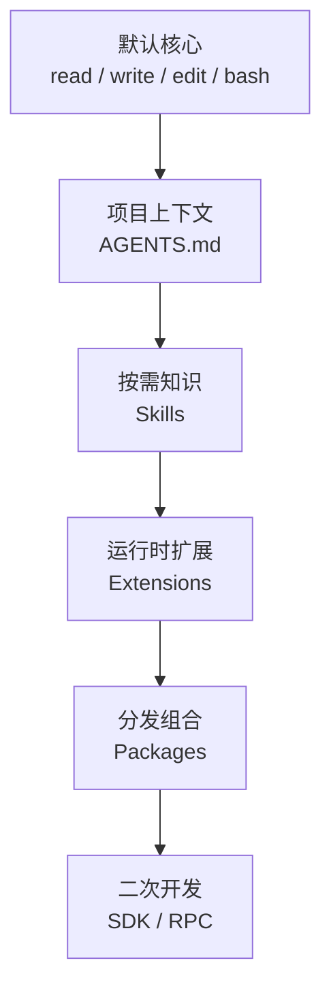

## 前言

最近研究了一下 [Pi Coding Agent](https://github.com/earendil-works/pi)。真正让我感兴趣的不是它和其他 Coding Agent 的跑分比较，而是它默认只给模型四个工具：`read`、`write`、`edit` 和 `bash`。

现在的 AI 编程工具都在不断做加法。计划模式、子 Agent、任务列表、浏览器、MCP、记忆、后台命令、权限弹窗、IDE 集成，一个产品里恨不得把 Agent 能遇到的所有工作流都提前做好。

Pi 走了另一个方向：先把核心压到很小，其他能力通过 Skills、Extensions、Packages 和 SDK 往外扩。

这让我重新思考了一个问题：**Coding Agent 的能力，真的和默认工具数量成正比吗？**

本文不准备逐项介绍 Pi 的安装和命令，而是基于它的设计谈谈我对工具数量、上下文、会话、记忆和安全边界的理解。

> 本文核对 Pi Coding Agent `v0.84.3`。截至 2026 年 8 月 27 日，当前官方包为 `@earendil-works/pi-coding-agent`。Pi 更新很快，具体命令以后可能变化，但本文讨论的主要是设计思路。

## Coding Agent 不只是一个会写代码的模型

以前我们讨论 AI 编程能力，很容易把重点全部放在模型上：哪个模型写代码更强，哪个模型上下文更长，哪个模型跑分更高。

但真正使用一段时间后会发现，同一个模型放进不同 Coding Agent，表现可能完全不一样。

因为模型外面还有一层 Harness：

```text
模型：理解任务、推理、决定下一步动作
Harness：提供上下文、工具、会话、权限和交互方式
```

模型想修改一个登录接口，至少要经历下面这些步骤：

```text
理解用户要求
  -> 找到项目入口
  -> 搜索登录相关代码
  -> 读取真实实现
  -> 判断修改位置
  -> 编辑文件
  -> 运行测试
  -> 根据结果继续修正
```

模型只是负责“决定下一步做什么”，真正让决定落到项目里的，是 Harness 提供的工具和运行环境。

所以我现在更愿意用下面这个不严谨但实用的公式理解 Coding Agent：

```text
实际效果
  = 模型能力
  × 上下文质量
  × 工具契约
  × 验证闭环
  × 权限边界
```

这里任何一项接近零，最后效果都不会好。

一个很强的模型，如果拿到的是错误目录、过期文档和含糊需求，一样会稳定地改错地方。一个工具很多的 Agent，如果没有测试闭环，也只是更快地产生未经验证的代码。

Pi 的价值就在于，它把注意力重新拉回 Harness 本身：模型到底需要多少工具，才能把任务做完？

## 四个工具为什么可能已经够用

Pi 默认提供：

| 工具    | 作用           |
| ------- | -------------- |
| `read`  | 读取文件       |
| `write` | 创建或覆盖文件 |
| `edit`  | 修改已有文件   |
| `bash`  | 执行命令       |

第一次看到会觉得太少了。搜索代码怎么办？列目录怎么办？跑测试、看 Git、读取日志、查依赖又怎么办？

答案基本都藏在 `bash` 里。

```bash
rg "login" src
git status --short
pnpm test
find . -name package.json
curl http://localhost:3000/health
```

现代开发环境本身已经有大量 CLI。`rg` 负责搜索，Git 负责版本状态，包管理器负责构建测试，`curl` 负责请求接口，Docker 负责运行容器。

从这个角度看，Pi 没有重新为每种动作设计一套 Agent Tool，而是让模型复用开发者已经在使用的命令行生态。

一个普通修复任务可以被压缩成这样的循环：

```text
read  -> 读项目配置和关键文件
bash  -> 搜索调用方、运行检查
edit  -> 修改已有实现
write -> 必要时创建测试或文档
bash  -> 验证修改结果
```

这四个动作确实可以组合出很大一部分本地开发能力。

**工具少，不等于能做的事情少。工具是否具备组合能力，往往比工具数量更重要。**

## bash 不是一个工具，而是一整个操作系统入口

不过，直接说“Pi 只有四个工具，所以很简单”也不完整。

`bash` 表面上只占一个工具名，背后却连接了整个操作系统：

```text
bash
  ├─ Git
  ├─ rg / find / sed
  ├─ npm / pnpm / cargo / go
  ├─ curl / ssh
  ├─ Docker
  ├─ 数据库客户端
  └─ 机器上几乎所有可执行程序
```

也就是说，Pi 并没有消灭复杂度，而是把大量能力压缩进了一个通用入口。

这让我想到软件设计里经常出现的情况：接口数量少，不代表系统能力小。有时候一个通用接口背后承担了更多隐含语义。

比如下面两种设计：

```text
方案一：search_code、run_test、git_status、http_request、docker_exec
方案二：bash
```

方案一的优点是结构化。每个工具可以做参数校验、权限控制和稳定的结果解析。

方案二的优点是通用。只要系统里有对应命令，模型就能直接使用，不需要 Harness 提前适配。

但它们的风险也刚好相反：

| 方式           | 优点                     | 代价                   |
| -------------- | ------------------------ | ---------------------- |
| 多个专用工具   | 结构清楚、容易限制权限   | 工具描述多、扩展成本高 |
| 一个通用 Shell | 组合能力强、复用现有生态 | 权限太宽、输出不稳定   |

所以 Pi 的“四工具”不是无条件优于更多工具，而是一个非常明确的取舍：**用通用性换取极小的默认工具面。**

## 工具越多，模型越要先做一道选择题

为什么少工具有时反而能让 Agent 更稳定？

首先，模型每次行动前都要选择工具。

假设系统里同时存在：

```text
search_files
search_code
grep
find_symbol
find_references
read_file
read_many_files
list_directory
inspect_repository
```

对开发者来说，这些名字都能理解；对模型来说，每一步都多了一次路由判断：

```text
我现在应该 search_code，还是 grep？
我要先 list_directory，还是直接 inspect_repository？
read_file 和 read_many_files 的边界是什么？
```

工具描述写得再清楚，也不可能完全消除重叠。

工具越多，至少会增加三种成本。

### 1. 上下文成本

工具名称、参数 Schema、字段说明和使用约束都要进入模型上下文。

单个工具不长，几十个工具叠在一起就不是小数目了。更麻烦的是，这些说明会在许多请求中持续存在，不管当前任务是否需要。

### 2. 路由成本

模型要先决定用哪个工具，再决定参数怎么填。

如果两个工具能力重叠，选错不一定直接报错，而可能绕一圈才发现结果不合适。

### 3. 失败状态成本

每个工具都有自己的错误格式、分页方式、超时规则和返回结构。

工具越多，Agent 需要处理的状态组合也越多。

因此，我不再认为“Agent 有 100 个工具”天然是一件值得宣传的事情。真正重要的是：

1. 当前任务实际需要多少工具。
2. 模型能否准确理解它们的边界。
3. 工具返回结果能否直接推动下一步行动。

**一个从来不会被调用的工具，不只是没有价值，它还可能一直占着上下文和模型注意力。**

## 一句 hi 吃掉 14770 个 Token，已经把工具成本暴露过一次

工具说明会占上下文，这不是抽象推导。

我之前在[一句 hi，为什么让 Codex 吃掉 14770 个输入 Token](https://huzhihui.com/blog/codex-hi-14770-input-tokens)里拆过一次真实请求。

用户输入只有两个字符：

```text
hi
```

但那次请求的实际数据是：

```json
{
  "input_tokens": 14770,
  "cached_tokens": 6400,
  "output_tokens": 51
}
```

请求文件有 `66 KB`，其中：

- `instructions` 长度为 `14667`；
- `input` 里先放了权限、仓库和环境上下文；
- 12 个工具的 Schema 合计约 `19099` 个字符；
- 用户的 `hi` 最后才被追加进去。

那次请求甚至没有真正调用工具，但工具成本已经发生了。模型在回答之前，仍然需要先阅读工具描述，并判断“这一轮是否要使用工具”。

这也是我现在看 Pi 四工具设计时最直接的背景：

```text
工具没调用，不代表工具没进入请求
功能没使用，不代表功能没有常驻成本
```

当然，缓存会降低重复前缀的实际费用。但缓存不是免单，而且它还引出另一个问题：前缀不仅要短，还要稳定。

我在 Claude Code 源码文章中总结过，频繁切换模型、Thinking、工具集和 MCP 组合，可能改变可缓存前缀。一个会话中途不断加工具，看起来很灵活，实际可能同时增加上下文体积和缓存失效率。

因此，更完整的目标不是单纯追求“最短 Prompt”，而是：

```text
常驻前缀尽量短
同一任务中的前缀尽量稳定
低频能力尽量按需加载
大结果尽量摘要或落盘
```

这比看着总 Token 数字再临时焦虑更有用。

## 极简真正减少的是常驻复杂度

Pi 并不是拒绝复杂功能。它同样有 Skills、Extensions、Packages、Web UI 和 SDK。

区别在于，这些复杂度不必全部常驻在核心里。

可以把 Pi 的能力分成几层：



这套设计让我想到前端里的首屏加载：不是应用以后永远不能有复杂功能，而是不要把所有功能都打进第一屏 Bundle。

这不是为了配合 Pi 临时想出来的类比。几年前我优化一个使用 `react-toastify` 的 Next.js 项目时，就遇到过同一道题。

当时真正需要 Toast 的只有少数交互，但公共 `app.tsx` 让每个页面都在初始阶段加载它。后来改成动态导入，只在用户真正触发操作时加载对应 Chunk，每个页面的初始打包体积减少了 `15-20 KB+`。

```js
// before：无论当前页面是否使用，初始阶段都加载
import { toast } from './toastify';

// after：真正触发时再加载
const toast = (message) =>
  import('./toastify').then((module) => module.toast(message));
```

前端性能优化里早就有一条很朴素的经验：

> 不一定用到的大模块，不要因为“以后可能用”就塞进首屏。

Agent 上下文也是同一个问题。Skill 名称和描述可以常驻，完整流程和参考资料等任务匹配后再读；专用工具可以延迟注册，或者只在特定工作流中开放。

区别只是以前优化的是 JavaScript Bundle，现在优化的是模型每一轮都要读取的上下文 Bundle。

对于 Agent 也一样：

```text
默认就需要的能力 -> 放进核心
任务匹配时才需要 -> 放进 Skill
必须改变运行时行为 -> 放进 Extension
需要团队分发 -> 封装成 Package
需要产品级定制 -> 使用 SDK
```

所以我理解的“极简”不是代码少，也不是功能少，而是：

> 让复杂度在真正需要它的时候出现，而不是让所有复杂度从会话第一秒就存在。

这比单纯追求一个更短的系统提示词更重要。

## Skill 和 Extension 的边界很值得借鉴

Pi 把 Skill 和 Extension 分开，我觉得这是一个很重要的设计。

### Skill 改变模型知道什么

Skill 本质上是一份按需加载的工作说明，可以包含：

- 任务流程；
- 命令和脚本；
- 参考资料；
- 模板和资源。

比如一个接口评审 Skill 可以告诉模型：

```text
先找后端接口定义
再找前端调用方
对比请求、响应和错误码
检查兼容性
最后运行契约测试
```

它没有直接改 Pi 的运行时，只是让模型在特定任务里按一套更可靠的流程行动。

### Extension 改变系统能做什么

Extension 是运行在 Pi 进程中的 TypeScript 代码，可以注册工具、命令、事件和 UI，甚至阻止工具调用。

它改变的不是模型知识，而是 Harness 行为。

可以这样区分：

```text
Skill：告诉模型应该怎么做
Extension：改变系统实际上能怎么做
```

这个边界比把所有东西统称为“插件”更清楚。

团队的代码评审规范更适合做成 Skill；真正的 GitHub API Tool、危险命令确认框和远程执行入口，则应该进入 Extension。

如果把规范全部写成运行时代码，维护成本会很高；如果把权限控制只写成提示词，又没有真正的执行约束。

这里的本质是把软约束和硬能力分开。

## 从一个 Agent 到多个 Agent，原则并没有变

Pi 可以通过扩展加入子 Agent，但我不认为“能多开”本身是能力证明。

我之前写多智能体协作时，最后得出的判断是：**先定边界，再定 Agent 数量。**

一个子 Agent 真正成立，至少要说明：

```text
任务边界：它只负责哪一段
上下文边界：它能看到什么
工具边界：它可以调用哪些能力
权限边界：它不能触碰什么
预算边界：最多使用多少时间和 Token
结果边界：返回完整过程还是最终摘要
失败边界：超时、跑偏以后谁来接管
```

如果这些都没有，只是给三个 Prompt 分别起名“架构师”“程序员”“测试工程师”，那不是多智能体系统，只是多个角色在共享复杂度。

更糟的是，Agent 数量增加后，成本通常不是线性多几次模型调用。上下文复制、工具 Schema、消息路由、失败重试和结果汇总都会叠加。

这和 Pi 的四工具思路其实是一致的：

```text
工具不是越多越好，要先看能力是否重叠
Agent 不是越多越好，要先看任务是否值得拆分
```

短链路、强依赖完整上下文的任务，一个 Agent 往往更省。只有子任务能独立验收、上下文可以隔离、工具或权限明显不同，多 Agent 才开始有真实价值。

所以我更看好的结构一直是 Workflow 包住 Agent：流程负责状态、超时、重试和人审，Agent 只在边界内处理非结构化判断和工具选路。

## 会话为什么应该是一棵树

Pi 另一个让我印象很深的设计是 `/tree`。

大部分聊天产品把对话展示成一条时间线：

```text
问题 -> 回答 -> 追问 -> 回答 -> 继续追问
```

但真实开发过程并不是直线。

我们经常会经历：

```text
先尝试方案 A
  -> 发现会破坏兼容性
  -> 回到原来的决策点
  -> 改成方案 B
  -> 保留 A 的调研结论
```

如果只有线性聊天，用户通常有三种选择：

1. 在原对话里说“忽略前面的方案”。
2. 新建会话，再重新补一遍上下文。
3. 删除历史，假装错误路线没有发生。

这三种都不舒服。

Pi 把会话条目保存成带 `id` 和 `parentId` 的树，可以从以前的节点继续产生新分支。

```text
修复登录状态
  ├─ 方案 A：localStorage
  │   └─ 发现安全风险
  └─ 方案 B：服务端 Session
      └─ 最终实现
```

这个设计和 Git 很像。Git 不要求软件开发永远向前走，它允许分支、回退、比较和合并。

**代码是树，决策也是树，只有聊天界面长期把它假装成一条直线。**

当然，会话树也不是越大越好。分支太多同样会难以管理，旧分支摘要也可能丢失信息。但至少它承认了真实开发中的试错，而不是要求用户一直维护一段越来越长的“请忽略上文”。

## 记忆越神秘，工程上越难相信

现在很多 Agent 都在强调长期记忆。听起来很美好：它记得你的习惯、项目背景和以前做过的决定，下次不用再说。

但从工程角度看，我反而更喜欢 Pi 这种相对显式的状态：

```text
会话历史     -> 这次任务发生过什么
AGENTS.md    -> 进入项目后长期遵守什么
Skills       -> 某类任务应该按什么流程做
Git diff     -> 代码实际上改了什么
测试结果     -> 修改是否满足可执行标准
```

这几种状态都有明确位置，也可以被人读取和修改。

隐式记忆最大的问题不是它记不住，而是我们不知道它记住了什么：

- 过期规则有没有被删除？
- 一次临时偏好会不会变成长期约束？
- 另一个项目的经验会不会被错误带进来？
- 模型为什么做出这个决定，能否追溯？

因此，我现在越来越认同一个观点：

> Agent 的关键记忆应该尽量落到人类可审查的工程载体中，而不是只存在于不可见的向量或摘要里。

比如“不要执行生产数据库迁移”这种规则，就应该明确写进项目约束；接口契约应该写进代码和文档；当前实现状态应该交给 Git；是否完成应该交给测试。

会话记忆可以帮助继续工作，但不应该成为项目事实的唯一来源。

## 压缩上下文其实是在有损保存现场

Pi 支持 `/compact`，在对话过长时把旧内容压缩成摘要。

这个功能很实用，但也容易被误解成“上下文不够了，自动整理一下就行”。

压缩本质上是有损的：

```text
完整历史 -> 模型生成摘要 -> 后续只读取摘要和最近消息
```

摘要写得再好，也不可能保留所有细节。

如果关键状态只在聊天里，压缩时就可能出现：

- 忘记某个明确不能修改的接口字段；
- 丢失一次失败测试的具体错误；
- 把尚未验证的推测总结成既定事实；
- 只记住改了什么，忘记为什么这样改。

因此，使用长会话时最重要的不是找到“永不丢上下文”的模型，而是持续把状态外化：

1. 决策进入文档。
2. 修改进入 Git diff。
3. 契约进入类型和测试。
4. 未完成事项明确到文件和命令。

这样即使换模型、换 Agent、换会话，真实工程状态仍然存在。

**好的 Agent 记忆不是替代工程文档，而是知道什么时候应该把聊天里的结论写回工程。**

## 极简界面不代表权限也很小

Pi 的设计里最容易被“极简”两个字掩盖的，是安全边界。

Pi 官方文档写得很直接：它没有内置沙箱。工具和 Extensions 以启动 Pi 的用户权限运行。

这意味着只要当前用户能做，`bash` 理论上也可能做：

```text
读取 Home 目录文件
访问本机凭据
修改项目外的内容
运行安装脚本
连接网络服务
删除文件
```

Project Trust 可以控制项目里的设置、Skills 和 Extensions 是否在启动时加载，但它不是操作系统级隔离。

这正好说明：工具数量和权限大小不是一回事。

```text
100 个只读专用工具，不一定比 1 个完整 Shell 权限更大
4 个工具的界面，也不代表系统只有 4 种风险
```

如果只是本机可信项目、人工持续盯着执行过程，这种设计很直接。

但如果要处理陌生仓库、运行无人值守任务或把 Pi Web 暴露到远程网络，我认为就必须增加系统级边界：

- 容器或虚拟机；
- 只挂载必要目录；
- 最小权限和短期凭据；
- 不需要时关闭网络；
- 重要操作需要审批；
- 结果进入可信环境前检查 diff。

权限弹窗能减少误操作，真正的隔离仍然要交给操作系统和虚拟化层。

## Pi 并没有消灭复杂度，只是把选择权交还给用户

看到这里会发现，Pi 并不是一个“什么都没有”的 Agent。

它有会话树、压缩、Skills、Extensions、Packages、RPC 和 SDK，社区里还可以安装 Web UI、MCP、子 Agent 和各种集成。

所以 Pi 的复杂度并不低，只是组织方式不同：

```text
其他产品：把常见工作流做进默认产品
Pi：保留小内核，让用户自己选择需要的工作流
```

前者更像一个完成度很高的产品，后者更像一套可组装的开发工具。

这也决定了它们适合不同的人。

### Pi 更适合谁

- 熟悉终端和 CLI 的开发者；
- 想控制模型、工具和上下文的人；
- 需要自定义 Agent 工作流的团队；
- 想用 SDK 构建自己产品的人；
- 愿意自己承担扩展筛选和安全配置的人。

### 完整产品更适合谁

- 希望安装后直接使用的人；
- 需要统一权限和审批体验的团队；
- 不想维护插件兼容性的人；
- 更依赖 IDE、云任务和协作平台的人；
- 希望默认值已经覆盖大部分工作流的人。

因此，我不会把“更少默认功能”简单理解为“更先进”。

**极简系统降低的是默认复杂度，同时提高了使用者做选择和承担边界的责任。**

## Pi 越极简，越考验使用者管理复杂度的能力

这也是 Pi 最容易被忽略的一面。

一个完整产品会替用户做很多决定：什么时候弹审批、任务怎么排队、子 Agent 怎么创建、哪些目录可写、失败后如何恢复。

Pi 把更多决定留给扩展和使用者。自由度提高了，但复杂度管理责任并没有消失。

我在 Vibe Coding 相关文章里反复写过，AI 最容易制造的不是一眼就能看出的错误，而是“局部都对，整体开始散”。

模型很擅长根据当前要求继续添加：

- 再补一个入口；
- 再兼容一个字段；
- 再加一个状态；
- 再装一个 Extension；
- 再开一个 Agent。

但它很少主动停下来问：系统是不是已经出现重复能力？这层抽象还应该存在吗？当前任务值得继续自动化吗？

因此，使用极简 Agent 反而更需要人承担五件事：

1. 定义问题。把“优化一下”收敛成可验收目标。
2. 设计边界。决定哪层能知道什么、工具和字段从哪里通过。
3. 压缩上下文。只给任务需要的文件、日志和历史。
4. 验收结果。检查权限、异常、兼容性和真实运行结果。
5. 控制成本。知道什么时候继续、换模型、开新会话，什么时候让人接手。

AI 写代码越快，这些看起来比较慢的工作越值钱。因为代码生成速度提升以后，真正的瓶颈会从“能不能写出来”转移到“系统是否仍然可控”。

**极简 Harness 不会替我们管理复杂度，它只是让复杂度藏在哪里更容易被看见。**

## Pi 是否真的超过 Codex 和 Claude Code

不同 Coding Agent 之间的比较很吸引人，但我不认为这类产品能通过一句“谁超过谁”下结论。

至少要固定这些条件：

1. 底层是不是同一个模型和版本。
2. 思考等级与 Token 预算是否一致。
3. 工具集和权限是否一致。
4. 系统提示词和项目规则是否一致。
5. 是否允许联网、安装依赖和运行测试。
6. 成本是否包含缓存、重试和失败任务。
7. 最终由谁、用什么标准验收。

Pi 本身可以连接不同模型。把 OpenAI 模型放进 Pi，再拿它和 Codex 比，比较的已经不是两个独立模型，而是模型与 Harness 的组合。

我更关注的是产品哲学：

```text
Pi：把能力做成可组合积木，默认保持开放
Codex / Claude Code：把更多流程、权限和体验做成产品能力
```

前者透明、可改、适合折腾；后者替用户处理更多复杂度，适合直接完成工作。

真正有意义的测试，不是看一次公开榜单，而是在自己的仓库里给出同一个任务、同一套约束和同一套验收，看看谁更稳定地交付结果。

## Pi 给我最大的启发：Agent 设计不是不断加功能

研究 Pi 的设计后，我对 Coding Agent 有了几个更明确的判断。

### 1. 工具要看组合能力，不看数量

少数边界清楚、结果稳定的工具，可能比几十个互相重叠的工具更容易让模型使用。

新增工具之前应该先问：现有工具真的无法完成，还是只是我们想给同一个动作换一个名字？

### 2. 不要让所有知识永久占据上下文

长期规则进入 `AGENTS.md`，特定领域流程进入 Skill，真正需要时再加载完整内容。

上下文不是越多越好。无关信息同样会干扰模型决策。

### 3. 软约束和硬边界必须分开

“不要删除文件”写进提示词，只是一条软约束；文件系统权限、沙箱和审批才是硬边界。

不能因为模型通常会听话，就把提示词当成安全系统。

### 4. 会话不是项目真相

聊天可以保存思考过程，但项目状态最终要回到代码、Git、测试和文档。

一段无法被代码和验证支持的长记忆，并不会让工程更可靠。

### 5. 扩展性也需要成本预算

每安装一个 Extension，都增加了依赖、兼容性、权限和维护成本。

极简内核如果最后装了几十个来历不明的扩展，复杂度和风险一样会回来。

## 如果让我设计自己的 Coding Agent

基于这些理解，我会优先保证下面几件事。

### 默认工具尽量少

只保留覆盖大部分任务的读、搜索、修改和执行能力。新增工具必须能提供明确的结构化价值或权限边界。

### 上下文分层加载

```text
全局安全规则 -> 始终加载
项目约束     -> 进入项目时加载
领域知识     -> 任务匹配时加载
大段参考资料 -> 工具需要时读取
```

### 每次修改都有验证出口

Agent 不能把“文件写成功”当成任务完成。工具链应该鼓励它继续运行测试、构建、类型检查或最小复现。

### 权限在模型之外执行

只读、可写目录、网络访问、凭据使用和破坏性操作审批，都应该由运行环境控制，而不是只靠系统提示词。

### 状态尽量可观察

用户应该知道：

- 当前加载了哪些规则；
- 模型能调用哪些工具；
- 哪些扩展正在运行；
- 会话是否压缩过；
- 修改是否经过验证；
- 结论来自源码、文档还是模型推测。

我越来越觉得，Agent 工程真正难的不是让模型“会做更多事”，而是让它在做事时保持边界清楚、状态可见、结果可验证。

## 结语

Pi 最有意思的地方，不是它用四个工具赢了多少榜单，而是它用一个极端例子提醒我们：Coding Agent 的能力不等于默认功能列表的长度。

四个工具背后依然有 Shell、操作系统和完整开发生态；极简并没有消灭复杂度，只是减少常驻复杂度，并把扩展选择权交给使用者。

这套思路的优势是透明、可组合、容易二次开发；代价是使用者必须更懂工具、更懂权限，也更愿意为自己的扩展和运行环境负责。

写到这里就停了。对我来说，Pi 带来的最大启发不是“以后 Agent 都应该只有四个工具”，而是：**不要急着把所有能力都塞进核心，先把最小闭环做清楚，再让复杂度按需出现。**

## 参考文章

1. [Pi 官方仓库](https://github.com/earendil-works/pi)
2. [Pi Usage](https://github.com/earendil-works/pi/blob/main/packages/coding-agent/docs/usage.md)
3. [Pi Sessions](https://github.com/earendil-works/pi/blob/main/packages/coding-agent/docs/sessions.md)
4. [Pi Skills](https://github.com/earendil-works/pi/blob/main/packages/coding-agent/docs/skills.md)
5. [Pi Extensions](https://github.com/earendil-works/pi/blob/main/packages/coding-agent/docs/extensions.md)
6. [Pi Security](https://github.com/earendil-works/pi/blob/main/packages/coding-agent/docs/security.md)

## 相关阅读

1. [一句 hi，为什么让 Codex 吃掉 14770 个输入 Token：逐字段拆解一次真实请求](https://huzhihui.com/blog/codex-hi-14770-input-tokens)
2. [看完 Claude Code 源码，这几条少烧 Token 的方法你一定要知道](https://huzhihui.com/blog/claude-code-token-saving-must-know)
3. [多智能体协作，不是多开几个 Agent：从中介者模式看 OpenClaw 和 Hermes Agent](https://huzhihui.com/blog/multi-agent-openclaw-hermes-mediator-pattern)
4. [设计模式和管理能力，才是 AI Vibe Coding 时代真正的自救](https://huzhihui.com/blog/design-patterns-and-management-self-rescue-in-ai-vibe-coding-era)
5. [AI 写代码越快，程序员越要知道自己到底值钱在哪](https://huzhihui.com/blog/ai-coding-token-cost-programmer-value)
