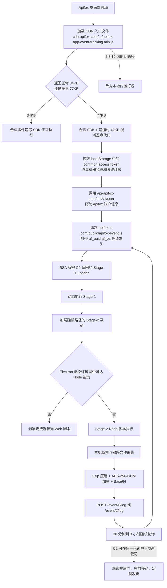

这两年技术圈有个很顺耳的词，叫 AI 全栈。

前端不只写页面，后端不只管接口，测试、运维、自动化、模型调用、上线发布，最好都能被同一批人和同一台工作终端串起来。管理上还有另一个同样顺耳的词，叫降本增效。翻译成人话，很多时候就是更少的人，覆盖更多的链路。

问题不是 AI 全栈本身。问题是人少了，权限没少，反而更集中。

今天一个开发者终端上，往往同时放着 SSH 密钥、Git 凭证、云厂商 Access Key、Kubernetes 配置、数据库连接串、命令行历史、浏览器登录态、AI 平台 token，以及一串桌面工具的本地缓存。以前这些东西多少还分散在不同岗位、不同机器、不同流程里；现在它们被越来越自然地堆进一个“效率工作台”里。

所以 Apifox 这次事件值得认真看。

单看官方通告，它已经足够严重；再把公开技术分析一起放进来，事情的轮廓会更完整一些：这不是一个笼统的“第三方脚本异常”，也不只是“某段远程 JS 被替换”。更准确地说，这是一次针对 **Apifox 官方 CDN 入口文件** 的投毒，随后借助 Electron 桌面端较高的本地能力，把问题从“前端脚本风险”一路放大成了“主机级远程代码执行平台”。

它打到的不是一个普通客户端 bug，而是今天最值钱、也最脆的一层：开发者终端上的整条研发链路。

## 通告确认了哪些事实

Apifox 在 2026 年 3 月 25 日发布的风险提示里，确认了这些关键信息：

- 受影响范围是“公网 SaaS 版 Apifox 桌面客户端”。
- SaaS Web 版不受影响，私有化部署版不受影响。
- 风险时间窗是 2026 年 3 月 4 日到 2026 年 3 月 22 日。
- 事件原因是桌面客户端动态加载的一个外部 JavaScript 文件遭到恶意篡改，官方定性为供应链攻击。
- 恶意域名为 `apifox[.]it[.]com`，活跃时间为 18 天。
- 官方已发布 `2.8.19`，并将相关在线动态加载机制改为本地内置打包。
- 官方建议受影响时间段内使用过相关版本的用户，立即升级并全面轮换敏感凭证。

这已经足够说明问题不轻。

但结合公开分析，技术主线其实可以进一步说得更具体。

## 为什么这件事放到 AI 全栈语境里更危险

这不是要反对 AI 全栈。AI 全栈已经是现实，Agent、自动化和平台化也确实在提升效率。

真正的问题是，职责合并的速度，往往快于安全边界重建的速度。

一个人覆盖的环节越多，这台机器上沉淀的上下文就越多：代码仓库、云平台、K8s 集群、私有 npm、内部 API、发布链路、临时脚本、浏览器登录态，都会慢慢汇总到同一个终端上。表面看是“一个人顶三个人”，安全视角里更像是把三个人的权限和爆炸半径，打包塞进了一台电脑。

以前攻下一台开发机，未必能继续往里走。现在如果拿到一台“AI 全栈工程师”的工作机，顺着 SSH、Git、npm、K8s、云平台、命令行历史往里摸，运气好一点，可能就是半个公司的研发环境。

这也是为什么 Apifox 这次事件真正吓人的地方，不在于一个桌面工具被投毒，而在于这个桌面工具刚好运行在今天最肥的一层土壤上。

## 入口不是安装包，而是官方 CDN 上的启动脚本

这次事件最核心的地方，不是安装包本身被整体替换，而是 Apifox 桌面端在启动过程中会加载一个官方 CDN 上的 JS 文件：

```txt
hxxps://cdn[.]apifox[.]com/www/assets/js/apifox-app-event-tracking.min.js
```

公开分析指出，这个文件正常情况下大约是 **34KB**。从 **2026 年 3 月 4 日**开始，受影响用户在某些请求里拿到的是被投毒后的版本，大小大约 **77KB**。

也就是说，攻击者不是伪造了一个完全不同的脚本，而是在原有合法文件后面，**追加了约 42KB 的严重混淆恶意代码**。

这个细节很重要。

因为它解释了为什么这件事比“普通第三方埋点被劫持”更难察觉：

- 入口来自 `cdn.apifox.com`，也就是官方域名。
- 路径看起来是正常的业务/事件追踪文件。
- 前半部分仍然是合法 SDK，恶意代码是追加在尾部的。
- 对客户端来说，这是“可信启动链”里的一个资源，而不是明显可疑的外链。

从信任模型看，这相当于攻击者直接站进了官方 CDN 分发链路。

## 攻击链流程图

如果把这次攻击链按执行顺序拆开，大致是下面这样：



这张图里最关键的分叉，不在“是否加载了外部 JS”，而在后半段：**恶意代码是否运行在一个可以直接访问 Node.js 能力的 Electron 渲染环境里**。这一步决定了它是“前端脚本异常”，还是“主机级入侵入口”。

## 分阶段看，这是一条完整的 C2 链路

如果按技术实现拆，这次事件大致可以分成四层。

### 1. Stage 0：CDN 入口文件投毒

第一层，就是被追加恶意代码的 CDN 入口文件。

根据公开分析，投毒后的 `apifox-app-event-tracking.min.js` 由两部分组成：

- 前半部分约 34KB，是原本合法的事件追踪 SDK。
- 后半部分约 42KB，是新增的混淆恶意代码。

这段恶意代码不是随手写的几行脚本，而是做了比较完整的混淆处理。公开分析里提到的手法包括：

- 字符串数组旋转。
- Base64 + RC4 解码。
- 控制流扁平化。
- 十六进制算术混淆。
- 代理函数包装。
- 死代码干扰。
- 反调试逻辑。

这意味着攻击者一开始就不是想做一次短平快的窃密，而是明确预期到样本会被逆向和还原。

### 2. Stage 1：指纹采集、身份补全、向 C2 建联

恶意代码真正执行后的第一件事，不是立刻去翻文件，而是先做环境探测和身份补全。

根据公开分析，它会先构造一个机器指纹。参与指纹计算的字段包括：

- MAC 地址。
- CPU 型号。
- 主机名。
- 用户主目录。
- 操作系统平台。

这些信息会被拼接后做 SHA-256，得到一个 64 位十六进制标识，作为 `af_uuid` 使用。

同时，它还会读取 Apifox 本地 `localStorage` 里的 `common.accessToken`，然后调用官方接口：

```txt
GET hxxps://api[.]apifox[.]com/api/v1/user
Authorization: <accessToken>
```

目的不是攻击 Apifox 官方 API 本身，而是借助这个已经窃取到的登录态，进一步拿到当前用户的邮箱和姓名，把受害者环境和账号身份绑在一起。

再往后，这些信息会放进一组自定义请求头里，例如：

- `af_uuid`
- `af_os`
- `af_user`
- `af_name`
- `af_apifox_user`
- `af_apifox_name`

然后请求：

```txt
hxxps://apifox[.]it[.]com/public/apifox-event.js
```

这一步其实已经说明，攻击者不是简单地“偷一点文件就走”，而是在搭一条稳定的主机识别和任务下发通道。

### 3. Stage 2：RSA 解密 Loader，拉取随机路径载荷

公开分析显示，入口恶意代码里硬编码了一把 RSA-2048 私钥。这个设计本身很诡异，但也恰恰是后来研究人员能够完整还原通信链路的重要原因。

攻击链在这里的工作方式大致是：

1. 客户端向 `hxxps://apifox[.]it[.]com/public/apifox-event.js` 发起请求。
2. 服务端返回一段 RSA 加密数据。
3. 客户端用内嵌私钥解密。
4. 解密后的内容不是最终载荷，而是一个更小的 Loader。
5. Loader 再动态插入一个脚本标签，去加载随机路径的 Stage-2。

为避免误用，下方只保留脱敏后的伪代码流程：

```txt
request C2 endpoint:
  hxxps://apifox[.]it[.]com/public/apifox-event.js

receive encrypted loader
decrypt returned content
dynamically execute the returned stage
```

而解密后的 Loader 逻辑，大致可以概括为：

```txt
create a script element
point it to:
  hxxps://apifox[.]it[.]com/<random-hex>.js
append it to document.head
load the next-stage payload
```

这里面有几个很典型的对抗特征：

- Stage-2 路径是随机 8 位十六进制。
- 历史路径很快返回 404，不适合简单基于 URL 黑名单检测。
- 脚本标签加载后会从 DOM 中自删除，减少现场痕迹。
- 不同机器或不同时间点，请求到的 Stage-2 可能不一样。

这已经不是“单文件投毒”了，而是一个分层下载、按需下发的 C2 体系。

### 4. Stage 3：Node 脚本执行、分轮次窃密、持续轮询

真正负责本地取数和外传的，是 Stage-2。

公开分析里至少还原出两类 Stage-2。

第一轮更偏基础侦察，重点包括：

- `~/.ssh/`
- `~/.zsh_history`
- `~/.bash_history`
- `~/.git-credentials`
- `ps aux` 或 `tasklist`

后续版本又扩大了范围，新增了：

- `~/.zshrc`
- `~/.npmrc`
- `~/.kube/*`
- `~/.subversion/*`
- 主目录、桌面、文档等目录树遍历

这类取数逻辑本质上已经是 Node 脚本，不再是普通浏览器脚本。它会直接用 `fs` 读文件，用 `child_process` 执行命令，用 `os` 和 `crypto` 收集环境并处理数据。

可以抽象成下面这种脱敏后的流程：

```txt
read local files such as:
  ~/.ssh/
  ~/.git-credentials
  ~/.zsh_history
  ~/.bash_history
  ~/.npmrc
  ~/.kube

collect process information
compress and encrypt the result
POST the packaged data to:
  hxxps://apifox[.]it[.]com/event/0/log
```

公开分析还提到，它的数据外传链路大致是：

```txt
原始 JSON -> Gzip -> AES-256-GCM -> Base64 -> POST 上传
```

而且这不是一次性触发。代码会以 **30 分钟到 3 小时**的随机间隔继续轮询 C2。

这意味着，受害主机不是“被偷过一轮信息”这么简单，而是可能在一段时间内持续接受新的任务。

## 为什么这已经不是窃密脚本，而是远程代码执行平台

这点其实是整个事件里最需要警惕的地方。

如果公开分析只还原出了 `~/.ssh/`、`~/.git-credentials`、`~/.kube` 这些文件读取逻辑，那它至少还是“已观察到的窃密样本”。但这里的问题比这个更大，因为中间有一个非常关键的动作：

```txt
dynamic execution of decrypted C2 response
```

这意味着什么？

意味着攻击者每一轮都可以下发**全新的任意 JavaScript**。当前公开出来的 Stage-2 v1 和 v2，只是研究人员在侦察阶段观察到的两类载荷，不能把它误解成“攻击到这里就结束了”。

更准确的理解应该是：

- 已公开的部分，说明攻击者至少做过系统侦察和凭证采集。
- 这套架构本身，具备继续下发后门、横向移动脚本、定制化攻击逻辑的能力。
- 对高价值目标来说，后续发生过什么，不能仅凭当前公开 IoC 来下结论。

所以这件事不能当成一次普通的“密码泄露事件”来处理，更接近“开发工具被植入了一个可持续下发任务的 RCE 平台”。

## 为什么 Electron 会把问题从前端放大到主机

如果这段被投毒的 JS 只运行在普通浏览器页面里，风险当然也不小，但边界还是 Web 边界。浏览器沙箱默认不会让一段页面脚本直接去读 `~/.ssh/`，更不应该让它执行 `ps aux` 或 `tasklist`。

但 Electron 不一样。

Electron 本质上是 Chromium 加 Node.js 运行时。如果渲染进程没有严格启用 `sandbox`，或者预加载层对外暴露了过宽的 Node API，远程脚本和本地系统能力之间那堵墙就会变得很薄。

公开分析里已经明确点出，这次事件之所以能成立，和桌面端没有严格启用 `sandbox`，并且暴露了 Node.js API 有直接关系。也正因为如此，**Windows、macOS、Linux 三个平台都在攻击面内**。

从能力上看，普通网页脚本和这次样本的差别非常直观：

- 普通网页脚本：最多碰到 DOM、Cookie、Web Storage 和网络请求。
- 这次样本：已经能 `require("fs")`、`require("os")`、调用 `child_process`、读用户主目录、执行系统命令、持续轮询远端 C2。

所以这次事故的放大点，不是“攻击者多写了几段 JS”，而是 **Electron 运行时把一段来自 CDN 的被投毒脚本，放进了一个足够接近主机的执行环境里**。

这就是为什么它会从“脚本问题”升级成“主机控制问题”。

## 攻击者为什么盯这些文件

官方通告和公开分析里提到的路径，看起来很杂，但其实目标非常一致：它们不是业务数据本身，而是通往更多系统的钥匙。

比如：

- `~/.ssh/` 可以通向 Git 仓库、跳板机、线上主机。
- `~/.git-credentials` 里常常有 Git 平台访问令牌。
- `~/.zsh_history`、`~/.bash_history` 里经常有临时执行过的密码、Token、内网地址、数据库连接串。
- `~/.npmrc` 可能有私有仓库 Token。
- `~/.kube/*` 可能直接对应集群访问权限和 OIDC Token。

今天很多团队在讲 AI 全栈、效率工具、一个人覆盖更多工作流，但这背后的副作用是：越来越多高权限材料，被集中堆在一台经常联网、经常更新、经常装工具的工作终端上。

以前这些材料还分散在不同角色手里。现在为了快，它们更容易自然汇总到同一批研发终端里。对组织来说这当然提高了效率，对攻击者来说也等于提高了单次成功入侵的收益。

一旦这个终端上的开发工具进入攻击链，损失的就不是“某个软件账号”，而可能是整条研发环境的入口。

## 从修复动作看，根因其实很清楚

Apifox 在 `2.8.19` 里的关键动作，是把相关在线动态加载逻辑去掉，改成内置打包。

这个修复方向本身已经说明问题根子在哪：

- 根因不只是 `apifox[.]it[.]com` 这个恶意域名。
- 根因也不只是攻击者后续下发了什么载荷。
- 更前面的根因，是桌面端关键执行链依赖了来自 CDN 的远程 JS，而这段远程 JS 又处在一个能够接近本地系统能力的运行上下文里。

从安全设计上讲，这一层至少应该同时满足几件事：

- 关键执行链尽量不要依赖远程动态代码。
- 必须远程加载时，要做内容完整性校验和版本固定。
- Electron 渲染环境默认最小权限，严格启用隔离。
- preload 只暴露必要接口，而不是把 Node 能力大面积透给页面逻辑。
- 对远程脚本加载、异常出网、文件读取和高危命令执行建立可观测性。

少了其中任意一环，都会给攻击链留出空间。

## 如果你在受影响时间窗内使用过，应该怎么处理

如果你在 **2026 年 3 月 4 日到 2026 年 3 月 22 日**之间使用过受影响的公网 SaaS 桌面客户端，建议不要只做“升级到 `2.8.19`”这一件事。

更稳妥的做法，是按“本机高敏感凭证可能已暴露，且存在后续任务下发可能”来处理。

建议至少做这些动作：

- 轮换 `~/.ssh/` 下所有仍在使用的密钥。
- 吊销并重发 Git 平台 PAT、CI Token、制品仓库令牌。
- 轮换云服务 Access Key、数据库密码、Kubernetes 凭证。
- 检查 shell history 中出现过的密码、连接串、API Key，并一并更换。
- 排查代码仓库、服务器、云平台、CI/CD 的异常登录与异常操作。
- 检查终端和代理日志里是否存在指向 `apifox[.]it[.]com` 的历史请求。
- 关注是否出现过异常请求头，如 `af_uuid`、`af_os`、`af_user`、`af_name`。

如果要做临时阻断，官方建议可以在 `hosts` 中加入：

```txt
127.0.0.1 apifox[.]it[.]com
```

但需要强调的是，这只能阻断后续已知域名访问，不能替代凭证轮换和失陷排查。

如果你的机器曾持有 SSH、K8s、Git、npm 等高价值权限，更合理的预设不是“可能没事”，而是“至少已经发生过侦察和第一轮凭证采集”。

## 写在最后

Apifox 这次事件最值得记住的，不只是一次 CDN 投毒，也不只是某个 Electron 安全边界没收紧。

它更像给今天的研发组织拍了一张 X 光片。

今天大家都在讲 AI 全栈、Agent 提效、平台化、降本增效。问题不是这条路不能走，而是很多团队只把人和流程做了压缩，却没有同步重建权限拆分、终端隔离、凭证治理和可观测性。

于是结果就变成了：

一个人顶三个人，三个人的权限和爆炸半径也一起塞进一台机器里。

Apifox 这次事件刚好把这个时代问题暴露得很完整：

- 入口在官方 CDN。
- 执行点在桌面端启动链。
- 放大器是 Electron 与 Node 权限边界。
- 真正的收益点，是开发者终端上那些能继续通往更多系统的钥匙。

所以这篇文章的结论不是“AI 全栈不好”，也不是“某个工具不能用”。

更准确的说法是：当 AI 全栈已经变成组织现实，开发者终端就不再只是个人工作台，而是基础设施的一部分。谁还把它当成普通客户端来管理，谁就更可能在下一次供应链事故里付总账。

## 扩展阅读

- [Apifox 官方风险提示与升级公告](https://mp.weixin.qq.com/s/GpACQdnhVNsMn51cm4hZig)
- [官方帮助文档：关于 Apifox 外部 JS 文件受篡改的风险提示与升级公告](https://docs.apifox.com/8392582m0?nav=01KMJJ5DQMQSKK5EEFPC9ZEKH3)
- [官方更新日志：2.8.19 去除在线加载 JS，改为内置打包](https://docs.apifox.com/5807637m0)
- [补充公众号文章](https://mp.weixin.qq.com/s/gmEkbOnRcMNFiKePjCWuEw)
- 其余第三方技术分析与样本还原材料，建议按文章标题自行检索，不在此直接提供样本或镜像链接。

## 版权声明

本文为原创整理与写作，引用的官方通告、公开技术分析与相关参考资料，其著作权归原作者或原发布方所有。文中如涉及外部分析内容，均仅用于安全研究、事件复盘与技术讨论。

转载、摘编请保留原文链接并注明出处。
