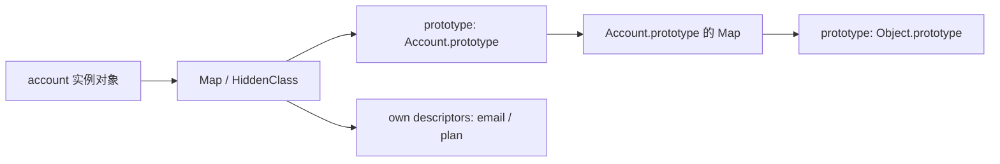

## 前言

```text
读取 obj.xxx 时，如果 obj 自己没有 xxx，应该去哪里找？
```

本文参考源码版本固定为：

```text
Chromium: 148.0.7778.178
commit: d096af1c9e98c45c3596e59620622b1a049bfecb
```

## 从一个实例属性查找开始

```js
function Account(email) {
  this.email = email;
}

Account.prototype.plan = 'basic';
Account.prototype.getEmail = function () {
  return this.email;
};

const account = new Account('ops@example.com');

account.plan = 'enterprise';

console.log(account.email);
console.log(account.getEmail());
console.log(account.plan);
console.log(Object.hasOwn(account, 'plan'));
console.log(Object.hasOwn(account, 'getEmail'));
console.log('getEmail' in account);
console.log(Object.getPrototypeOf(account) === Account.prototype);

delete account.plan;

console.log(account.plan);
console.log(account.constructor === Account);
console.log(Object.getPrototypeOf(Account.prototype) === Object.prototype);
console.log(Object.getPrototypeOf(Object.prototype));
```

输出是：

```text
ops@example.com
ops@example.com
enterprise
true
false
true
true
basic
true
true
null
```

这有几个问题：

1. `getEmail` 不在 `account` 自己身上，为什么 `account.getEmail()` 能执行？
2. `account.plan` 一开始是 `enterprise`，删除以后为什么变成了 `basic`？
3. `account.constructor` 又是从哪里来的？
4. `Account.prototype` 和 `Object.prototype` 到底是什么关系？

结论：

**读取对象属性时，JavaScript 会先找对象自身；自身没有，就沿着内部的 `[[Prototype]]` 往上找，直到找到属性或者走到 `null`。**

也就是说：

```text
account
  -> Account.prototype
  -> Object.prototype
  -> null
```

`email` 和第一次读取的 `plan` 来自 `account` 自身。

`getEmail`、删除后的 `plan`、`constructor` 都不是 `account` 自己的属性，而是沿着原型链找到的。

再看一个属性遮蔽：

```js
function Account() {}

Account.prototype.plan = 'basic';

const account = new Account();

account.plan = 'enterprise';
console.log(account.plan);

delete account.plan;
console.log(account.plan);
```

输出：

```text
enterprise
basic
```

当实例自己有同名属性时，会优先使用实例自己的属性；删除以后，才会继续沿原型链往上找。

## 先把三个概念拆开

| 名称            | 含义                                                                |
| --------------- | ------------------------------------------------------------------- |
| `prototype`     | 函数对象上的属性，通常用于给 `new` 出来的实例指定原型               |
| `[[Prototype]]` | 每个普通对象内部的原型链接，属性查找会沿着它往上走                  |
| `__proto__`     | 访问 `[[Prototype]]` 的历史遗留访问器，不建议作为主要写法理解或使用 |

来看一段代码：

```js
function AccountRecord() {}

const record = new AccountRecord();

console.log(AccountRecord.prototype);
console.log(Object.getPrototypeOf(record) === AccountRecord.prototype);
```

输出：

```text
AccountRecord {}
true
```

`AccountRecord.prototype` 是构造函数上的属性。

`Object.getPrototypeOf(record)` 拿到的是实例 `record` 的内部 `[[Prototype]]`。

这两者之所以相等，是因为 `new AccountRecord()` 时把它们连上了。

## 不是所有函数都有自己的 prototype

```text
普通可构造函数和 class 通常有自己的 prototype 属性；箭头函数、方法、部分内建函数没有自己的 prototype。
```

比如：

```js
function Fn() {}
const arrow = () => {};

class Account {}

console.log(Object.hasOwn(Fn, 'prototype'));
console.log(Object.hasOwn(arrow, 'prototype'));
console.log(Object.hasOwn(Account, 'prototype'));
```

输出：

```text
true
false
true
```

箭头函数不能被 `new`，所以也没有必要提供给实例使用的 `prototype`。

同样，`__proto__` 也不是“每个对象自己都有的属性”。

```js
const obj = {};
const dict = Object.create(null);

console.log('__proto__' in obj);
console.log('__proto__' in dict);

console.log(Object.getPrototypeOf(dict));
```

输出：

```text
true
false
null
```

普通对象能访问 `__proto__`，是因为它从 `Object.prototype` 继承了这个访问器。`Object.create(null)` 创建的是一个没有原型的对象，自然也就没有这条继承路径。

所以平时判断原型，更推荐写：

```js
Object.getPrototypeOf(obj);
Object.setPrototypeOf(obj, proto);
```

而不是直接读写 `obj.__proto__`。

## new 做了什么

还是这个例子：

```js
function Account(email) {
  this.email = email;
}

Account.prototype.plan = 'basic';

const account = new Account('ops@example.com');
```

可以把 `new Account()` 简化成几步：

1. 创建一个新对象。
2. 取 `Account.prototype`。
3. 如果 `Account.prototype` 是对象，就把新对象的 `[[Prototype]]` 指向它。
4. 如果 `Account.prototype` 不是对象，就使用默认的 `Object.prototype`。
5. 用新对象作为 `this` 执行构造函数。
6. 根据构造函数返回值决定最终结果。

这里最关键的是第 3 步。

```js
function Report() {}

Report.prototype = 1;

const report = new Report();

console.log(Object.getPrototypeOf(report) === Object.prototype);
```

输出：

```text
true
```

因为 `Report.prototype` 不是对象，所以实例不会连到数字 `1` 上，而是回退到默认原型。

规范里的 `OrdinaryCreateFromConstructor` 和 `GetPrototypeFromConstructor` 描述的就是这件事：从构造器的 `"prototype"` 属性取原型，如果取到的不是对象，就使用内建默认原型。

## constructor 只是一个普通属性

默认情况下，函数的 `prototype` 对象上会有一个 `constructor` 属性：

```js
function Account() {}

console.log(Account.prototype.constructor === Account);
```

输出：

```text
true
```

所以实例也能访问：

```js
const account = new Account();

console.log(account.constructor === Account);
console.log(Object.hasOwn(account, 'constructor'));
```

输出：

```text
true
false
```

`account` 自己没有 `constructor`，它是沿着原型链到 `Account.prototype` 上找到的。

如果我们重写 `prototype`：

```js
function Account() {}

Account.prototype = {
  plan: 'basic',
};

const account = new Account();

console.log(account.constructor === Account);
console.log(account.constructor === Object);
```

输出：

```text
false
true
```

因为新的 `Account.prototype` 是一个普通对象，它自己的原型是 `Object.prototype`。这个普通对象上没有 `constructor`，继续往上找，就找到了 `Object.prototype.constructor`。

如果需要保持语义，可以手动补回去：

```js
Account.prototype = {
  constructor: Account,
  plan: 'basic',
};
```

但要记住：`constructor` 不是原型链成立的原因，它只是沿原型链找到的一个属性。

## 属性查找：规范里怎么说

来看一个最小例子：

```js
const defaultPolicy = {
  region: 'global',
};

const requestPolicy = Object.create(defaultPolicy);

requestPolicy.timeout = 3000;

console.log(requestPolicy.timeout);
console.log(requestPolicy.region);
console.log(requestPolicy.retries);
```

输出：

```text
3000
global
undefined
```

规范里的 `OrdinaryGet` 大致就是这个流程：

1. 先查对象自己的属性描述符。
2. 如果有，返回这个属性的值，或者调用 getter。
3. 如果没有，取对象的 `[[Prototype]]`。
4. 如果原型是 `null`，返回 `undefined`。
5. 如果原型不是 `null`，继续在原型上执行 `[[Get]]`。

所以 `requestPolicy.region` 的查找路径是：

```text
requestPolicy 自身没有 region
  -> requestPolicy.[[Prototype]] 是 defaultPolicy
  -> defaultPolicy 自身有 region
  -> 返回 defaultPolicy.region
```

这就是原型链。

## getter 里的 this 不是原型对象

`OrdinaryGet` 还有一个很重要的细节：它会把原始接收者 `receiver` 一路传下去。

这会影响 getter 里的 `this`。

```js
const defaultPolicy = {
  get cacheKey() {
    return `${this.region}:${this.timeout}`;
  },
};

const requestPolicy = Object.create(defaultPolicy);

requestPolicy.region = 'cn-shanghai';
requestPolicy.timeout = 3000;

console.log(requestPolicy.cacheKey);
```

输出：

```text
cn-shanghai:3000
```

`cacheKey` 这个 getter 是在 `defaultPolicy` 上找到的，但调用 getter 时，`this` 仍然是最开始读取属性的 `requestPolicy`。

也就是说：

```text
属性可以在原型上找到，但访问时的 receiver 仍然可以是实例本身。
```

这也是很多继承方法能正常访问实例属性的原因：

```js
const defaultPolicy = {
  getEmail() {
    return this.email;
  },
};

const requestPolicy = Object.create(defaultPolicy);
requestPolicy.email = 'ops@example.com';

console.log(requestPolicy.getEmail());
```

输出：

```text
ops@example.com
```

方法来自原型，`this` 来自调用者。

## class 只是把原型写法包装了一层

现代代码里我们更多写 `class`：

```js
class Account {
  constructor(email) {
    this.email = email;
  }

  getEmail() {
    return this.email;
  }
}

const account = new Account('ops@example.com');

console.log(account.getEmail());
console.log(Object.getPrototypeOf(account) === Account.prototype);
console.log(Object.hasOwn(Account.prototype, 'getEmail'));
```

输出：

```text
ops@example.com
true
true
```

`getEmail` 并没有复制到每个实例上，它仍然在 `Account.prototype` 上。

所以 `class` 没有改变 JavaScript 的原型继承模型，它只是给构造函数、原型方法、继承这些操作提供了更统一的语法。

## instanceof 看的是原型链

`instanceof` 也和原型链有关。

```js
function Account() {}

const account = new Account();

console.log(account instanceof Account);
```

输出：

```text
true
```

它大致会做两件事：

1. 取 `Account.prototype`。
2. 看这个对象是否出现在 `account` 的原型链上。

所以如果后面改了 `Account.prototype`，结果也会变：

```js
function Account() {}

const account = new Account();

console.log(account instanceof Account);

Account.prototype = {};

console.log(account instanceof Account);
```

输出：

```text
true
false
```

因为 `account` 连着的是旧的 `Account.prototype`，而 `instanceof` 检查的是当前新的 `Account.prototype`。

V8 的 `OrdinaryHasInstance` 里也能看到这个思路：先取构造函数的 `"prototype"` 属性，如果它不是对象就抛错，然后检查这个 prototype 是否在对象的原型链上。

## 从 V8 源码看原型链

规范解释了行为，V8 解释了浏览器里大概怎么落地。

先看 `Map`。

V8 官方文章里会把 `Map` 称为 `HiddenClass`。它不是 JavaScript 里的 `Map` 数据结构，而是 V8 用来描述对象形状的内部结构。

在 [`map.h`](https://source.chromium.org/chromium/chromium/src/+/d096af1c9e98c45c3596e59620622b1a049bfecb:v8/src/objects/map.h) 里，注释写得很直白：

```cpp
// All heap objects have a Map that describes their structure.
```

`Map` 里有很多信息，比如：

```text
instance_size
instance_type
number_of_own_descriptors
prototype
instance_descriptors
prototype_validity_cell
prototype_info
```

这几个字段可以先这样理解：

| 字段                      | 作用                                                   |
| ------------------------- | ------------------------------------------------------ |
| `prototype`               | 当前对象形状对应的原型对象                             |
| `instance_descriptors`    | 命名属性的描述信息，比如属性名和存储位置               |
| `prototype_validity_cell` | 用来保护“原型链没有变化”这个优化假设                   |
| `prototype_info`          | 当这个对象作为原型时，记录一些原型相关的缓存和用户信息 |

也就是说，在 V8 里，对象不是只拿着一堆属性值。它背后还有一个 `Map`，用来描述这个对象的结构，以及它的原型是谁。

可以简化成这样：



## 属性读取：LookupIterator 往上找

V8 里读取属性，会走到 `JSReceiver::GetProperty`：

```cpp
MaybeHandle<Object> JSReceiver::GetProperty(
    Isolate* isolate,
    DirectHandle<JSReceiver> receiver,
    DirectHandle<Name> name) {
  LookupIterator it(isolate, receiver, name, receiver);
  if (!it.IsFound()) return it.factory()->undefined_value();
  return Object::GetProperty(&it);
}
```

核心是 `LookupIterator`。

当当前对象找不到属性时，`LookupIterator::NextHolder` 会继续取当前 `Map` 上的 `prototype`：

```cpp
if (map->prototype(isolate_) == ReadOnlyRoots(isolate_).null_value()) {
  return JSReceiver();
}

return Cast<JSReceiver>(map->prototype(isolate_));
```

这和规范里的 `OrdinaryGet` 是一一对应的：

```text
规范：
  own property 找不到
  -> [[GetPrototypeOf]]
  -> parent.[[Get]]
  -> null 就返回 undefined

V8：
  当前 holder 找不到
  -> 从 holder.map()->prototype() 取下一个 holder
  -> 继续 LookupIterator
  -> prototype 是 null 就结束
```

浏览器源码里的原型链查找。

## 函数的 prototype 也不是一开始就都铺好

再看函数的 `prototype`。

在 [`js-function.cc`](https://source.chromium.org/chromium/chromium/src/+/d096af1c9e98c45c3596e59620622b1a049bfecb:v8/src/objects/js-function.cc) 里，`JSFunction::GetFunctionPrototype` 有这样一段：

```cpp
if (!function->has_prototype()) {
  DirectHandle<JSObject> proto =
      isolate->factory()->NewFunctionPrototype(function);
  JSFunction::SetPrototype(isolate, function, proto);
}

return DirectHandle<Object>(function->prototype(), isolate);
```

这说明在 V8 里，函数的 `.prototype` 可以懒创建。

也就是说，JavaScript 层面我们感觉“函数天生有 prototype”，但引擎内部会为了节省内存和启动成本，在需要的时候再创建。

这不影响语言行为，但能帮助我们理解一件事：

```text
prototype 是语言暴露出来的属性；引擎内部可以用更复杂的结构来支撑它。
```

## 为什么不建议频繁改原型

JavaScript 是动态语言，原型当然可以改：

```js
const obj = {};

Object.setPrototypeOf(obj, {
  name: 'proto',
});

console.log(obj.name);
```

输出：

```text
proto
```

但这不代表应该在业务代码热路径里这么做。

在 V8 里，设置原型不是简单改一个指针。`JSObject::SetPrototype` 会做一堆检查：

1. 原型是否不可变。
2. 对象是否可扩展。
3. 是否会形成循环原型链。
4. 是否需要更新保护器。
5. 是否需要应用 `MapUpdater` 做原型迁移。

源码里还能看到这个循环检测：

```cpp
for (PrototypeIterator iter(isolate, receiver, kStartAtReceiver);
     !iter.IsAtEnd(); iter.Advance()) {
  if (iter.GetCurrent<JSReceiver>() == *object) {
    // Cycle detected.
  }
}
```

同时，`Map` 里还有 `prototype_validity_cell`。注释说，当原型对象变化时，它自己的 validity cell 以及下游原型相关的 validity cell 都会被失效。

这背后的意思是：

```text
V8 可以基于“原型链没变”做缓存和内联优化；一旦你改原型，这些假设就要被推翻。
```

所以日常建议是：

1. 初始化时确定原型，不要运行时频繁改。
2. 优先使用 `class`、构造函数或 `Object.create` 创建需要的原型关系。
3. 不要在热路径里反复 `Object.setPrototypeOf`。
4. 不要随意 monkey patch 内建原型，比如 `Array.prototype`、`Object.prototype`。

## 原型链和数组空洞

原型链不只影响普通对象，也会影响数组。

```js
const arr = ['a', 'b', 'c'];

delete arr[1];

Array.prototype[1] = 'from prototype';

console.log(arr[0]);
console.log(arr[1]);
console.log(arr[2]);

delete Array.prototype[1];
```

输出：

```text
a
from prototype
c
```

`delete arr[1]` 删除的是数组自身的索引属性。读取 `arr[1]` 时，如果自身没有这个属性，就会继续沿原型链查。

V8 的 fast properties 文章里也提到，holey elements 会让数组访问需要考虑原型链。这也是为什么数组空洞和修改 `Array.prototype` 都可能让引擎优化变得更困难。

业务代码里不要往 `Array.prototype` 上挂业务方法，也不要依赖数组空洞去读原型上的值。这种代码读起来不直观，性能也不稳定。

## 一个现实坑：原型污染

原型链还有一个安全问题：原型污染。

如果把不可信输入直接合并到对象上，攻击者可能尝试构造类似下面的路径：

```text
__proto__
constructor.prototype
prototype
```

一旦污染到共享原型，后续很多对象读取属性时都可能受影响。

防御思路很简单：

1. 合并用户输入时过滤 `__proto__`、`constructor`、`prototype` 等危险 key。
2. 只做字典用途时，可以用 `Object.create(null)`。
3. 更明确的 key-value 存储，优先考虑 `Map`。
4. 判断自有属性时，用 `Object.hasOwn(obj, key)`，不要直接相信原型链上的属性。

比如：

```js
const dict = Object.create(null);

dict.accountId = 'acct_1001';

console.log(Object.getPrototypeOf(dict));
console.log(Object.hasOwn(dict, 'accountId'));
```

输出：

```text
null
true
```

这个对象没有原型链，更适合作为纯字典。

## 回到最开始那道题

再看一遍：

```js
function Account(email) {
  this.email = email;
}

Account.prototype.plan = 'basic';
Account.prototype.getEmail = function () {
  return this.email;
};

const account = new Account('ops@example.com');

account.plan = 'enterprise';

console.log(account.email);
console.log(account.getEmail());
console.log(account.plan);
console.log(Object.hasOwn(account, 'plan'));
console.log(Object.hasOwn(account, 'getEmail'));
console.log('getEmail' in account);
console.log(Object.getPrototypeOf(account) === Account.prototype);

delete account.plan;

console.log(account.plan);
console.log(account.constructor === Account);
console.log(Object.getPrototypeOf(Account.prototype) === Object.prototype);
console.log(Object.getPrototypeOf(Object.prototype));
```

为什么输出：

```text
ops@example.com
ops@example.com
enterprise
true
false
true
true
basic
true
true
null
```

可以按下面几步理解：

1. `email` 是构造函数执行时挂到 `account` 自己身上的属性。
2. `getEmail` 不在 `account` 自己身上，所以 `Object.hasOwn(account, 'getEmail')` 是 `false`。
3. `'getEmail' in account` 会检查自身和原型链，`Account.prototype` 上有 `getEmail`，所以是 `true`。
4. 执行 `account.getEmail()` 时，方法沿原型链找到，但调用时的 receiver 仍然是 `account`。
5. `account.plan` 一开始读到的是自己的 `enterprise`，删除自有属性后，继续往上找到 `Account.prototype.plan`。
6. `account.constructor` 也是沿原型链在 `Account.prototype` 上找到的。
7. `Account.prototype` 的原型是 `Object.prototype`，`Object.prototype` 的原型是 `null`，所以原型链到这里结束。

所以这道题真正要掌握的不是 `__proto__` 画线，而是：

```text
prototype 决定实例创建后先连到哪里；
属性读取会先找自身，再沿着 [[Prototype]] 链往上找；
方法可以来自原型，但调用时的 this 仍然可以指向实例本身。
```

## 总结

1. `prototype` 是构造函数上的属性，主要影响未来通过 `new` 创建的实例。
2. `[[Prototype]]` 是对象内部的原型链接，属性查找沿着它往上走。
3. `__proto__` 是历史遗留访问器，理解时可以知道它，但代码里更推荐 `Object.getPrototypeOf`。
4. `constructor` 只是普通属性，通常来自构造函数默认的 `prototype` 对象。
5. `class` 仍然基于原型，方法默认放在 `Class.prototype` 上。
6. `instanceof` 本质上是检查构造函数当前的 `prototype` 是否在对象原型链上。
7. V8 里对象的 `Map` 保存对象形状和 `prototype`，属性读取通过 `LookupIterator` 沿原型链查找。
8. 频繁修改原型会破坏引擎对对象形状和原型链的优化假设。
9. 做字典和合并用户输入时，要注意原型污染。

```text
对象读取属性时，先找自己；自己没有，就沿着 [[Prototype]] 一层层往上找，直到 null。new、class、数组字面量这些创建方式，只是负责在对象创建时把这条链的第一段连好。
```

## 参考文章和源码

- [MDN: Inheritance and the prototype chain](https://developer.mozilla.org/en-US/docs/Web/JavaScript/Guide/Inheritance_and_the_prototype_chain)
- [MDN: Object.getPrototypeOf](https://developer.mozilla.org/en-US/docs/Web/JavaScript/Reference/Global_Objects/Object/getPrototypeOf)
- [ECMAScript 2027: OrdinaryGet](https://tc39.es/ecma262/multipage/ordinary-and-exotic-objects-behaviours.html#sec-ordinaryget)
- [ECMAScript 2027: OrdinaryObjectCreate](https://tc39.es/ecma262/multipage/ordinary-and-exotic-objects-behaviours.html#sec-ordinaryobjectcreate)
- [V8: Fast properties](https://v8.dev/blog/fast-properties)
- Chromium/V8 源码版本：`148.0.7778.178`，commit：`d096af1c9e98c45c3596e59620622b1a049bfecb`
- [V8 map.h](https://source.chromium.org/chromium/chromium/src/+/d096af1c9e98c45c3596e59620622b1a049bfecb:v8/src/objects/map.h)
- [V8 js-objects-inl.h](https://source.chromium.org/chromium/chromium/src/+/d096af1c9e98c45c3596e59620622b1a049bfecb:v8/src/objects/js-objects-inl.h)
- [V8 lookup.cc](https://source.chromium.org/chromium/chromium/src/+/d096af1c9e98c45c3596e59620622b1a049bfecb:v8/src/objects/lookup.cc)
- [V8 js-objects.cc](https://source.chromium.org/chromium/chromium/src/+/d096af1c9e98c45c3596e59620622b1a049bfecb:v8/src/objects/js-objects.cc)
- [V8 js-function.cc](https://source.chromium.org/chromium/chromium/src/+/d096af1c9e98c45c3596e59620622b1a049bfecb:v8/src/objects/js-function.cc)
- [V8 objects.cc](https://source.chromium.org/chromium/chromium/src/+/d096af1c9e98c45c3596e59620622b1a049bfecb:v8/src/objects/objects.cc)
