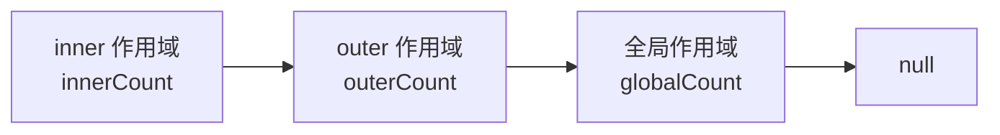

## 前言

```text
为什么外层函数已经执行完了，里面的变量还能被访问？
```

## 先看一道题

```js
var name = 'global';

function outer() {
  var name = 'outer';

  return function inner() {
    console.log(name);
  };
}

var fn = outer();

fn();
```

输出是：

```text
outer
```

这个结果有两个容易误解的地方：

1. `inner` 是在全局作用域里通过 `fn()` 调用的，为什么没有输出 `global`？
2. `outer()` 已经执行完了，为什么 `outer` 里的 `name` 还没有被回收？

**JavaScript 是词法作用域，函数能访问哪些变量，在函数定义时就确定了；闭包让函数在离开原始执行位置后，仍然能继续访问当时的词法环境。**

## 作用域：变量查找的规则

作用域解决的是两个问题：

1. 变量声明放在哪里。
2. 使用变量时，应该去哪里找。

比如：

```js
var a = 1;

function foo() {
  var b = 2;
  console.log(a);
}

foo();
console.log(b);
```

输出：

```text
1
ReferenceError: b is not defined
```

`foo` 能访问外层的 `a`，但外层不能访问 `foo` 内部的 `b`。

还有一个经常混在一起的问题：

```js
var obj = {};

console.log(obj.name);
console.log(name);
```

前者是对象属性查找，找不到返回 `undefined`。后者是标识符查找，沿作用域链找不到就会抛出 `ReferenceError`。

## 词法作用域：看定义位置，不看调用位置

JavaScript 采用的是词法作用域，也叫静态作用域。

看一个很经典的例子：

```js
var value = 1;

function foo() {
  console.log(value);
}

function bar() {
  var value = 2;
  foo();
}

bar();
```

输出：

```text
1
```

如果 JavaScript 是动态作用域，`foo()` 在 `bar()` 里面调用，就可能拿到 `bar` 里的 `value = 2`。

但 JavaScript 不是这样。`foo` 定义在全局作用域，所以它向外找变量时，会去全局环境找 `value`，而不是去调用它的 `bar` 里找。

也就是说：

```text
函数的作用域链，和函数在哪里调用没关系，和函数在哪里定义有关。
```

## 作用域链：变量是怎么一路往外找的

再看一个例子：

```js
const globalCount = 1;

function outer() {
  const outerCount = 2;

  function inner() {
    const innerCount = 3;
    console.log(innerCount, outerCount, globalCount);
  }

  inner();
}

outer();
```

当 `inner` 里执行 `console.log(innerCount, outerCount, globalCount)` 时，变量查找过程大致是：

1. 先在 `inner` 自己的作用域里找，找到 `innerCount`。
2. 找不到 `outerCount`，就去外层 `outer` 的作用域里找。
3. 还需要 `globalCount`，继续去全局作用域里找。
4. 如果一直找到最外层还没有，就抛出 `ReferenceError`。

这条“从内到外”的查找路径，就是作用域链。

可以画成这样：



作用域链不是代码执行时临时猜出来的。函数创建时，它能访问的外层环境就已经确定了。

## 从规范角度看：词法环境

在 ECMAScript 规范里，作用域链对应的核心概念叫 `Lexical Environment` 和 `Environment Record`。

```text
Lexical Environment = 当前这层作用域的变量记录 + 指向外层环境的引用
```

也就是说，每一层环境里大概有两样东西：

```js
{
  record: {
    // 当前作用域里的变量、函数、参数等绑定
  },
  outer: 上一层词法环境,
}
```

比如前面的例子，可以简化成：

```text
inner lexical environment
  record: innerCount
  outer -> outer lexical environment
    record: outerCount
    outer -> global lexical environment
      record: globalCount
      outer -> null
```

规范里还有一个很关键的操作：查找标识符时，如果当前 `Environment Record` 没有这个绑定，就继续找 `[[OuterEnv]]`。

这就是作用域链在规范层面的表达。

需要注意的是，`Environment Record` 是规范用来描述语义的模型，不代表浏览器里一定有一个同名对象让我们直接访问。不同引擎会有自己的实现方式，但行为要符合这套语义。

## 从 V8 源码看：闭包变量为什么还能活

本文看的 Chromium/V8 版本固定为：

```text
Chromium: 148.0.7778.178
commit: d096af1c9e98c45c3596e59620622b1a049bfecb
```

先说结论：

```text
闭包不是把整个函数执行上下文都留在内存里。
```

更接近 V8 实现的说法是：

```text
需要跨函数继续访问的变量，会被分配到堆上的 Context 里；闭包函数持有这个 Context，所以变量还能活。
```

### Scope：先分析哪些变量需要进 Context

V8 解析代码时，会建立 `Scope`。`Scope` 里有两个很关键的字段：

```cpp
int num_stack_slots() const { return num_stack_slots_; }
int num_heap_slots() const { return num_heap_slots_; }
```

也就是说，变量大致有两类去处：

1. 放在栈帧或寄存器里，用完就可以跟着调用结束。
2. 放在堆上的 `Context` 里，给后续闭包继续访问。

`Scope::NeedsContext()` 的判断也很直白：

```cpp
bool NeedsContext() const {
  return num_heap_slots() > 0;
}
```

那什么变量必须进 `Context`？

看 `Scope::MustAllocateInContext` 的注释和逻辑，核心原因是：

```text
如果变量会被内层作用域访问，或者可能通过 eval / runtime lookup 被访问，就必须分配到 context。
```

源码里对应的是：

```cpp
return var->has_forced_context_allocation() || inner_scope_calls_eval();
```

在变量分配时，V8 会走到类似下面的分支：

```cpp
if (MustAllocateInContext(var)) {
  AllocateHeapSlot(var);
} else {
  AllocateStackSlot(var);
}
```

所以，闭包的成本不是“外层函数所有局部变量都永远不释放”，而是“被闭包需要的那部分变量会进入堆上的 context slot”。

回到开头的例子：

```js
function outer() {
  var name = 'outer';

  return function inner() {
    console.log(name);
  };
}
```

`name` 被内层函数 `inner` 访问，不能只放在 `outer` 的普通栈帧里，否则 `outer()` 返回后就没了。因此它需要进入 `Context`。

### Context：运行时真正保存闭包变量的对象

V8 里的 `Context` 是一个堆对象。

在 [`contexts.h`](https://source.chromium.org/chromium/chromium/src/+/d096af1c9e98c45c3596e59620622b1a049bfecb:v8/src/objects/contexts.h) 里可以看到两个很关键的槽位：

```cpp
enum Field {
  SCOPE_INFO_INDEX,
  PREVIOUS_INDEX,
  EXTENSION_INDEX,
  ...
};
```

可以简单理解成：

1. `SCOPE_INFO_INDEX`：指向这层作用域的元信息。
2. `PREVIOUS_INDEX`：指向外层 `Context`，这就是运行时的作用域链。
3. 后面的 slot：保存真正的闭包变量。

这和前面规范里的 `Lexical Environment` 很像：

```text
Context
  scope_info -> 当前作用域有哪些变量
  previous   -> 外层 Context
  slots      -> 变量值
```

`ScopeInfo` 则保存作用域的静态元信息。比如 [`scope-info.tq`](https://source.chromium.org/chromium/chromium/src/+/d096af1c9e98c45c3596e59620622b1a049bfecb:v8/src/objects/scope-info.tq) 里就有：

```cpp
context_local_count
context_local_names
context_local_infos
outer_scope_info
```

也就是说：

- `ScopeInfo` 更像“说明书”：这层作用域有哪些 context local，名字是什么，模式是什么，外层 scope info 是谁。
- `Context` 更像“运行时存储”：这一轮函数调用里，context slot 里的真实值是什么。

### CreateFunctionContext：函数执行时创建 Context

当一个函数作用域确实需要 `Context` 时，字节码生成阶段会生成创建 context 的逻辑。

在 [`bytecode-generator.cc`](https://source.chromium.org/chromium/chromium/src/+/d096af1c9e98c45c3596e59620622b1a049bfecb:v8/src/interpreter/bytecode-generator.cc) 里，`BuildNewLocalActivationContext()` 会根据 scope 创建对应的 context：

```cpp
int slot_count = scope->num_heap_slots() - Context::MIN_CONTEXT_SLOTS;

builder()->CreateFunctionContext(scope, slot_count);
```

[`bytecodes.h`](https://source.chromium.org/chromium/chromium/src/+/d096af1c9e98c45c3596e59620622b1a049bfecb:v8/src/interpreter/bytecodes.h) 里也能看到相关字节码：

```cpp
CreateClosure
CreateFunctionContext
PushContext
PopContext
LdaContextSlot
StaContextSlot
```

1. 创建函数执行需要的 `FunctionContext`。
2. 把当前 context 压到执行环境里。
3. 访问闭包变量时，通过 `LdaContextSlot` / `StaContextSlot` 读写 context slot。
4. 创建内层函数时，通过 `CreateClosure` 创建闭包函数。

### CreateClosure：函数对象会带上当前 Context

继续看 `VisitFunctionLiteral()`：

```cpp
builder()->CreateClosure(entry, GetNewClosureSlot(expr), flags);
```

真正运行时创建闭包函数的地方，可以看 [`runtime-scopes.cc`](https://source.chromium.org/chromium/chromium/src/+/d096af1c9e98c45c3596e59620622b1a049bfecb:v8/src/runtime/runtime-scopes.cc) 里的 `Runtime_NewClosure`：

```cpp
DirectHandle<Context> context(isolate->context(), isolate);

return *Factory::JSFunctionBuilder{isolate, shared, context}
            .set_feedback_cell(feedback_cell)
            .Build();
```

这段就很关键了：创建 `JSFunction` 时，会把当前的 `context` 一起传进去。

也就是说，`inner` 被创建出来时，不只是一个函数代码入口，它还带着当时的外层 `Context`。

所以开头例子的运行过程可以重新写成：

1. 编译阶段发现 `inner` 访问了 `outer` 的 `name`。
2. V8 把 `name` 分配到 `outer` 的 `FunctionContext`。
3. 执行 `outer()` 时创建这个 `Context`，并把 `name = 'outer'` 存进去。
4. 执行到 `return function inner() { ... }` 时，`CreateClosure` 创建 `inner`，并让 `inner` 持有当前 `Context`。
5. `outer()` 返回后，普通栈帧可以结束，但那个 `Context` 还被 `inner` 引用着。
6. 后面调用 `fn()` 时，读取 `name` 就是沿着 `inner` 持有的 context 链去找。

这就是“外层函数执行完了，变量还活着”的真正原因。

## 闭包到底是什么

回到开头的例子：

```js
function outer() {
  var name = 'outer';

  return function inner() {
    console.log(name);
  };
}

var fn = outer();

fn();
```

`outer()` 执行完后，按直觉它的执行上下文应该出栈，局部变量也应该没了。

但 `inner` 是在 `outer` 里面创建的，它创建时就记录了自己所在的词法环境。放到 V8 里看，就是 `inner` 这个 `JSFunction` 持有了创建时的 `Context`。只要 `inner` 这个函数还可以被外部访问，它引用到的那部分外层环境就不能被释放。

```text
闭包 = 函数 + 函数创建时能访问的外层词法环境
```

所以闭包不是“某种特殊写法”，也不是“return 一个函数才叫闭包”。只要一个函数能访问外层作用域里的变量，它就和那个外层环境形成了闭包。只是返回函数、事件回调、定时器回调这些场景，更容易把闭包的效果表现出来。

## 闭包保留的是绑定，不是复制值

来看这个例子：

```js
function createCounter() {
  let count = 0;

  return {
    add() {
      count++;
    },
    get() {
      return count;
    },
  };
}

const counter = createCounter();

counter.add();
counter.add();

console.log(counter.get());
```

输出：

```text
2
```

`add` 和 `get` 访问的是同一个 `count` 绑定。`add` 修改了 `count`，`get` 再读取时就能看到最新值。

所以更准确的理解是：

```text
闭包让函数继续引用外层词法环境里的变量绑定，而不是复制当时的变量值。
```

这也是闭包能用来做私有状态的原因。

## 闭包的常见用法

### 私有状态

```js
function createWallet() {
  let balance = 0;

  return {
    deposit(amount) {
      balance += amount;
    },
    getBalance() {
      return balance;
    },
  };
}

const wallet = createWallet();

wallet.deposit(100);
console.log(wallet.getBalance());
console.log(wallet.balance);
```

输出：

```text
100
undefined
```

外部不能直接访问 `balance`，只能通过返回出来的方法间接操作它。

### 函数工厂

```js
function makeAdder(x) {
  return function add(y) {
    return x + y;
  };
}

const add10 = makeAdder(10);
const add20 = makeAdder(20);

console.log(add10(1));
console.log(add20(1));
```

输出：

```text
11
21
```

每次调用 `makeAdder` 都会创建一套新的词法环境，所以 `add10` 和 `add20` 互不影响。

### 事件回调

```js
function bindButton(id, text) {
  const button = document.getElementById(id);

  button.addEventListener('click', function () {
    console.log(text);
  });
}

bindButton('save', '保存');
```

点击事件发生时，`bindButton` 早就执行完了。但回调函数仍然能访问 `text`，这也是闭包。

## React 里为什么到处都是闭包

因为函数组件本身就是函数：

```jsx
function Counter() {
  const [count, setCount] = useState(0);

  function handleClick() {
    console.log(count);
    setCount(count + 1);
  }

  return <button onClick={handleClick}>{count}</button>;
}
```

每次渲染 `Counter`，本质上都是重新执行一次 `Counter()`。

所以每次渲染都会产生一套新的词法环境：

```text
render 1:
  count = 0
  handleClick -> 捕获 render 1 的 count

render 2:
  count = 1
  handleClick -> 捕获 render 2 的 count
```

这就是 React 里很多闭包问题的根源：

```text
你拿到的函数，不一定来自最新一次 render。
```

### useState：状态不在你的闭包里，dispatch 会进入 React 队列

先看 `useState`。

在 React 19.2.4 的 `react-dom-client.development.js` 里，`mountState` 大致会做两件事：

```js
hook.memoizedState = hook.baseState = initialState;
hook.queue = {
  pending: null,
  dispatch: null,
  lastRenderedReducer: basicStateReducer,
  lastRenderedState: initialState,
};
```

然后创建 `dispatch`：

```js
dispatch = dispatchSetState.bind(null, currentlyRenderingFiber, queue);
queue.dispatch = dispatch;
return [hook.memoizedState, dispatch];
```

这说明一件事：

```text
count 这个值属于当前 render 的词法环境；真正的状态记录在 Fiber 对应的 hook 链表和 update queue 里。
```

所以 `setCount` 不是直接修改你这次闭包里的 `count`，而是把更新放进 React 的队列：

```js
setCount(count + 1);
```

`count + 1` 会先用当前闭包里的 `count` 算出一个值，再把这个值交给 React。

如果连续写：

```jsx
function add() {
  setCount(count + 1);
  setCount(count + 1);
  setCount(count + 1);
}
```

这三个 `count + 1` 用的是同一次 render 里的同一个 `count`，所以它们不是自然递增三次。

更稳的写法是函数式更新：

```jsx
function add() {
  setCount((c) => c + 1);
  setCount((c) => c + 1);
  setCount((c) => c + 1);
}
```

这不是为了“绕过闭包”，而是告诉 React：下一次状态应该基于队列里的上一个状态计算。

### useEffect：依赖数组其实是在管理闭包刷新

再看一个 stale closure 例子：

```jsx
function Counter() {
  const [count, setCount] = useState(0);

  useEffect(() => {
    const id = setInterval(() => {
      console.log(count);
    }, 1000);

    return () => clearInterval(id);
  }, []);

  return <button onClick={() => setCount(count + 1)}>{count}</button>;
}
```

页面上的 `count` 会变，但 `setInterval` 里一直打印 `0`。

原因是：

1. 首次 render 时，`count = 0`。
2. `useEffect(..., [])` 只在挂载时注册一次。
3. `setInterval` 的回调捕获的是首次 render 的 `count`。
4. 后续 render 产生了新的 `count`，但这个 interval 回调没有被替换。

所以 React 文档才会强调：`useEffect` 的依赖项应该包含 effect 里用到的 reactive values，也就是 props、state，以及组件内部声明的变量和函数。

如果希望 interval 随 `count` 更新，可以写：

```jsx
useEffect(() => {
  const id = setInterval(() => {
    console.log(count);
  }, 1000);

  return () => clearInterval(id);
}, [count]);
```

这表示：`count` 变了，就清理旧闭包，注册新闭包。

注意 cleanup 也很有意思。React 会先用旧值执行 cleanup，再用新值执行 setup。这正好体现了闭包：

```text
旧 effect 的 cleanup，拿到的是旧 render 的变量；
新 effect 的 setup，拿到的是新 render 的变量。
```

### useRef：用稳定对象读取最新值

如果我们不想反复重建 interval，但又想读取最新值，可以用 `useRef`：

```jsx
function Counter() {
  const [count, setCount] = useState(0);
  const countRef = useRef(count);

  countRef.current = count;

  useEffect(() => {
    const id = setInterval(() => {
      console.log(countRef.current);
    }, 1000);

    return () => clearInterval(id);
  }, []);

  return <button onClick={() => setCount((c) => c + 1)}>{count}</button>;
}
```

`useRef` 的源码也很简单：

```js
function mountRef(initialValue) {
  var hook = mountWorkInProgressHook();
  initialValue = { current: initialValue };
  return (hook.memoizedState = initialValue);
}
```

`ref` 对象本身是稳定的，闭包捕获的是这个稳定对象。后续 render 改的是 `ref.current`，所以旧闭包也能读到最新值。

这也是很多 React 代码里用 `ref` 解决 stale closure 的原因。

### useCallback：缓存函数身份，不是自动更新闭包

`useCallback` 也经常和闭包混在一起。

先看一个容易写错的例子：

```jsx
function Search({ keyword }) {
  const submit = useCallback(() => {
    console.log(keyword);
  }, []);

  return <button onClick={submit}>搜索</button>;
}
```

如果 `keyword` 后续变了，`submit` 里还是旧值。

原因不是 React 奇怪，而是你用 `[]` 告诉 React：这个 callback 永远不用换。

React 19.2.4 里的 `updateCallback` 逻辑也很直接：

```js
if (deps !== null && areHookInputsEqual(deps, prevState[1])) {
  return prevState[0];
}

hook.memoizedState = [callback, deps];
return callback;
```

也就是说：

```text
依赖没变，React 返回上一次的 callback；依赖变了，React 保存这一次 render 创建的新 callback。
```

所以 `useCallback` 缓存的是函数身份，不会让旧函数“自动看到新变量”。

正确写法应该是：

```jsx
const submit = useCallback(() => {
  console.log(keyword);
}, [keyword]);
```

或者如果它不应该响应 `keyword`，就不要在里面读 `keyword`。

### React 19.2 的 useEffectEvent：把“响应式”和“读取最新值”分开

React 19.2 文档里已经有 `useEffectEvent`。

它解决的是一种很常见的闭包问题：

```text
Effect 只想因为 roomId 变化而重连，但连接成功后的回调又想读取最新 theme / muted / count。
```

如果直接把所有值都塞进依赖数组，可能会导致频繁重连。比如：

```jsx
function ChatRoom({ roomId, theme }) {
  useEffect(() => {
    const connection = createConnection(roomId);

    connection.on('connected', () => {
      showNotification('Connected!', theme);
    });

    connection.connect();
    return () => connection.disconnect();
  }, [roomId, theme]);
}
```

`theme` 变化也会重连聊天室，这通常不是我们想要的。

React 19.2 可以写成：

```jsx
function ChatRoom({ roomId, theme }) {
  const onConnected = useEffectEvent(() => {
    showNotification('Connected!', theme);
  });

  useEffect(() => {
    const connection = createConnection(roomId);

    connection.on('connected', onConnected);

    connection.connect();
    return () => connection.disconnect();
  }, [roomId]);
}
```

React 文档里的解释是：Effect Event 可以读取最新的 props 和 state，但不会让 Effect 因为这些值重新同步。

源码里 `useEffectEvent` 的思路也能看出来：

```js
var ref = { impl: callback };

return function () {
  return ref.impl.apply(void 0, arguments);
};
```

更新时，React 会把新的 callback 放进这个 ref 对应的实现里：

```js
useEffectEventImpl({ ref: ref, nextImpl: callback });
```

所以它和 `useRef` 的思路有点像：闭包持有稳定入口，真正执行时再走最新实现。

但它不是“依赖数组作弊器”。React 文档也说得很明确：如果某个值应该触发 Effect 重新同步，就应该放进依赖数组；`useEffectEvent` 只适合那种“在 Effect 触发的事件里读取最新值，但不希望它改变订阅生命周期”的逻辑。

### React 里的闭包应该怎么判断

写 React 时，可以按下面这几条判断：

1. 事件处理函数通常就是闭包，捕获当前 render 的 props 和 state。
2. `useEffect` 的依赖数组，决定这个 effect 闭包什么时候更新。
3. `useCallback` 只稳定函数身份，不会自动修复 stale closure。
4. 只更新状态时，优先考虑函数式更新：`setCount((c) => c + 1)`。
5. 需要长期订阅，又要读最新值，可以考虑 `useRef` 或 React 19.2 的 `useEffectEvent`。
6. 如果某个值变化应该重新连接、重新订阅、重新请求，就把它放进依赖数组。

## for 循环里的闭包问题

以前最经典的闭包坑，是 `var` 和循环：

```js
for (var i = 0; i < 3; i++) {
  setTimeout(function () {
    console.log(i);
  }, 0);
}
```

输出：

```text
3
3
3
```

原因是 `var` 没有块级作用域，三个回调引用的是同一个 `i`。等回调执行时，循环已经结束，`i` 变成了 `3`。

换成 `let`：

```js
for (let i = 0; i < 3; i++) {
  setTimeout(function () {
    console.log(i);
  }, 0);
}
```

输出：

```text
0
1
2
```

`let` 在 `for` 循环里会为每次迭代创建新的词法环境，所以每个回调拿到的是各自那一轮的 `i`。

如果不用 `let`，以前常见的写法是 IIFE：

```js
for (var i = 0; i < 3; i++) {
  (function (current) {
    setTimeout(function () {
      console.log(current);
    }, 0);
  })(i);
}
```

这段代码本质上是手动为每一轮循环创建一个新的函数作用域。

## 闭包和内存：为什么可能泄漏

闭包本身不是内存泄漏。

真正的问题是：**闭包让某些变量继续可达，如果这些变量引用了很大的对象、DOM 节点、定时器或缓存，就可能让它们一直无法被回收。**

比如：

```js
let clickHandler = null;

function bindPanel() {
  const panel = document.querySelector('#panel');

  clickHandler = function () {
    console.log(panel.textContent);
  };

  window.addEventListener('click', clickHandler);

  panel.remove();
}

bindPanel();
```

`panel.remove()` 只是把节点从 DOM 树上移除了。

但 `clickHandler` 还被 `window` 的事件监听持有，而 `clickHandler` 又通过闭包引用了 `panel`。所以这个 DOM 节点虽然离开了页面树，但仍然被 JavaScript 引用着。

在 Chrome DevTools 的内存文档里，这类节点通常会被称为 `Detached DOM tree`：节点已经从 DOM 树移除，但还有 JavaScript 引用保留着它。

修复思路也很直接：

```js
window.removeEventListener('click', clickHandler);
clickHandler = null;
```

或者从一开始就避免在长生命周期闭包里捕获很重的对象：

```js
function bindPanel() {
  const panel = document.querySelector('#panel');
  const text = panel.textContent;

  window.addEventListener('click', function () {
    console.log(text);
  });

  panel.remove();
}
```

回调只保留字符串 `text`，不再保留整个 DOM 节点。

## 怎么判断闭包该不该担心

日常写代码不需要看到闭包就紧张。大多数闭包都是正常的。

真正需要注意的是下面几类：

1. 闭包生命周期很长，比如挂在 `window`、模块单例、全局缓存上。
2. 闭包捕获了很大的对象，比如大数组、大 Map、大 JSON。
3. 闭包捕获了 DOM 节点，而且节点后续会被移除。
4. 闭包被定时器、事件监听、Promise 链长时间持有。

对应的处理方式也不复杂：

1. 不用了就 `removeEventListener`。
2. 不用了就 `clearInterval`、`clearTimeout`。
3. 长生命周期闭包里尽量只捕获必要字段，不要顺手捕获整个对象。
4. 确认外部引用断开后，再让垃圾回收接管。

关键不是“销毁闭包”，而是“让闭包不再可达”。只要没有地方能再访问这个函数，它引用的词法环境也就有机会被回收。

## 回到最开始那道题

现在再看一遍：

```js
var name = 'global';

function outer() {
  var name = 'outer';

  return function inner() {
    console.log(name);
  };
}

var fn = outer();

fn();
```

为什么输出 `outer`？

可以按下面几步理解：

1. `inner` 定义在 `outer` 里面，所以它的外层词法环境是 `outer`。
2. `fn = outer()` 后，`fn` 指向 `inner`。
3. `inner` 通过 `fn` 逃到了外部。
4. 只要 `fn` 还存在，`inner` 引用的那部分 `outer` 词法环境就不能释放。
5. 执行 `fn()` 时，查找 `name` 会先沿着 `inner -> outer -> global` 的链路找。
6. 在 `outer` 的环境里找到 `name = 'outer'`，所以输出 `outer`。

所以，闭包不是为了“强行让变量不销毁”而设计出来的技巧，它是词法作用域自然带来的结果。

## 总结

1. 作用域解决的是变量存放和变量查找的问题。
2. JavaScript 是词法作用域，函数能访问哪些变量由定义位置决定。
3. 作用域链就是从当前环境一路沿 `outer` 往外找变量。
4. 规范里的 `Lexical Environment` 可以理解为“变量记录 + 外层引用”。
5. 闭包是函数和其创建时词法环境的组合。
6. 闭包保留的是变量绑定，不是简单复制值。
7. V8 里需要逃逸的变量会进入堆上的 `Context`，闭包函数持有这个 `Context`。
8. React 函数组件每次 render 都会产生新的词法环境，所以事件回调、Effect、`useCallback` 都和闭包有关。
9. 闭包本身不是内存泄漏，长生命周期闭包捕获大对象或 DOM 节点才容易出问题。

```text
函数在哪里定义，就沿着哪里的作用域链查变量；函数被带到外面继续用，就会把需要的外层环境一起带出去。
```

## 参考文章和规范

- [MDN: Closures](https://developer.mozilla.org/en-US/docs/Web/JavaScript/Guide/Closures)
- [ECMAScript 2027: Lexical Environments](https://tc39.es/ecma262/multipage/executable-code-and-execution-contexts.html#sec-lexical-environments)
- [Chrome DevTools: Fix memory problems](https://developer.chrome.com/docs/devtools/memory-problems)
- [React 19.2: useEffect](https://react.dev/reference/react/useEffect)
- [React 19.2: useEffectEvent](https://react.dev/reference/react/useEffectEvent)
- Chromium/V8 源码版本：`148.0.7778.178`，commit：`d096af1c9e98c45c3596e59620622b1a049bfecb`
- [V8 scopes.h](https://source.chromium.org/chromium/chromium/src/+/d096af1c9e98c45c3596e59620622b1a049bfecb:v8/src/ast/scopes.h)
- [V8 scopes.cc](https://source.chromium.org/chromium/chromium/src/+/d096af1c9e98c45c3596e59620622b1a049bfecb:v8/src/ast/scopes.cc)
- [V8 contexts.h](https://source.chromium.org/chromium/chromium/src/+/d096af1c9e98c45c3596e59620622b1a049bfecb:v8/src/objects/contexts.h)
- [V8 scope-info.tq](https://source.chromium.org/chromium/chromium/src/+/d096af1c9e98c45c3596e59620622b1a049bfecb:v8/src/objects/scope-info.tq)
- [V8 bytecode-generator.cc](https://source.chromium.org/chromium/chromium/src/+/d096af1c9e98c45c3596e59620622b1a049bfecb:v8/src/interpreter/bytecode-generator.cc)
- [V8 bytecodes.h](https://source.chromium.org/chromium/chromium/src/+/d096af1c9e98c45c3596e59620622b1a049bfecb:v8/src/interpreter/bytecodes.h)
- [V8 runtime-scopes.cc](https://source.chromium.org/chromium/chromium/src/+/d096af1c9e98c45c3596e59620622b1a049bfecb:v8/src/runtime/runtime-scopes.cc)
