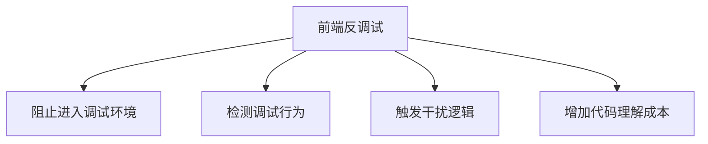

# 前端反调试入门：常见套路、识别方法与绕过思路

## 目录

### 1. 为什么前端要做反调试

- 1.1 前端反调试到底在防什么
- 1.2 常见目标：防抓包、防控制台分析、防代码还原、防接口复现
- 1.3 它真的有用吗：安全价值和现实局限

**这一节建议写法：**
先把读者拉到一个共识上：前端反调试不是“绝对防御”，而是**抬高分析成本**。开篇别急着上代码，先讲清楚“它防的是谁、拖的是谁、恶心的是谁”。

---

### 2. 前端反调试的基本思路

- 2.1 阻止你打开开发者工具
- 2.2 让你打开了也不好分析
- 2.3 一旦检测到调试行为就跳转、卡死、清空页面
- 2.4 干扰断点、调用栈、格式化代码、Hook 分析

**这一节建议写法：**
把“反调试”抽象成几个大类，方便后面逐个展开。这里可以加一张总览图：



---

### 3. 常见前端反调试手法盘点

- 3.1 禁用 F12、右键、复制、快捷键
- 3.2 `debugger` 语句与无限 `debugger`
- 3.3 `setInterval` / `setTimeout` 轮询检测
- 3.4 基于窗口尺寸差异检测 DevTools
- 3.5 利用 `console` 特性做探测
- 3.6 `console-ban` 一类库的典型做法
- 3.7 打开控制台后强制跳转空白页或登录页
- 3.8 代码自校验 / 函数字符串校验 / toString 检测
- 3.9 混淆、字符串加密、动态拼接、`eval` / `Function`
- 3.10 无限递归、死循环、异常流控制干扰调试

**这一节建议写法：**
这是正文核心。你可以把每一种手法都写成统一模板：

- 原理是什么
- 代码大概长什么样
- 调试时有什么表现
- 如何快速定位

顺手点一下：52pojie 上相关公开讨论里，确实常见“`console-ban` 导致一打开控制台就跳空白页”和“无限 `debugger` 反调试”这类问题。([52pojie.cn][1])

---

### 4. 从一个简单案例看反调试链路

- 4.1 页面加载时做了哪些初始化
- 4.2 哪些检测逻辑最先执行
- 4.3 触发条件是什么
- 4.4 检测成功后执行了什么破坏动作
- 4.5 这些逻辑一般藏在哪里

**这一节建议写法：**
这里可以虚构一个最小案例，或者拿你准备分析的页面做“匿名化处理”。重点不是还原业务，而是让读者学会看链路：

`入口脚本 -> 定时检测 -> 命中条件 -> 跳转/卡死/清空`

---

### 5. 反调试代码通常埋在什么位置

- 5.1 首屏入口脚本
- 5.2 webpack 打包产物里的自执行函数
- 5.3 混淆后的工具函数
- 5.4 动态加载脚本
- 5.5 框架生命周期钩子里
- 5.6 第三方库或私有 SDK 中

**这一节建议写法：**
这一节特别实用。很多人不是不会绕，而是**根本找不到代码在哪**。
可以讲几个定位思路：

- 全局搜 `debugger`
- 搜 `setInterval`
- 搜 `devtools`
- 搜 `toString`
- 搜可疑跳转语句
- 从报错堆栈或暂停堆栈回溯

---

### 6. 如何识别“它在做前端反调试”

- 6.1 一打开控制台页面就异常
- 6.2 页面频繁 pause
- 6.3 调试时卡顿明显、CPU 飙高
- 6.4 Sources 里出现大量混淆和动态代码
- 6.5 调用栈里反复出现同一检测函数
- 6.6 页面行为和不开控制台时完全不同

**这一节建议写法：**
别只讲代码。很多读者最需要的是“看到什么现象，就知道大概率是什么手法”。

---

### 7. 常见绕过思路：先定位，再隔离，再替换

- 7.1 不要一上来就硬刚，先找入口
- 7.2 断在关键 API，而不是断在业务逻辑
- 7.3 覆盖检测函数为空函数
- 7.4 清掉定时器和轮询
- 7.5 屏蔽跳转逻辑
- 7.6 改写 `debugger` 触发路径
- 7.7 在脚本执行前做 Hook
- 7.8 用本地代理/脚本重写响应内容

**这一节建议写法：**
这一节可以写成“方法论”，不要写成“脚本大全”。重点是思路顺序：

1. 观察现象
2. 找触发点
3. 看破坏动作
4. 找依赖链
5. 局部替换而不是全局乱删

---

### 8. 几类典型反调试的处理示例

- 8.1 遇到无限 `debugger` 怎么办
- 8.2 遇到 `console-ban` 怎么办
- 8.3 遇到窗口尺寸检测怎么办
- 8.4 遇到 `eval` 动态代码怎么办
- 8.5 遇到打开控制台即跳转怎么办
- 8.6 遇到自校验代码怎么办

**这一节建议写法：**
这里最适合加“伪代码 + 处理思路”。比如：

```js
setInterval(function () {
  debugger;
}, 100);
```

你就讲：

- 先从定时器回调入手
- 找是谁注册的
- 清定时器或重写回调
- 别直接删一大片代码，容易把业务删崩

---

### 9. 实战中更有效的分析策略

- 9.1 先抓接口，再碰前端逻辑
- 9.2 优先分析关键参数生成链
- 9.3 对混淆代码做“去噪”
- 9.4 保留现场：记录堆栈、断点、调用关系
- 9.5 不要被“花活”带偏
- 9.6 什么时候该放弃浏览器内调试，转本地还原分析

**这一节建议写法：**
这是经验部分，能拉开博客质量。告诉读者：
**前端反调试的目的往往不是保密算法本身，而是让你在错误的位置浪费时间。**

---

### 10. 前端反调试的局限性

- 10.1 代码终究运行在客户端
- 10.2 再复杂也要落到可执行逻辑
- 10.3 保护的是时间，不是绝对安全
- 10.4 真正的安全边界仍然在后端

**这一节建议写法：**
这节用来收束全文。别把反调试吹神。结论应该稳一点：
它有价值，但主要价值是**增加成本、延缓分析、筛掉低水平自动化**。

---

### 11. 写给开发者的建议：怎么做才更合理

- 11.1 不要把反调试当核心安全方案
- 11.2 少堆“表演型”防护，多做真实风控
- 11.3 前端保护要和后端校验联动
- 11.4 控制性能损耗和误伤率
- 11.5 给业务、风控、前端三方一个平衡点

**这一节建议写法：**
这节很加分。会让你的文章不只是“怎么绕过”，而是有工程视角。

---

### 12. 总结

- 12.1 前端反调试的本质
- 12.2 最值得掌握的几个识别点
- 12.3 最常用的几种绕过思路
- 12.4 后续还可以继续深挖哪些方向

---

## 你可以直接用的文章副标题

你挑一个：

1. **前端反调试入门：常见套路、识别方法与绕过思路**
2. **一文看懂前端反调试：从 debugger 到 console-ban**
3. **前端反调试到底在防什么：原理、案例与实战分析**
4. **打开控制台就跳空白页？聊聊前端反调试那些套路**
5. **前端反调试实战笔记：定位、分析与绕过**

---

## 这篇博客最推荐的写法

我建议你按这个节奏写：

**开头现象**
“为什么一开控制台页面就白了 / 卡了 / 跳走了？”

**中间拆原理**
把常见反调试拆成 5~8 类。

**再讲定位方法**
让读者知道怎么找，而不只是知道“有这个东西”。

**最后讲局限和工程建议**
这样整篇文章层次会高很多，不像单纯记录题解。

---

## 一个更适合发布的精简版目录

如果你想写得更短、更像博客，而不是教程，可以用这个：

1. 前言：前端反调试到底是什么
2. 常见手法：`debugger`、定时器、控制台检测、跳转空白页
3. 一个典型案例的执行链路
4. 我是怎么定位到反调试代码的
5. 几种常见绕过思路
6. 前端反调试的局限
7. 总结
