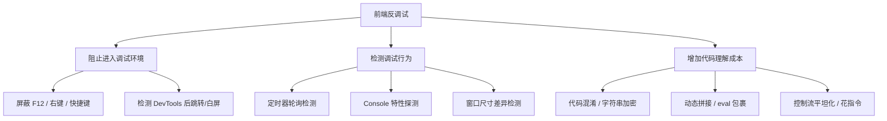
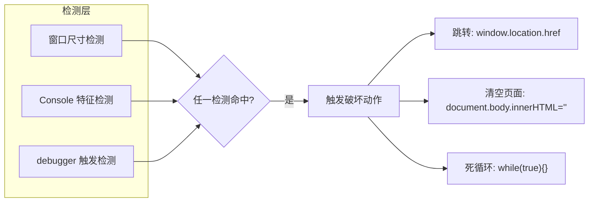
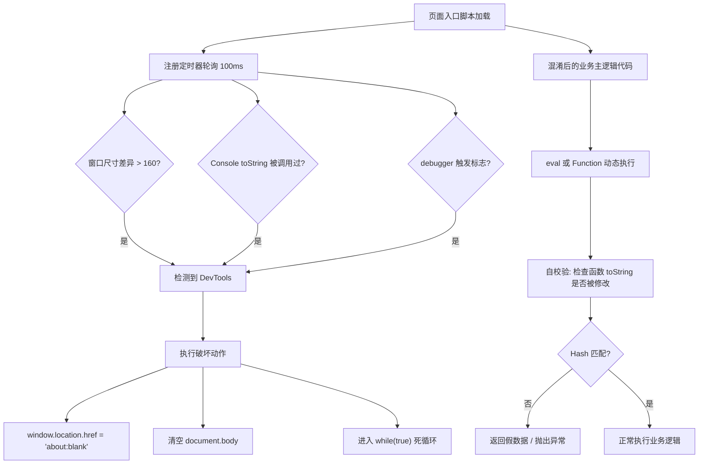
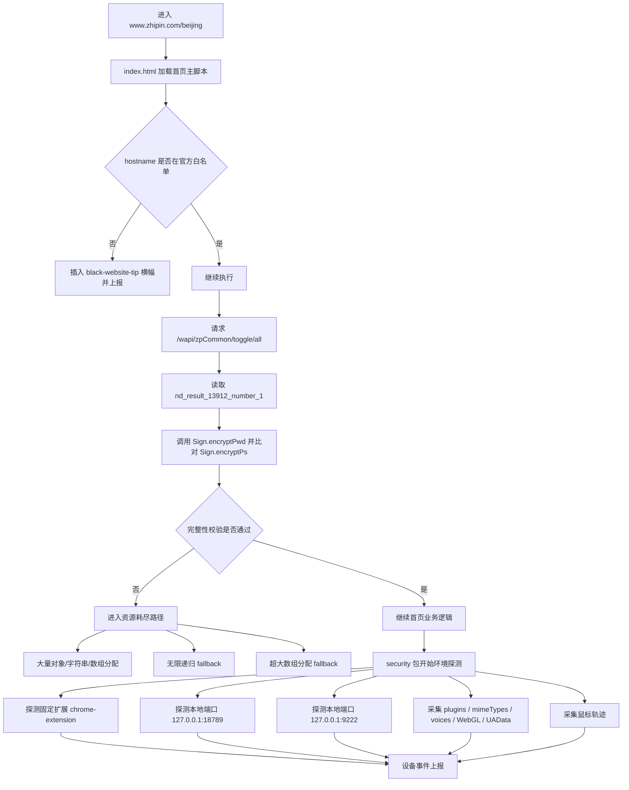
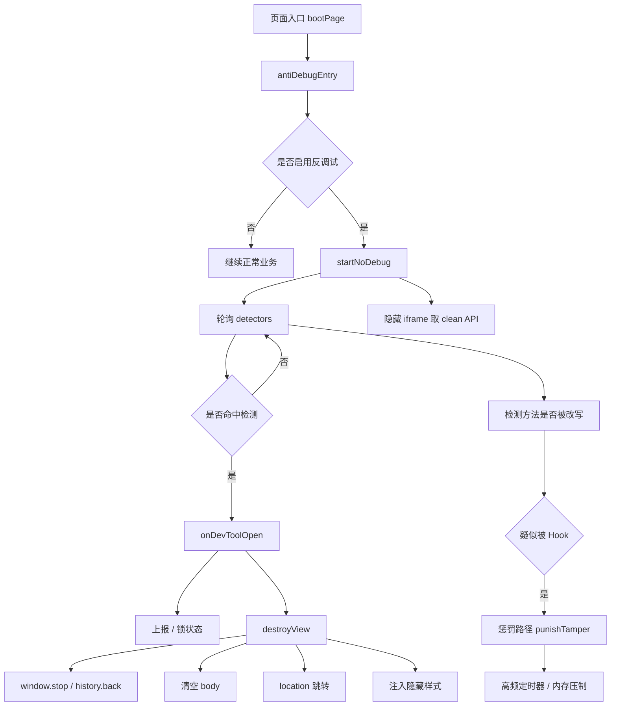

## 为什么前端要做反调试

如果你做过前端逆向，大概率都见过这种场景：页面本来一切正常，刚按下 F12，白屏了，跳首页了，或者开始疯狂断点，CPU 也跟着飙上去。

很多时候你甚至还没来得及点开 Network，更别说顺着调用栈往下跟，页面就已经先动手了。背后那类专门“跟你过不去”的代码，基本都算前端反调试。

说白了，前端反调试不是为了让你“永远看不到”，而是为了让你“看得更慢、更累”。代码既然已经发到客户端，就不存在绝对防御，它真正能做的是抬高定位、理解和复现的时间成本。

它防的对象，大致可以拆成三层：

- 第一层，防“普通用户误操作”。比如禁用右键、禁止复制、屏蔽 F12，这类东西主要是拦没有技术背景的人，别让他们一不小心把 DevTools 打开了。
- 第二层，防“初级自动化或爬虫”。常见做法是看 `navigator.webdriver`、无头浏览器特征，识别自动化环境后直接拒绝。这一层更像环境识别，不是在跟人类分析者硬碰硬。
- 第三层，防“逆向分析者”。你已经打开 DevTools，准备看 Sources、下断点、抓 Network 了，这时候它才真正发力。像跳转、卡死、无限 `debugger`、混淆、自校验，基本都属于这一层。

落到代码层面，常见动作也差不多就三类：

- **阻止你进调试环境**：要么 DevTools 打不开，要么一打开就出事。
- **检测你是不是在调试**：一旦发现你开了 DevTools、下了断点、开始观察控制台，就触发对抗动作。
- **就算你进去了，也尽量让代码难看**：你确实进去了，也没立刻白屏，但代码已经乱到不值得逐行看了。

真实页面里这几类一般不是分开用的。更常见的情况是混着来：先靠轮询或控制台探测判断你是不是在调试，再决定是跳转、清空页面，还是单纯把代码搅得很难看。

用一张图概括：



后面就按这个框架往下拆：先看套路，再看怎么定位，最后再讲怎么绕。

## 常见前端反调试手法盘点

### 禁用 F12、右键、复制、快捷键

**原理**：监听 `keydown` 和 `contextmenu` 事件，阻止默认行为。这是最基础的手段，防普通用户有效，对技术人员几乎透明。

**代码示例**：

```js
// 禁止 F12 和常见开发者工具快捷键
document.addEventListener('keydown', function (e) {
  // F12
  if (e.keyCode === 123) {
    e.preventDefault();
    return false;
  }
  // Ctrl+Shift+I / Ctrl+Shift+J / Ctrl+Shift+C / Ctrl+U
  if (
    (e.ctrlKey &&
      e.shiftKey &&
      (e.keyCode === 73 || e.keyCode === 74 || e.keyCode === 67)) ||
    (e.ctrlKey && e.keyCode === 85)
  ) {
    e.preventDefault();
    return false;
  }
});

// 禁止右键菜单
document.addEventListener('contextmenu', function (e) {
  e.preventDefault();
  return false;
});

// 禁止文本选择（CSS 方式）
// * { user-select: none; }
```

**调试表现**：在页面上按 F12 没反应，右键弹不出菜单，Ctrl+C 复制失败。

**快速定位**：全局搜索 `keyCode`、`123`、`contextmenu`、`preventDefault`。在 Chrome DevTools 中可以在 Event Listener Breakpoints 里勾选 Keyboard 和 Context Menu 类目，直接断在事件处理函数入口处。

**绕过**：通过浏览器菜单栏手动打开 DevTools，或者用 `Ctrl+Shift+I` 再配合事件断点定位后覆盖。也可以使用浏览器的“开发者工具-设置”中“禁用 JavaScript”后打开页面再恢复。

### `debugger` 语句与无限 `debugger`

**原理**：JavaScript 的 `debugger` 语句是一个“硬断点”——只要 DevTools 处于开启状态，执行到它就会暂停，就像在 Sources 面板里手动打了一个断点。攻击者利用这一点，把 `debugger` 放进循环或定时器里，让分析者根本无法正常调试。

**代码示例**：

```js
// 方式一：定时器版本。每 100ms 触发一次 debugger
setInterval(function () {
  debugger;
}, 100);

// 方式二：死循环版本。
(function () {
  while (true) {
    debugger;
  }
})();
```

**调试表现**：只要打开 DevTools，页面就不停在 Sources 面板暂停，点击“Resume script execution”（继续执行）立刻又停在下一个 `debugger`，形成无限循环，根本无法进行任何分析。

**快速定位**：在 Sources 面板的 Call Stack 里可以看到暂停位置所在函数，直接顺着文件名和行号就能定位到反调试代码。

**绕过**：在该 `debugger` 行号上右键 → “Never pause here”（一律不在此处暂停），之后这个位置的 `debugger` 就不会再触发。如果 `debugger` 是动态生成的（比如通过 `Function` 构造），可以用条件断点（条件设为 `false`）使其跳过。

### `setInterval` / `setTimeout` 轮询检测

**原理**：持续检测 DevTools 的打开/关闭状态，一旦状态切换就触发对抗动作。窗口尺寸检测、控制台检测、debugger 断点检测的逻辑大多挂载在这种轮询定时器上，通常周期在 50~500ms 之间。

**代码示例**：

```js
// 每 500ms 调用一次检测函数
setInterval(function () {
  if (isDevToolsOpen()) {
    document.body.innerHTML = ''; // 清空页面
  }
}, 500);
```

**调试表现**：打开 DevTools 后约 0.5~1 秒内出现异常，CPU 占用可能偏高。

**快速定位**：在 Console 中执行 `console.log(setInterval.toString())` 无法直接定位到用户代码，更有效的方式是在 Sources 面板中搜索 `setInterval` 关键字，或在 Call Stack 中回溯定时器回调的来源文件。

**绕过**：Control+C 停止脚本执行后，在 Console 中执行 `for (let i = 1; i < 100000; i++) { clearInterval(i); clearTimeout(i); }` 清掉所有定时器，再继续分析。

### 基于窗口尺寸差异检测 DevTools

**原理**：当 DevTools 以“停靠在下侧/右侧”方式打开时，会占据浏览器窗口的一部分空间，导致 `window.outerWidth - window.innerWidth` 或 `window.outerHeight - window.innerHeight` 的差值明显增大。正常浏览时差值通常在几十像素以内，而打开 DevTools 后差值可能超过 160px。

**代码示例**：

```js
function isDevToolsOpen() {
  const threshold = 160;
  const widthDiff = window.outerWidth - window.innerWidth;
  const heightDiff = window.outerHeight - window.innerHeight;
  return widthDiff > threshold || heightDiff > threshold;
}

let wasOpen = false;
setInterval(function () {
  const nowOpen = isDevToolsOpen();
  if (!wasOpen && nowOpen) {
    // 首次检测到 DevTools 打开 → 跳转
    window.location.href = 'about:blank';
  }
  wasOpen = nowOpen;
}, 100);
```

**调试表现**：打开 DevTools 后页面立刻跳转，而且往往是“按 F12 瞬间页面没了”。

**快速定位**：搜索 `outerWidth`、`outerHeight`、`innerWidth`、`innerHeight`。

**绕过**：

- 在打开页面**之前**先打开 DevTools（此时 DevTools 不在页面上，不会触发尺寸变化），再输入 URL 访问。
- 使用 DevTools 的“独立窗口模式”（点击 DevTools 右上角的三个点 → 选择 Undock into separate window），这样 DevTools 不占用页面窗口空间，尺寸差值几乎为零，检测直接失效。
- 在 Console 中覆盖 `isDevToolsOpen` 为 `() => false`。

### 利用 `console` 特性做探测

**原理**：Console 有一个比较隐蔽的行为——当 DevTools 打开时，`console.log` 输出对象时浏览器会计算该对象的属性；而 DevTools 关闭时，很多浏览器会推迟甚至忽略 console 输出的求值。攻击者在对象上设置一个 getter，当 getter 被调用就意味着“有人想看看这个对象长什么样”，从而推断 DevTools 已打开。

**代码示例**：

```js
let devtoolsOpen = false;
const detector = /./;
detector.toString = function () {
  devtoolsOpen = true;
  return '';
};

console.log('%c', detector);

setInterval(function () {
  if (devtoolsOpen) {
    // 触发对抗动作
    window.location.href = 'about:blank';
  }
  devtoolsOpen = false; // 重置标志
}, 1000);
```

这里真正起作用的，不是什么 getter 概念本身，而是 `toString` 被重写了。`console.log('%c', detector)` 在某些场景下会去取第二个参数的字符串表示，一旦 `detector.toString()` 被调用，标志位就会被置成 `true`。后面的轮询看到这个标志位，就知道 DevTools 大概率已经打开了。

这类探测的麻烦点就在于：表面上你只看到了一个再普通不过的 `console.log`，但真正的检测动作藏在对象求值阶段里。你如果只盯着显式的条件判断，很容易漏掉它。

**调试表现**：打开 DevTools 后 1 秒左右触发跳转或空白页，且没有明显的 `debugger` 暂停。

**快速定位**：搜索 `toString`、`console.log`、`%c`。

**绕过**：打开 DevTools 后在 Console 中先把 `console.log` 覆盖为空函数 `console.log = function(){}`，再刷新页面。或者在页面脚本加载前注入 Hook，把检测对象的 `toString` 覆盖为无害版本。

### `console-ban` 一类库的典型做法

**原理**：`console-ban` 是一个专门用于前端反调试的 npm 库，集成了多种检测手段——Console 检测、窗口尺寸检测、debugger 断点检测，一打开 DevTools 就触发清空页面或跳转。它的核心逻辑通常压缩在一行内以增加定位难度，典型特征是代码中包含 `newu(e).ban()` 这样的调用链，其中 `ban()` 方法负责执行清空页面等破坏动作。

**典型调用链**：

```js
// console-ban 类库的核心调用模式
var u = function (e) {
  e.init = function (e) {
    new u(e).ban();
  };
};
```

上述代码中，`ban()` 方法内部封装了检测逻辑（Console 特征检测、尺寸检测、定时轮询等）和破坏逻辑（清空页面或跳转），外部调用只需一行 `new u(targetElement).ban()` 即可启动所有反调试保护。

**调试表现**：一打开控制台页面立即跳转到空白页（`about:blank`），跳转速度快到来不及在 Sources 里打断点。

**快速定位**：如果是常见的 `console-ban`，可以在 Network 面板中搜索文件名 `console-ban`，或在 Sources 中搜索 `ban`、`newu`、`init`。由于跳转太快，建议先在浏览器设置中启用“Disable cache”并在页面未加载完成时快速定位。

**绕过**：

- 在跳转逻辑入口处打断点（比如 `window.location.href` 的赋值语句），断住后把后续逻辑覆盖掉。
- 用 Fiddler / Charles / mitmproxy 做代理，在响应中把 `console-ban` 相关的 JS 文件直接替换为空文件。
- 如果已经定位到 `ban()` 或对应的跳转封装函数，直接把它替换为空函数，通常比去硬拦浏览器导航对象更稳。

### 打开控制台后强制跳转空白页或登录页

**原理**：多种检测手段（尺寸检测、Console 检测、debugger 检测）最终都可能触发同一个动作：**跳转**。这是反调试链路中的“最终执行环节”。无论是窗口尺寸差值超阈值、Console toString 被调用、还是 debugger 触发，最终都汇聚到 `window.location.href = xxx` 这一行。



**调试表现**：打开 DevTools 后页面立刻消失，URL 变为 `about:blank` 或登录页。

**快速定位**：优先在 Sources 中搜索 `location.href`、`location.replace`、`window.location`、`about:blank` 这类关键词，再顺着调用栈往回找检测入口。

**绕过**：这一类场景不要一上来就想着重定义 `window.location`。这在很多浏览器里并不稳，能不能改、什么时候能改，本身就是个坑。更实用的办法一般有三种：

- 直接在 `window.location.href = ...` 或 `location.replace(...)` 这类语句上打断点，先断住再回溯是谁触发的。
- 用 Chrome Overrides、本地代理、响应替换，把跳转语句删掉或改掉。
- 如果已经定位到检测函数，优先把检测函数改成永远返回 `false`，而不是去硬拦浏览器的导航对象。

### 代码自校验 / 函数字符串校验 / toString 检测

**原理**：攻击者会预先计算好某个核心函数 `toString()` 之后的 hash。只要这个函数在运行时被改写、被重新包装，或者执行到的代码已经不是原始版本，hash 就会不匹配，程序就可以判定“有人动过我”，然后拒绝执行或返回假数据。

**代码示例**：

```js
function secretAlgorithm(input) {
  var a = 1;
  var b = 2;
  return a + b + input;
}

(function () {
  var originalHash = 'abc123'; // 预先计算的 toString hash
  var currentHash = simpleHash(secretAlgorithm.toString());
  if (currentHash !== originalHash) {
    // 代码被修改过 → 拒绝执行
    throw new Error('Tampered!');
  }
})();
```

**调试表现**：你看起来没动多少逻辑，但一旦把脚本替换成本地版本、删了一小段反调试代码，或者重写了某个函数，页面就开始报错、返回假数据，或者直接不走原来的执行路径。

**快速定位**：搜索 `toString`、`hash`、`Function.prototype.toString`。

**绕过**：这里有个细节要说明白：DevTools 里的 Pretty Print 通常只是改显示，不会直接改掉运行时代码。真正容易触发校验的，往往是你用 Overrides、本地代理、注入脚本，或者直接在运行时重写了函数。更稳的做法是先把源码落到本地，找到自校验点，把它单独剥掉，再在本地副本上做格式化、重命名和加注释。

换句话说，这一类问题真正要防的是“代码被你动过”，不是“你把它看顺眼了”。这两个动作表面上很像，但在调试链路里其实不是一回事。

### 混淆、字符串加密、动态拼接、`eval` / `Function`

**原理**：通过工具（如 javascript-obfuscator、JScrambler、国内常见的 jsjiami.com 等）将原始代码转换成人类难以阅读的形态。常见手法包括：变量名混淆（`aaa`、`_0x1234`）、字符串 Base64 编码或切分成数组、控制流平坦化（把所有逻辑平铺到 switch-case 里）、`eval` / `Function` 动态执行。

**代码示例**（简化版混淆示意）：

```js
// 原始代码
function greet(name) {
  return 'Hello, ' + name;
}

// 混淆后
var _0xabc = ['Hello, ', 'log'];
function _0xdef(_0x1) {
  return _0xabc[0] + _0x1;
}
```

**调试表现**：Sources 面板里全是单字母或无意义的变量名，代码被压成一行或几行，几乎无法阅读。

**快速定位**：优先使用“格式化”功能（Pretty Print）展开代码。如果是 jsjiami.com 类混淆，可以搜索 `jsjiami` 特征字符串确认类型。对于 eval 加密的代码，在 Chrome DevTools 设置中开启“在 eval 或控制台中显示匿名脚本”选项，即可看到 eval 解出的真实代码。

**绕过**：对于简单的字符串数组混淆，先把所有变量名和字符串表翻译出来（在 Console 中直接执行数组变量得到字符串表）；对于 eval 加密，Hook `eval` 和 `Function.prototype.constructor`，把要执行的代码打印出来而不是真正执行。

### 无限递归、死循环、异常流控制干扰调试

**原理**：在代码中插入看似无意实则蓄谋的死循环或无限递归，这类代码通常在特定的触发条件（如检测到 DevTools 打开、检测到断点）下才执行。它不直接跳转或清空页面，而是让页面进入“卡死”状态——CPU 占用飙升、页面无法响应任何交互，分析者无法继续分析。

**代码示例**：

```js
// 常规代码中插入看似“正常”的递归，但在调试模式下会触发
function safeRecursion(depth) {
  if (detectDebugger()) {
    // 检测到调试 → 进入无限递归
    return safeRecursion(depth);
  }
  return depth > 0 ? safeRecursion(depth - 1) : 'done';
}
```

**调试表现**：页面卡顿明显，CPU 飙高，Sources 面板操作迟缓，有时甚至会触发浏览器的“页面无响应”提示。

**快速定位**：在 Performance 面板录制几秒，查看火焰图中耗时最长的函数调用链，通常死循环/无限递归的函数会占据 >90% 的采样时间，直接定位到具体行。

**绕过**：找到递归/循环入口后，用条件断点（条件设为 `false`）或“Never pause here”将其跳过。如果卡死已经影响 DevTools 响应，先在 Sources 面板中暂停脚本执行，再定位和处理。

## 从一个简单案例看反调试链路

综合上述各种手法，实际的页面往往会将它们组合成一套完整的反调试链路：



从分析者的视角看，整个链路是：

**入口脚本 → 定时检测（多通道）→ 任一通道命中 → 跳转/卡死/清空。**

同时还有另一条并行的链路：

**混淆代码 → eval/Function 解出真代码 → 自校验（函数 toString hash 比对）→ 被修改则拒绝执行。**

理解了这两条链，你就知道不能只盯着一处突破，而是要**先看全局链路，再找最薄弱的环节下手**。

很多实战里的卡点，其实不是某一段代码特别难懂，而是一开始就把“检测链”和“业务链”混在一起看了。

## 反调试代码通常埋在什么位置

很多人不是不会绕过，而是**根本找不到代码在哪儿**。下面列出常见埋点位置，并附上排查方法：

### 常见埋点位置

| 埋点位置          | 说明                                   | 典型特征                                     |
| ----------------- | -------------------------------------- | -------------------------------------------- |
| 首屏入口脚本      | 页面最先加载的 JS 文件                 | 文件名通常带 `main`、`app`、`index`、`chunk` |
| webpack 打包产物  | 自执行函数包裹的模块化代码             | `(function(modules){...})({...})` 结构       |
| 混淆后的工具函数  | 变量名无意义的依赖代码                 | `_0x` 前缀、单字母变量名                     |
| 动态加载脚本      | 通过 `createElement('script')` 插入    | 在 Network 面板中延迟出现的 JS 请求          |
| 框架生命周期钩子  | Vue 的 `mounted`、React 的 `useEffect` | 在组件初始化时注入反调试逻辑                 |
| 第三方库/私有 SDK | 安全 SDK 或风控 SDK 自带               | 文件名含 `risk`、`security`、`protector` 等  |

### 定位技巧

下面这些定位技巧，我更建议按**从快到慢**的顺序试：

- **全局搜 `debugger`**——最直接有效。在 Sources 面板按 `Ctrl+Shift+F`，搜 `debugger`。只要代码中有显式的 `debugger` 语句（包括定时器、循环内的），立刻就能定位到文件和行号。

- **搜 `setInterval`**——定时器是轮询检测的骨架。搜 `setInterval(` 可找到所有定时器注册点，再逐一检查回调函数是否包含检测逻辑。

- **搜 `devtools`**——很多开发者直接拿这个英文词命名变量和函数。搜 `devtools`、`devtool`、`DevTools`，如果命中就能快速锚定检测代码的坐标。

- **搜 `toString`**——控制台检测和函数自校验都依赖 `toString`。搜 `toString(` 或 `.toString`，注意排除框架中正常的 `toString` 调用，重点关注与检测标志位相关的。

- **搜跳转语句**——搜 `location.href`、`location.replace`、`window.location`、`about:blank`。找到跳转语句后，从它的调用栈往上一层追溯检测触发条件，即可还原完整链路。

- **从报错堆栈或暂停堆栈回溯**——如果页面已经出现异常（白屏、卡死、跳转），不要刷新页面，立即查看 Sources 面板的 Call Stack。当前的函数调用链本身就是最好的线索——从堆栈顶部往底层逐步展开，检测函数和被检测对象往往就在其中。

- **用 XHR / fetch 断点辅助定位**——在 Sources 的 XHR/fetch Breakpoints 面板添加一个通配符过滤（如 `*`），这样任何网络请求发出前都会自动断下。此时查看 Call Stack，通常反调试代码在页面初始化阶段就会执行，堆栈中直接暴露它的位置。

## 常见绕过思路：先定位，再隔离，再替换

绕过前端反调试，最忌讳“上来就注释一大片代码”——这样很容易把业务逻辑一起干掉，导致页面功能异常。更稳的做法通常是按下面这个顺序来：

- 先观察现象，确认它更像哪一类手法。
- 再找触发点，用前面的定位技巧把检测代码揪出来。
- 接着看破坏动作，弄清楚命中后它到底在做什么，是跳转、清空还是死循环。
- 再往回找依赖链，把“检测函数”和“破坏函数”分开看，它们很多时候不是一坨。
- 最后才做局部替换，只覆盖关键节点，而不是全局删代码。

这个顺序别小看。很多人卡住，不是不会改代码，而是第一步就改错地方了。真正耗时间的，往往不是“怎么删”，而是“先判断到底是哪一层在动手”。

举个实际操作的例子：假设打开 DevTools 后页面跳转为 `about:blank`。

- 先看现象：如果是“跳转空白页”，大概率是窗口尺寸检测或 Console 检测。
- 再抓触发点：搜索 `location.href` 找到跳转语句，再从堆栈回溯到调用它的检测函数。
- 接着确认破坏动作：跳转语句往往长得像 `window.location.href = 'about:blank'`。
- 再顺着依赖链回去：跳转往往是由 `isDevToolsOpen()` 这类函数的返回值触发，而这个函数本身又是被 `setInterval` 定时调用的。也就是：定时器 → 检测函数 → 跳转语句。
- 最后才做局部替换：不删定时器（可能绑定了其他功能），也不改跳转语句，只把 `isDevToolsOpen` 覆盖为 `function() { return false; }`。这样定时器照跑、跳转逻辑照在，但检测条件永远为假，一切风平浪静。

具体到技术手段，常用的绕过工具箱包括：

- **Hook 法**：在脚本执行前覆盖检测函数为空函数。
- **定时器清理**：清掉轮询定时器，让检测逻辑不再触发。
- **跳转屏蔽**：优先断在跳转语句、改检测函数，或者直接用 Overrides / 本地代理删掉跳转逻辑。
- **断点跳过**：对 `debugger` 使用“Never pause here”或条件断点。
- **本地代理替换**：用 Fiddler / Charles / mitmproxy 或 Chrome Overrides 把反调试相关的 JS 文件替换为干净版本，或者通过浏览器的 Block Request 功能直接屏蔽该文件的加载。
- **魔改浏览器**：修改 Chromium 源码，从底层绕过某些检测（适用于高级场景）。

## 几类典型反调试的处理示例

### 遇到无限 `debugger` 怎么办

```js
// 反调试代码（典型定时器版本）
setInterval(function () {
  debugger;
}, 100);
```

**处理思路**：

- 在 Sources 面板找到包含 `debugger` 的代码行
- 在该行号右键 → “Never pause here”
- 如果 `debugger` 是 `eval` 或 `Function` 动态生成的，无法直接定位行号，则使用条件断点：在 Call Stack 中回溯到注册定时器的入口，在该入口处右键添加条件断点，将条件设为 `false`，`setInterval` 的注册被跳过，后续的 debugger 也就不会被创建
- 更彻底的方式：用 Chrome Overrides 功能将远程 JS 文件保存到本地，删除 `debugger` 语句后保存，刷新页面即可

### 遇到 `console-ban` 怎么办

**处理思路**：

- 先在 Network 面板中定位 `console-ban` 对应的 JS 文件
- 在这个文件里搜索 `ban` 或 `location.href`，找到跳转语句或清空页面的行
- 在该行打断点 → 刷新页面 → 断住后，在 Console 中执行覆盖语句，把 `ban()` 方法替换为空函数
- 更简单的方式是用代理工具（Fiddler/Charles/mitmproxy）把 `console-ban` 的 JS 文件直接替换为空文件或剔除跳转逻辑的版本

### 遇到窗口尺寸检测怎么办

**处理思路**：

- 最优先的方式：**把 DevTools 设置为独立窗口**（点击 DevTools 面板右上角 ⋮ → 选择“Undock into separate window”）。DevTools 脱离浏览器窗口后不再占用页面空间，内外尺寸差值几乎为零，检测直接失效，且不影响任何页面功能，是成本最低的绕过方式。
- 备选方案：如果必须使用停靠模式，在 Console 中直接执行 `isDevToolsOpen = function() { return false; }`（需要先在 Sources 中找到函数名）。
- 对于匿名检测函数，别急着去魔改 `outerWidth` 这类浏览器属性。更省事的办法通常还是两种：一是直接改检测函数的返回值，二是用 Overrides 把整段检测逻辑拿掉。

### 遇到 `eval` 动态代码怎么办

**处理思路**：

- 在 Chrome DevTools 设置中开启“在 eval 或控制台中显示匿名脚本”，这样 eval 解出的代码会以独立文件出现在 Sources 面板中，可以直接查看和调试。
- 更主动的方式是 Hook `eval`，把即将执行的代码打印到 Console 中：

```js
// Hook eval，把要执行的代码打印出来
var originalEval = window.eval;
window.eval = function (code) {
  console.log('Eval intercepted:', code);
  return originalEval.call(this, code);
};
```

- 同理可以 Hook `Function.prototype.constructor`，截获通过 `new Function()` 动态创建的代码。在执行 Hook 脚本后刷新页面，Console 中会打印出所有 eval 解出的完整代码。

### 遇到打开控制台即跳转怎么办

**处理思路**：

- 先别在目标页里慢悠悠开 DevTools，最好先在空白页把 DevTools 打开，再访问目标 URL。
- 如果页面一开就跳，优先在 Sources 里给 `location.href`、`location.replace`、`window.location.assign` 这类导航点加断点，或者直接用 Overrides 把跳转逻辑替掉。
- 真正要改的通常不是浏览器自己的 `location` 对象，而是那个“检测命中后调用跳转”的业务函数。找到它，把它改空，或者让检测结果恒为 `false`，会稳得多。
- 断住一次之后不要急着继续执行，先顺着 Call Stack 回溯，通常几层就能看到真正的检测入口。

### 遇到自校验代码怎么办

**处理思路**：

- 先分清楚：Pretty Print 一般只改显示，不会直接触发自校验。真正容易出问题的是你开始替换脚本、重写函数、删逻辑。
- 先通过 Overrides 或代理工具把源文件拉到本地
- 在**本地副本**上操作：找到自校验代码（通常是对某函数 `toString()` 后做 hash 比对），把校验逻辑注释掉或把比较条件改为永远为真
- 让页面加载修改后的本地文件，此时可以放心格式化、重命名、加注释

### 拿某聘首页这条链路做实战：为什么你感觉像“调试工具被自动关掉了”

前面讲的那些手法，如果只停在“知道有这个东西”，实际排查时还是很容易乱。

这篇里说的“实战”，落到具体站点，其实就是PC 首页这条链路。它有代表性的地方在于：**不是靠一个显眼的 `debugger` 硬断你，而是把域名白名单、配置中心校验、资源耗尽、本地工具探测和环境指纹采集串成了一整套联动流程。**

而且它严格说也不是那种纯 SPA 空壳，而是服务端先把首页骨架和内容吐出来，再由前端脚本接管交互、登录注册、埋点和风控。所以你在分析时，很容易被“页面 HTML 很完整”这个表象带偏，以为真正的对抗逻辑都在业务代码里。实际上，真正值得先盯住的，是后面接上的那几段安全脚本。

先把这条实际链路压成一张图：



你如果对着这次样本直接搜关键字，会很快碰到几组很扎眼的点：

- `black-website-tip`
- `/wapi/zpCommon/toggle/all`
- `nd_result_13912_number_1`
- `chrome-extension://...`
- `127.0.0.1:9222`
- `127.0.0.1:18789`

这几个词基本就把这套站点的前端安全面串起来了：域名判断、配置中心校验、本地调试工具探测、环境指纹和行为采样。

先看现象。这类页面很容易给人一种错觉：**一打开调试工具，页面就像把调试器“自动关掉了”。**

但更常见的真实情况不是 DevTools 真被页面关掉，而是页面在你打开调试工具后，立刻做了下面几件事里的某几件：

- 跳到空白页。
- 调用停止或返回，让当前页面看起来像被“踢走”了。
- 直接清空 `body`，让你以为页面自己崩了。
- 注入一段样式，把正文 `display:none`、`visibility:hidden`、`opacity:0`，或者直接做一层 blur。

所以排查时别先猜“哪段最像反调试”，先抓**最后到底发生了什么**。很多页面不是在检测器里直接动手，而是前面负责检测，后面统一收口到一个破坏函数。

拿某聘这条链路做抽象化后的等价代码来说，入口更接近下面这样：

```js
function bootPage() {
  initApp();
  antiDebugEntry();
}

function antiDebugEntry() {
  checkOfficialHost();

  $.ajax({
    url: '/wapi/zpCommon/toggle/all',
    type: 'POST',
    data: {
      system: '9E2145704D3D49648DD85D6DDAC1CF0D',
    },
    success(res) {
      const remote = res?.zpData?.nd_result_13912_number_1?.result;
      const local = Sign.encryptPs;

      Sign.encryptPwd();

      if (remote !== local) {
        triggerResourceBomb();
        return;
      }

      startSecurityProbe();
    },
    error() {
      triggerResourceBomb();
    },
  });
}
```

这里有个特别容易忽略的点：它不是“先判断 DevTools 是否打开，再决定要不要炸”。它更像“先做一轮完整性校验，校验不过就直接进惩罚路径”。所以你主观上感觉是在“反调试”，代码层面其实更接近“反篡改 + 反分析”。

同一个首页主脚本里，域名判断也是一条独立链。它会先看 `window.location.hostname` 是否落在官方域名白名单里；如果不在，就动态插入一个固定定位的顶部横幅，文案直接提示“当前网站非某聘官方网站”，同时把 `hostname`、`referrer`、`url` 上报出去。

也就是说，这个站点的第一层不是在和 DevTools 打，而是在先分辨“你是不是跑在异常域名上”。

真正持续起作用的，往往也不是某一个显眼函数，而是一组轮询检测器。它们隔一段时间就跑一次，分别检查 DevTools 状态、控制台特征、方法是否被改写。

脱敏后大致像这样：

```js
const detectors = [
  detectDevToolsPanel,
  detectConsoleProbe,
  detectPatchedMethods,
];

function startNoDebug(ctx) {
  setInterval(() => {
    for (const detector of detectors) {
      if (detector()) {
        onDevToolOpen(ctx);
        return;
      }
    }
  }, 500);
}
```

把这段看懂，主干就出来了：入口负责启动，轮询负责检测，命中之后统一走回调。另外，某聘这类站点跟“普通无限 `debugger` 页”不太一样的地方在于，它除了这条常规的“检测器 -> 命中回调 -> 破坏动作”链之外，还额外有一条**配置中心校验失败后直接资源耗尽**的分支。你如果只按“是不是有 `debugger`、是不是有 `window.location.href`”这种思路搜，很容易漏掉真正更脏的那条路。

如果把这段脱敏实战再压成一张图，链路会更清楚：



命中之后，通常不会在检测器内部直接做破坏，而是统一收口到一个“命中回调”里：

```js
function onDevToolOpen(ctx) {
  reportDevToolOpen(ctx);
  lockState('devtools_open');
  destroyView();
}
```

最后的跳转、清空页面、样式遮蔽，往往都收在另一个单独的破坏函数里：

```js
function destroyView() {
  try {
    window.stop();
  } catch {}

  try {
    history.back();
  } catch {}

  setTimeout(() => {
    try {
      document.body.innerHTML = '';
    } catch {}

    try {
      window.location.href = 'about:blank';
    } catch {}

    injectMaskStyle();
  }, 100);
}

function injectMaskStyle() {
  const style = document.createElement('style');
  style.textContent = `
    html, body, #app {
      filter: blur(20px) !important;
      visibility: hidden !important;
    }
  `;
  document.head.appendChild(style);
}
```

这就是为什么用户主观感受会是：**“我一开调试工具，页面就像把它关掉了。”**

但技术上更准确的说法通常是：页面命中了检测链，然后统一触发了跳转、清空或样式破坏。对分析者来说，这反而是线索。你不需要先把所有检测器都看懂，先抓最终的破坏动作，再顺着调用栈回去，往往更快。

如果回到某聘这条真实链路，还得再补一层：**它不一定第一时间走 `destroyView()` 这种显眼的页面破坏函数。** 配置校验失败后，它也可能直接进入资源耗尽路径。用户感受到的不是“被重定向”，而是“页面和 DevTools 一起开始卡，像被人从下面拖住了”。

把那条路抽象成伪代码，大概是这样：

```js
function triggerResourceBomb() {
  try {
    const trash = [];

    for (let i = 0; i < 1000; i++) {
      const obj = {};

      for (let j = 0; j < 1000; j++) {
        obj[`key_${i}_${j}`] = 'x'.repeat(1000);
      }

      trash.push(obj);
    }

    const timer = setInterval(() => {
      const batch = [];

      for (let i = 0; i < 1000; i++) {
        batch.push(new Array(10000).fill('x'));
      }

      trash.push(...batch);
    }, 10);
  } catch (e) {
    try {
      (function recur() {
        recur();
      })();
    } catch (e2) {
      window[randomName()] = new Array(1e9);
    }
  }
}
```

这一段特别有代表性，因为它说明了一个很现实的判断：很多站点真正想做的，不是精确识别“你有没有打开 DevTools”，而是只要它觉得环境不对，就直接把你的分析效率拖垮。

这种“先抓最终破坏动作，再回溯调用栈”的思路，可以用一个很小的脱敏示意说明：

```js
function traceSink(action, target) {
  const stack = new Error('[ANTI-DEBUG-TRACE]').stack;
  console.groupCollapsed(`[ANTI-DEBUG-TRACE] ${action}`);
  console.log('target:', target);
  console.log(stack);
  console.groupEnd();
}

const rawOpen = window.open;
window.open = function (...args) {
  traceSink('window.open()', args[0]);
  return rawOpen.apply(this, args);
};

const rawAssign = window.location.assign.bind(window.location);
window.location.assign = function (url) {
  traceSink('location.assign()', url);
  return rawAssign(url);
};
```

这段代码的重点不是“拦截”本身，而是说明一个排查顺序：先抓 sink，再顺着栈回去看“检测器 -> 命中回调 -> 统一破坏函数”。

如果你接下来要研究源码，尤其是那种已经编译、压缩、拆 chunk 的源码，我不太建议一直卡在浏览器里硬跟。

更稳的做法通常是：**线上先定位，源码再落本地慢慢看。**

这一步不复杂，核心就是用代理把目标页面实际返回的 bundle 保存下来，比如首页主包、公共包、运行时包，或者你已经定位到的那几个动态 chunk。落到本地以后，先格式化，让代码从“一大坨”变成能分段阅读的状态；再按你已经抓到的现象去搜关键词，比如跳转语句、可疑定时器、`debugger`、样式注入、`toString`、检测回调名字。找到一段以后，不要急着全读完，先把“入口 -> 检测 -> 命中 -> 破坏动作”这一条链单独摘出来。需要的话，再在本地副本上改变量名、加注释、做标记，慢慢把调用关系理顺。

脱敏后，一个很典型的本地研究路径大概像这样：

```txt
dist/
  runtime.js
  vendor.js
  app.main.js
  chunk-anti-debug.js

先搜:
  location.href
  location.replace
  document.body.innerHTML
  debugger
  toString
  setInterval

再回看:
  是谁注册了检测器
  是谁触发了 onDevToolOpen
  最后的 destroyView / punishTamper 在哪
```

这样做的好处很实际：

- 浏览器里负责“先抓现象、先抓调用栈”。
- 代理负责“把线上返回的真实代码拿下来”。
- 本地环境负责“慢慢格式化、慢慢加注释、慢慢把链路看清楚”。

说白了，浏览器里适合快定位，本地更适合慢研究。尤其是编译后的源码，真要一点点看，放在本地编辑器里会舒服太多。

这套站点还有一层经常被漏掉的东西：**它的安全包不只是“阻止你调试”，还在顺手判断你是不是一个异常环境。**

像 `security/106/geek/index.js` 里这几类探测，放在一起看就很典型：

- 固定扩展探测：直接 `fetch("chrome-extension://.../options.js")`
- 本地端口探测：`ws://127.0.0.1:9222` 和 `ws://127.0.0.1:18789`
- 指纹采集：`navigator.plugins`、`mimeTypes`、`speechSynthesis.getVoices()`、WebGL、`userAgentData`
- 行为采样：鼠标移动、点击轨迹、速度、角度变化

尤其是 `9222` 这个点，基本一眼就会让人联想到 Chrome Remote Debugging 端口。

为什么我会这么说？因为在浏览器逆向和自动化场景里，`9222` 这个端口实在太常见了。Chrome / Chromium 只要带着 `--remote-debugging-port=9222` 启动，就会把 DevTools Protocol 暴露在本地端口上。Puppeteer、Playwright、手动 attach 调试器、一些自定义调试壳，最后都会和这个入口沾边。前端脚本当然没法直接判断“你现在是不是开了 Chrome DevTools”，但它完全可以试着连一下 `ws://127.0.0.1:9222`。只要握手成功，哪怕它不知道后面挂着的是浏览器远程调试、自动化框架还是某个中间调试器，对风控来说也已经够了：这至少说明当前机器上存在一个很像“远程调试入口”的东西。

`9222` 在这里不是铁证，但绝对是一个很强的信号。你在真实站点里看到前端主动探这个端口，第一反应基本就该从“页面反调试”切到“它开始怀疑你这台机器上有调试或自动化能力了”。

所以从实战视角看，你面对的就不是“一个会跳转的前端页面”，而是一套：

**页面脚本完整性校验 + 本地调试工具探测 + 环境指纹 + 行为风控**

混在一起的组合拳。

这类站点还有一个容易踩坑的地方：**只在主窗口层做补丁，可能不够。**

有些页面会额外创建一个隐藏的 iframe，再从 `iframe.contentWindow` 里拿一套更接近“干净原生”的方法。这样做的目的，说白了就是绕过你只打在主窗口上的简单 Hook。脱敏后的写法大概像这样：

```js
let cleanFrame;

function getCleanWindowApi(name) {
  if (!cleanFrame) {
    cleanFrame = document.createElement('iframe');
    cleanFrame.style.display = 'none';
    document.body.appendChild(cleanFrame);
  }

  return cleanFrame.contentWindow?.[name] ?? window[name];
}
```

你如果发现自己明明已经把主窗口上的某些方法拦住了，页面却还是照样跳、照样清空，那就要开始怀疑：它是不是没有走你以为的那条调用路径。

还有一类实战里很烦的情况，不是页面立刻跳，而是**突然开始又卡又慢**。

这种时候别先怀疑是业务 Bug。更常见的情况是：页面发现“某些方法不像原生实现了”，于是没有马上跳转，而是转去跑另一条惩罚路径。比如高频定时器、异常分配、持续堆对象，让页面和 DevTools 一起变钝。它的目标不是把你踢出去，而是把你的分析效率拖下去。

脱敏后的惩罚路径，大致会长这样：

```js
function punishTamper() {
  const trash = [];

  const timer = setInterval(() => {
    try {
      const batch = [];

      for (let i = 0; i < 1000; i++) {
        batch.push(new Array(10000).fill('x'));
      }

      trash.push(...batch);
    } catch {
      clearInterval(timer);
    }
  }, 10);
}
```

所以真到实战里，我更建议按这个顺序看：

- 先看结果。是跳转、白屏、样式被盖掉，还是单纯卡死。
- 再找 sink。谁在做导航，谁在清空 DOM，谁在插入可疑样式，谁在启动异常定时器。
- 再回溯栈。把“检测器 -> 命中回调 -> 统一破坏函数”这条链先串起来。
- 最后才决定怎么处理。是改检测条件，是隔离破坏动作，还是把惩罚路径单独切掉。

这套顺序看起来不花哨，但在真实页面里很实用。因为它先解决的是“到底哪一层在动手”，而不是一上来就把时间耗在阅读整份混淆代码上。

## 实战中更有效的分析策略

下面这些经验不算花活，但基本都很省时间，而且都是实战里反复验证过的。

**先抓接口，再碰前端逻辑。** 很多参数根本没必要从混淆代码里硬抠。先用 Network 看清请求什么时候发、参数怎么传，有时候在 Initiator 里就已经能追到参数生成链了。很多页面真正有价值的信息，都在请求发起前后那一小段链路里，不在整份打包产物里。

**优先分析关键参数生成链。** 你真正关心的，通常不是整个前端逻辑，而是那一个签名参数到底怎么来的。把范围缩到“它在哪里赋值、在哪里参与拼接、最后在哪里发出去”，其余代码先当黑盒。

**对混淆代码先做“去噪”。** 拿到代码别急着逐行啃。先把明显的反调试部分剥掉，比如定时器检测、`debugger`、跳转逻辑，再去还原字符串数组。外围噪音清掉以后，业务逻辑会好读很多。

这个过程很像考古，不是比谁先冲进去，而是先把周围的土清掉。土没清干净，你看到的很多东西其实都不是重点。

**保留现场。** 调试过程中顺手记一下堆栈、断点、关键函数调用关系，截图也行。混淆代码看久了很容易绕晕，别太相信自己的短期记忆。

**不要被“花活”带偏。** 有些页面会故意塞一堆永远不会执行的分支，目的就是让你浪费时间。别忘了你的目标通常只有一个：把关键参数链路拆清楚，不是把整份 JS 逐字读懂。

**什么时候该放弃浏览器内调试。** 如果页面是重混淆、多层 `eval`、再加动态注入的组合拳，那在浏览器里逐行跟往往已经不划算了。这时候把 JS 导到本地，用 Node.js 或 Python 搭一个可重复执行的环境，通常效率更高，也更不容易被浏览器里的反调试逻辑牵着走。

## 前端反调试的局限性

先把这件事的边界看清，你就不会把前端反调试神化。

它当然有价值，但这个价值主要体现在“拖时间”和“筛人”，不是体现在“绝对挡住”。

**代码终究跑在客户端。** 无论它被混淆成什么样，最终都得在用户浏览器里执行。这就决定了：只要时间和耐心够，前端层的保护终归是可以被还原的。

**再复杂也得落到可执行逻辑。** 再花哨的检测，底层还是一行行 JS。你只要抓住 `eval`、`Function`、`setInterval`、导航跳转这些关键点，很多所谓“高级防护”其实都能被拆开看。

**它保护的是时间，不是绝对安全。** 这是前端反调试最该放对的位置。它的上限无非是把 5 分钟的活拖成 5 小时。真正难绕过的，还是后端校验、风控策略和异常行为检测。

**真正的安全边界还在后端。** 任何前端加密算法最后都得落到客户端执行，这意味着实现逻辑迟早能被还原。如果后端不做独立校验、不做限流、不做行为风控，前端反调试堆再多，本质上也只是摩擦层。

**绕过往往只是时间问题。** 浏览器在变，DevTools 在变，很多依赖具体实现细节的反调试手法，版本一升级就失效了。它更像一层摩擦层，不是一面真正的盾牌。

## 怎么做才更合理

如果你自己就是前端开发者，想给项目加反调试，我更建议从下面几个角度想。

因为真正落地的时候，你面对的不是一道纯技术题，而是体验、性能、安全、维护成本一起拧在一块的工程题。

**别把反调试当核心安全方案。** 它是延迟，不是阻止。目标应该是抬高分析成本、筛掉低水平自动化，而不是幻想它能挡住所有逆向。

**少堆“表演型”防护，多做真实风控。** 无限 `debugger`、禁用右键、复制弹警告，这些东西对真分析者没多大阻碍，倒是很容易伤到正常用户。与其把时间花在这些动作上，不如把精力放到验证码、设备指纹、行为分析这些更实在的地方。

**前端保护要和后端校验联动。** 关键判断一定要放服务端。前端这边可以上报信号，比如“检测到 DevTools 打开”，但它只能当辅助信息，**不能替代后端独立校验**。

**控制性能损耗和误伤率。** 轮询太频繁会吃 CPU，移动端尤其明显；窗口尺寸检测在分屏、多窗口场景下也容易误伤。阈值、冷却期、触发条件都要收着点，不然就是典型的“杀敌八百，自损一千”。

**业务、风控、前端三方要有个平衡点。** 安全措施不能只看“能不能加”，还得看体验和维护成本。一个页面每秒跑几十次检测，可能确实更难分析了，但性能和用户体验也一起掉下去了。
