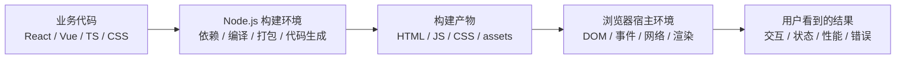

这两年我越来越常听到一句话：

前端不就是做页面吗？

再往后通常还会接一句：

现在 `AI` 连页面都能生成了，前端是不是快被淘汰了？

我每次听到这种判断，第一反应都不是反驳，而是会觉得这事太典了。因为前端最容易被看见的，刚好是最表面的那一层；前端真正难、真正贵、真正容易出事故的部分，反而都藏在页面后面。

`AI` 当然能很快生成一个页面。

但“生成一个页面”和“完成前端开发”，中间差了好几层东西。

一个静态落地页，和一个真实项目里的前端，根本不是同一种工作。前者更像是把视觉结果先搭出来，后者更像是在浏览器、`Node.js`、构建链路、运行时机制、业务状态、多人协作、兼容性和性能之间，做一整套约束下的系统设计。

说白了，很多人低估前端，不是因为他们不聪明，而是因为他们只看到了结果，没看到系统。

## 为什么大家总低估前端

前端有一个天然吃亏的地方。

它的产物太“可见”了。

你看到一个页面，会本能地觉得它不过就是几个按钮、几张图、几个输入框。因为最后呈现在屏幕上的东西非常直观，于是人很容易把实现过程也想象得很直观。

但真实情况正好相反。

页面只是壳。
复杂度大多不在壳上。

比如下面这些东西，截图里通常都看不出来：

- 状态怎么流转
- 接口失败怎么兜底
- 表单联动怎么保证不串
- 权限差异怎么隔离
- 大量数据怎么渲染不卡
- 不同设备上交互怎么成立
- 多人协作时怎么保证代码不失控
- 发布以后怎么回滚、排查、补救

再加上截至 `2026-04-16`，就目前可验证的情况看，`AI` 很擅长把“可见层”先拼出来，这个误会就更严重了。

因为它会让很多人产生一种错觉：

既然页面能生成，那前端不就已经被做掉一半了吗？

问题是，截至 `2026-04-16`，`AI` 更稳定、更常见的强项，恰恰还是前端里最容易展示、也最容易被误认为是全部的那一层。

它能把一个好看的界面先写出来。
但它并不会自动替你解决这些事：

- 这个页面到底跑在什么宿主环境里
- 它要经过什么构建链路才能上线
- 它在浏览器里实际怎么执行
- 它的状态、性能、边界、兼容性会不会炸
- 十个人一起改的时候，怎么保证它还能长期活着

所以我一直觉得，前端最容易被低估，不是因为它真的简单，而是因为它把复杂度藏得太深了。

## 学前端，先把三个环境分清楚

很多人学前端时，脑子里只有一层：

“我写代码，浏览器执行。”

这句话不算错，但在真实项目里远远不够。

如果你想把前端学明白，尤其是想进入多人开发、真实项目、工程协作，你至少得把三件事分开看：

- 宿主环境
- 构建环境
- 运行时

### 1. 宿主环境：你的代码到底跑在哪

`JavaScript` 不是脱离环境凭空运行的。

同样是 `JavaScript`，放到不同宿主里，能力完全不一样。

在浏览器里，你能拿到的是：

- `window`
- `document`
- `localStorage`
- DOM / BOM / Web API

在 `Node.js` 里，你能拿到的是：

- `process`
- `fs`
- `path`
- `http`
- 文件系统、进程、服务端能力

它们都能写 `JavaScript`。
但它们不是同一个世界。

```ts
// 浏览器里可以
import fs from 'node:fs';

document.querySelector('#app'); // 浏览器里可以
localStorage.getItem('token');

fs.readFileSync('./data.json'); // Node.js 里可以
```

同一门语言，不同宿主，能力边界完全不同。

甚至连看起来很像的 API，也不完全一样。比如 `Node.js` 官方文档就专门提到，`setTimeout()` 在浏览器里返回的是数值型定时器标识，在 `Node.js` 里返回的是 `Timeout` 对象。表面像一套 API，底层却不是一回事。

这也是为什么我一直不太赞同把前端理解成“会写点页面代码”。

你真进项目以后，首先要搞清楚的，往往不是语法，而是边界：

这段代码能不能在这个环境里跑。

### 2. 构建环境：Node.js 不只是“装包工具”

很多初学者第一次看到 `Node.js`，只知道它跟 `npm`、`pnpm`、`Vite`、`Webpack` 有关系。

但如果你真的做项目，就会发现 `Node.js` 对现代前端的重要性，远远不只是“拿来装依赖”。

它支撑的其实是一整套工程化能力：

- 依赖安装
- 模块解析
- 代码编译
- TypeScript 转译
- CSS 预处理
- 代码压缩
- 代码分包
- 本地开发服务器
- Mock、脚本、CLI、代码生成
- SSR、BFF、中间层能力
- CI/CD 里的构建和发布

也就是说，很多业务代码不是“写完就给浏览器跑”。

它要先经过一层 `Node.js` 世界里的加工、裁剪、拼装，最后才会变成浏览器真正能吃下去的产物。



比如一段 `JSX` 或 `TypeScript`，浏览器本来就不能直接理解。它得先在 `Node.js` 世界里被转译、切分、注入运行时代码，最后才会变成浏览器真正执行的那份内容。

前端工程化真正难的地方，不是记住工具名。

而是你要知道：**业务代码是怎么落到构建环境，再落到浏览器环境里的。**

你写的每一行代码，最后是被谁处理、在哪执行、以什么方式进入用户设备的。

这套链路如果你脑子里没图，项目一复杂就会懵。

### 3. 运行时：浏览器不是“自动帮你跑起来”的黑盒

再往下一层，才是很多人真正容易忽略的地方：

浏览器到底怎么执行你的代码。

很多前端问题，表面看是“组件不对劲”“框架抽风”“接口慢了一点”，最后追到根上，其实都是运行时问题：

- 事件循环怎么调度
- 宏任务和微任务谁先执行
- DOM 什么时候更新
- 浏览器什么时候 layout
- 什么时候 paint
- 什么时候 composite
- 为什么这次更新掉帧
- 为什么这次输入卡顿
- 为什么这个弹层定位总会闪一下

框架只是抽象层。
浏览器才是真实执行环境。

很多所谓前端难题，最后都要回到浏览器机制去解释。

## 为什么“看起来简单”的需求，实际上很重

前端还有一个非常容易被误解的点：

很多需求从文字上看，特别像“小改动”。

比如：

- 做一个富文本编辑框
- 做一个拖拽搭建页
- 做一个流程图编辑器
- 做一个图片裁剪和标注页面
- 做一个大屏可视化

不懂前端的人听完，经常会觉得：

这不还是页面吗？

但问题是，这些需求一旦真的做，复杂度会立刻从“页面开发”跳到“应用开发”，再往上甚至会跳到“图形系统开发”。

我举一个特别典型的例子。

假设一句需求是：

“做一个可拖拽的表单搭建器，能保存、回显、预览、发布。”

文字很短。
看起来也不吓人。

但只要你真正拆一下，就知道事情没那么简单：

- 拖拽排序怎么做
- 组件 schema 怎么设计
- 配置面板怎么联动
- 预览态和编辑态怎么切
- 撤销 / 重做要不要支持
- 自动保存还是手动保存
- 发布后的历史版本怎么回滚
- 不同角色能不能改同一个组件
- 一个组件的改动会不会影响其他页面
- 表单字段校验、联动、默认值、条件显示怎么表达
- 数据结构怎么持久化，后端怎么消费

到这一步，它已经不是“做个页面”了。

它更像是在浏览器里做一个小型应用平台。

所以很多“看起来简单”的需求，真正重的地方不在视觉，而在系统性。

## 前端到底难在哪几层

如果一定要把前端的难点往下拆，我会更愿意按六层来看。

### 1. 工程复杂度

这一层就是很多人刚进项目最先撞到的墙。

你自己写个 demo，当然感觉前端不难。

因为那时你面对的是：

- 一个人
- 一个页面
- 一份状态
- 一套依赖
- 一个环境

可真实项目不是这样。

真实项目里你会同时碰到：

- 多人协作
- 分支合并
- 依赖升级
- 类型约束
- lint / test / build
- 环境变量
- 预发、生产、灰度
- 出错回滚

这就是为什么前端必须学工程化。

因为你要解决的早就不是“页面怎么写出来”，而是“团队怎么稳定交付”。前端工程化不是为了显得专业，也不是为了多上几个工具。它本质上是在管理复杂度，让一个项目在多人协作和长期迭代里别散架。

也是从这一层开始，`Node.js` 才真正进入主场。

### 2. 应用复杂度

这层是最容易把“页面开发”和“软件开发”彻底拉开的地方。

像这些产品，名字听起来都还是“网页”：

- 网页版 Office
- 网页版 PS
- 低代码编辑器
- 流程图编辑器
- 可视化搭建平台

但它们本质上已经不是普通网页了。

它们要处理的是一整套接近桌面软件的能力：

- 文档模型
- 图层模型
- 选区、焦点、快捷键
- 拖拽、吸附、对齐
- 撤销 / 重做
- 自动保存
- 协同编辑
- 插件系统
- 历史版本
- 导入 / 导出

比如网页版 Office，真正难的不是把文字渲染出来，而是光标、选区、输入法、批注、多人协同、复制粘贴、分页、导出这些事怎么同时成立。

网页版 PS 也一样。真正难的不是“有个画布”，而是图层、蒙版、滤镜、变换、历史栈、内存占用、局部重绘、导出精度这些都在一起的时候，系统还能不能稳。

流程图编辑器和低代码平台也类似。

你看到的是几个框和几根线。
前端看到的是：

- 空间坐标
- 命中检测
- 连线路径
- 缩放和平移
- 序列化协议
- 节点依赖关系
- 布局算法
- 协作冲突

这时再说“前端不就是页面吗”，就已经不太对题了。

### 3. 渲染复杂度

这一层对应的，就是很多人平时不太会接触，但一碰就知道完全不是一个量级的方向：

- `WebGL`
- `Three.js`
- `WebGIS`
- 大屏可视化
- 图像处理
- 实时动画系统

这里有个很关键的判断：

**DOM 不是万能渲染方案。**

普通后台表格、表单、营销页，用 DOM 当然很好。

但一旦你进入下面这些场景：

- 海量点位地图
- 大规模节点连线
- 3D 展示
- 粒子动画
- 图像滤镜和像素级处理

很多时候就必须上 `Canvas`、`WebGL`，甚至更底层的图形能力。

因为这时你面对的已经不是普通页面渲染，而是：

- 坐标系
- 图层
- 矩阵变换
- GPU
- 渲染循环
- shader
- 纹理
- 批处理

海量数据可视化也不是“多画几个 div”。

你得考虑：

- 十万级点位怎么绘制
- 缩放和平移怎么保持流畅
- 标注怎么避让
- 图层怎么分层更新
- 交互命中怎么做
- 哪些数据在 CPU 算，哪些该交给 GPU

到这一层时，我会直接说一句：

这类前端，本质上已经不是“页面开发”，而是浏览器里的图形与渲染系统开发。

### 4. 样式与动画复杂度

这一层我觉得也经常被低估，而且是那种会让很多其他工程师本能想绕开的复杂。

因为在很多非前端同学眼里，`CSS` 看起来特别像一种“低门槛语言”：

- 无非就是配颜色
- 改改边距
- 调调宽高
- 写几个动画

但真进复杂项目以后你会发现，`CSS` 和动画根本不是“装饰层”，它们本身就是一套约束系统。

你在和浏览器打交道的，不只是几个属性名，而是下面这些机制一起叠出来的结果：

- cascade
- specificity
- inheritance
- normal flow
- flex / grid 布局规则
- containing block
- stacking context
- overflow 和滚动容器
- 响应式断点
- 字体、排版、国际化文本长度

这些东西最麻烦的地方在于，它们不是线性执行的。

你写一段 `JavaScript`，通常还能按调用链追。
但你写一段 `CSS`，最后结果往往是多个规则叠加、多个上下文共同约束后的“最终计算值”。

也就是说，`CSS` 很多时候不是在“编程”，而是在“约束求解”。

这也是为什么很多工程师一开始会低估它，真碰到复杂布局以后又会迅速头大。

而且这还只是“同一个浏览器里能不能摆对”。

一旦进入真实项目，你马上还要面对兼容性问题。

很多样式问题真正难的地方，不是属性会不会写，而是：

- 这个特性在不同浏览器里实现是否一致
- 浏览器默认样式会不会干扰你
- 表单控件、滚动条、输入框、选择器这些原生元素能不能被稳定控制
- 同样一套布局在桌面浏览器、移动浏览器、内嵌 WebView 里会不会出现不同结果

这也是为什么很多前端同学第一次认真处理兼容性时，会突然意识到：

原来 `CSS` 从来不是“写出来就一样”。

它经常是：

- Chrome 里正常
- Safari 里偏一点
- 某些 Android WebView 里再错一点
- 放进微信、企业容器、App 内嵌页以后又是另一套表现

这里面最容易把人拖进去的，往往不是那种特别炫的效果，而是最普通的细节：

- `fixed` 和 `sticky` 在滚动容器里的行为
- 移动端地址栏伸缩导致的视口高度变化
- 软键盘弹起以后布局被挤压
- 安全区和刘海屏留白
- 字体渲染、行高、换行策略的细微差异

这些东西你单看哪一个都不算“高深算法”。

但它们一旦和真实业务、真实设备、真实容器叠起来，就会形成非常典型的前端复杂度。

比如一个看起来很普通的问题：

- 为什么这个元素明明设了 `z-index` 却压不过去
- 为什么这个 `position: sticky` 到这里就失效了
- 为什么这个弹层在桌面端正常，在移动端滚动容器里就错位
- 为什么这个文本在英文里好好的，换成德语或者阿拉伯语就全挤爆了

这些问题往往都不是“某个属性不会写”。

而是你得同时理解：

- 元素处在哪个布局上下文
- 它的包含块是谁
- 它有没有创建新的 stacking context
- 它的尺寸是内容驱动、容器驱动，还是约束驱动
- 它在不同断点、不同语言、不同状态下会不会变形

响应式布局其实也是同一个道理。

很多人一提响应式，脑子里第一反应还是“写几个 media query”。

但真实项目里的响应式，远不只是屏幕宽了排三列、窄了排一列。

它真正要解决的是：

- 内容长度变化时版面还能不能稳
- 模块优先级变化时信息层级会不会乱
- 触摸设备和鼠标设备的交互密度要不要一致
- 同一组件在桌面端、平板、手机上是缩放，还是重排，还是降级

也就是说，响应式不是一个“适配动作”，而是一套布局策略。

你做得越复杂，就越会发现：

- 有些组件适合流式伸缩
- 有些组件适合断点切换
- 有些组件根本不该缩，而应该直接换结构

所以前端很多布局问题，说到底不是 `CSS` 技巧问题，而是信息架构和约束建模问题。

再比如 `CSS` 自定义属性，很多人第一次接触时会觉得它不过就是“样式变量”。

但真进项目以后你会发现，它值钱的地方根本不只是少写几个颜色值。

它真正强的，是把主题、间距、层级、动画时长、组件状态这些设计约束抽成可传播、可覆盖、可继承的系统变量。

这件事一旦做好，收益很大：

- 主题切换会顺很多
- 设计 token 更容易落地
- 组件复用会更稳定
- 动态样式可以少写很多条件分支

但它带来的复杂度也很真实。

因为自定义属性不是普通常量，它会参与 cascade、inheritance 和运行时计算。

这就意味着你一旦把变量系统铺开，就很容易遇到这些问题：

- 变量定义在哪一层最合理
- 哪些变量该全局暴露，哪些该组件内收口
- 变量覆盖链一长，最后值到底从哪来的
- 动态主题切换时，哪些地方会跟着重算和重绘

写到这里你会发现，连“变量”这件事在前端里都不是纯粹的语法问题，而是系统设计问题。

再往前一步，动画还会再加一层时间维度。

动画一进来，问题立刻就不只是“样式对不对”了，而会变成：

- 动画由谁触发
- 在什么时机开始
- 中途能不能被打断
- 退出动画和卸载时机怎么协调
- 动画会不会触发 layout / paint
- 这段动画在低端机上会不会掉帧
- 用户开了 `prefers-reduced-motion` 该怎么降级

很多人第一次认真做复杂动效时都会意识到：

原来动画不是把元素“动起来”这么简单。

它本质上是在协调视觉、时序、性能和交互反馈。

一个做得不好的动画，不只是“不够好看”。
它可能会直接带来：

- 卡顿
- 误触
- 焦点错乱
- 信息层级混乱
- 用户对状态变化的误判

而且复杂动画真正让工程师头大的，还不只是“性能够不够”。

很多时候更难的是编排。

一旦进入真实项目，动画经常不再是一个元素单独 transition 一下，而是：

- 多个元素按顺序进场
- 一个状态切换要同时驱动布局、透明度、层级和手势可用性
- 进入动画、停留状态、退出动画要和组件挂载卸载对齐
- 某个动画被中途打断后，系统要不要回滚，还是接着过渡到下一个状态

这时候动画其实已经很接近一个小型状态机了。

你要解决的不是“这个元素怎么动”，而是“这个界面在状态迁移时，视觉和交互怎么保持一致”。

所以我一直觉得，动画和 `CSS` 的复杂性之所以让很多工程师望而却步，不是因为它们冷门，而是因为它们同时吃三种能力：

- 空间感
- 时序感
- 性能意识

你既要知道元素最后会长成什么样，也要知道它什么时候变，还要知道这个变化会不会把渲染链路拖慢。

这件事一旦复杂起来，就一点都不“只是样式”了。

### 5. 平台复杂度

这一层也很容易被低估。

因为很多人默认前端运行环境是统一的。

其实完全不是。

前端最麻烦的一部分，恰恰来自“同一套业务要落到不同平台”：

- 不同浏览器实现差异
- 不同设备性能差异
- 鼠标和触摸不是一套交互
- 输入法、键盘、滚动、`fixed`、`sticky` 都可能出问题
- 微信里跑和 Chrome 里跑，可能完全不是一个世界

再把视野放大一点，你会发现所谓“前端方向”本身就已经分叉了：

- 浏览器前端
- 小程序
- `React Native`
- `Flutter`
- `Next.js`
- `Node.js` 中间层 / BFF / SSR

这些技术方向看起来都跟“前端”沾边，但它们面对的宿主环境其实不一样。

小程序不是标准浏览器。
`React Native` 不是 DOM。
`Flutter` 更不是 DOM，它有自己的渲染引擎和平台嵌入层。
`Next.js` 还会把一份代码拆到服务端和客户端两个环境里执行。

也就是说，前端不是只懂一个浏览器就够了。

很多前端经验的价值，就体现在知道哪里必须优雅，哪里必须妥协。

有些问题不是你写得不对。
而是平台边界就在那里。

### 6. 运行时复杂度

这一层最能区分“会用框架”和“真的懂前端”。

因为很多前端问题，最后都要回到浏览器原理。

你迟早得理解这些东西：

- 事件循环
- 宏任务和微任务
- 渲染时机
- DOM / CSSOM / render tree
- layout / paint / composite
- 事件模型
- 文件 API
- 网络、缓存、跨域、Cookie

浏览器执行也不是一句“把 JS 跑起来”就完了。

更接近真实的过程是：

- 解析 `HTML`，生成 DOM
- 解析 `CSS`，生成 CSSOM
- 组合出 render tree
- `JavaScript` 在事件循环里改状态、改 DOM、发请求、注册事件
- 浏览器再挑合适的时机去做 layout、paint、composite

你一旦在这个过程中频繁读写布局、塞进长任务，或者让一帧里做了太多事，卡顿、闪动、掉帧就会一起冒出来。

为什么一个输入框在复杂页面里会卡？

可能不是组件库问题。
而是主线程被长任务占住了。

为什么一个动画掉帧？

可能不是“浏览器性能不行”，而是你改了会触发 layout 和 paint 的属性，没走合成层那条更轻的路径。

为什么一个弹层第一次打开位置会抖一下？

可能不是定位库写坏了，而是你在错误的时机读写布局，导致强制同步测量。

为什么两个异步更新顺序总是怪怪的？

很多时候就是微任务、宏任务、批处理和渲染时机一起叠出来的效果。

所以我一直觉得，前端真正往上走，不是只会背框架 API。

而是你开始能用浏览器运行时去解释问题。

## 如果从复杂度角度看，前端到底在复杂什么

如果把前面那些例子都先放下，只从技术角度看，我会觉得前端复杂度主要来自六类，而且这六类不是独立的，是会互相放大的。

### 1. 状态复杂度

前端不是只有“拿数据然后展示”。

真实页面里经常同时存在：

- 服务端返回的远程状态
- 用户输入中的临时状态
- 组件内部状态
- 跨页面共享状态
- URL 和路由状态
- 权限、配置、缓存这些派生状态

状态一多，问题就出来了：

- 谁是单一数据源
- 谁能改状态
- 改完以后谁该跟着更新
- 更新的边界在哪里
- 旧状态怎么失效

很多前端 bug，本质上不是代码不会写，而是状态模型从一开始就没有立住。

### 2. 时间复杂度

前端还是一个非常吃时序的系统。

同样的代码，放在不同时间点执行，结果可能都不一样。

比如：

- 数据先回来还是组件先挂载
- DOM 先更新还是测量先发生
- hydration 先完成还是用户先交互
- 动画帧先执行还是副作用先塞进主线程

这也是为什么很多问题特别玄。

不是因为它不符合逻辑，而是因为它特别符合“时序逻辑”。

你不把时序看成一等公民，很多 bug 就只能靠猜。

### 3. 渲染复杂度

前端最后一定要落到渲染上。

而渲染不是一句“把数据显示出来”这么轻。

你要考虑：

- 渲染量有多大
- 更新频率有多高
- 哪些操作会触发 layout / paint
- 哪些东西可以留在合成层
- DOM、Canvas、WebGL 该怎么选

一旦界面变复杂，渲染就不再是“最后一步”，而会变成架构设计的一部分。

### 4. 表现层复杂度

这一层说白了，就是布局、样式和动画本身带来的复杂度。

很多系统逻辑明明没错，最后用户体验还是会出问题，往往就卡在这里：

- 布局是不是稳定
- 层级是不是正确
- 响应式是不是会变形
- 动画是不是打断了交互
- 视觉反馈是不是和状态变化一致

这也是为什么 `CSS` 和动画在很多复杂项目里，根本不是“美化工作”，而是功能正确性的一部分。

### 5. 环境复杂度

同一份业务逻辑，可能会经过：

- 构建环境
- 服务端环境
- 浏览器环境
- 容器环境
- 小程序或原生桥接环境

每多一层环境，就多一层能力边界、多一层兼容问题、多一层调试成本。

这也是为什么现代前端经常不是“代码写对就行”，而是“代码写对了，还要放在对的环境里，以对的方式执行”。

### 6. 协作复杂度

前端还有一个经常被忽略的现实：

它很少是一个人长期在一张白纸上写完的。

真实项目里你要面对的还有：

- 多人改同一块业务
- 设计稿变化
- 接口变化
- 依赖升级
- 发布策略
- 回滚和线上排查

所以前端复杂度从来不只是技术复杂度，还包括系统在团队里长期演化的复杂度。

我觉得把这六类放在一起看，会更容易理解一件事：

前端并不是语法难。

前端是多种复杂度同时压到一个用户界面里，而用户看到的却只有“一个页面”。

## 前端工程师和 API 调用工程师，边界线到底在哪

我这几年有一个越来越强烈的感受：

很多人嘴上在做前端，实际做的其实更接近“API 调用工程师”。

这话不是讽刺。

因为几乎所有前端，一开始都是从这一步过来的：

- 后端给一个接口
- 前端发个请求
- 把返回数据塞进状态
- 再把状态渲染到页面上
- 用户点一下按钮
- 再调另一个接口

这当然也是工作，而且是正经工作。

问题在于，如果你的前端能力长期只停在这一层，那你解决问题的方式就会越来越单一。你看到的世界，会越来越像：

- 这个字段后端能不能多给一个
- 这个接口能不能帮我排一下序
- 这个 loading 能不能先糊一下
- 这个报错是不是框架抽风了

也就是说，你关注的主要还是“接口给什么，我怎么接；接口不给什么，我怎么要”。

但真正把前端工程师和 API 调用工程师拉开差距的，往往不是会不会写几个组件，也不是会不会用 `React` / `Vue` / `TypeScript`。

真正的边界线，是你对底层执行的理解深度。

同样一个问题摆在面前：

页面白屏了。

API 调用工程师的第一反应可能是：

- 接口挂了？
- 返回字段变了？
- 是不是少传了什么参数？

这些判断不能说错。

但真正的前端工程师脑子里通常还会多出几层：

- 这是构建产物问题，还是运行时问题
- 是客户端白屏，还是 SSR 输出就不对
- 是 hydration 失败了，还是路由切换炸了
- 是某个副作用把主线程卡死了，还是资源加载顺序出问题
- 是浏览器环境问题，还是容器环境问题

再比如同样一个“列表渲染卡顿”。

只停在接口层的人，第一反应常常是：

- 后端是不是返回太慢了
- 要不要加分页
- 要不要让后端少返回一点字段

而理解更深的人会继续往下看：

- 是请求慢，还是渲染慢
- 是数据量大，还是无效重渲染太多
- 是 DOM 太重，还是布局计算太频繁
- 是主线程长任务，还是图片和字体阻塞了关键渲染
- 要不要做虚拟列表、分片更新、懒加载、预渲染

你会发现，差别不在于谁更会“写业务”。

差别在于，谁脑子里有更多层解释模型。

这也是为什么我会说，前端工程师真正值钱的地方，不是“能把接口接上”。

而是他知道：

- 这段代码在什么环境里执行
- 这个问题属于哪一层
- 这个 bug 该往浏览器、框架、构建链路、平台边界，还是业务状态里去找
- 这个需求一旦变复杂，系统会先从哪开始变脆

说得再直一点：

API 调用工程师更像是在完成页面的数据接线。

前端工程师是在理解整个界面系统为什么能跑、为什么会慢、为什么会炸、为什么在这个平台能成立、换个平台就未必成立。

这不是 title 高低的问题。

这是理解深度的问题。

而且这个边界线，往后只会越来越明显。

因为越是简单页面，接口和组件就越像全部。
越是复杂系统，接口反而越只是入口。

## 为什么有些人写了很多年前端，还是会被复杂问题卡住

这个现象其实也很常见。

有些人并不是没做过项目，也不是没写过业务，甚至简历上项目看起来不少。

但一旦需求从“列表 + 表单 + 弹窗 + 调接口”升级成下面这些东西，人就会明显开始失速：

- 首屏怎么更快
- 页面为什么会偶发卡死
- 为什么只在某个 WebView 里出问题
- 为什么 SSR 和客户端渲染结果对不上
- 为什么这个富文本在中文输入法下老出 bug
- 为什么这个拖拽编辑器越写越乱

原因通常不是不努力。

而是他的知识结构一直停留在“框架使用层”，没有继续往下钻到“执行层”和“系统层”。

框架使用层解决的是：

- 组件怎么写
- 状态怎么管
- 接口怎么调
- 页面怎么拼

执行层和系统层解决的则是：

- 它为什么这么执行
- 它为什么在这个时机会出问题
- 它为什么在这个平台上不成立
- 它为什么上线后会和本地不一样
- 它为什么一旦复杂起来就开始失控

这也是我为什么一直觉得，前端真正往上走，不是再多学一个框架。

而是补齐那些平时最容易被跳过，但决定你上限的东西：

- 宿主环境
- 构建链路
- 浏览器运行时
- 渲染机制
- 平台边界
- 性能与稳定性

这些东西平时不一定天天写在代码里。

但它们会决定你遇到复杂问题时，到底是“继续能拆”，还是“只能靠猜”。

## 再往外看，前端其实已经延伸到移动端和桌面端

如果把视角从浏览器再往外拉，你会更容易发现，前端的边界这些年其实一直在向移动端和桌面端扩。

这也是为什么我会觉得，前端这门活不能只用“网页”来理解。

因为一旦进入移动端和桌面端，你会发现很多复杂度不是消失了，而是换了一种形式继续存在。

### 移动端：不是把网页缩小，而是换了一套约束

很多人第一次从浏览器走到移动端，最容易产生的误判是：

不就是屏幕小一点吗？

其实不是。

移动端最先变的不是尺寸，而是约束条件：

- 设备性能差异更大
- 网络波动更明显
- 触摸交互不是鼠标交互
- 键盘、输入法、手势、滚动都有额外问题
- 后台切换、前台恢复、弱网重连、电量限制都会影响应用行为

也就是说，移动端前端不是把网页压缩一下，而是把同样的业务放进一个更敏感、更受限的环境里。

### 小程序 / Hybrid / WebView

这一类最能说明平台边界的重要性。

你看起来还是在写前端，但运行环境已经不是标准浏览器了。

你要面对的往往是：

- 容器提供的桥接能力
- 容器自己的生命周期
- 内嵌 WebView 的兼容差异
- 页面切换和资源缓存策略
- 宿主对网络、权限、分享、支付的限制

这时候很多经验都会变。

在浏览器里成立的东西，到这里不一定成立。

### React Native / Flutter

再往前一步，像 `React Native`、`Flutter` 这种方向，已经更接近“用前端思维做客户端”。

它们真正复杂的地方，不是“组件还能不能照着写”，而是：

- JavaScript / Dart 和原生系统怎么协作
- UI 线程、渲染线程、业务线程怎么分工
- 布局、手势、动画怎么保持流畅
- 列表、图片、导航、内存占用怎么控
- 系统权限、通知、文件、后台任务怎么接

这时候你会发现，移动端前端不是浏览器前端的缩水版。

它更像是前端方法论和客户端约束的结合体。

### 桌面端：界面之外，还要接操作系统

桌面端也一样，很多人一开始会想：

桌面端不就是把网页包一层壳吗？

如果只是做一个特别轻的工具，某种程度上可以这么说。

但只要你的桌面应用开始进入真实使用场景，问题很快就会从“页面怎么写”变成“应用怎么和操作系统一起工作”。

桌面端前端常见会多出来这些复杂度：

- 多窗口和窗口生命周期管理
- 菜单栏、托盘、快捷键
- 文件系统访问
- 系统通知和剪贴板
- 自动更新
- 崩溃恢复和进程隔离
- 安装、签名、打包、分发
- 更重的内存和 CPU 占用管理

这些问题一上来，桌面端就已经不是“网页多一个边框”了。

### Electron / Tauri 这类桌面方案

这一类方案特别有意思，因为它们很能说明前端为什么会往系统边界上长。

像 `Electron`，本质上就是把 Chromium 的多进程模型和 Node.js 环境带进桌面应用里。于是你马上会面对主进程、渲染进程、预加载脚本、IPC、安全边界这些问题。

`Tauri` 这类方案则更像是“Web 界面 + 系统运行时桥接”的另一种实现路径。界面还是 Web 技术，但系统能力、打包和宿主交互已经不再只是浏览器那一套。

这时候前端工程师要处理的，已经不仅是 UI 和接口，而是：

- Web 层和系统层怎么通信
- 哪些能力应该留在前端，哪些应该下沉到宿主层
- 怎样在可维护性、性能、体积和安全之间取平衡

这其实已经非常接近客户端工程了。

## 从技术方向再看一遍：浏览器、移动端、桌面端、Node、Next.js

如果你从技术路线再回头看，会更容易发现前端根本不是一个“只会切页面”的工种。

### 浏览器前端

浏览器前端依然是最基础的一支。

但它本身就已经包含宿主环境、构建链路、运行时、渲染机制、性能优化这一整套复杂度。

### 移动端

很多人做小程序、`React Native`、`Flutter` 以后，第一次强烈意识到：

原来“会写前端”和“会做浏览器前端”不是一回事。

你写的是界面，但宿主不是标准浏览器。交互、渲染、性能、能力边界，全都有自己的规则。你必须重新理解一遍环境。

### 桌面端

很多人到了 `Electron`、`Tauri` 这类方向以后，又会再意识到一层：

原来“会做界面”和“会做桌面应用”也不是一回事。

你不光要把界面写出来，还要理解进程模型、系统能力桥接、安装和更新、窗口与资源管理这些事情。

### Node.js

很多人把 `Node.js` 只当成前端的附属工具，这个理解太窄了。

现代前端的构建、脚本、开发服务器、SSR、接口中间层、BFF、CLI、自动化发布，背后大量都靠 `Node.js` 支撑。你不理解它，就很难真正理解工程化。

### Next.js

`Next.js` 这类框架最能说明一个事实：

前端已经不是“代码全在浏览器里跑”了。

一份项目里，可能同时存在：

- 构建期代码
- 服务端代码
- 浏览器客户端代码

哪些逻辑应该放服务端，哪些必须留在客户端，哪些数据可以直接在服务端拿，哪些交互必须等 hydration 以后才能成立，这些都不是切页面能解释清楚的。

## AI 会替代哪一层，不会替代哪一层

如果只按截至 `2026-04-16` 公开可见的产品能力和主流工作流来看，我觉得 `AI` 确实会越来越强地覆盖这些部分：

- 基础页面搭建
- 重复性样式编写
- 常见组件拼装
- 普通后台 CRUD 外壳
- 一部分模板化交互

这些能力被吃掉，我觉得很正常。

因为这本来就是前端里最标准化、最可见、最容易模式化的那一层。

某种意义上说，现在很多 `AI` 在前端里的工作形态，其实就特别像一个效率高得离谱的“API 调用工程师 + 页面拼装工”。

如果上下文足够清楚，比如：

- 接口文档已经给全了
- 页面结构已经定了
- 组件库已经选好了
- 交互路径已经画明白了

那它出活会非常快。

因为这种题，本来就最接近“拿信息，接起来，渲出来”这条路径。

但前端真正难的部分，短期内依然很难被“生成一个页面”这件事替代：

- 宿主环境边界判断
- 工程链路设计
- 复杂交互建模
- 复杂状态管理
- 渲染性能优化
- 平台兼容与妥协
- 线上问题排查
- 多人协作下的系统稳定性

也就是说，`AI` 更像是在压缩“页面生产”这层工作的成本。

但前端从来不只有页面生产。

真正值钱的前端，价值会越来越往这些地方集中：

- 对环境边界的理解
- 对系统复杂度的控制
- 对真实问题的抽象和取舍

## 在 2026 年这个阶段，AI 时代的前端程序员会往哪走

如果一定要谈展望，我会更倾向于给一个谨慎一点的判断。

截至 `2026-04-16`，更严谨的说法不是“前端程序员会不会消失”，而是：

前端工作正在重新分层，前端工程师的价值重心正在迁移。

这个判断不是空想。

从 `2025-09-25` GitHub 把 Copilot coding agent 推到通用可用，到 `2026-02-02` OpenAI 推出强调多代理、并行协作和长期任务管理的 Codex app，可以看到一个很清楚的方向：行业正在把“能不能生成代码”往前推进，工作流的重点开始转到“怎么描述任务、怎么拆解任务、怎么监督任务、怎么验收结果”。

也就是说，AI 时代不是把前端从流程里拿掉了。

更像是把前端从“手工逐行生产者”推向了“系统设计者、约束定义者、质量把关者和协作编排者”。

如果从岗位价值看，我觉得未来几年更可能出现的是下面几种变化。

### 1. 模板化页面生产，会继续被压缩

像这些工作，未来大概率还会继续被压缩成本：

- 常规营销页
- 后台 CRUD 外壳
- 标准化表单和列表页
- 常见组件拼装
- 重复性样式和基础交互

不是说这些工作会完全消失。

而是说，纯靠这些工作形成的区分度会越来越低。

因为截至目前，可见层、模板层、脚手架层，正是 AI 最容易快速给出结果的区域。

### 2. 前端工程师会更像“界面系统工程师”

未来更值钱的前端，未必是写代码最快的人。

更可能是这些人：

- 能把复杂需求拆成稳定系统的人
- 能把跨端、跨环境问题讲清楚的人
- 能在性能、交互、渲染和工程化之间做取舍的人
- 能判断哪些工作能安全交给 AI，哪些不能的人

换句话说，前端会越来越从“页面实现”走向“界面系统治理”。

### 3. 对底层执行的理解，会比以前更重要

这点其实很关键。

因为 AI 一旦能把表面代码先写出来，人类工程师的价值就更不体现在“会不会写出这段代码”，而体现在：

- 你知不知道它该放在哪个环境执行
- 你知不知道它为什么在这个平台会出问题
- 你知不知道它为什么会慢、会抖、会错位
- 你能不能判断这段 AI 生成代码只是“能跑”，还是“可长期维护”

也就是说，越往后，前端工程师越要靠解释能力、判断能力和验收能力拉开差距。

### 4. 跨端能力会越来越值钱

如果前端只停留在浏览器单点实现，未来确实会越来越容易被标准化工具吃掉。

但如果你能同时理解：

- 浏览器前端
- 小程序 / WebView
- `React Native` / `Flutter`
- `Electron` / `Tauri`
- `Next.js` 这类同时涉及服务端和客户端的框架

那你的价值就不只是“把页面做出来”，而是“把同一套业务在不同宿主环境下组织起来”。

而这类问题，恰恰不是当前 AI 最容易端到端稳定接住的。

### 5. 初级岗位的进入方式会变，但不会只剩淘汰

这件事我也不想说得太轻飘。

AI 变强以后，前端初级岗位的进入路径大概率会变难一些。

因为过去很多人是靠：

- 写页面
- 接接口
- 做样式
- 改交互

这类任务慢慢练出来的。

但如果这些部分被 AI 大量吃掉，新的前端同学就不能只靠“多写几个页面”积累竞争力了。

未来更现实的路径，可能会变成：

- 更早补底层环境知识
- 更早学会读复杂代码和排查问题
- 更早学会和 AI 协作、审查、验收
- 更早在复杂项目里理解系统为什么这么设计

所以我不太愿意把未来说成“前端没前途了”。

更准确的说法应该是：

前端不会消失。

但只会写可见层、只会接接口、只会拼页面的那部分能力，含金量会持续下降。

相反，那些能理解系统、理解环境、理解体验、还能驾驭 AI 工具链的人，价值反而会更高。

## 最后一句

如果只拿一个静态页面来定义前端，那前端当然显得很简单。

可一旦你把真实项目里的工程化、运行时、复杂交互、复杂渲染、跨平台和协作成本都摆出来，你会发现它根本不是“把页面做出来”这么一句话能概括的。

所以我现在越来越愿意把前端理解成这样：

**前端不是把设计稿翻译成 HTML。前端是在不同宿主环境里，把业务、交互、渲染和工程约束组织成一个可长期运行的用户界面系统。**

这也是为什么它总被低估。

因为它最复杂的部分，往往不在你第一眼看见的地方。

如果你现在正准备学前端，我会很直接地建议一句：

别只盯着框架和页面。

尽早把工程化、`Node.js`、浏览器运行时、渲染机制、平台边界一起补起来。因为你越早知道前端真正难在哪，后面越不容易把自己学窄。

如果你也见过那种一句话听起来很轻，结果真正做起来像开系统工程副本的前端需求，欢迎把例子留出来。我很想看看，大家都踩过哪些“看起来只是改个页面”的坑。

## 参考资料

- [MDN: JavaScript execution model](https://developer.mozilla.org/en-US/docs/Web/JavaScript/Reference/Execution_model)
- [MDN: Introduction to the CSS Cascade](https://developer.mozilla.org/en-US/docs/Web/CSS/CSS_cascade/Cascade)
- [MDN: Stacking context](https://developer.mozilla.org/en-US/docs/Web/CSS/Guides/Positioned_layout/Stacking_context)
- [MDN: Using CSS custom properties](https://developer.mozilla.org/en-US/docs/Web/CSS/CSS_cascading_variables/Using_CSS_custom_properties)
- [Node.js Docs: Timers](https://nodejs.org/api/timers.html)
- [Node.js Learn: Differences between Node.js and the Browser](https://nodejs.org/en/learn/getting-started/differences-between-nodejs-and-the-browser)
- [Next.js Docs: Server and Client Components](https://nextjs.org/docs/app/getting-started/server-and-client-components)
- [GitHub Blog: Introducing GitHub Copilot coding agent](https://github.blog/changelog/2025-09-25-github-copilot-coding-agent-is-now-generally-available/)
- [OpenAI: Introducing the Codex app](https://openai.com/index/introducing-the-codex-app/)
- [React Native Blog: New Architecture is here](https://reactnative.dev/blog/2024/10/23/the-new-architecture-is-here)
- [React Native Docs: Architecture Overview](https://reactnative.dev/architecture/overview)
- [Flutter Docs: Architectural Overview](https://docs.flutter.dev/resources/architectural-overview)
- [Flutter Docs: Web renderers](https://docs.flutter.dev/platform-integration/web/renderers)
- [Electron Docs: Process Model](https://www.electronjs.org/docs/latest/tutorial/process-model)
- [Electron Docs: Inter-Process Communication](https://www.electronjs.org/docs/latest/tutorial/ipc)
- [Tauri Docs: Architecture](https://v2.tauri.app/concept/architecture/)
- [Tauri Docs: Process Model](https://v2.tauri.app/concept/process-model/)
- [web.dev: Responsive web design basics](https://web.dev/articles/responsive-web-design-basics)
- [web.dev: How to create high-performance CSS animations](https://web.dev/articles/animations-guide)
- [web.dev: Rendering performance](https://web.dev/articles/rendering-performance)
