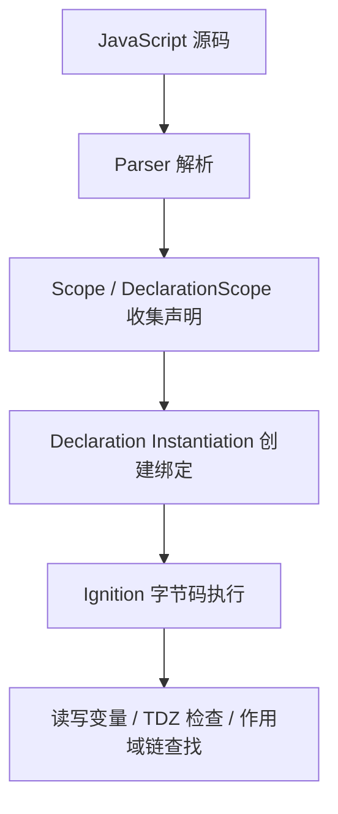

## 前言

变量提升经常被解释成：

```text
JavaScript 会把 var 和 function 移到代码最前面。
```

这句话适合入门记忆，但不够准确。代码并没有真的被移动，浏览器做的是另一件事：

```text
执行代码之前，先根据当前作用域里的声明创建绑定。
```

本文从几个常见业务场景出发，重新理解 `var`、函数声明、函数表达式、`let`、`const`、条件分支里的函数、重复声明和隐式全局。最后再结合 ECMAScript 规范和 V8 的执行上下文看一眼底层原因。

文章参考的版本固定为：

```text
ECMAScript: tc39.es 当前 living draft，访问日期 2026-06-24
Chromium: 148.0.7778.178
commit: d096af1c9e98c45c3596e59620622b1a049bfecb
```

## 先看一个支付页初始化问题

假设支付页里有这样一段初始化代码：

```js
renderCheckout({
  amount: 19900,
  coupon: true,
});

var currency = 'CNY';
var defaultChannel = 'card';

function renderCheckout(order) {
  console.log('currency:', currency);
  console.log('channel:', defaultChannel);
  console.log('discount:', getDiscount(order));
}

function getDiscount(order) {
  return order.coupon ? 20 : 0;
}
```

输出是：

```text
currency: undefined
channel: undefined
discount: 20
```

这里有三个现象：

1. `renderCheckout` 写在调用后面，但可以执行。
2. `getDiscount` 也写在调用后面，但可以执行。
3. `currency` 和 `defaultChannel` 明明后面有赋值，但此时读到的是 `undefined`。

这就是所谓变量提升最容易让人误解的地方。

结论先放前面：

```text
函数声明会在执行前创建函数值；
var 声明会在执行前创建绑定，并初始化为 undefined；
赋值语句仍然要等代码真正执行到那一行才发生。
```

所以这段代码更接近下面这种执行效果：

```js
var currency;
var defaultChannel;

function renderCheckout(order) {
  console.log('currency:', currency);
  console.log('channel:', defaultChannel);
  console.log('discount:', getDiscount(order));
}

function getDiscount(order) {
  return order.coupon ? 20 : 0;
}

renderCheckout({
  amount: 19900,
  coupon: true,
});

currency = 'CNY';
defaultChannel = 'card';
```

注意，这只是帮助理解的等价写法，不代表引擎真的把源码改成了这样。

## 变量提升到底是什么

更准确地说，变量提升来自 JavaScript 执行前的声明处理阶段。

在 ECMAScript 规范里，全局代码会走 `GlobalDeclarationInstantiation`，函数调用会走 `FunctionDeclarationInstantiation`，块级声明会有对应的块级声明实例化逻辑。

可以先把执行过程理解成三步：

```text
解析源码
  -> 收集声明，建立作用域信息
  -> 创建执行上下文和声明绑定
  -> 执行语句
```

我们平时说的“提升”，主要发生在“创建声明绑定”这一步。

不同声明的初始化结果不一样：

| 写法                   | 执行前是否有绑定 | 执行前能不能读 | 读到什么                         |
| ---------------------- | ---------------- | -------------- | -------------------------------- |
| `var config`           | 有               | 能             | `undefined`                      |
| `function load() {}`   | 有               | 能             | 函数对象                         |
| `let config`           | 有               | 不能           | 抛 `ReferenceError`              |
| `const config = ...`   | 有               | 不能           | 抛 `ReferenceError`              |
| `class Service {}`     | 有               | 不能           | 抛 `ReferenceError`              |
| `var fn = function ()` | 有               | 能             | 先是 `undefined`，赋值后才是函数 |

所以“提升”不是所有声明都变成可用。

更具体地说：

```text
var 是声明提前，初始化为 undefined；
function 是声明和函数值都提前准备好；
let / const / class 是绑定提前创建，但初始化之前不能访问。
```

## var：为什么业务配置会读到 undefined

来看一个接口配置的例子：

```js
function createOrderRequest(orderId) {
  return {
    url: `${apiBase}/orders/${orderId}`,
    timeout,
  };
}

console.log(createOrderRequest('A1001'));

var apiBase = '/api';
var timeout = 5000;
```

输出：

```text
{ url: 'undefined/orders/A1001', timeout: undefined }
```

原因是 `apiBase` 和 `timeout` 的绑定已经创建了，但赋值还没有执行。

也就是说，`var apiBase = '/api'` 可以拆成两件事：

```text
声明 apiBase
给 apiBase 赋值 '/api'
```

声明会提前处理，赋值不会提前。

所以在业务代码里，下面这种写法很危险：

```js
initPayment();

var paymentConfig = {
  provider: 'stripe',
  currency: 'CNY',
};

function initPayment() {
  console.log(paymentConfig);
}
```

输出：

```text
undefined
```

这类问题不一定马上报错，更麻烦的是它可能把 `undefined` 继续传给接口、埋点、支付 SDK，最后变成一个更远处的异常。

## let 和 const：为什么不是 undefined，而是直接报错

把上面的配置改成 `const`：

```js
initPayment();

const paymentConfig = {
  provider: 'stripe',
  currency: 'CNY',
};

function initPayment() {
  console.log(paymentConfig);
}
```

输出：

```text
ReferenceError: Cannot access 'paymentConfig' before initialization
```

这就是暂时性死区，也就是常说的 TDZ。

`let` 和 `const` 也会在当前作用域里提前创建绑定，但在代码执行到声明语句之前，这个绑定处于未初始化状态。访问它不是得到 `undefined`，而是直接抛 `ReferenceError`。

这点和 `var` 很不一样。

```js
console.log(featureFlag);
var featureFlag = true;

console.log(experimentConfig);
const experimentConfig = {
  name: 'checkout-v2',
};
```

前半段输出：

```text
undefined
```

后半段直接报错：

```text
ReferenceError: Cannot access 'experimentConfig' before initialization
```

所以 `let`、`const` 并不是“没有提升”，而是“提升后不能在初始化前访问”。

## typeof 也救不了 TDZ

以前我们可能会写这种兜底逻辑：

```js
if (typeof analyticsConfig === 'undefined') {
  console.log('analytics config is missing');
}
```

如果当前作用域里根本没有 `analyticsConfig`，这段代码没问题，结果是 `'undefined'`。

但是如果后面有一个同名的 `const`：

```js
if (typeof analyticsConfig === 'undefined') {
  console.log('analytics config is missing');
}

const analyticsConfig = {
  appId: 'web-console',
};
```

这里依然会报错：

```text
ReferenceError: Cannot access 'analyticsConfig' before initialization
```

因为当前作用域已经存在 `analyticsConfig` 这个词法绑定，只是还没有初始化。

所以业务里判断配置是否存在时，最好不要在同一个作用域里又提前访问、又在后面声明同名 `let` 或 `const`。

## 函数声明和函数表达式不是一回事

业务里经常会把工具函数放到下面：

```js
sendPageView('/checkout');

function sendPageView(path) {
  console.log('page_view:', path);
}
```

这可以正常执行：

```text
page_view: /checkout
```

因为 `sendPageView` 是函数声明，声明实例化阶段已经创建好了函数对象。

但如果换成函数表达式：

```js
sendClick('pay_button');

var sendClick = function (target) {
  console.log('click:', target);
};
```

会报：

```text
TypeError: sendClick is not a function
```

原因是 `sendClick` 这个 `var` 绑定提前存在，但值是 `undefined`，执行 `undefined()` 自然会报 TypeError。

如果再换成 `const`：

```js
sendClick('pay_button');

const sendClick = function (target) {
  console.log('click:', target);
};
```

会变成：

```text
ReferenceError: Cannot access 'sendClick' before initialization
```

所以同样是“下面有一个函数”，这三种写法的行为完全不同：

```text
function fn() {}          -> 提前可调用
var fn = function () {}   -> 变量提前，函数值不提前
const fn = function () {} -> 绑定提前，但初始化前处于 TDZ
```

## 条件分支里的函数声明，不要拿来写业务分支

旧代码里经常能看到这种写法：

```js
if (tenant === 'enterprise') {
  function resolvePrice(order) {
    return order.amount * 0.8;
  }
} else {
  function resolvePrice(order) {
    return order.amount;
  }
}

console.log(resolvePrice({ amount: 1000 }));
```

这段代码的问题不是能不能跑，而是语义不够稳定。

在严格模式和 ES Module 里，块级函数声明更接近块级作用域。`resolvePrice` 不应该在 `if` 外面直接依赖。

而在浏览器普通脚本里，为了兼容历史代码，规范还有 Annex B 相关规则，块级函数声明会有一些额外兼容行为。不同运行环境、不同打包方式下，读起来很容易误判。

业务里更推荐写成这样：

```js
let resolvePrice;

if (tenant === 'enterprise') {
  resolvePrice = function (order) {
    return order.amount * 0.8;
  };
} else {
  resolvePrice = function (order) {
    return order.amount;
  };
}

console.log(resolvePrice({ amount: 1000 }));
```

或者更直接：

```js
const priceResolvers = {
  enterprise(order) {
    return order.amount * 0.8;
  },
  standard(order) {
    return order.amount;
  },
};

console.log(priceResolvers[tenant]({ amount: 1000 }));
```

这里重点不是“哪个写法更短”，而是避免把业务分支建立在历史兼容语义上。

## 重名声明：最后一个函数声明会覆盖前面的

来看一个格式化金额的例子：

```js
console.log(formatAmount(19900));

function formatAmount(cents) {
  return `${cents} cents`;
}

function formatAmount(cents) {
  return `¥${(cents / 100).toFixed(2)}`;
}

var formatAmount = function (cents) {
  return `CNY ${(cents / 100).toFixed(2)}`;
};

console.log(formatAmount(19900));
```

输出：

```text
¥199.00
CNY 199.00
```

原因可以分两段看。

在声明实例化阶段，两个同名函数声明都会被处理，后面的函数声明会覆盖前面的，所以第一次调用时执行的是：

```js
function formatAmount(cents) {
  return `¥${(cents / 100).toFixed(2)}`;
}
```

等代码真正执行到这一行：

```js
var formatAmount = function (cents) {
  return `CNY ${(cents / 100).toFixed(2)}`;
};
```

`formatAmount` 又被重新赋值成函数表达式，所以第二次输出变成了 `CNY 199.00`。

这也是为什么业务里不要在同一个作用域里重复声明同名函数。看起来只是“下面又写了一个工具函数”，实际是在覆盖同一个绑定。

## 不带声明关键字：在现代项目里更应该当成错误

旧文章里常见一句话：

```text
不带 var 的变量会变成 window 的属性。
```

这句话只适用于非严格模式下的普通脚本。

比如：

```js
function normalizeOrder(order) {
  orderTotal = order.amount + order.shipping;
}

normalizeOrder({
  amount: 100,
  shipping: 10,
});

console.log(globalThis.orderTotal);
```

如果这是浏览器普通脚本，并且没有开启严格模式，可能输出：

```text
110
```

因为 `orderTotal = ...` 没有声明，运行时会沿作用域链查找，找不到时在全局对象上创建属性。

但在严格模式和 ES Module 里，它会直接报错：

```text
ReferenceError: orderTotal is not defined
```

现在前端项目大多经过 Vite、Webpack、Next.js、TypeScript、Babel 等工具处理，模块代码通常会按严格模式运行。所以不要再把“不带声明关键字会挂到 window 上”当成正常能力，它更应该被视为 bug。

建议直接交给 ESLint：

```text
no-undef
no-var
no-use-before-define
```

## script 和 module 的全局变量差异

在浏览器普通 `<script>` 里，顶层 `var` 会在全局环境记录里创建绑定，也会成为全局对象属性。

```html
<script>
  var sdkReady = true;

  console.log(window.sdkReady);
</script>
```

输出：

```text
true
```

但是在 ES Module 里，顶层声明属于模块作用域，不会挂到 `window` 上。

```html
<script type="module">
  var sdkReady = true;

  console.log(window.sdkReady);
</script>
```

输出：

```text
undefined
```

这也是为什么有些老 SDK 文档会让你写：

```js
var SDK_CONFIG = {};
```

然后另一个脚本里通过 `window.SDK_CONFIG` 读取。这个套路放到模块化项目里经常会失效。

如果确实要暴露给全局对象，就明确写：

```js
globalThis.SDK_CONFIG = {};
```

这样比依赖顶层 `var` 的历史行为清楚很多。

## 默认参数里的一个小坑

还有一个容易误会的点：函数参数默认值的求值，不在函数体内部。

```js
const apiBase = '/api';

function request(path = apiBase) {
  const apiBase = '/mock';
  return `${apiBase}${path}`;
}

console.log(request());
```

输出：

```text
/mock/api
```

`path = apiBase` 里的 `apiBase` 读到的是外层的 `/api`，不是函数体里的 `/mock`。

因为函数体里的 `const apiBase = '/mock'` 要等函数体执行时才初始化，而参数默认值在进入函数体之前就已经求值了。

这个例子和变量提升放在一起看，可以帮助我们记住一件事：

```text
作用域和绑定是在执行前准备好的，但初始化时机依然非常重要。
```

## 从 V8 看浏览器怎么做

规范描述语义，浏览器引擎负责实现。

以 V8 为例，可以从三个层次理解变量提升。

### 1. 解析阶段：先知道有哪些声明

V8 会先解析源码，建立作用域结构。像 `var`、函数声明、`let`、`const`、`class`，都会进入作用域分析。

这一层对应源码里的 `Scope`、`DeclarationScope` 这些概念。它们描述的不是某个变量的值，而是：

```text
这个名字声明在哪个作用域里；
它是 var、function，还是 lexical；
它是否被内部函数引用；
它最终可能放在栈上、寄存器里，还是需要放进 Context。
```

这里要注意一点：不是所有变量都会真的变成一个堆上的对象属性。

如果变量只在当前函数内部使用，V8 可以把它放在寄存器或者栈相关结构里。只有闭包捕获、`eval`、`with` 等情况，才更可能需要放到堆上的 `Context` 里长期保存。

### 2. 声明实例化：创建绑定

执行代码之前，V8 要根据作用域信息准备执行上下文。

从语言语义上看，这一步会得到类似下面的结果：

```text
var             -> 创建绑定，初始化为 undefined
function        -> 创建绑定，初始化为函数对象
let / const     -> 创建绑定，但保持未初始化
class           -> 创建绑定，但保持未初始化
```

这就是为什么：

```js
console.log(apiBase);
var apiBase = '/api';
```

读到的是 `undefined`。

而：

```js
console.log(apiBase);
const apiBase = '/api';
```

会抛 `ReferenceError`。

### 3. 执行阶段：字节码真正读写变量

到了执行阶段，Ignition 解释器会执行字节码。

此时访问变量，大致会变成：

```text
从当前作用域的绑定位置读取值；
如果是未初始化的 lexical binding，抛 ReferenceError；
如果是已经初始化的 var binding，拿到 undefined 或后续赋过的值；
如果当前作用域没有，就继续沿外层作用域查找。
```

所以“变量提升”不是一个单独的运行时魔法，而是解析、作用域分析、声明实例化、字节码执行一起产生的结果。

可以简化成下面这张图：



## 实际项目里怎么写

最后回到业务代码。

我的建议比较简单：

1. 配置、状态、依赖对象，先声明再使用，不要依赖提升。
2. 工具函数如果是纯函数，可以用函数声明，但不要在条件分支里声明函数。
3. 业务分支函数优先用 `const fn = () => {}` 或对象映射，让赋值时机更明确。
4. 不再使用 `var`，除非维护老代码。
5. 不写隐式全局，统一交给 ESLint 和 TypeScript 拦住。
6. 不在同一个作用域里重复声明同名函数。
7. 浏览器全局共享配置时，显式写 `globalThis.xxx`，不要依赖顶层 `var`。

## 总结

变量提升可以记成一句话：

```text
执行之前先创建声明绑定，但不同声明的初始化时机不同。
```

具体来说：

1. `var` 会提前创建绑定，并初始化为 `undefined`。
2. 函数声明会提前创建函数对象，所以可以在声明前调用。
3. 函数表达式不会提前创建函数值，`var fn = function () {}` 在赋值前只是 `undefined`。
4. `let`、`const`、`class` 会提前创建绑定，但初始化前处于 TDZ。
5. 重名函数声明会覆盖前面的声明，后续赋值还会再次覆盖。
6. 条件分支里的函数声明有历史兼容语义，不适合承载业务逻辑。
7. 现代模块代码里，不带声明关键字通常直接报错，顶层 `var` 也不再等价于挂到 `window`。

写到这里，变量提升就不是“背输出题”了，而是能解释清楚业务代码里为什么会读到 `undefined`、为什么会报 `ReferenceError`、为什么有的函数能提前调用，有的却不行。

## 参考文章和源码

- [ECMAScript 2027: GlobalDeclarationInstantiation](https://tc39.es/ecma262/multipage/global-object.html#sec-globaldeclarationinstantiation)
- [ECMAScript 2027: FunctionDeclarationInstantiation](https://tc39.es/ecma262/multipage/ordinary-and-exotic-objects-behaviours.html#sec-functiondeclarationinstantiation)
- [ECMAScript 2027: BlockDeclarationInstantiation](https://tc39.es/ecma262/multipage/ecmascript-language-statements-and-declarations.html#sec-blockdeclarationinstantiation)
- [ECMAScript 2027: Declarative Environment Records](https://tc39.es/ecma262/multipage/executable-code-and-execution-contexts.html#sec-declarative-environment-records)
- [ECMAScript 2027: Global Environment Records](https://tc39.es/ecma262/multipage/executable-code-and-execution-contexts.html#sec-global-environment-records)
- [MDN: Hoisting](https://developer.mozilla.org/en-US/docs/Glossary/Hoisting)
- [MDN: Temporal dead zone](https://developer.mozilla.org/en-US/docs/Web/JavaScript/Reference/Statements/let#temporal_dead_zone_tdz)
- Chromium/V8 源码版本：`148.0.7778.178`，commit：`d096af1c9e98c45c3596e59620622b1a049bfecb`
- [V8 scopes.h](https://source.chromium.org/chromium/chromium/src/+/d096af1c9e98c45c3596e59620622b1a049bfecb:v8/src/ast/scopes.h)
- [V8 contexts.h](https://source.chromium.org/chromium/chromium/src/+/d096af1c9e98c45c3596e59620622b1a049bfecb:v8/src/objects/contexts.h)
- [V8 scope-info.h](https://source.chromium.org/chromium/chromium/src/+/d096af1c9e98c45c3596e59620622b1a049bfecb:v8/src/objects/scope-info.h)
- [V8 bytecode-generator.cc](https://source.chromium.org/chromium/chromium/src/+/d096af1c9e98c45c3596e59620622b1a049bfecb:v8/src/interpreter/bytecode-generator.cc)
