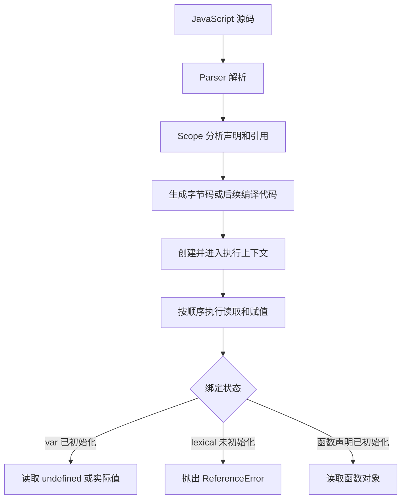

## 前言

在前端项目中，我们经常会遇到这类问题：接口明明已经写在初始化代码下面，函数里拿到的配置却是 `undefined`；某个处理函数写在调用处后面可以正常执行，换成箭头函数后却变成 `TypeError`；把一个变量改成 `const` 以后，原来的 `undefined` 又变成了 `ReferenceError`。

这些现象通常都会被归到“变量提升”上。但如果只记住“`var` 和 `function` 会被提升到顶部”，遇到真实代码时还是容易混淆。因为这里至少有三个不同的问题：

1. 当前作用域里有没有这个名字的绑定。
2. 这个绑定现在有没有初始化。
3. 初始化发生在代码执行的哪一个时刻。

本文不再使用几个变量互相赋值的输出题，而是从权限初始化、埋点注册、配置读取和旧脚本兼容等业务场景出发，先解释我们看到的结果，再回到 ECMAScript 的声明实例化和 V8 的执行上下文。

## 先从一个权限初始化问题开始

假设管理后台启动时，需要先根据权限决定菜单是否展示。旧代码可能这样写：

```js
bootstrapNavigation();

var permissionSnapshot = {
  canViewFinance: true,
  canExport: false,
};

function bootstrapNavigation() {
  const menu = permissionSnapshot.canViewFinance ? ['概览', '财务'] : ['概览'];

  mountNavigation(menu);
}
```

运行时不会得到一个“暂时没有权限”的菜单，而是直接报错：

```text
TypeError: Cannot read properties of undefined (reading 'canViewFinance')
```

很多人第一次看到这里，会觉得 `permissionSnapshot` 明明就在下面声明并赋值了，为什么函数里还是拿不到？把代码拆开就清楚了：

```js
var permissionSnapshot;

bootstrapNavigation();

permissionSnapshot = {
  canViewFinance: true,
  canExport: false,
};
```

`var permissionSnapshot` 的声明会在当前作用域建立绑定，并初始化为 `undefined`；对象字面量的创建和赋值，仍然要等执行流走到那一行。

这里的“提升”不是引擎真的把源码剪切、粘贴到了文件顶部，而是执行代码之前，当前作用域已经准备好了这个名字。调用 `bootstrapNavigation` 时，函数声明也已经准备好，所以函数能够被调用；但函数访问的配置还没有完成赋值。

这也是业务中比较麻烦的一类问题：它不一定在变量所在的位置报错，而可能沿着配置对象、埋点参数或第三方 SDK 继续传递，最后在完全不相干的调用栈里才暴露出来。

## 变量提升更准确的含义

“变量提升”是开发者社区常用的说法，并不是 ECMAScript 规范中的一个统一术语。规范实际描述的是：代码执行前，根据声明创建各种 Environment Record 和绑定，然后在执行声明对应的语句时完成初始化或赋值。

可以把一次代码执行粗略理解成下面几个阶段：

```text
源码解析
  -> 分析作用域和声明
  -> 创建执行上下文
  -> 创建声明绑定
  -> 按顺序执行语句
```

这不是说所有引擎都必须严格按照这几个阶段实现，而是帮助我们理解可观察行为的模型。

不同声明的状态大致如下：

| 声明方式                    | 执行前是否创建绑定 | 初始化前读取结果          |
| --------------------------- | ------------------ | ------------------------- |
| `var config`                | 是                 | `undefined`               |
| `function load() {}`        | 是                 | 可以拿到函数对象          |
| `let config`                | 是                 | 抛出 `ReferenceError`     |
| `const config = ...`        | 是                 | 抛出 `ReferenceError`     |
| `class Service {}`          | 是                 | 抛出 `ReferenceError`     |
| `var load = function () {}` | 是                 | `undefined`，不是函数对象 |

因此，“有没有提升”不是一个特别有用的问题。更有用的问题是：

```text
名字是否已经建立绑定？绑定是否已经初始化？初始化的值是什么？
```

## `var`：声明提前，赋值不提前

我们再看一个接口客户端的业务场景：

```js
registerRequestInterceptor();

var requestBase = '/api';
var requestTimeout = 8000;

function registerRequestInterceptor() {
  httpClient.interceptors.request.use((request) => ({
    ...request,
    baseURL: requestBase,
    timeout: requestTimeout,
  }));
}
```

函数声明可以提前使用，但 `requestBase` 和 `requestTimeout` 在调用发生时还是 `undefined`。如果请求库允许 `undefined`，问题可能不会立刻报错，而是表现为：

- 开发环境请求走了错误的相对路径；
- 超时时间退回库的默认值；
- 某些请求绕过了预期的拦截器配置；
- 只有接口失败时，才在网络面板里发现配置不对。

`var requestBase = '/api'` 至少包含两个动作：

```text
创建 requestBase 绑定，并初始化为 undefined
执行到这一行时，把 '/api' 写入 requestBase
```

只有第一个动作会在执行前发生。把声明写在前面，不能让第二个动作也提前发生。

在现代项目中，配置和依赖通常应该显式初始化以后再启动业务：

```js
const requestBase = '/api';
const requestTimeout = 8000;

function registerRequestInterceptor() {
  httpClient.interceptors.request.use((request) => ({
    ...request,
    baseURL: requestBase,
    timeout: requestTimeout,
  }));
}

registerRequestInterceptor();
```

这里的重点不是“把所有函数都搬到下面”，而是让初始化顺序和启动顺序在代码中直接可见。

## 函数声明和函数表达式的差异

在一个页面埋点模块中，下面两种写法看起来很像，执行行为却不同。

第一种是函数声明：

```js
trackCheckoutView();

function trackCheckoutView() {
  analytics.track('checkout_view');
}
```

函数声明在函数代码开始执行前，就已经可以拿到函数对象，所以调用能够成功。

第二种是函数表达式：

```js
trackCheckoutView();

var trackCheckoutView = function () {
  analytics.track('checkout_view');
};
```

这里提前创建的是 `trackCheckoutView` 这个 `var` 绑定，绑定里的值还是 `undefined`。因此调用的实际效果接近：

```js
undefined();
```

最终得到：

```text
TypeError: trackCheckoutView is not a function
```

如果使用 `const`：

```js
trackCheckoutView();

const trackCheckoutView = () => {
  analytics.track('checkout_view');
};
```

则会因为读取了尚未初始化的词法绑定而得到：

```text
ReferenceError: Cannot access 'trackCheckoutView' before initialization
```

可以用下面的方式记忆：

```text
function handler() {}        -> 函数声明和值都已准备好
var handler = function () {} -> 绑定已准备好，函数值还没有
const handler = () => {}     -> 绑定已创建，但初始化前不能读取
```

这也是为什么业务代码中使用函数表达式时，通常会把依赖声明、函数定义和启动调用按顺序组织，而不是依赖“函数可以提升”这条经验。

## `let`、`const` 和 TDZ：为什么不是 `undefined`

假设页面要根据灰度配置决定是否加载新结算组件：

```js
startCheckout();

const checkoutExperiment = {
  enabled: true,
  version: 'v2',
};

function startCheckout() {
  if (checkoutExperiment.enabled) {
    loadCheckoutV2();
  } else {
    loadCheckoutV1();
  }
}
```

这次不会像 `var` 一样读到 `undefined`，而是在读取 `checkoutExperiment` 时直接抛出：

```text
ReferenceError: Cannot access 'checkoutExperiment' before initialization
```

`let`、`const` 和 `class` 的绑定同样会在所属作用域建立，但从绑定建立到执行声明初始化之间，有一个不能访问的区域，这就是暂时性死区（Temporal Dead Zone，TDZ）。

所以“`let` 和 `const` 没有提升”更适合当成入门阶段的简化说法。更准确的描述是：

```text
它们会影响整个作用域，但在执行到声明之前处于未初始化状态。
```

TDZ 的价值在于，它会把“配置还没准备好”的问题更早暴露出来。相比 `var` 把错误值悄悄传下去，直接抛出 `ReferenceError` 通常更容易定位。

### 一个容易忽略的遮蔽问题

下面这段代码里，`if` 外层虽然也有一个 `experiment`，但块内的 `const experiment` 会遮蔽整个块：

```js
const experiment = getRuntimeExperiment();

if (experiment.enabled) {
  console.log(experiment.version);

  const experiment = {
    enabled: false,
    version: 'fallback',
  };
}
```

第一行 `console.log` 访问的是块内那个尚未初始化的绑定，而不是外层的 `experiment`，因此仍然会抛 `ReferenceError`。

在真实项目里，这类问题常见于回调、条件分支和局部变量重名。变量名看起来一样，不代表它们是同一个绑定；作用域边界和初始化时机才决定最终读到谁。

## `typeof` 也不能绕过 TDZ

`typeof` 对于“根本不存在的变量”有一个历史上的安全特例：

```js
if (typeof optionalAnalytics === 'undefined') {
  console.log('analytics is unavailable');
}
```

但是，如果当前作用域后面声明了同名的 `const`，这个名字已经属于当前作用域，只是还没有初始化：

```js
if (typeof optionalAnalytics === 'undefined') {
  console.log('analytics is unavailable');
}

const optionalAnalytics = createAnalytics();
```

这时 `typeof optionalAnalytics` 也会触发 `ReferenceError`。因此，运行时能力检测不要和同一作用域中的词法声明使用相同名字；如果是模块依赖，优先使用明确的导入和依赖注入。

## 条件分支里的函数声明为什么不适合写业务逻辑

老代码里有时会这样根据环境切换适配器：

```js
if (isMobileWeb) {
  function openSharePanel() {
    mobileBridge.openShare();
  }
} else {
  function openSharePanel() {
    desktopDialog.open();
  }
}

openSharePanel();
```

这段代码的问题不是单纯的“函数有没有提升”，而是块级函数声明在不同代码形态下存在复杂的兼容语义。ES Module 和严格模式下，它更接近块级声明；普通脚本还受到 Annex B 历史兼容规则影响。打包器、严格模式和运行环境一变化，代码就可能出现不同结果。

业务分支应该把选择动作写出来：

```js
const openSharePanel = isMobileWeb
  ? () => mobileBridge.openShare()
  : () => desktopDialog.open();

openSharePanel();
```

或者用策略表：

```js
const shareActions = {
  mobile: () => mobileBridge.openShare(),
  desktop: () => desktopDialog.open(),
};

shareActions[isMobileWeb ? 'mobile' : 'desktop']();
```

这样选择发生在赋值表达式中，函数在哪个作用域里、什么时候可用，都比依赖条件分支函数声明清楚。

## 重名声明：不是多个变量，而是同一个绑定被覆盖

在维护老项目时，常见一种情况是同一个 SDK 适配函数被重复声明：

```js
function createUploader(file) {
  return legacyUploader(file);
}

function createUploader(file) {
  return modernUploader(file);
}

uploadButton.addEventListener('change', (event) => {
  createUploader(event.target.files[0]);
});
```

这里并不存在两个可以通过调用位置区分的 `createUploader`。同一个作用域里，后面的函数声明会覆盖前面的函数绑定，因此事件触发时执行的是 `modernUploader` 版本。

如果后面还有赋值：

```js
var createUploader = createMockUploader;
```

那么执行流走到这行以后，绑定又会被改成 `createMockUploader`。所以同名声明和后续赋值叠加起来，最终行为取决于两个时间点：声明实例化时的初始值，以及代码执行到赋值语句时的最新值。

在模块化项目里，同一模块不应该用重复声明表达“覆盖实现”。如果确实需要替换实现，建议使用明确的变量赋值、依赖注入或配置映射，让覆盖关系可以被搜索和测试发现。

## 不带声明关键字：不要把它理解成正常的作用域查找

以前常见的说法是：不写 `var` 的变量会沿着作用域链查找，找不到就挂到 `window` 上。这句话只描述了非严格模式普通脚本中的一种历史行为，而且“沿作用域链找不到以后创建全局属性”本身也不是现代项目应依赖的能力。

```js
function recordExportResult(result) {
  exportStatus = result.status;
}

recordExportResult({ status: 'success' });
```

在非严格模式的某些普通脚本环境里，`exportStatus` 可能成为全局对象属性；但在严格模式和 ES Module 中，这段代码会抛出：

```text
ReferenceError: exportStatus is not defined
```

现在的前端项目通常使用 ES Module，模块代码默认采用严格模式。因此，不带声明关键字应该被当成错误处理：

```js
function recordExportResult(result) {
  const exportStatus = result.status;
  return exportStatus;
}
```

可以让 `no-undef`、TypeScript 和编辑器诊断尽早拦截这类问题。需要使用浏览器全局时，也应该明确写出边界：

```js
globalThis.exportStatus = 'success';
```

## 普通脚本和 ES Module 的全局差异

浏览器中的经典脚本和模块脚本不是同一种顶层作用域。

经典脚本里，顶层 `var` 会参与全局环境的 `var` 绑定，并与全局对象属性产生关联：

```html
<script>
  var legacySdkReady = true;
  console.log(window.legacySdkReady); // true
</script>
```

但模块里的顶层 `var` 属于模块自己的作用域：

```html
<script type="module">
  var moduleSdkReady = true;
  console.log(window.moduleSdkReady); // undefined
</script>
```

模块中的变量不会因为写在顶层就自动暴露到 `window`。这也是把老页面拆成模块时，一个很容易踩到的兼容问题：旧脚本可能依赖某个顶层 `var`，拆分后另一个脚本再通过 `window.xxx` 读取就失效了。

如果确实要跨模块或跨脚本共享，应该明确使用：

```js
globalThis.legacySdkReady = true;
```

或者更推荐把它变成模块导出，再由使用方显式导入。模块化并不是把所有变量都放进一个更大的全局作用域，而是让依赖关系变得可见。

## 从 ECMAScript 规范看执行上下文

到这里，前面的现象可以用规范中的几个概念解释。

### 1. Environment Record 保存绑定关系

规范中的 Environment Record 可以理解为“当前作用域如何把名字映射到值”的抽象记录。它不等于浏览器中的某个 JavaScript 对象，也不要求引擎一定创建一个名为 `EnvironmentRecord` 的实体。

不同类型的代码会使用不同的环境记录。全局环境比较特殊，既要处理全局对象相关的 `var`/函数声明，又要处理不直接成为全局对象属性的词法声明。

### 2. Declaration Instantiation 创建声明

脚本、函数和块在开始执行时，会执行相应的声明实例化过程。以本文涉及的几种声明为例，可以抽象成：

```text
var                 -> 创建可变绑定，初始化为 undefined
function declaration -> 创建绑定，并初始化为函数对象
let / const / class  -> 创建词法绑定，但先不初始化
```

这正好对应三个常见结果：

```text
var 配置             -> 读到 undefined
函数声明             -> 声明前也能调用
const 配置            -> 声明前读取抛 ReferenceError
```

当真正执行到 `const config = createConfig()` 时，右侧表达式先被求值，然后结果才会写入这个词法绑定。也就是说，绑定的创建和绑定的初始化不是同一个动作。

### 3. 作用域查找发生在读取绑定时

当函数执行到 `permissionSnapshot` 这种标识符时，运行时会根据当前的词法环境查找绑定。当前环境没有，才会继续找外层环境；当前环境有一个尚未初始化的 `const` 时，不会跳过它去找外层同名变量，而是直接抛出 TDZ 错误。

因此，原文中常见的“找不到变量就一直向上找，最后找到 `window`”并不适合概括所有情况：

- 作用域链查找处理的是已经存在的绑定和外层环境；
- 未声明赋值属于另一套运行时语义；
- 严格模式和模块代码不会把未声明赋值静默变成全局属性。

## 从 V8 看：执行上下文不是一张变量对象表

规范给出的是语言行为，V8 负责把这些行为实现成解析器、作用域分析、字节码和运行时结构。

可以用下面的流程理解 V8 处理本文代码的思路：



V8 会在解析和作用域分析阶段知道哪些名字属于哪个作用域，哪些变量被闭包捕获。执行时，变量不一定都存储在一个统一的“变量对象”里：

- 只在当前函数内部使用的变量，可能被放在栈、寄存器或优化后的内部位置；
- 被闭包捕获的变量，需要在函数返回后仍然可用，更可能进入 V8 的 `Context` 结构；
- 全局对象相关的属性、模块绑定和函数局部变量，也不是同一种存储路径。

所以，“变量提升”不是 V8 把所有变量搬到一个对象顶部。更接近真实情况的说法是：V8 先建立作用域和绑定信息，再在执行代码时根据绑定状态生成对应的读取、写入和 TDZ 检查。

这里还要区分两层概念：

```text
ECMAScript Execution Context：规范为了描述语言行为定义的抽象结构
V8 Context：V8 为实现作用域和闭包等机制使用的运行时结构
```

它们相关，但不是一一对应。规范里的 Environment Record 和执行上下文不能直接当成 V8 源码中的某个对象来理解。

## 实际项目中的写法建议

回到业务代码，变量提升相关问题通常可以通过几条简单规则减少：

1. 配置、权限快照、客户端实例等依赖，先完成初始化，再调用启动函数。
2. 不依赖 `var` 的 `undefined` 作为默认配置；如果缺少配置，主动校验并报出有意义的错误。
3. 工具函数可以使用函数声明，但不要把条件分支里的函数声明当成业务策略切换机制。
4. 业务回调优先使用 `const`，让函数值的初始化位置明确。
5. 不写未声明赋值；需要全局共享时显式使用 `globalThis`，更推荐使用模块导出。
6. 避免同一作用域的重复函数声明和同名赋值，尤其是 SDK 适配、Mock 替换和灰度逻辑。
7. 配置读取遇到 `undefined` 时，先检查初始化顺序，再检查字段本身是否真的允许缺省。

可以把启动代码组织成一条更容易阅读的链路：

```js
const runtimeConfig = readRuntimeConfig();
const permissionSnapshot = await fetchPermissions();
const apiClient = createApiClient(runtimeConfig);

setupNavigation(permissionSnapshot);
setupTracking(apiClient);
renderApplication();
```

这段代码不需要读者记住任何提升规则，也能看出依赖的准备顺序。对于团队协作和问题排查来说，这通常比依赖语言的隐式行为更可靠。

## 总结

变量提升可以归纳成一句话：

```text
代码执行前会创建声明绑定，但不同声明的初始化时机和初始状态不同。
```

具体来看：

1. `var` 的绑定会提前创建，并初始化为 `undefined`；赋值不会提前发生。
2. 函数声明会在函数代码执行前准备好函数对象，所以可以在声明位置之前调用。
3. 函数表达式只是把函数对象作为一次赋值结果，不能套用函数声明的提前调用规则。
4. `let`、`const`、`class` 会影响所属作用域，但初始化前处于 TDZ，读取时抛出 `ReferenceError`。
5. 重名声明操作的是同一个作用域绑定，后续声明或赋值可能覆盖前面的实现。
6. 条件分支中的函数声明带有严格模式、模块和 Annex B 兼容差异，不适合作为业务分支机制。
7. 未声明赋值和作用域链查找不是一回事，现代模块代码中应该把它当成错误。
8. ECMAScript 的执行上下文是规范抽象，V8 的 `Context` 是实现作用域和闭包的运行时结构，二者不能简单画等号。

到这里，业务代码里的 `undefined`、`TypeError` 和 TDZ 的 `ReferenceError`，就可以从“背输出结果”还原成绑定创建、绑定初始化和代码执行顺序三个问题。

## 参考文章和源码

- [ECMAScript® Language Specification](https://tc39.es/ecma262/)
- [ECMAScript：GlobalDeclarationInstantiation](https://tc39.es/ecma262/multipage/global-object.html#sec-globaldeclarationinstantiation)
- [ECMAScript：FunctionDeclarationInstantiation](https://tc39.es/ecma262/multipage/ecmascript-language-functions-and-classes.html#sec-functiondeclarationinstantiation)
- [ECMAScript：BlockDeclarationInstantiation](https://tc39.es/ecma262/multipage/ecmascript-language-statements-and-declarations.html#sec-blockdeclarationinstantiation)
- [MDN：Hoisting](https://developer.mozilla.org/en-US/docs/Glossary/Hoisting)
- [MDN：let：Temporal dead zone](https://developer.mozilla.org/en-US/docs/Web/JavaScript/Reference/Statements/let#temporal_dead_zone_tdz)
- [MDN：JavaScript modules](https://developer.mozilla.org/en-US/docs/Web/JavaScript/Guide/Modules)
- [V8：Firing up the Ignition interpreter](https://v8.dev/blog/ignition-interpreter)
