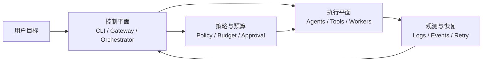
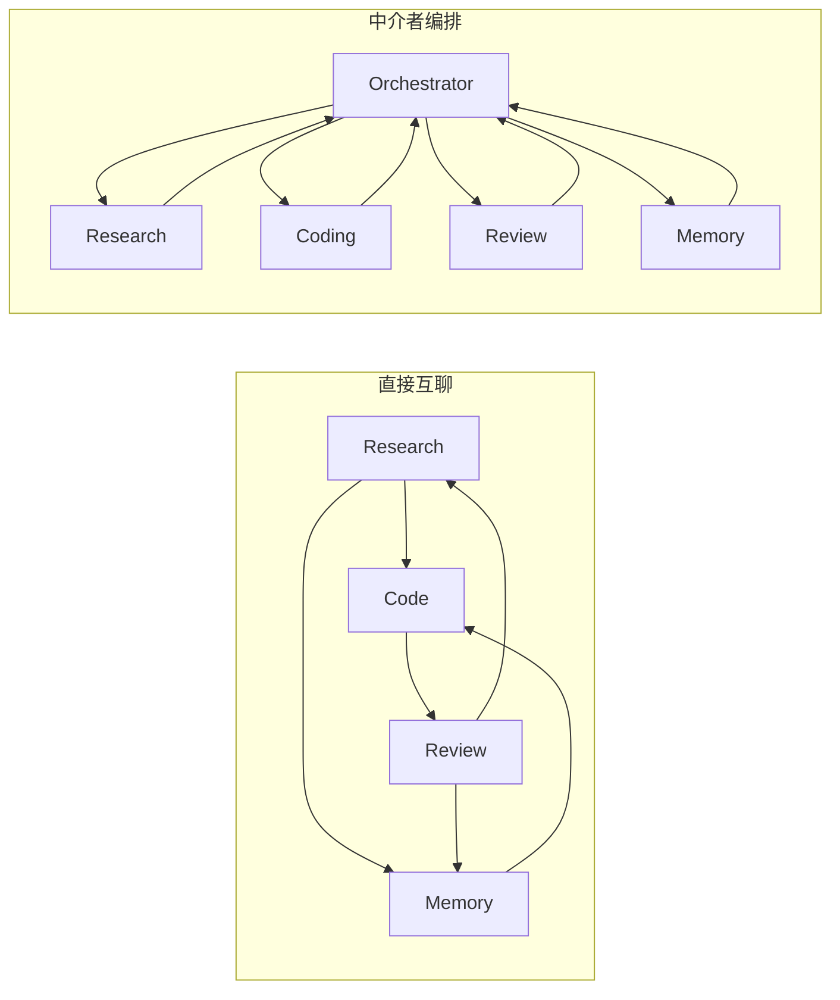
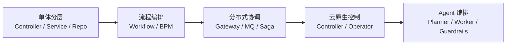
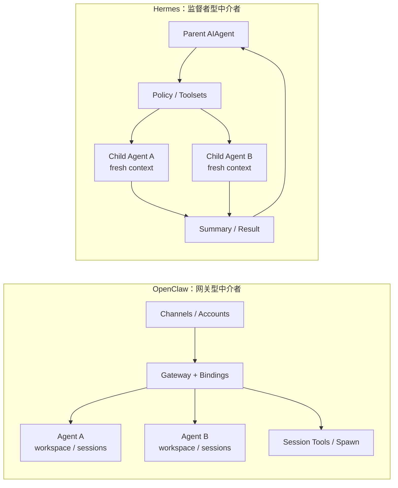
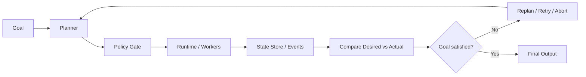
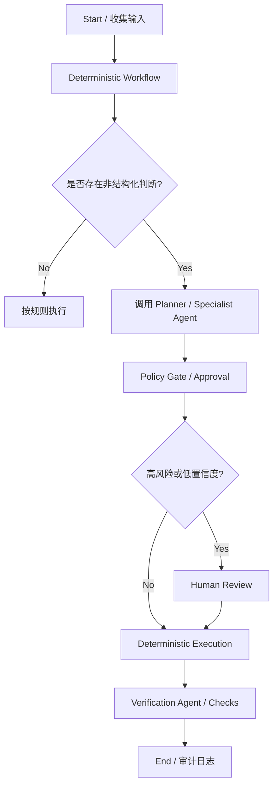

这次我想把话再往前推一步。

多智能体不是 AI 突然发明出来的一种“新组织学”。

它更像是软件行业过去二十年已经反复踩过的几类协调问题，在 LLM 时代重新回来了一遍。只不过这次，系统里多了一个会推理、会犯错、会临场改主意的执行单元。

所以真正值得看的，从来不是“一个 agent 写代码，另一个 agent 做测试”这种角色分工。

而是下面这几个更硬的问题：

- 谁负责拆任务
- 谁负责分配权限和预算
- 谁决定上下文该给到哪一层
- 子任务失败以后，系统怎么重试、降级、终止

这也是我最近把 `OpenClaw` 和 `Hermes Agent` 放在一起看时，最强烈的感觉。

截至 `2026-04-14`，`OpenClaw` 最新 release 是 `2026.4.12`，发布时间是 `2026-04-13`；`Hermes Agent` 最新 release 是 `v0.9.0 / v2026.4.13`，发布时间同样是 `2026-04-13`。它们都还在快速演进，但我越来越确定一件事：

**多智能体真正成熟的标志，不是并发数变多，而是它越来越像一个有控制平面、有执行平面、有恢复机制的系统。**

如果只想先抓一眼版，我会把它画成这样：



## 如果你做过业务系统，这一波会很眼熟

我第一次认真拆多智能体时，脑子里冒出来的不是“AI 团队协作”。

而是以前做业务系统时那些老朋友：

- `API Gateway`
- `Workflow Engine`
- `Message Bus`
- `Supervisor`
- `Controller Loop`

说白了，今天很多多智能体框架干的事情，老业务系统早就干过。

只是名字不一样。

以前我们管它叫流程编排、任务调度、控制回路、失败恢复、补偿事务。现在换到 agent 这边，名字变成了 delegation、subagent、context engine、toolset、sandbox、memory worker。

骨架其实没变。

真正变的是：**以前执行节点大多是确定性的函数或服务，现在执行节点里混进了一个非确定性的 LLM。**

这会带来一个本质变化：

> 过去的软件系统，难点在分布式协调。  
> 现在的 agent 系统，难点变成了“概率性规划”叠加“确定性治理”。

我越来越相信，后面真正能落地的多智能体，不会是“agent 社会”，而会是“概率性规划器 + 确定性控制面 + 受限执行 worker”的组合。

## 为什么我坚持说它先是中介者模式

中介者模式最值钱的地方，不是抽象漂亮。

而是它专门解决一种很现实的问题：**一旦协作对象变多，直接互相调用会把系统拖进耦合泥潭。**

先看一个反例。很多人第一次写多 agent，脑子里大概是这个结构：

```ts
class ResearchAgent {
  run(task) {
    const facts = web.search(task);
    return CodeAgent.run({ type: 'implement', facts });
  }
}

class CodeAgent {
  run(task) {
    const patch = writeCode(task.facts);
    return ReviewAgent.run({ type: 'review', patch });
  }
}

class ReviewAgent {
  run(task) {
    if (!task.patch.pass) {
      return ResearchAgent.run({ type: 'recheck' });
    }
    return task.patch;
  }
}
```

这段伪代码的问题不是“写得不优雅”。

而是结构上已经开始失控了。

`ResearchAgent` 知道 `CodeAgent`，`CodeAgent` 知道 `ReviewAgent`，`ReviewAgent` 又反过来知道 `ResearchAgent`。角色一多，链路就会从 `n` 条，膨胀成接近 `n²` 的通信关系。

更麻烦的是，下面这些东西会马上散掉：

- 权限判断散在每个 agent 里
- 重试策略散在每个 agent 里
- 成本统计散在每个 agent 里
- 日志和状态树散在每个 agent 里

这时候你再加一个 `SecurityAgent`、`MemoryAgent`、`PlanningAgent`，系统很快就会从“多智能体”变成“多处 prompt 相互引用”。

直接互聊和中介层编排，结构差别其实一眼就能看出来：



中介者模式真正解决的是这个。

它不让 agent 直接互相耦合，而是统一交给编排层：

```ts
type Task = {
  id: string;
  goal: string;
  context: string;
  toolset: string[];
  budget: { maxTokens: number; maxTimeMs: number };
  outputSchema: string;
  retryPolicy: 'none' | 'once' | 'bounded';
};

class Orchestrator {
  run(userGoal: string) {
    const queue = this.plan(userGoal);

    while (queue.hasNext()) {
      const task = queue.next();

      if (!this.policy.allow(task)) {
        this.recordBlocked(task);
        continue;
      }

      const agent = this.selectAgent(task);
      const result = agent.execute(task);
      this.observe(task, result);

      if (result.status === 'needs_followup') {
        queue.push(...this.replan(task, result));
      }
    }

    return this.summarize();
  }
}
```

这里的关键不是 `while` 循环。

而是系统里终于出现了一个单点：

- 任务在这里被创建
- 上下文在这里被裁剪
- 权限在这里被审批
- 失败在这里被归因
- 结果在这里被回收

这就是为什么我会说，`CLI`、`Gateway`、`Orchestrator` 一旦开始调多个 agent，它本质上就是中介者模式。

不是像。

是已经在干这件事了。

## 如果把它放回业务架构演进里，会更容易看明白

多智能体不是凭空冒出来的，它站在几波老架构演进的肩膀上。

我会把它放进下面这条线里看：

| 阶段           | 当时要解决的问题       | 当时成熟的解法                        | 放到今天的多智能体里，对应的是什么 |
| -------------- | ---------------------- | ------------------------------------- | ---------------------------------- |
| 单体业务时代   | 一个请求内部怎么拆职责 | Controller / Service / Repository     | 单 agent + tools                   |
| 流程化业务时代 | 跨步骤、长事务怎么走完 | BPM / Workflow Engine                 | Orchestrator 管任务树              |
| 分布式业务时代 | 多服务如何解耦和补偿   | API Gateway / MQ / Saga               | 多 agent 任务契约、重试、回收      |
| 云原生时代     | 系统如何持续自愈       | Controller / Operator / Desired State | 持续观察 agent 状态并纠偏          |
| Agent 时代     | 不确定任务怎么动态拆分 | Planner + Worker + Guardrails         | 非确定性规划 + 确定性执行          |

这张表不是为了硬套概念。

而是为了说明一件事：**多智能体最值得学的，不只是 prompt engineering，而是老系统里那些已经被证明有效的组织方式。**

如果把这条演进线压成一张图，会更直观：



### 业务系统 1.0：函数调用

最早的业务系统很简单。

入口来了，请求进 controller，controller 调 service，service 调 repository。整个链条虽然分层，但大体还是一个进程里完成的。

这对应今天最常见的 agent 形态，其实就是：

```ts
async function singleAgentHandle(goal: string) {
  const plan = await llm.plan(goal);
  const docs = await web.search(plan.query);
  const file = await terminal.run(plan.command);
  return llm.answer({ goal, docs, file });
}
```

这种结构不是不能用。

如果任务短、上下文集中、风险低，它其实是最划算的。

很多团队一上来就拆多 agent，反而是在把简单问题复杂化。

### 业务系统 2.0：流程编排

当业务开始跨部门、跨系统、跨时间，事情就变了。

一个订单不只是“查库存然后扣款”，它可能还要风控、通知、发票、客服、退款。这个时候，单纯函数调用已经不够，需要流程编排。`Camunda` 这类工作流系统的文档写得非常直白：流程编排是在协调业务流程中所有移动部件，让人、系统、设备一起完成端到端流程。

这段历史非常重要。

因为今天很多人以为多智能体是在发明“复杂任务拆分”。不是。工作流系统早就在做。真正新的地方，是把其中一部分步骤，从确定性节点，换成了概率性节点。

所以我会把两者区别写成这样：

```ts
// 传统工作流：路径大体已知
workflow
  .start('order_fulfillment')
  .then('risk_check')
  .then('charge_payment')
  .then('create_shipment')
  .then('notify_user');

// agent 编排：路径部分未知，需要先规划
const plan = planner.decompose('帮我完成订单异常排查');

for (const step of plan.steps) {
  orchestrator.dispatch(step);
}
```

你会发现，两边的骨架其实很像。

真正不同的是第二段的 `planner.decompose()`。这里开始引入非确定性，所以后面的编排层必须更强，不然系统就会发散。

更有意思的是，老工作流厂商自己也已经往这边走了。`Camunda` 官方现在甚至直接用了 `agentic orchestration` 这个词，而且明确把 AI agents 放进 BPMN 工作流里，让 deterministic rule sets、human tasks 和 AI-driven decisions 协作。

这等于官方承认了一件事：

**agent 不是工作流的替代品，而是在吃掉工作流里“原本最难标准化的那一段”。**

### 业务系统 3.0：分布式和补偿

再往后，业务进入微服务和消息化时代。

你会发现，真正难的已经不是“谁做哪一步”，而是：

- 谁来发命令
- 谁来确认完成
- 谁来处理超时
- 谁来记录状态
- 出错以后谁来补偿

这时候你再看多智能体，味道就更熟了。

今天很多 agent 框架的本质，不就是在重新回答这些问题吗？

```ts
type AgentCommand = {
  taskId: string;
  assignee: 'research' | 'coding' | 'review';
  payload: string;
  timeoutMs: number;
  retry: number;
  onFailure: 'replan' | 'abort' | 'fallback';
};

function dispatch(cmd: AgentCommand) {
  log.append(cmd);
  queue.publish(cmd.assignee, cmd);
}

function onResult(result) {
  stateStore.update(result.taskId, result.status);

  if (result.status === 'failed') {
    compensateOrReplan(result);
  }
}
```

这已经不是什么“灵感型协作”了。

这就是命令、状态、回执、补偿。

## OpenClaw 和 Hermes，分别把中介者模式做成了两种产品

如果只看 marketing 词汇，`OpenClaw` 和 `Hermes Agent` 都是多智能体。

但如果从模式上看，它们其实在实现两种不同的“中介层”。

### OpenClaw：网关型中介者

`OpenClaw` 官方多智能体文档给了一个非常强的信号：它的目标是让一个运行中的 Gateway 承载多个隔离 agent、多个渠道账号，再通过 `bindings` 把入站消息路由到对应 agent。

这句话背后有三层意思：

第一，它把“入口路由”放在系统中心。

第二，它把“agent 身份隔离”做成了一等公民。官方文档明确写了每个 agent 都有独立的 `workspace`、`agentDir` 和 `session store`。

第三，它的路由不是模糊的，而是确定性的。文档直接写了 `bindings` 的匹配优先级，而且同层冲突时“配置顺序里先出现的生效”。

把这套东西翻成伪代码，大概就是：

```ts
function routeInboundMessage(msg: InboundMessage) {
  const binding = bindings
    .sort(bySpecificity)
    .find((rule) => rule.matches(msg));

  const agentId = binding?.agentId ?? defaultAgentId;
  const agent = agentRegistry.get(agentId);

  return agent.handle(msg);
}
```

注意这个结构里的重点。

不是 `agent.handle(msg)`。

而是前面的 `sort(bySpecificity)`、`find(rule.matches)`、`defaultAgentId`。这说明 `OpenClaw` 的核心价值，在于先把“谁该接这个请求”这件事做稳。

这跟很多传统业务系统里 `API Gateway + routing rules` 的角色非常像。

然后再看它的 `sessions_spawn`。官方文档明确说它会创建一个隔离的后台子 session，而且“always non-blocking”，会立刻返回 `runId` 和 `childSessionKey`。这说明它的子 agent 更像控制平面里被调度的后台作业，而不是一群自由聊天的数字员工。

甚至连记忆，`OpenClaw 2026.4.12` 也开始做成 agent 了。`Active Memory plugin` 的官方描述，本质上就是“在主回复前，先跑一个 memory sub-agent”。

这是一个特别值得注意的信号。

因为它意味着，未来很多今天看起来像“函数调用”的能力，都会慢慢演进成“可独立调度、可替换、可观察的 agent worker”。

### Hermes Agent：监督者型中介者

`Hermes Agent` 的中心则完全不一样。

它最值得看的不是多账号路由，而是 `delegate_task`。官方文档写得很硬：子 agent 由 `delegate_task` 拉起，拿到 isolated context、restricted toolsets、own terminal sessions，而且只有最终 summary 会进入父上下文。

这四个点特别关键。

它们说明 `Hermes` 在做的，不是“把多个 agent 接在一起”。

而是“把一个主控 agent 变成监督者，然后谨慎地往外委派”。

如果把这个设计翻成伪代码，会像这样：

```ts
function delegateTask(goal: string, context: string, toolsets: string[]) {
  const child = spawnChildAgent({
    freshConversation: true,
    context,
    toolsets,
    canDelegateAgain: false,
  });

  const summary = child.run(goal);
  return summarizeForParent(summary);
}
```

这里最厉害的一点其实不是 `spawnChildAgent()`。

而是 `freshConversation: true`。

官方文档甚至专门强调，子 agent 对父历史“zero knowledge”，只能看到 `goal` 和 `context` 里显式喂进去的内容。很多人第一次看到会觉得太苛刻，但我觉得这反而是成熟的信号。

因为这说明 `Hermes` 已经意识到一件事：

> 多智能体系统真正稀缺的，不是共享上下文。  
> 是可控的上下文。

再往深一点看，它的 `toolsets` 也是同样思路。不同子 agent 拿不同工具集，某些能力对子 agent 永远禁用。这其实就是把“最小权限原则”前置进了编排层。

如果我用一个更老派的概念来形容，`Hermes` 像的不是消息总线。

它更像 `Erlang/OTP` 里的 supervisor tree。

`Erlang` 官方文档对 supervisor 的描述非常直白：supervisor 负责启动、停止、监控子进程，并在必要时重启，而且还要限制某段时间内的最大重启强度，避免系统无限重启自爆。

把这段原则翻成 agent 世界，其实就是：

```ts
class Supervisor {
  runTaskTree(rootTask: Task) {
    const child = this.startChild(rootTask);
    const result = child.execute();

    if (result.status === 'failed' && this.restartBudget.allows(rootTask.id)) {
      return this.restart(rootTask);
    }

    if (this.restartBudget.exhausted(rootTask.id)) {
      return this.abortSubtree(rootTask.id);
    }

    return result;
  }
}
```

这段伪代码背后的观点很明确：

**多智能体不是让系统更自由，而是让系统更需要监督。**

### 两者真正的差别，不在“有没有多个 agent”

我会把它们的差别压缩成一句话：

- `OpenClaw` 更像“谁来接、从哪接、隔离在哪”的中介者
- `Hermes` 更像“谁来拆、派给谁、出了事谁兜底”的中介者

放到架构上看，就是这样：

| 维度           | OpenClaw                                | Hermes Agent                                 |
| -------------- | --------------------------------------- | -------------------------------------------- |
| 中介层核心职责 | 入口路由、身份隔离、会话隔离            | 任务拆解、子 agent 委派、结果回收            |
| 更像什么老架构 | Gateway / Channel Router                | Supervisor / Task Orchestrator               |
| 关键边界       | workspace、agentDir、bindings、sessions | context、toolsets、terminal session、summary |
| 最像的历史经验 | API 网关、多租户隔离、控制平面          | 工作流引擎、监督树、受限 worker pool         |

这也是为什么 `Hermes` 的 OpenClaw 迁移文档会直接把 `multi-agent list` 和 `bindings` 划进“没有直接 Hermes 等价物”的部分，建议改用 `profiles` 和手工平台配置去重建。

这不是缺功能。

这是产品哲学不一样。

如果用一张图对照，两条路线会更清楚：



## 设计模式不止中介者，但中介者是总入口

如果只讲中介者模式，还不够把今天的多智能体看透。

我会把它拆成五层。

### 1. 中介者模式：解决 N² 协作爆炸

所有 agent 都通过中介层互动，避免直接互相知道对方。

```ts
orchestrator.send('research', task);
orchestrator.send('coding', task);
orchestrator.send('review', task);
```

一旦系统是这样写的，你才能集中做：

- policy
- audit
- budget
- cancellation

### 2. 命令模式：把任务变成可排队、可重放的对象

多智能体里真正的最小单位不是消息，而是任务命令。

```ts
type AgentTaskCommand = {
  goal: string;
  contextRef: string;
  toolset: string[];
  model: string;
  retryPolicy: 'never' | 'once' | 'bounded';
};
```

只要任务被对象化，系统才谈得上：

- 入队
- 并行
- 暂停
- 取消
- 幂等

### 3. 策略模式：不同 agent 不是同一把锤子

多智能体真正有价值的前提，是不同任务能套不同策略。

```ts
function selectExecutionStrategy(task: Task) {
  if (task.kind === 'search') return { model: 'cheap-fast', toolset: ['web'] };
  if (task.kind === 'patch')
    return { model: 'strong-code', toolset: ['terminal', 'file'] };
  return { model: 'default', toolset: ['memory'] };
}
```

如果每个 agent 都拿一样的模型、一样的工具、一样的权限，那很多时候你只是把一个 agent 切成了三段。

### 4. 观察者模式：没有事件流，就没有多智能体运营

当系统开始有后台任务、子任务树、异步完成、进度通知，观察者模式就会自动出现。

```ts
eventBus.emit('task.started', taskId);
eventBus.emit('task.completed', taskId);
eventBus.emit('task.failed', taskId);
dashboard.subscribe(taskId, renderStatus);
```

很多团队以为“让 agent 会调用工具”就够了。

不够。

没有事件流，你连问题发生在哪一步都看不清。

### 5. 状态机和控制回路：AI 不是只会聊天，它还得被纠偏

这一点我觉得经常被低估。

`Kubernetes` 官方文档把 controller 定义成一种 non-terminating loop，会持续观察 current state，让系统接近 desired state。这个思路放到多智能体上，非常贴切。

因为真正线上可用的 agent 系统，最后都不会是“一次回答结束”。

它更像这样：

```ts
while (!goalSatisfied()) {
  const desired = planner.currentPlan();
  const actual = runtime.inspect();
  const diff = compare(desired, actual);

  for (const action of diff.actions) {
    orchestrator.dispatch(action);
  }
}
```

这其实已经不是聊天产品的脑回路了。

这是控制回路。

也就是说，多智能体往后走，越来越像控制系统，不只是对话系统。

这条回路如果画出来，就是下面这个形状：



## 真正的新东西，不是模式本身，而是“非确定性节点”进来了

到这里我反而想强调一句：

今天多智能体最“新”的地方，不是中介者、命令、策略、监督、控制回路这些模式。

这些都不新。

真正新的，是系统里开始大规模出现一种节点：

- 输入不完整
- 路径不固定
- 输出不是严格可预测
- 但它又必须被放进生产流程

这就是 LLM agent。

所以我现在最认同的一种架构表达，其实不是“AI 员工团队”。

而是这句话：

> 把不确定性交给 agent。  
> 把确定性约束留给系统。

用伪代码写，就是：

```ts
const plan = planner.propose(goal); // 允许不确定
const approvedPlan = policyGate.validate(plan); // 必须确定

for (const step of approvedPlan.steps) {
  runtime.execute(step); // 必须可观测、可取消、可追责
}
```

这也是为什么我会觉得，未来真正厉害的多智能体框架，不会只拼模型能力。

它们拼的是：**怎么把概率性决策，装进一个确定性外壳里。**

## 我对未来的几个判断

下面这些是我的推断，不是官方 roadmap。

但它们都能从现有框架和老架构经验里找到依据。

### 1. 工作流引擎和多智能体会合流

这件事其实已经开始了。

`Camunda` 已经在官方文档里明说 agentic orchestration，要把 AI agents 放进 BPMN 流程里。`Temporal` 也一直在强调 durable execution，服务的是 order fulfillment、customer onboarding、payment processing 这种需要“绝不能凭空消失”的长事务。

我对未来的判断很直接：

**稳定步骤继续交给 workflow engine，不稳定步骤交给 agent。**

也就是说，很多系统最后会长成：

```ts
workflow.step('collect_case_data');
workflow.step('call_analysis_agent');
workflow.step('human_approval');
workflow.step('execute_fix');
workflow.step('notify_customer');
```

不是 agent 替代 workflow。

而是 agent 成为 workflow 里的一个新节点类型。

### 2. Context Engineering 会升级成基础设施

`Hermes` 把 context engine 做成可插拔，`delegate_task` 又强调 fresh context；`OpenClaw` 则开始把记忆召回单独 agent 化。

这两条线最后都会指向同一个结论：

上下文不会再只是 prompt 的一部分。

它会变成基础设施。

以后真正值钱的，不是“谁家 prompt 写得更长”，而是：

- 如何切 context
- 如何压缩 context
- 如何给不同 worker 不同粒度的 context
- 如何让 summary 回传时不失真

### 3. 多智能体的 moat 会越来越像“控制平面能力”

我觉得以后真正能形成护城河的，不会是“我支持 8 个 agent 并发”。

而是下面这些：

- 任务树可视化
- 子任务预算和配额
- 权限审批链
- 中断和取消传播
- 失败恢复和重试上限
- 审计日志

换句话说，未来最值钱的不是 `agent count`。

而是 `control plane quality`。

### 4. 最先被淘汰的，会是角色扮演式多 agent

什么 CEO agent、CTO agent、产品经理 agent，这类写法短期会一直有流量。

但我越来越不看好它们长期能打。

原因很简单：角色名不是系统边界。

真正能留下来的，会是这种拆法：

- research worker
- browse worker
- memory worker
- coding worker
- verification worker
- approval gate

为什么？

因为它们对应的是能力边界、权限边界和失败边界，而不是人设边界。

## 真正落地时，我会怎么选型

写到这里，其实最容易被问到的不是“你说得对不对”。

而是：

**那到底什么时候该用单 agent，什么时候该上 workflow，什么时候才值得拆成多智能体？**

我现在的判断已经很固定了。

### 先看任务形状，不要先看模型能力

很多团队一讨论架构，第一反应是“哪个模型更强”“能不能支持 tool calling”“能不能并行”。

这些当然重要。

但它们都排在后面。

我会先看任务形状：

| 任务形状                                 | 更合适的架构                  | 为什么                                 |
| ---------------------------------------- | ----------------------------- | -------------------------------------- |
| 链路很短，目标清晰，强依赖完整上下文     | 单 agent + tools              | 少一次拆分，就少一次上下文损耗         |
| 步骤相对固定，但中间有一两段非结构化判断 | Workflow + agent 节点         | 稳定骨架交给流程，不确定节点交给 agent |
| 子任务可并行、能力边界清晰、工具差异明显 | Supervisor + worker pool      | 可以按能力、权限、预算拆分             |
| 多入口、多账号、多 persona、长期在线运行 | Gateway + multi-agent routing | 入口管理和隔离比任务拆解更重要         |

如果我把这个判断写成伪代码，大概会是这样：

```ts
function chooseArchitecture(task: {
  stepsArePredictable: boolean;
  needsLongRunningState: boolean;
  needsHumanApproval: boolean;
  hasParallelSubgoals: boolean;
  requiresDifferentToolsets: boolean;
  hasMultipleChannelsOrPersonas: boolean;
}) {
  if (task.hasMultipleChannelsOrPersonas) {
    return 'gateway-multi-agent';
  }

  if (
    task.stepsArePredictable &&
    (task.needsLongRunningState || task.needsHumanApproval)
  ) {
    return 'workflow-plus-agent-node';
  }

  if (task.hasParallelSubgoals && task.requiresDifferentToolsets) {
    return 'supervisor-worker-pool';
  }

  return 'single-agent-with-tools';
}
```

注意这段逻辑里的优先级。

第一优先级不是“能不能多 agent”。

而是：

- 有没有稳定骨架
- 有没有长期状态
- 有没有人审
- 有没有明确可分的子目标
- 有没有多入口和多身份

只有这些问题先答清，后面的架构选型才有意义。

### 一条很实用的经验：先定边界，再定 agent 数量

这点我越来越确信。

因为很多系统表面上像在讨论“要不要 3 个 agent 还是 5 个 agent”，本质上讨论的其实应该是：

- 哪一段是确定性的
- 哪一段是概率性的
- 哪一段必须可审计
- 哪一段允许失败重试
- 哪一段必须人来拍板

如果这些边界没定下来，agent 数量讨论就是伪问题。

我现在很少会问“需要几个 agent”。

我更常问的是：

```ts
type BoundaryDesign = {
  deterministicSteps: string[];
  nondeterministicSteps: string[];
  approvalGates: string[];
  rollbackPoints: string[];
  observableStates: string[];
};
```

你把这个对象先答出来，很多架构决策会自动浮出来。

## 一个我更看好的落地骨架：Workflow 包住 Agent

如果是要做真正线上可用的系统，我现在最看好的，不是“全靠多智能体自己跑完”。

我更看好的是：

**Workflow 负责骨架，Agent 负责局部不确定性。**

这不是我自己拍脑袋想出来的。

`Camunda` 官方在 agentic orchestration 的设计文档里，已经把这个思路写得很清楚了：要把 deterministic orchestration 和 dynamic orchestration 混合起来；同时还专门给了 `guardrail sandwich` 和 human-in-the-loop escalation 这类建议。`Temporal` 的官方文档则一直强调 durable execution，核心意思也很像：长流程不能“做着做着就消失”，状态和恢复必须由系统兜住。

这两条线合起来，我的结论就是：

> 不要让 agent 承担全部流程。  
> 让 agent 承担流程里最不稳定、最难规则化、但又最值得自动化的那一段。

落到结构上，我更愿意把它画成这样：



这张图里最关键的不是中间那个 agent。

而是它两边的壳。

- 前面有 deterministic workflow
- 中间有 policy gate
- 后面有 verification 和 audit

agent 被放在中间，是因为它适合处理非结构化问题。

agent 没有被放到最外层，是因为最外层必须可恢复、可审计、可中断。

### 这套骨架为什么更稳

因为它等于把“创造性”和“治理性”拆开了。

用伪代码写，会更清楚：

```ts
async function runCase(caseInput: CaseInput) {
  const workflowState = await workflow.start(caseInput);

  if (workflowState.requiresOnlyDeterministicSteps) {
    return deterministicEngine.execute(workflowState);
  }

  const plan = await plannerAgent.propose({
    goal: workflowState.goal,
    context: workflowState.relevantContext,
  });

  const approved = await policyGate.validate(plan);

  if (!approved.ok) {
    return humanReviewQueue.enqueue({
      caseId: workflowState.id,
      reason: approved.reason,
    });
  }

  const result = await workerRuntime.execute(approved.plan);
  const verification = await verificationAgent.check(result);

  if (!verification.pass) {
    return workflow.routeTo('manual_escalation');
  }

  return workflow.complete(result);
}
```

这段代码想表达的就一句话：

**LLM 可以提议。系统必须裁决。**

如果没有 `policyGate.validate()`、`verificationAgent.check()`、`workflow.complete()` 这几层，多智能体系统很容易“看起来很聪明，出了事却没人兜底”。

### 真正该让 Agent 做的，通常是这几类事

如果把实践里最适合 agent 的部分压缩一下，我会列这几类：

- 分类、分诊、研判
- 在多个工具之间动态选路
- 在不完整信息下生成候选方案
- 对非结构化文本、文档、对话做提炼
- 在有限边界里做局部修复或局部调查

相反，下面这些我会尽量往 deterministic workflow 里放：

- 审批链
- 权限校验
- 扣费和预算控制
- 审计记录
- 超时、重试和失败恢复
- 对外副作用执行，比如发货、打款、删库、发正式通知

原因很简单。

前一类问题，本来就带不确定性。

后一类问题，一旦出错，代价太高，不能只靠“模型大概会做对”。

## 一个更实操的判断式：别问“能不能上”，问“哪一段值得上”

我现在在团队里更愿意推动的，不是整套系统一口气 agent 化。

而是先做这种切法：

```ts
function shouldAgentify(step: Step) {
  return (
    step.inputIsUnstructured &&
    step.outputCanBeReviewed &&
    step.failureIsRecoverable &&
    step.valueFromAdaptationIsHigh
  );
}
```

只有同时满足这四个条件，我才会比较放心地把某一步交给 agent：

- 输入是非结构化的
- 输出是可复核的
- 失败是可恢复的
- 适应性带来的收益很高

少一个条件，我都会更谨慎。

## FAQ：几个最容易吵起来的问题

### 为什么不直接上一个更强的单 Agent

能用单 agent 解决的事，我其实非常愿意先用单 agent。

因为它更便宜，也更容易调。

问题在于，一旦任务同时满足下面几件事，单 agent 的优势就会迅速下降：

- 上下文太大，必须切片
- 工具权限差异很大
- 子任务能并行
- 失败以后要精确归因
- 有些环节必须审批，有些环节只要建议

这时候真正缺的就不是“更强的脑子”。

而是“更好的组织方式”。

### Workflow 和 Multi-Agent 是替代关系吗

我越来越不这么看。

更准确地说：

- workflow 负责流程边界、状态持久化、超时重试、人审和审计
- agent 负责在边界内处理非结构化判断、工具选路和候选方案生成

所以更稳的答案通常不是二选一。

而是：

**workflow 打底，agent 填空。**

### OpenClaw 和 Hermes Agent 应该怎么选

如果你最关心的是：

- 多入口
- 多账号
- 多 persona
- 长期在线
- 路由和隔离

那我会更偏向先看 `OpenClaw` 这条路。

如果你最关心的是：

- 复杂任务拆分
- 子任务委派
- 不同工具集 worker
- 上下文裁剪
- 受监督的执行树

那我会更偏向先看 `Hermes Agent` 这条路。

当然，这不是最终结论。

更像是你该先从哪种问题出发。

### 多智能体最容易做错的地方是什么

不是模型不够聪明。

而是把“多角色提示词”误当成“多智能体架构”。

真正的多智能体，至少得有：

- 任务契约
- 权限边界
- 上下文边界
- 结果回收
- 失败恢复
- 观测与审计

没有这些，很多所谓的 multi-agent，其实只是多个 prompt 在同一个上下文里轮流说话。

## 什么时候不该上多智能体

越写到后面，我越想补这一段。

因为不是所有问题都值得拆 agent。

如果任务天然是短链路，而且强依赖一份完整上下文，那单 agent 往往更省。

如果系统还没有：

- 日志
- 状态树
- 成本统计
- 失败分类

那也先别急着拆。

因为你连“到底是哪一层在浪费钱”都看不到，拆完只会让问题更难查。

还有一种特别常见的误区，是把“多角色 prompt”误当成“多智能体架构”。前者只是换几套人设说话，后者要求你真的有：

- 任务契约
- 权限边界
- 结果回收
- 失败处理

没有这些，就别急着说自己做的是 multi-agent。

## 写在最后

我现在越来越觉得，多智能体最值得看的地方，不是它像不像一个团队。

而是它终于开始像一个系统。

`OpenClaw` 和 `Hermes Agent` 放在一起特别有意思。前者像网关型中介者，优先解决入口路由、身份隔离和长期运行的控制面问题；后者像监督者型中介者，优先解决任务拆分、子 agent 隔离和结果回收问题。

两条路都对。

只是它们分别从不同的老架构传统里长出来。

所以如果你现在在做自己的多智能体系统，我觉得最值得问自己的不是：

“我还要不要再加两个 agent？”

而是：

**我到底是在堆角色，还是在设计协作结构？**

真正的分水岭就在这。

## 参考资料

- [OpenClaw 多智能体路由文档](https://docs.openclaw.ai/concepts/multi-agent)
- [OpenClaw Session Tools 文档](https://docs.openclaw.ai/concepts/session-tool)
- [OpenClaw Gateway Architecture 文档](https://docs.openclaw.ai/concepts/architecture)
- [OpenClaw 2026.4.12 Release Notes](https://github.com/openclaw/openclaw/releases)
- [Hermes Agent Subagent Delegation 文档](https://hermes-agent.nousresearch.com/docs/user-guide/features/delegation/)
- [Hermes Agent Architecture 文档](https://hermes-agent.nousresearch.com/docs/developer-guide/architecture/)
- [Hermes Agent Profile Commands 文档](https://hermes-agent.nousresearch.com/docs/reference/profile-commands/)
- [Hermes Agent Migrate from OpenClaw 文档](https://hermes-agent.nousresearch.com/docs/guides/migrate-from-openclaw/)
- [Hermes Agent v0.9.0 / v2026.4.13 Release Notes](https://github.com/NousResearch/hermes-agent/releases)
- [Camunda Agentic Orchestration 文档](https://docs.camunda.io/docs/components/agentic-orchestration/agentic-orchestration-overview/)
- [Camunda Agentic Orchestration Glossary](https://docs.camunda.io/docs/reference/glossary/)
- [Camunda Agentic Orchestration Design and Architecture](https://docs.camunda.io/docs/components/agentic-orchestration/ao-design/)
- [Camunda Processes / Process Orchestration 文档](https://docs.camunda.io/docs/components/concepts/processes/)
- [Temporal 官方文档首页](https://docs.temporal.io/)
- [Kubernetes Controllers 文档](https://kubernetes.io/docs/concepts/architecture/controller/)
- [Kubernetes Operator Pattern 文档](https://kubernetes.io/docs/concepts/extend-kubernetes/operator)
- [Erlang Supervisor Behaviour 文档](https://www.erlang.org/doc/system/sup_princ.html)
