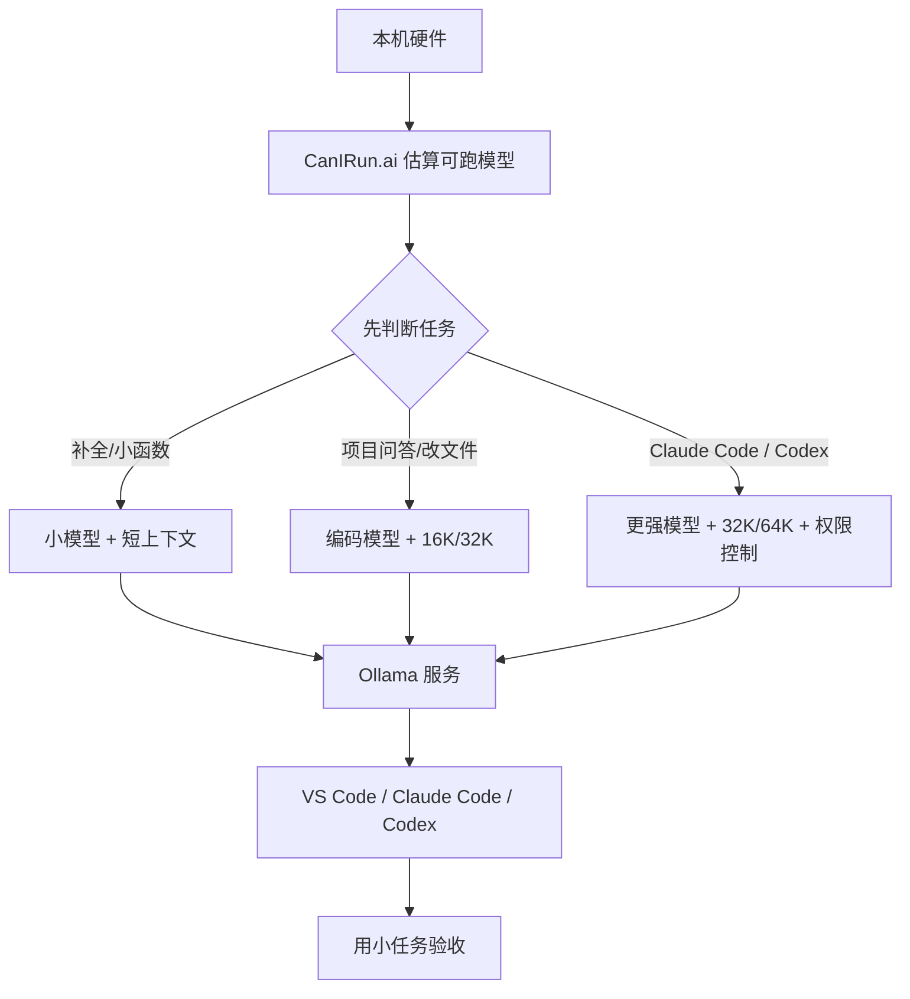

配本地 AI 编码助手，我现在最不建议的做法，就是打开 Ollama 以后直接搜一个最大模型下载。

这条路我踩过。

模型能跑起来，不代表能写代码。能写一个函数，不代表能进项目改文件。能在终端里回一句话，也不代表 Claude Code、Codex 这种 agent 工具能稳定读文件、调工具、跑命令。

真正影响体验的，往往不是“模型聪不聪明”这一个点，而是四件事有没有对齐：

- 机器到底能撑多大的模型
- 上下文开到多少不会把机器拖死
- Ollama 的 API 是不是稳定可访问
- VS Code、Claude Code、Codex 的配置是不是可复现

所以这篇按我自己实际会走的顺序写：先去 [CanIRun.ai](https://www.canirun.ai/) 看硬件边界，再用 [Ollama](https://docs.ollama.com/) 把模型服务跑起来，最后接 VS Code、Claude Code、Codex。

中间会留截图位置。你自己配的时候，把关键截图补上，这篇文章的说服力会比纯命令教程高很多。

## 先说我现在的判断

本地 AI 编码助手不是越大越好。

更准确地说，第一阶段应该先追求“能稳定干活”，不是追求“参数最大”。

我一般把本地 AI 编码助手拆成这条链路：



这里有两个常见误区。

第一个误区是：模型越大，编码体验越好。

实际不一定。大模型一旦把显存或统一内存吃满，速度会先崩。编码助手不是一次性问答，它会带仓库上下文、工具说明、历史消息、命令输出。一个能稳定 32K 上下文的小模型，很多时候比一个勉强跑起来的大模型更适合日常开发。

第二个误区是：本地模型就是免费。

云 API 账单确实少了，但你付的是另一种成本：等待时间、机器占用、上下文调参、模型选择、工具兼容性。尤其是 Claude Code、Codex 这种 agent 工具，模型只会聊天还不够，得能听懂工具调用和文件修改流程。

所以我现在的做法很简单：

**先用小任务跑稳，再往更大的模型和更长的上下文加。**

## 第 0 步：先用 CanIRun.ai 看硬件边界

打开：

```text
https://www.canirun.ai/
```

我会先在这里看一遍机器能跑什么。CanIRun.ai 会根据浏览器能拿到的 GPU、VRAM、RAM、CPU 信息，给模型做兼容性估算。它不是最终跑分，但很适合做第一轮筛选。

### 图 1：CanIRun.ai 硬件识别结果


### 图 2：CanIRun.ai 推荐模型列表


我实际看 CanIRun.ai 时，不会只看“能不能跑”。我更关心这几个点：

| 字段       | 我会怎么看                                          |
| ---------- | --------------------------------------------------- |
| Task       | 做编码助手优先看 `code`，聊天模型先放后面           |
| 模型大小   | 不选贴着上限的，先选有余量的                        |
| Context    | 编码任务尽量从 16K、32K 往上看                      |
| 量化格式   | Q4 更适合先跑通，Q8/F16 更吃内存                    |
| 兼容性等级 | `Runs great` / `Runs well` 优先，`Tight fit` 先别碰 |

一个很实用的选择表：

| 机器情况            | 我会先试什么 | 适合做什么                     |
| ------------------- | ------------ | ------------------------------ |
| 16GB 内存普通笔记本 | 1.5B 到 8B   | 补全、小函数、解释代码         |
| 24GB 统一内存或显存 | 7B 到 20B    | 项目问答、小范围改文件         |
| 32GB 到 48GB        | 14B 到 32B   | 多文件修改、较长上下文         |
| 64GB 以上           | 32B+ 或 MoE  | agent 任务、长上下文、复杂重构 |

这里不要被参数量带着跑。

我更愿意先选一个跑得轻松的模型，把 VS Code、Claude Code、Codex 的链路全部跑通，再决定要不要换大模型。否则后面每一步出问题，你都分不清是模型太弱、上下文太短、配置错了，还是机器扛不住。

## 第 1 步：安装 Ollama，把本地服务跑起来

Ollama 在这套链路里的角色很简单：把本地模型变成一个服务。

默认地址通常是：

```text
http://localhost:11434
```

macOS 和 Windows 直接装 Ollama App。Linux 可以用官方脚本：

```bash
curl -fsSL https://ollama.com/install.sh | sh
```

装完先确认版本：

```bash
ollama -v
```

然后拉模型。这里用 `qwen3-coder` 举例，你实际要换成 CanIRun.ai 里更适合自己机器的模型：

```bash
ollama pull qwen3-coder
```

先跑一句最小测试：

```bash
ollama run qwen3-coder "写一个 TypeScript debounce 函数，只返回代码"
```

### 图 3：Ollama 模型下载和最小测试


接着看模型列表和运行状态：

```bash
ollama list
ollama ps
```

`ollama ps` 这一步我不会跳过。它能看到模型是否在跑、context 多少、processor 是什么。如果这里已经大量走 CPU，后面接 Claude Code、Codex 基本只会更慢。

### 图 4：`ollama ps` 运行状态


我的经验是：第一次别急着追 64K context。

先看模型在默认状态下能不能正常响应，`ollama ps` 里有没有严重 CPU offload，再往下调上下文。

## 第 2 步：上下文别一步拉满

聊天模型 4K 上下文还能凑合。

编码助手不行。

Ollama 的 [context length 文档](https://docs.ollama.com/context-length)里建议 coding tools、agents、web search 这类任务至少 64K tokens，同时也提醒要用 `ollama ps` 检查 context 和 CPU offload。

但我的实际做法不是一上来就 64K。

我会先按任务分：

| 场景                           | 我会先设多少                 |
| ------------------------------ | ---------------------------- |
| 补全、小函数、解释单文件       | 4K 到 8K                     |
| 项目问答、小范围改文件         | 16K 到 32K                   |
| Claude Code / Codex agent 任务 | 32K 到 64K                   |
| 大仓库重构、长日志分析         | 64K 起步，但要看机器能不能扛 |

CLI 方式可以这样启动：

```bash
OLLAMA_CONTEXT_LENGTH=64000 ollama serve
```

Linux systemd 可以写 override：

```bash
sudo systemctl edit ollama
```

填入：

```ini
[Service]
Environment="OLLAMA_CONTEXT_LENGTH=64000"
```

然后重启：

```bash
sudo systemctl daemon-reload
sudo systemctl restart ollama
ollama ps
```

更稳的做法，是给模型单独做一个 Modelfile。这样 VS Code、Claude Code、Codex 都填同一个模型名，不用在每个客户端里分别猜 context。

```text
FROM qwen3-coder
PARAMETER num_ctx 32768
```

创建：

```bash
ollama create qwen3-coder-32k -f Modelfile
```

## 第 3 步：先测 API，再配 IDE

这一步很重要。

不要一上来就在 VS Code、Claude Code、Codex 里排错。先确认 Ollama 的 API 本身能通。

Ollama 支持 OpenAI-compatible API，base URL 是：

```text
http://localhost:11434/v1/
```

先测模型列表：

```bash
curl http://localhost:11434/v1/models
```

再测 chat completions：

```bash
curl http://localhost:11434/v1/chat/completions \
  -H "Content-Type: application/json" \
  -d '{
    "model": "qwen3-coder-32k",
    "messages": [
      {
        "role": "user",
        "content": "写一个 TypeScript debounce 函数，只给代码"
      }
    ],
    "stream": false
  }'
```

### 图 6：Ollama OpenAI-compatible API 测试


如果这一步不通，先别碰 IDE。

我会按这个顺序查：

1. `ollama list` 里有没有这个模型名
2. `ollama ps` 里模型有没有启动
3. `curl http://localhost:11434/v1/models` 能不能返回
4. 模型名是不是和配置里完全一致

很多所谓“VS Code 插件连不上”“Codex 不工作”，最后都是模型名写错或者 `/v1` 漏了。

## 第 4 步：VS Code 先用 Continue，把配置落到文件

VS Code 现在可以通过 Copilot Chat 的模型选择器接 Ollama。Ollama 官方 VS Code 集成页写了几个前提：Ollama v0.18.3+、VS Code 1.113+、GitHub Copilot Chat 0.41.0+。

最快命令：

```bash
ollama launch vscode
```

如果只是想体验，这条路够了。

但我更喜欢把配置写到文件里。原因很简单：换机器、排错、分享配置，都更方便。

Continue 的配置文件是：

```text
~/.continue/config.yaml
```

我一般会把补全模型和聊天模型拆开。小模型负责 autocomplete，大一点的编码模型负责 chat/edit/apply：

```yaml
name: Local Coding
version: 0.0.1
schema: v1

models:
  - name: Qwen3 Coder 32K
    provider: ollama
    model: qwen3-coder-32k
    roles:
      - chat
      - edit
      - apply
    defaultCompletionOptions:
      temperature: 0.2

  - name: Qwen2.5 Coder Autocomplete
    provider: ollama
    model: qwen2.5-coder:1.5b-base
    roles:
      - autocomplete
    defaultCompletionOptions:
      temperature: 0.1

  - name: Nomic Embed Text
    provider: ollama
    model: nomic-embed-text
    roles:
      - embed
```

远程 Ollama 这样写：

```yaml
models:
  - name: Qwen3 Coder Remote
    provider: ollama
    model: qwen3-coder-32k
    apiBase: http://192.168.1.20:11434
    roles:
      - chat
      - edit
      - apply
```

## 第 4.5 步：GitLens 也可以接 Ollama 生成提交信息

IDE 里还有一个很适合本地模型的场景：生成 commit message。

这个任务不一定需要最强的云模型。它看的是 staged diff，输出的是一两行提交说明。对隐私更敏感的项目，我反而更愿意让它走本地 Ollama。因为 commit message 生成器要读的就是你这次改了什么，本质上还是代码 diff。

GitLens 的 AI 设置里已经有 Ollama 入口。官方设置里能看到这些关键项：

- `gitlens.ai.enabled`
- `gitlens.ai.model`
- `gitlens.ai.ollama.url`
- `gitlens.ai.modelOptions.temperature`
- `gitlens.ai.generateCommits.customInstructions`

我的配置思路是：模型仍然用前面创建好的 `qwen3-coder-32k`，Ollama URL 指到本机 `11434`，再把输出格式限制成 Conventional Commit。

VS Code 的 `settings.json` 可以这样写：

```json
{
  "gitlens.ai.enabled": true,
  "gitlens.ai.model": "ollama:qwen3-coder-32k",
  "gitlens.ai.ollama.url": "http://localhost:11434",
  "gitlens.ai.modelOptions.temperature": 0.2,
  "gitlens.ai.generateCommits.customInstructions": "请根据 staged diff 生成中文 Conventional Commit。第一行格式为 type(scope): summary，不超过 72 个字符；必要时补 1-3 条正文说明；不要编造没有出现在 diff 里的改动。"
}
```

然后按这个顺序试：

1. 先 stage 一两个文件，不要一上来全量提交
2. 打开 Command Palette
3. 执行 `GitLens: Generate Commit Message (Experimental)`
4. 看生成的 commit message 有没有准确命中 diff

### 图 8：GitLens 使用 Ollama 生成提交信息


这张图就很适合放在这里。它证明本地模型不是只能在聊天框里回答问题，也能接到 IDE 的具体开发动作里。

我实际会这样验收：先故意 stage 一个很小的修改，比如只改 README 或只改一个按钮文案。如果 GitLens 能生成准确的提交信息，再拿真实业务 diff 去试。不要一上来就丢 20 个文件的 diff，否则模型写得泛，很难判断是模型问题还是输入太乱。

这里还有一个版本坑：GitLens 的 AI 功能和 UI 入口可能会随着版本、账号套餐变化。如果你在界面里找不到按钮，就直接进 VS Code `settings.json` 搜 `gitlens.ai`，或者用命令面板搜 `Generate Commit Message`。

## 第 5 步：Claude Code 走 Anthropic-compatible API

Claude Code 是 Anthropic 的 agentic coding tool。Ollama 现在提供 Anthropic-compatible API，所以可以把 Claude Code 请求转到本地 Ollama。

最快路径：

```bash
ollama launch claude
```

指定模型：

```bash
ollama launch claude --model glm-4.7-flash
```

只写配置、不启动：

```bash
ollama launch claude --config
```

如果手动配，核心是这几个环境变量：

```bash
export ANTHROPIC_AUTH_TOKEN=ollama
export ANTHROPIC_API_KEY=""
export ANTHROPIC_BASE_URL=http://localhost:11434
```

然后启动：

```bash
claude --model glm-4.7-flash
```

长期使用可以写到：

```text
~/.claude/settings.json
```

示例：

```json
{
  "model": "glm-4.7-flash",
  "env": {
    "ANTHROPIC_AUTH_TOKEN": "ollama",
    "ANTHROPIC_API_KEY": "",
    "ANTHROPIC_BASE_URL": "http://localhost:11434",
    "CLAUDE_CODE_DISABLE_NONESSENTIAL_TRAFFIC": "1"
  },
  "permissions": {
    "deny": ["Read(./.env)", "Read(./.env.*)", "Read(./secrets/**)"],
    "ask": ["Bash(git push:*)", "Bash(rm:*)", "Bash(sudo:*)", "Bash(curl:*)"]
  }
}
```

项目规则写到：

```text
项目目录/CLAUDE.md
```

可以先放一个短版本：

```md
# Project Rules

- Read the relevant code before editing.
- Keep changes scoped to the current request.
- Do not edit unrelated files.
- Prefer `rg` for search.
- Run the narrowest relevant test after code changes.
- Never read `.env`, private keys, tokens, or credential files.
```

### 图 9：Claude Code 使用本地 Ollama


这里我会特别看一个现象：它是不是只会解释，不会行动。

如果 Claude Code 能正常回答，但一让它改文件就开始绕圈，优先怀疑模型不适合 agent 工具调用，或者上下文太短。先换 Ollama Claude Code 集成页推荐的模型试一次，比如 `glm-4.7-flash` 或云端模型。能工作以后，再回头试本地小模型。

## 第 6 步：Codex 用 profile 固定配置

Codex CLI 也可以通过 Ollama 跑本地模型。

安装：

```bash
npm install -g @openai/codex
```

最快路径：

```bash
ollama launch codex
```

只写配置、不启动：

```bash
ollama launch codex --config
```

手动临时跑：

```bash
codex --oss -m qwen3-coder-32k
```

长期用我建议写 profile。配置文件在：

```text
~/.codex/config.toml
```

示例：

```toml
[model_providers.ollama-local]
name = "Ollama"
base_url = "http://localhost:11434/v1"

[profiles.ollama-local]
model = "qwen3-coder-32k"
model_provider = "ollama-local"

[profiles.ollama-small]
model = "gpt-oss:20b"
model_provider = "ollama-local"
```

启动：

```bash
codex --profile ollama-local
```

远程 Ollama：

```toml
[model_providers.ollama-remote]
name = "Ollama Remote"
base_url = "http://192.168.1.20:11434/v1"

[profiles.ollama-remote]
model = "qwen3-coder-32k"
model_provider = "ollama-remote"
```

项目规则写到：

```text
项目目录/AGENTS.md
```

示例：

```md
# Agent Rules

- Read code before editing.
- Keep changes small and reviewable.
- Do not revert unrelated changes.
- Use `rg` before broad file reads.
- Run formatting and tests when touching code.
- Do not read `.env`, tokens, private keys, or credential files.
```

### 图 10：Codex profile 和本地模型启动


Codex 这里最容易错的是 `base_url`。

一定要带 `/v1`：

```toml
base_url = "http://localhost:11434/v1"
```

Claude Code 看 `CLAUDE.md`，Codex 看 `AGENTS.md`。两个文件规则可以一致，但文件名最好分开，这样每个工具都能读到自己的项目约束。

## 我会怎么验收这套本地 AI 编码助手

配置完以后，我不会马上让它“重构整个项目”。

先跑三个小任务。

第一个，只读仓库：

```text
读一下这个项目的 package.json 和目录结构，告诉我本地怎么启动。不要改文件。
```

第二个，改一个很小的点：

```text
把首页某个按钮文案改一下，只改必要文件，改完告诉我改了哪里。
```

第三个，让它跑命令：

```text
找出这个项目的 lint/test 命令，先不要修代码，跑完把失败原因说清楚。
```

### 图 11：本地 AI 编码助手完成一个小任务


这三步能过，才说明模型、上下文、工具调用、权限和文件写入基本正常。

如果第一步读不清项目结构，多半是上下文或工具配置有问题。如果第二步能说不能改，可能是模型不适合 agent。如果第三步跑命令乱来，先收紧权限，不要急着给它更大自由。

## 配置速查表

这张表可以直接当排错入口：

| 工具               | 配置文件                               | API 类型             | 最容易错的地方                       |
| ------------------ | -------------------------------------- | -------------------- | ------------------------------------ |
| Ollama             | systemd/env/Modelfile                  | 本地服务             | context 太长导致 CPU offload         |
| VS Code + Continue | `~/.continue/config.yaml`              | Ollama provider      | 模型名和 `ollama list` 不一致        |
| Claude Code        | `~/.claude/settings.json`、`CLAUDE.md` | Anthropic-compatible | 环境变量没生效，模型不擅长 tool call |
| Codex              | `~/.codex/config.toml`、`AGENTS.md`    | OpenAI-compatible    | profile 没选对，`base_url` 漏 `/v1`  |

我的建议是：context 尽量固化到 Modelfile，客户端只认模型名。配置越分散，后面排错越麻烦。

## 常见坑：我会按这个顺序排

### VS Code 里看不到模型

先查：

```bash
ollama list
curl http://localhost:11434/v1/models
```

模型不存在就先 `ollama pull`。Continue 里的 `model` 必须和 `ollama list` 输出一致。

### Claude Code 能回答，但不改文件

先别急着怀疑 Claude Code。

更可能是模型不适合 agent 工具调用，或者上下文太短。先用 Ollama 官方 Claude Code 页面推荐的模型试一次。如果推荐模型能工作，本地小模型不工作，问题基本就在模型能力。

### Codex 连不上 Ollama

先测 OpenAI-compatible API：

```bash
curl http://localhost:11434/v1/models
```

再检查 `~/.codex/config.toml` 里的 `base_url`：

```toml
base_url = "http://localhost:11434/v1"
```

不要漏掉 `/v1`。

### 一进项目就爆内存

先降上下文，再换小模型：

```text
FROM qwen3-coder
PARAMETER num_ctx 16384
```

然后：

```bash
ollama create qwen3-coder-16k -f Modelfile
```

能稳定改完一个小文件，比一个理论上 64K 但每次卡死的配置更有用。

### 远程 Ollama 连不上

先在客户端机器测：

```bash
curl http://远程IP:11434/v1/models
```

不通就查监听地址、防火墙、VPN、局域网路由。远程 Ollama 不要裸露到公网，至少放内网或 VPN 后面。

## FAQ

### 本地 AI 编码助手一定要 64K 上下文吗？

不一定。Claude Code、Codex 这类 agent 工具建议 32K 到 64K 起步，但小改动和补全没必要。上下文越大越吃资源，机器不够时先用 16K 或 32K 跑稳。

### CanIRun.ai 推荐的模型一定能跑吗？

不一定。它适合做硬件估算和模型筛选，但浏览器 API 识别到的硬件信息可能有偏差。最终还是要用 `ollama ps` 看实际 `PROCESSOR` 和 `CONTEXT`。

### VS Code、Claude Code、Codex 要不要都配？

不用一口气全配。日常写代码先配 VS Code/Continue；想要终端 agent 再配 Codex；需要 Claude Code 的交互体验再配 Claude Code。先跑通一条链路，比同时调三个工具更省时间。

### 本地模型能完全替代云模型吗？

不能这么理解。本地模型适合低风险、重复、隐私敏感、日常改文件的任务。复杂架构判断、跨仓库重构、线上事故分析，云模型仍然更稳。我的做法是本地处理日常任务，难题再切云端。

## 最后：这套东西真正解决的是可复现

最终你会得到这几类文件：

```text
~/.continue/config.yaml
~/.claude/settings.json
~/.codex/config.toml
项目目录/CLAUDE.md
项目目录/AGENTS.md
```

再加一个本机或局域网模型服务：

```text
http://localhost:11434
```

这套东西配完，不代表你拥有了一个无敌本地程序员。

更准确地说，你有了一条可复现、可排错、可替换模型的本地 AI 编码链路。模型不行就换模型，上下文不够就调 context，工具不稳就收敛权限，配置失效就回到文件查。

这比“下载一个最大模型，然后祈祷它聪明”靠谱得多。

## 参考资料

- [CanIRun.ai](https://www.canirun.ai/)
- [Ollama context length](https://docs.ollama.com/context-length)
- [Ollama OpenAI compatibility](https://docs.ollama.com/openai)
- [Ollama VS Code integration](https://docs.ollama.com/integrations/vscode)
- [Ollama Claude Code integration](https://docs.ollama.com/integrations/claude-code)
- [Ollama Codex CLI integration](https://docs.ollama.com/integrations/codex)

## Related Reading

- [一句 hi，为什么让 Codex 吃掉 14770 个输入 token：逐字段拆解一次真实请求](/blog/codex-hi-14770-input-tokens)
- [看完 claude code 源码，这几条少烧 token 的方法你一定要知道](/blog/claude-code-token-saving-must-know)
- [设计模式和管理能力，才是 AI Vibe Coding 时代真正的自救：AI 不会提醒你系统正在散架](/blog/design-patterns-and-management-self-rescue-in-ai-vibe-coding-era)
- [面试官：如何让 AI 稳定回复 JSON？](/blog/how-to-make-ai-return-stable-json)
