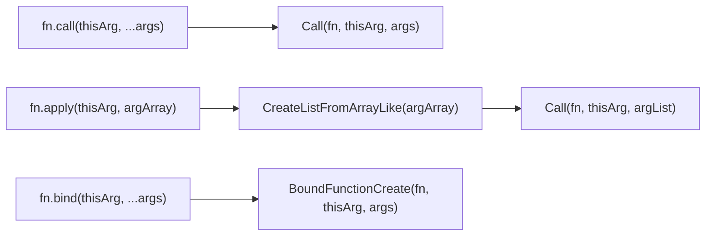
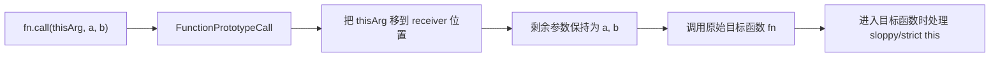
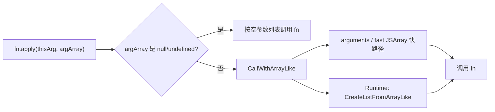
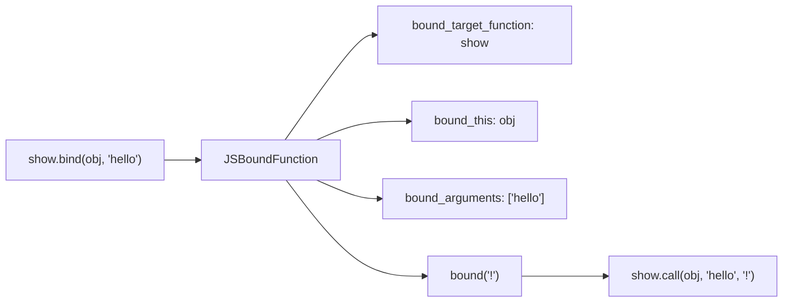
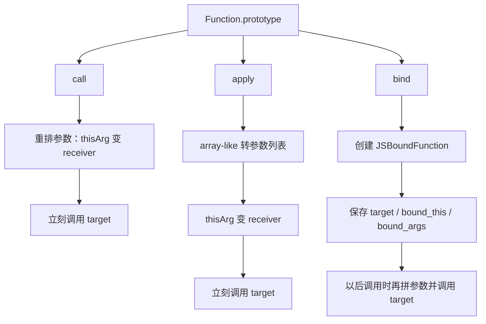

## 前言

`call`、`apply`、`bind`，容易踩坑的地方是：

1. `call(null)` 为什么有时是 `window`，有时又是 `null`？
2. `apply` 只是数组传参吗？为什么浏览器引擎里会有一堆 array-like 快路径？
3. `bind` 之后再 `call`，为什么第二次传入的 `this` 不生效？
4. 手写 `call/apply/bind` 到底能模拟到哪一步，哪里一定模拟不了？

文章参考的源码版本固定为：

```text
ECMAScript: tc39.es 当前 living draft，访问日期 2026-06-17
Chromium: 148.0.7778.178
commit: d096af1c9e98c45c3596e59620622b1a049bfecb
```

## 先看一道 this 输出题

假设下面代码在浏览器普通 `<script>` 里执行，不是 ES Module：

```js
globalThis.name = 'window';

function sloppy(label) {
  console.log(label, this && this.name, Object.prototype.toString.call(this));
}

function strictMode(label) {
  'use strict';
  console.log(label, this === null ? 'null' : this && this.name);
}

const obj = {
  name: 'obj',
};

const bound = sloppy.bind({ name: 'bound' }, 'bind-1');

sloppy.call(obj, 'call');
sloppy.apply('hi', ['apply']);
sloppy.call(null, 'null');
strictMode.call(null, 'strict-null');
bound.call({ name: 'again' }, 'bind-2');
```

输出大概是：

```text
call obj [object Object]
apply undefined [object String]
null window [object Window]
strict-null null
bind-1 bound [object Object]
```

这几个输出基本把重点都覆盖了：

1. `call(obj, 'call')` 把 `obj` 放到了函数执行时的 `this` 位置。
2. `apply('hi', ['apply'])` 的第一个参数是 `thisArg`，第二个参数会被拆成参数列表；非严格函数里，字符串基本类型会被包装成 `String` 对象。
3. `sloppy.call(null)` 在非严格函数里会把 `null/undefined` 转成全局对象。
4. `strictMode.call(null)` 不会转换，严格函数拿到的就是 `null`。
5. `bound.call(...)` 里的第二次 `this` 没有生效，因为 `bind` 创建出来的函数已经记住了第一次绑定的 `this`。

所以，“`this` 永远指向最后调用它的对象”这句话只能当成入门口诀。更准确的说法是：

**普通函数调用时，`this` 来自调用形式；`call/apply` 可以显式传入 receiver；`bind` 会提前把 receiver 固定到一个新函数里；箭头函数根本没有自己的 `this`。**

## 规范里 call、apply、bind 做了什么

ECMAScript 规范图：



三个方法的核心差异非常明确：

1. `call`：把第二个及后面的参数当成参数列表，立刻调用目标函数。
2. `apply`：把第二个参数当成类数组对象，先转换成参数列表，再立刻调用目标函数。
3. `bind`：不立刻调用，而是创建一个新的 Bound Function。

有一个非常关键但经常被忽略的细节：

**规范里的 `call/apply` 会把 `thisArg` 原样传给目标函数，`null` 变 `window`、基本类型变包装对象，不是 `call/apply` 自己做的，而是目标函数进入执行阶段时按函数类型处理的。**

也就是说：

```js
function sloppy() {
  console.log(this === globalThis);
}

function strictMode() {
  'use strict';
  console.log(this);
}

sloppy.call(null);
// true

strictMode.call(null);
// null
```

同一个 `thisArg`，进不同类型的函数，结果不一样。

## thisArg 的几个现代细节

以前我们常把 `thisArg` 分成四种情况：

1. 不传、`null`、`undefined`。
2. 传对象。
3. 传字符串、数字、布尔值。
4. 传函数。

今天更建议按“目标函数类型”来理解。

### 非严格普通函数会转换 this

```js
function show() {
  console.log(Object.prototype.toString.call(this));
}

show.call(1);
// [object Number]

show.call('hello');
// [object String]

show.call(null);
// 浏览器普通 script 中是 [object Window]
```

非严格函数进入执行时，会把 `null/undefined` 转成全局对象，把基本类型转成对应包装对象。

### 严格普通函数不转换 this

```js
function show() {
  'use strict';
  console.log(this);
}

show.call(1);
// 1

show.call(null);
// null
```

严格函数拿到什么就是什么。

这也是为什么只说“`call(null)` 指向 `window`”并不完整。这个结论只适用于非严格普通函数，在 ES Module、class 方法、现代构建产物里，经常并不是你以为的环境。

### 箭头函数不吃 call/apply/bind 的 this

```js
const obj = { name: 'obj' };

const arrow = () => {
  console.log(this);
};

arrow.call(obj);
```

箭头函数没有自己的 `this`，它的 `this` 来自定义时所在的词法作用域。`call/apply/bind` 传进去的 `thisArg` 不会变成箭头函数内部的 `this`。

所以在 React 函数组件、hooks、回调闭包大量使用之后，`bind` 的出场频率少了很多，不是它过时了，而是很多场景已经换成了词法 `this` 或者根本不需要 `this`。

### class 构造器不能被 call/apply 当普通函数调用

```js
class User {}

User.call({});
// TypeError: Class constructor User cannot be invoked without 'new'
```

`class` 的构造器只能通过 `new` 或 `Reflect.construct` 走构造路径。你可以把它理解成：它虽然长得像函数对象，但不能像 ES5 构造函数那样用 `call` 借调。

## 从 V8 看 call：本质是调整 receiver

在 Chromium 的 V8 里，`Function.prototype.call/apply/bind` 会在启动初始化阶段挂到 `Function.prototype` 上。

对应源码在 `v8/src/init/bootstrapper.cc`，大致会把：

```text
Function.prototype.apply -> FunctionPrototypeApply
Function.prototype.bind  -> FastFunctionPrototypeBind
Function.prototype.call  -> FunctionPrototypeCall
```

安装到函数原型上。

当你写：

```js
fn.call(thisArg, a, b);
```

引擎看到的不是“神秘改变 this”，而是一次栈参数重排。



`v8/src/builtins/x64/builtins-x64.cc` 里的 `Generate_FunctionPrototypeCall` 做的事情可以简化成：

1. 从参数里拿到真正要调用的函数，也就是 `fn`。
2. 把 `call` 自己这个调用壳去掉。
3. 如果没有传 `thisArg`，补一个 `undefined`。
4. 把第一个参数变成目标函数的 receiver。
5. 尾调用 V8 的通用函数调用入口。

这就是为什么：

```js
fn.call(obj, 1, 2);
```

等价于“以 `obj` 作为 receiver，调用 `fn(1, 2)`”。

真正处理 `null/undefined`、基本类型包装的地方，是后续 `CallFunction` 进入目标函数时的 receiver 转换逻辑。V8 会根据目标函数是不是 strict mode，决定是否把 receiver 转成全局代理对象或者包装对象。

所以 `call` 的本质不是“修改函数”，也不是“修改对象”，而是：

**在这一次调用里，把目标函数调用帧里的 receiver 换成你传入的值。**

## apply 为什么更像“参数展开器”

`apply` 和 `call` 的区别只在参数形态：

```js
fn.call(obj, 1, 2, 3);
fn.apply(obj, [1, 2, 3]);
```

规范里 `apply` 会先对第二个参数做 `CreateListFromArrayLike`，再调用目标函数。

V8 里也有一条很清晰的路径：



在 `v8/src/builtins/x64/builtins-x64.cc` 里，`Generate_FunctionPrototypeApply` 会先判断 `argArray` 是不是 `null/undefined`：

```js
fn.apply(obj, null);
fn.apply(obj, undefined);
```

这两种都会按空参数列表调用。

如果不是空值，就进入 `CallWithArrayLike`。在 `v8/src/builtins/builtins-call-gen.cc` 里，V8 会尝试识别一些常见快路径，比如：

1. `arguments` 对象。
2. 快速数组，也就是常见的 JSArray。
3. 其他 array-like 对象，再走运行时转换。

这解释了为什么 `apply` 不只是“第二个参数必须是数组”。更准确地说，它要的是 **array-like**：

```js
function sum(a, b, c) {
  return a + b + c;
}

const arrayLike = {
  0: 1,
  1: 2,
  2: 3,
  length: 3,
};

sum.apply(null, arrayLike);
// 6
```

但今天写业务代码时，很多 `apply` 场景已经可以被更直观的写法替代。

比如数组拼接：

```js
const arr1 = [1, 2, 3];
const arr2 = [4, 5, 6];

arr1.push(...arr2);
```

获取最大值：

```js
const numbers = [1, 4, 6, 2, 3, 100, 98];

Math.max(...numbers);
// 100
```

注意，`apply` 和展开语法都会把数组元素变成“函数参数”。数组非常大时，可能碰到引擎的参数数量限制。大数组求最大值，更稳的写法是：

```js
const max = numbers.reduce(
  (current, item) => Math.max(current, item),
  -Infinity,
);
```

所以这样判断：

1. 参数已经是普通数组，并且数量不大：优先用展开语法。
2. 参数是 array-like，或者你在写底层工具：`apply` 仍然有价值。
3. 大数组不要硬塞进函数参数列表，用循环或 `reduce`。

## bind：创建一个有记忆的函数

`call/apply` 是“立刻调用”，`bind` 是“先记住，以后再调用”。

```js
function show(prefix, suffix) {
  console.log(prefix, this.name, suffix);
}

const obj = { name: 'jacky' };

const bound = show.bind(obj, 'hello');

bound('!');
// hello jacky !
```

规范里，`bind` 会创建一个 Bound Function Exotic Object。它内部至少记住三件事：

```text
[[BoundTargetFunction]]  原始目标函数
[[BoundThis]]            第一次绑定的 this
[[BoundArguments]]       第一次预置的参数
```

V8 里也有对应的对象结构。在 `v8/src/objects/js-function.tq` 里，`JSBoundFunction` 保存了：

```text
bound_target_function
bound_this
bound_arguments
```

这就是 `bind` 的核心。



注意，这里说的是“类似于”，不是源码真的调用了一次 JS 层面的 `show.call(...)`。

在 `v8/src/builtins/x64/builtins-x64.cc` 里，`CallBoundFunctionImpl` 做的事情也很直接：

1. 把调用时的 receiver 替换成 `bound_this`。
2. 把 `bound_arguments` 插到当前参数前面。
3. 取出 `bound_target_function`。
4. 跳到通用调用入口继续执行。

所以多次 `bind` 时，第一次绑定的 `this` 会赢。

```js
function list(...args) {
  console.log(this.name, args);
}

const f = list.bind({ name: 'first' }, 1).bind({ name: 'second' }, 2);

f(3);
// first [1, 2, 3]
```

第二次 `bind` 不是完全没用，它预置的参数 `2` 生效了；只是第二次绑定的 `this` 没有机会覆盖第一次的 `this`。

可以这样理解：

```text
第二层 bound 函数：
  想用 this = second，参数 = [2, 3] 调用第一层 bound 函数

第一层 bound 函数：
  忽略传进来的 this，继续用自己记住的 first
  最终参数合并为 [1, 2, 3]
```

## bind 和 new 的关系

`bind` 还有一个经常被漏掉的点：绑定函数可以被 `new`。

```js
function Person(name) {
  this.name = name;
}

const BoundPerson = Person.bind({ name: 'ignored' }, 'jacky');

const person = new BoundPerson();

console.log(person.name);
// jacky

console.log(person instanceof Person);
// true
```

`new BoundPerson()` 时，`bind` 绑定的 `this` 会被忽略，因为构造调用要创建一个新实例作为 `this`。

规范里的 Bound Function 有自己的构造逻辑。V8 的 `ConstructBoundFunction` 也会处理两件事：

1. 把 `bound_arguments` 拼到构造参数前面。
2. 如果 `new.target` 是这个 bound function，就把 `new.target` 改回原始目标函数。

这就是为什么 `new BoundPerson()` 创建出来的对象仍然能和 `Person.prototype` 建立关系。

也因为这一层语义，手写 `bind` 想完全贴近原生行为并不简单。

## 手写之前，先知道模拟边界

很多文章会写一个 `myCall`：

```js
Function.prototype.myCall = function (thisArg, ...args) {
  if (typeof this !== 'function') {
    throw new TypeError('target must be callable');
  }

  const receiver = thisArg == null ? globalThis : Object(thisArg);
  const fnKey = Symbol('fn');

  receiver[fnKey] = this;

  try {
    return receiver[fnKey](...args);
  } finally {
    delete receiver[fnKey];
  }
};
```

这个写法适合理解“把函数临时挂到对象上，再通过对象方法调用，让 `this` 指向这个对象”。

但它不是原生 `call` 的完整模拟：

1. 严格函数里的 `null` 不应该被转成 `globalThis`。
2. 箭头函数没有自己的 `this`，你挂到对象上也改不了。
3. bound function 已经记住了 `this`，再次 `myCall` 也改不了。
4. 如果对象不可扩展，临时挂属性可能失败。
5. 原生调用不会真的往你的对象上塞一个属性。

`myApply` 可以沿用同一个思路，只是先把 array-like 转成参数列表：

```js
function toList(arrayLike) {
  if (arrayLike == null) return [];

  const object = Object(arrayLike);
  const length = Number(object.length) >>> 0;
  const result = [];

  for (let index = 0; index < length; index++) {
    result.push(object[index]);
  }

  return result;
}

Function.prototype.myApply = function (thisArg, argArray) {
  return this.myCall(thisArg, ...toList(argArray));
};
```

`myBind` 至少要考虑普通调用和构造调用：

```js
Function.prototype.myBind = function (thisArg, ...boundArgs) {
  if (typeof this !== 'function') {
    throw new TypeError('target must be callable');
  }

  const target = this;

  function bound(...args) {
    const isConstructCall = this instanceof bound;
    const receiver = isConstructCall ? this : thisArg;

    return target.apply(receiver, boundArgs.concat(args));
  }

  if (target.prototype) {
    bound.prototype = Object.create(target.prototype);
    Object.defineProperty(bound.prototype, 'constructor', {
      value: bound,
      writable: true,
      configurable: true,
    });
  }

  return bound;
};
```

这个版本能解释大部分日常现象，但依然不是完整 polyfill。原生 `bind` 还会处理 `length`、`name`、`prototype`、`new.target`、class constructor、内部槽等细节。V8 里甚至还有 `FastFunctionPrototypeBind`，专门在满足条件时走更快的创建路径。

所以手写实现最重要的价值不是“替代原生方法”，而是帮你理解这几个动作：

```text
call  -> 本次调用换 receiver
apply -> 本次调用换 receiver，并展开 array-like 参数
bind  -> 创建一个记住 target / this / args 的新函数
```

## 在 TypeScript 中怎么描述这种函数

前面讲的是运行时：`call/apply/bind` 都围绕 receiver 和参数列表展开。

到了 TypeScript 里，重点就变成了：**怎么把 receiver、参数列表和返回值都描述清楚**。

### 1. 用 this 参数描述 receiver

TypeScript 有一种专门的函数 `this` 参数语法：

```ts
type User = {
  name: string;
  age: number;
};

function greet(this: User, prefix: string, suffix: string) {
  return `${prefix}${this.name}${suffix}`;
}

greet.call({ name: 'jacky', age: 18 }, 'hello ', '!');
greet.apply({ name: 'jacky', age: 18 }, ['hello ', '!']);
```

这里的 `this: User` 不是运行时参数，编译成 JavaScript 后不会多出来一个参数。它只是告诉 TypeScript：

```text
这个函数被调用时，this 应该是 User 类型。
```

在 `strict` 模式下，TypeScript 会结合内置的 `CallableFunction.call/apply/bind` 类型检查参数。比如 `thisArg` 少了 `age`，或者参数数量不对，都会被提示。

```ts
greet.call({ name: 'jacky' }, 'hello ', '!');
// 类型报错：缺少 age

greet.call({ name: 'jacky', age: 18 }, 'hello ');
// 类型报错：缺少 suffix
```

这背后依赖的就是 TypeScript 标准库里的这些工具类型：

```ts
type ThisParameterType<T> = T extends (this: infer U, ...args: never) => any
  ? U
  : unknown;

type OmitThisParameter<T> =
  unknown extends ThisParameterType<T>
    ? T
    : T extends (...args: infer A) => infer R
      ? (...args: A) => R
      : T;
```

简单说：

1. `ThisParameterType<T>`：把函数里的 `this` 类型拿出来。
2. `OmitThisParameter<T>`：把函数类型里的 `this` 参数去掉，得到一个普通函数类型。

### 2. bind 之后，this 参数应该消失

来看一个例子：

```ts
type Greet = (this: User, prefix: string, suffix: string) => string;

type GreetThis = ThisParameterType<Greet>;
// User

type BoundGreet = OmitThisParameter<Greet>;
// (prefix: string, suffix: string) => string
```

这和运行时的 `bind` 是对应的：

```ts
const user: User = {
  name: 'jacky',
  age: 18,
};

const boundGreet = greet.bind(user);

boundGreet('hello ', '!');
```

`greet` 原本需要一个 `this: User`，但 `bind(user)` 之后，`this` 已经被提前固定了，所以返回的新函数只需要接收 `prefix` 和 `suffix`。

如果再预置一部分参数：

```ts
const sayHello = greet.bind(user, 'hello ');

sayHello('!');
// string
```

这个类型也能被推出来，因为 TypeScript 的 `bind` 类型定义里用了元组：

```ts
bind<T, A extends any[], B extends any[], R>(
  this: (this: T, ...args: [...A, ...B]) => R,
  thisArg: T,
  ...args: A
): (...args: B) => R;
```

可以看到，它把参数拆成了两段：

```text
A：bind 时提前绑定的参数
B：新函数调用时还需要传的参数
```

这和前面讲 V8 的 `bound_arguments` 是同一个思路，只是 TypeScript 在类型层面把它表达出来了。

### 3. 给 call/apply 写一个类型安全的工具函数

如果我们自己封装一个 `invoke`，不要直接写成：

```ts
function invoke(fn: Function, thisArg: any, args: any[]) {
  return fn.apply(thisArg, args);
}
```

这样写基本等于放弃类型检查。

更好的写法是把 `this`、参数列表、返回值都抽出来：

```ts
type FnWithThis<This, Args extends unknown[], Return> = (
  this: This,
  ...args: Args
) => Return;

function invoke<This, Args extends unknown[], Return>(
  fn: FnWithThis<This, Args, Return>,
  thisArg: This,
  ...args: Args
): Return {
  return fn.call(thisArg, ...args);
}

const result = invoke(greet, user, 'hello ', '!');
// result: string
```

这里的 `Args extends unknown[]` 很关键，它保留了参数列表的顺序和每一项类型。

也就是说，`call` 的运行时模型：

```text
fn.call(thisArg, arg1, arg2)
```

可以在 TypeScript 里表达成：

```text
This + Args + Return
```

这比单纯写 `Function`、`any[]` 要可靠很多。

### 4. 柯里化函数类型怎么写

`bind` 的“预置部分参数”很容易让人想到柯里化。

比如普通函数是：

```ts
type Add = (a: number, b: number, c: number) => number;
```

柯里化之后希望变成：

```ts
type CurriedAdd = (a: number) => (b: number) => (c: number) => number;
```

可以先写一个递归类型：

```ts
type CurryArgs<
  Args extends readonly unknown[],
  Return,
> = Args extends readonly [infer First, ...infer Rest]
  ? Rest['length'] extends 0
    ? (arg: First) => Return
    : (arg: First) => CurryArgs<Rest, Return>
  : Return;

type Curry<F extends (...args: any[]) => unknown> = F extends (
  ...args: infer Args
) => infer Return
  ? CurryArgs<Args, Return>
  : never;
```

然后使用：

```ts
type CurriedAdd = Curry<Add>;

const add: CurriedAdd = (a) => (b) => (c) => a + b + c;

add(1)(2)(3);
// 6
```

这个类型的核心还是“拆参数列表”：

```text
[a, b, c] -> a -> b -> c -> return
```

也就是把一次接收多个参数的函数，转换成每次只接收一个参数、逐步返回下一个函数。

如果要把 `this` 也纳入柯里化，可以先把 `thisArg` 当成第一层参数：

```ts
type CurryWithThis<F> = F extends (
  this: infer This,
  ...args: infer Args
) => infer Return
  ? (thisArg: This) => CurryArgs<Args, Return>
  : never;

type CurriedGreet = CurryWithThis<typeof greet>;

const curriedGreet: CurriedGreet = (thisArg) => (prefix) => (suffix) =>
  greet.call(thisArg, prefix, suffix);

curriedGreet({ name: 'jacky', age: 18 })('hello ')('!');
```

这个写法其实就是在类型层面表达：

```text
先确定 this
再一个个确定参数
最后调用原函数
```

不过这里也要注意边界：上面这个 `Curry` 是教学版，只处理“每次传一个参数”的普通函数。真实项目里如果要兼容可选参数、rest 参数、重载函数、一次传多个参数的 curry，类型会复杂很多。

所以我的建议是：

1. 写业务函数类型：优先把 `this` 参数、`Parameters<T>`、`ReturnType<T>` 用清楚。
2. 写 `bind/call/apply` 相关工具：尽量用元组类型保留参数列表，不要退化成 `any[]`。
3. 写柯里化类型：先处理最常见的固定参数函数，复杂场景可以用成熟工具库或单独封装。

## 今天还应该怎么用

### 1. 借用方法：仍然常用

```js
const toString = Object.prototype.toString;

toString.call(null);
// [object Null]

toString.call([]);
// [object Array]
```

判断数组时今天直接用 `Array.isArray()` 更清楚：

```js
Array.isArray([]);
// true
```

但 `Object.prototype.toString.call(value)` 仍然适合看一些内建对象的 `[[Class]]` 标签，比如 `Date`、`RegExp`、`Map`、`Set`。

### 2. 动态调用：优先考虑 Reflect.apply

如果你是在写工具函数，需要“传入函数、this、参数数组，然后调用”，今天可以直接用：

```js
function invoke(fn, receiver, args) {
  return Reflect.apply(fn, receiver, args);
}
```

`Reflect.apply(fn, receiver, args)` 比 `fn.apply(receiver, args)` 更像元编程 API：目标函数、receiver、参数列表都是显式的，不依赖 `fn` 自己有没有被改写过 `apply` 属性。

### 3. 回调 this 丢失：bind 仍然是答案之一

```js
class Page {
  constructor() {
    this.name = 'Page';
  }

  handleClick() {
    console.log(this.name);
  }
}

const page = new Page();
const handler = page.handleClick;

handler();
// this 丢失
```

解决方式可以是 `bind`：

```js
const handler = page.handleClick.bind(page);
handler();
// Page
```

也可以在 class field 或函数组件里用箭头函数、闭包等方式规避。现代 React 里我们很少再在 `render` 里写 `.bind(this)`，不是 `bind` 的原理变了，而是组件写法变了。

### 4. 继承：理解就好，业务里别迷恋

以前会用：

```js
function Animal(name) {
  this.name = name;
}

function Cat(name) {
  Animal.call(this, name);
}
```

这能继承实例属性，但不能自动继承原型方法。今天业务代码里，如果真需要类继承，直接用 `class extends` 更清楚：

```js
class Animal {
  constructor(name) {
    this.name = name;
  }
}

class Cat extends Animal {
  constructor(name) {
    super(name);
  }
}
```

不过 `Animal.call(this, name)` 仍然值得理解，因为它把“构造函数内部的 `this` 可以被显式指定”这件事讲得非常直观。

## 从源码再回到一句话

最后再把三者放到一张图里：



**`call` 是一次性指定 `this` 调用；`apply` 是一次性指定 `this` 并展开 array-like 调用；`bind` 是创建一个提前绑定 `this` 和部分参数的新函数。**

再往深一层：

1. `thisArg` 本身不会被 `call/apply` 神奇改造，真正的转换发生在目标函数进入执行时。
2. `apply` 的重点不是“数组”，而是“从 array-like 创建参数列表”。
3. `bind` 的重点不是“延迟执行”，而是“创建了带内部记忆的 Bound Function”。
4. 多次 `bind` 时，后续 `this` 覆盖不了前面的 `this`，但后续参数会继续追加。
5. 手写实现可以帮助理解调用模型，但不要把它当成原生语义的完整替代。

```text
receiver，也就是这一次调用里的 this。
```

## 参考规范和源码

规范：

1. [ECMAScript Function.prototype.call](https://tc39.es/ecma262/multipage/fundamental-objects.html#sec-function.prototype.call)
2. [ECMAScript Function.prototype.apply](https://tc39.es/ecma262/multipage/fundamental-objects.html#sec-function.prototype.apply)
3. [ECMAScript Function.prototype.bind](https://tc39.es/ecma262/multipage/fundamental-objects.html#sec-function.prototype.bind)
4. [ECMAScript Bound Function Exotic Objects](https://tc39.es/ecma262/multipage/ordinary-and-exotic-objects-behaviours.html#sec-bound-function-exotic-objects)

Chromium / V8 源码：

1. [v8/src/init/bootstrapper.cc](https://source.chromium.org/chromium/chromium/src/+/d096af1c9e98c45c3596e59620622b1a049bfecb:v8/src/init/bootstrapper.cc)
2. [v8/src/builtins/x64/builtins-x64.cc](https://source.chromium.org/chromium/chromium/src/+/d096af1c9e98c45c3596e59620622b1a049bfecb:v8/src/builtins/x64/builtins-x64.cc)
3. [v8/src/builtins/builtins-call-gen.cc](https://source.chromium.org/chromium/chromium/src/+/d096af1c9e98c45c3596e59620622b1a049bfecb:v8/src/builtins/builtins-call-gen.cc)
4. [v8/src/builtins/builtins-function.cc](https://source.chromium.org/chromium/chromium/src/+/d096af1c9e98c45c3596e59620622b1a049bfecb:v8/src/builtins/builtins-function.cc)
5. [v8/src/builtins/function.tq](https://source.chromium.org/chromium/chromium/src/+/d096af1c9e98c45c3596e59620622b1a049bfecb:v8/src/builtins/function.tq)
6. [v8/src/objects/js-function.tq](https://source.chromium.org/chromium/chromium/src/+/d096af1c9e98c45c3596e59620622b1a049bfecb:v8/src/objects/js-function.tq)
7. [v8/src/compiler/js-call-reducer.cc](https://source.chromium.org/chromium/chromium/src/+/d096af1c9e98c45c3596e59620622b1a049bfecb:v8/src/compiler/js-call-reducer.cc)
