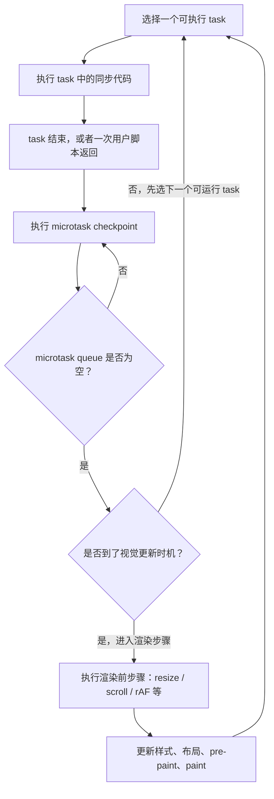
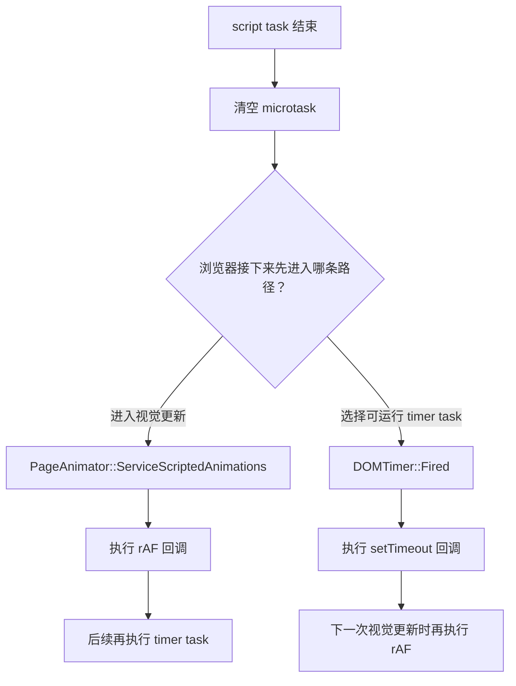
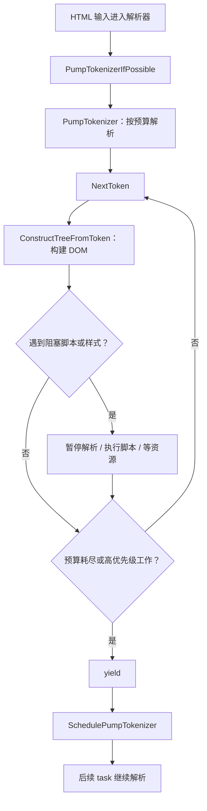
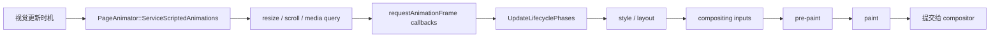
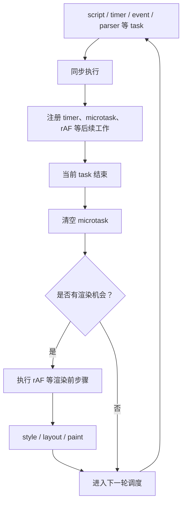

## 前言

最近重新梳理浏览器事件循环，发现很多文章最后都会落到输出题：

```text
宏任务、微任务、requestAnimationFrame、渲染，到底谁先？
```

输出题它适合检查基础概念。但如果只把事件循环背成“宏任务队列 + 微任务队列”，遇到 `requestAnimationFrame` 和渲染时机就很容易卡住。

我的思路：先看哪些输出是稳定的，再看 `timer` 和 `rAF` 为什么不一定谁先，最后结合 Chromium 源码解释背后的原因。

本文参考源码版本固定为：

```text
Chromium: 148.0.7778.178
commit: d096af1c9e98c45c3596e59620622b1a049bfecb
```

## 先看一道常见输出题

```js
async function run() {
  console.log('async start');
  await null;
  console.log('async end');
}

console.log('script start');

setTimeout(() => {
  console.log('timer');
}, 0);

Promise.resolve().then(() => {
  console.log('promise');
});

queueMicrotask(() => {
  console.log('queueMicrotask');
});

requestAnimationFrame(() => {
  console.log('rAF');
});

run();

console.log('script end');
```

稳定能确定的输出是：

```text
script start
async start
script end
promise
queueMicrotask
async end
```

那后面的 `timer` 和 `rAF` 呢？

这就是这道题真正有意思的地方：**`timer` 和 `rAF` 不一定谁先。**

也就是说，完整输出可能是情况一：

```text
script start
async start
script end
promise
queueMicrotask
async end
rAF
timer
```

也可能是情况二：

```text
script start
async start
script end
promise
queueMicrotask
async end
timer
rAF
```

前六行是稳定的，因为它们只涉及当前 script task 和 microtask checkpoint。后两行不稳定，因为它们涉及 timer task 和下一次渲染机会，而浏览器不是每轮事件循环都会渲染。

## 先给结论：什么时候情况一，什么时候情况二

先把结论放前面：

| 输出情况       | 常见触发条件                                                                                                                              | 可以怎么理解                     |
| -------------- | ----------------------------------------------------------------------------------------------------------------------------------------- | -------------------------------- |
| `rAF -> timer` | 当前 script task 和 microtask 清完后，浏览器正好进入下一次视觉更新；页面可见，下一帧需要更新，rAF 回调在渲染步骤里被执行                  | 浏览器先抓住这一帧的渲染机会     |
| `timer -> rAF` | 当前 task 结束时还没到下一帧，或者刚错过一帧；调度器先选择了已经到期的 timer task；页面后台、不可见、低刷新节奏、rAF 被节流时也更容易出现 | 浏览器先执行可运行的 timer task  |
| 只有前六行稳定 | 同步代码和 microtask 的顺序由当前 task 内的执行顺序决定                                                                                   | 这部分可以按事件循环规则稳定推出 |

更简单一点说：

- **microtask 清完后，浏览器马上进入本次渲染更新，就会先执行 `rAF`**，**再执行后续 timer task**。
- **microtask 清完后，还没到渲染机会，而 timer 已经可以运行，调度器就可能先执行 `timer`**。

所以这道题的正确答案不是背一个唯一输出，而是写成：

```text
前六行稳定：
script start
async start
script end
promise
queueMicrotask
async end

后两行不稳定：
rAF / timer 的相对顺序取决于浏览器是否先进入渲染机会
```

这也是事件循环容易被误解的地方：`requestAnimationFrame` 不是一个普通 timer，渲染也不是“每个宏任务后必定发生”的步骤。

## 为什么前六行稳定

首先，整体 script 本身就是一个 task。这个 task 里的同步代码会一直执行到结束，所以先输出：

```text
script start
async start
script end
```

中间遇到几个异步 API：

- `setTimeout`：注册一个后续 timer task。
- `Promise.then`：注册一个 microtask。
- `queueMicrotask`：注册一个 microtask。
- `await null`：`await` 后面的代码会作为后续 microtask 执行。
- `requestAnimationFrame`：注册下一次渲染前回调。

等当前 script task 结束，浏览器会执行 microtask checkpoint，于是依次输出：

```text
promise
queueMicrotask
async end
```

注意：`timer` 和 `rAF` 谁先，不应该用一句“rAF 一定在 timer 前”来记。`timer` 是后续 timer task，`rAF` 是下一次视觉更新前回调。它们的相对顺序和帧时机、页面状态、调度策略有关。

也就是说，这道题真正要掌握的不是最后两行谁先，而是：

```text
同步代码先跑完
当前 task 结束后清 microtask
清完 microtask 后，浏览器才可能进入下一次渲染或下一个 task
```

## 先建立一个直觉模型

我们先不要急着说“宏任务队列”和“微任务队列”，先看浏览器主线程上会发生什么：

- 执行 JS。
- 处理点击、输入、滚动等事件。
- 解析 HTML，构建 DOM。
- 计算样式和布局。
- 执行 `requestAnimationFrame`。
- 绘制页面。
- 执行 `setTimeout`、网络回调等异步任务。

这些工作大多都要占用主线程。主线程一次只能做一件事，所以浏览器需要一个调度机制：当前这段工作做完后，接下来做什么？

可以先记住这张简化图：



这张图有三个关键词：

- `task`：一段普通异步工作，比如整体 script、timer 回调、事件回调、解析器的一次继续解析。
- `microtask`：当前 task 结束后的收尾，比如 Promise reaction、`queueMicrotask`、`await` 后续。
- `rendering opportunity`：一次浏览器有机会更新页面的时机，不是每个 task 后都一定发生。

有了这张图，就能理解为什么 `rAF` 和 `timer` 不应该放到一个简单队列里比较。`timer` 等待的是“下一个可运行 task”，`rAF` 等待的是“下一次渲染步骤”。

## task：不可随便打断的工作

很多时候页面卡住，不是因为浏览器“不想渲染”，而是主线程还没空出来。

比如：

```js
box.textContent = 'loading...';

while (true) {
  // 长时间同步计算
}
```

`textContent` 已经修改了 DOM，但页面上可能一直看不到 `loading...`。原因是当前 JS task 没结束，浏览器没有机会进入 microtask checkpoint，也没有机会进入渲染更新。

在 Chromium 的 Blink [调度文档](https://source.chromium.org/chromium/chromium/src/+/d096af1c9e98c45c3596e59620622b1a049bfecb:third_party/blink/renderer/platform/scheduler/TaskSchedulingInBlink.md)里，也能看到这个实现思路。

文档里说，Blink 的主要调度单元是 task。task 是通过 `TaskRunner::PostTask` 或 `PostDelayedTask` 投递的 `base::OnceClosure`。更关键的是这句：

```text
At the moment Blink Scheduler treats tasks as an atomic unit
```

可以把它理解成：**task 一旦开始，调度器不会从中间把它切开。调度器只能等当前 task 结束后，再选择下一个可以执行的 task**。

所以平时写代码时，真正危险的是长 task：

```js
button.addEventListener('click', () => {
  heavyWork();
  updateDOM();
});
```

如果 `heavyWork()` 很久，用户输入、动画、渲染都会被拖住。解决思路通常不是换成 Promise，因为 Promise microtask 仍然会在当前收尾阶段清完，而是要把重活拆成多段 task，或者放到 Worker。

## microtask：当前 task 的收尾工作

再看 microtask。

```js
console.log('start');

setTimeout(() => {
  console.log('timer');
}, 0);

Promise.resolve().then(() => {
  console.log('promise');
});

queueMicrotask(() => {
  console.log('microtask');
});

console.log('end');
```

输出是：

```text
start
end
promise
microtask
timer
```

原因是：

1. `start` 和 `end` 是同步代码。
2. `Promise.then` 和 `queueMicrotask` 进入 microtask queue。
3. `setTimeout` 进入后续 timer task。
4. 当前 task 结束后，先清空 microtask queue。
5. microtask 清完后，才会轮到后续 task 或渲染机会。

再看一个容易错的：

```js
Promise.resolve().then(() => {
  console.log('promise1');

  queueMicrotask(() => {
    console.log('microtask in promise');
  });
});

Promise.resolve().then(() => {
  console.log('promise2');
});

setTimeout(() => {
  console.log('timer');
}, 0);
```

输出：

```text
promise1
promise2
microtask in promise
timer
```

`promise1` 里追加的 microtask 不会插到 `promise2` 前面，而是排到当前 microtask queue 的末尾。但它仍然会在本轮 checkpoint 里执行，因为 microtask 会一直清到空。

这也是下面代码会阻塞渲染的原因：

```js
box.textContent = 'loading...';

function loop() {
  queueMicrotask(loop);
}

loop();
```

它不是同步死循环，但效果依然很糟糕：microtask checkpoint 一直清不完，浏览器没有机会进入下一次 task，也没有机会进入渲染。

从源码看，Blink 的 `EventLoop` 主要负责 microtask，相关入口可以看 [`event_loop.h`](https://source.chromium.org/chromium/chromium/src/+/d096af1c9e98c45c3596e59620622b1a049bfecb:third_party/blink/renderer/platform/scheduler/public/event_loop.h) 和 [`event_loop.cc`](https://source.chromium.org/chromium/chromium/src/+/d096af1c9e98c45c3596e59620622b1a049bfecb:third_party/blink/renderer/platform/scheduler/common/event_loop.cc)。

`EventLoop::EnqueueMicrotask` 会把回调放进 `pending_microtasks_`，再投到 V8 的 `MicrotaskQueue`：

```cpp
void EventLoop::EnqueueMicrotask(base::OnceClosure task) {
  pending_microtasks_.push_back(std::move(task));
  microtask_queue_->EnqueueMicrotask(isolate_, &EventLoop::RunPendingMicrotask,
                                     this);
}
```

checkpoint 则会调用 V8：

```cpp
void EventLoop::PerformMicrotaskCheckpoint() {
  if (AreMicrotasksPaused() || ScriptForbiddenScope::IsScriptForbidden()) {
    return;
  }

  microtask_queue_->PerformCheckpoint(isolate_);
}
```

V8 侧的实现路径主要是 [`microtask-queue.cc`](https://source.chromium.org/chromium/chromium/src/+/d096af1c9e98c45c3596e59620622b1a049bfecb:v8/src/execution/microtask-queue.cc)、[`runtime-promise.cc`](https://source.chromium.org/chromium/chromium/src/+/d096af1c9e98c45c3596e59620622b1a049bfecb:v8/src/runtime/runtime-promise.cc) 和 [`promise-abstract-operations.tq`](https://source.chromium.org/chromium/chromium/src/+/d096af1c9e98c45c3596e59620622b1a049bfecb:v8/src/builtins/promise-abstract-operations.tq)。

Promise reaction job 会进入 microtask：

```cpp
EnqueueMicrotask(handlerContext, promiseReactionJobTask);
```

V8 的 `MicrotaskQueue::EnqueueMicrotask` 会把 microtask 放入 ring buffer：

```cpp
ring_buffer_[(start_ + size_) % capacity_] = microtask.ptr();
++size_;
```

执行时，`PerformCheckpointInternal` 会调用：

```cpp
RunMicrotasks(isolate);
```

`RunMicrotasks` 结束后有一个断言：

```cpp
DCHECK_EQ(0, size());
```

这正好对应我们前面说的：microtask checkpoint 会把队列清到空。

## await 本质是排队时机

`await` 经常让输出题变得绕。我们看一个简单例子：

```js
async function foo() {
  console.log('foo start');
  await 1;
  console.log('foo end');
}

Promise.resolve().then(() => {
  console.log('promise1');
});

foo();

Promise.resolve().then(() => {
  console.log('promise2');
});
```

输出是：

```text
foo start
promise1
foo end
promise2
```

关键在“排队时机”：

1. `promise1` 先进入 microtask queue。
2. 执行 `foo()`，同步输出 `foo start`。
3. 执行到 `await 1`，`foo end` 进入 microtask queue。
4. `promise2` 再进入 microtask queue。

所以顺序是：

```text
promise1 -> foo end -> promise2
```

把 `await` 理解成“后续代码进入 microtask”基本够用，但真正判断顺序时，要看执行到 `await` 的时间点。

## DOM 修改为什么不是马上绘制

容易把 DOM 修改和绘制混在一起。

```js
box.textContent = 'loading...';
box.style.width = '200px';
```

上面代码同步修改了 DOM/CSSOM 相关状态，但它不等于屏幕已经画出来。浏览器通常要等当前 task 结束、microtask 清空，并且到了视觉更新时机，才会进入样式、布局、绘制流程。

所以这个代码：

```js
box.textContent = 'loading...';

let i = 0;
while (i++ < 1_000_000_000) {}
```

页面不会先优雅地显示 `loading...`，然后再开始计算。因为渲染没法插到当前 task 中间。

如果你想让浏览器有机会先渲染，可以把后续重活让到下一轮：

```js
box.textContent = 'loading...';

setTimeout(() => {
  heavyWork();
}, 0);
```

更适合视觉更新的场景，可以用 `requestAnimationFrame`：

```js
requestAnimationFrame(() => {
  box.style.transform = 'translateX(100px)';
});
```

这段代码的意思不是“延迟 16ms 执行”，而是“等浏览器准备更新下一帧时执行”。

## setTimeout 和 requestAnimationFrame 的区别

`setTimeout` 和 `requestAnimationFrame` 经常被放在一起比较，但它们不是同一类东西。

### setTimeout 是 timer task

`setTimeout` 的 Blink 源码入口是 [`dom_timer.cc`](https://source.chromium.org/chromium/chromium/src/+/d096af1c9e98c45c3596e59620622b1a049bfecb:third_party/blink/renderer/core/scheduler/dom_timer.cc)。

简化后可以这样看：

```cpp
int DOMTimer::setTimeout(...) {
  auto* action = MakeGarbageCollected<ScheduledAction>(...);
  return MakeGarbageCollected<DOMTimer>(
      context, action, base::Milliseconds(timeout), true)->timeout_id_;
}
```

`DOMTimer` 构造时会根据 timeout 和嵌套层级选择 `TaskType`：

```cpp
TaskType task_type;
if (nesting_level_ > max_timer_nesting_level) {
  task_type = TaskType::kJavascriptTimerDelayedHighNesting;
} else if (timeout.is_zero()) {
  task_type = TaskType::kJavascriptTimerImmediate;
} else {
  task_type = TaskType::kJavascriptTimerDelayedLowNesting;
}
MoveToNewTaskRunner(context.GetTaskRunner(task_type));
```

等 timer 触发时，`DOMTimer::Fired()` 再执行回调：

```cpp
action->Execute(context);
```

所以 `setTimeout(fn, 0)` 不是马上执行，而是投递一个后续 timer task。

### requestAnimationFrame 是渲染前回调

`requestAnimationFrame` 的入口在 [`document.cc`](https://source.chromium.org/chromium/chromium/src/+/d096af1c9e98c45c3596e59620622b1a049bfecb:third_party/blink/renderer/core/dom/document.cc) 和 [`scripted_animation_controller.cc`](https://source.chromium.org/chromium/chromium/src/+/d096af1c9e98c45c3596e59620622b1a049bfecb:third_party/blink/renderer/core/dom/scripted_animation_controller.cc)。

`Document::RequestAnimationFrame` 会注册到 `ScriptedAnimationController`：

```cpp
int Document::RequestAnimationFrame(FrameCallback* callback) {
  return scripted_animation_controller_->RegisterFrameCallback(callback);
}
```

注册后会请求一次动画调度：

```cpp
CallbackId id = callback_collection_.RegisterFrameCallback(callback);
ScheduleAnimationIfNeeded();
```

后续真正执行 rAF 的地方在 [`page_animator.cc`](https://source.chromium.org/chromium/chromium/src/+/d096af1c9e98c45c3596e59620622b1a049bfecb:third_party/blink/renderer/core/page/page_animator.cc)。

`PageAnimator::ServiceScriptedAnimations()` 会按 HTML event loop rendering steps 执行 resize、scroll、media query、动画事件等步骤，然后执行 animation frame callbacks：

```cpp
active_controllers[i]->ExecuteFrameCallbacks();
```

把两条源码路径放在一起看，就能解释前面输出题的两种情况：



### 情况一：为什么会先 rAF 后 timer

如果当前 script task 和 microtask 清完以后，浏览器已经到了下一次视觉更新时机，那么调度会进入 rendering steps。这个时候 `PageAnimator::ServiceScriptedAnimations()` 会执行 animation frame callbacks，所以先输出：

```text
rAF
```

等这次渲染相关步骤结束，后续 timer task 再被调度到，就输出：

```text
timer
```

这种情况常见于页面可见、浏览器准备提交下一帧、当前 task 没有错过这次帧时机的时候。

### 情况二：为什么会先 timer 后 rAF

如果当前 script task 和 microtask 清完以后，还没到下一次视觉更新时机，或者刚错过这一帧，那么浏览器可以继续选择下一个可运行 task。`setTimeout(fn, 0)` 虽然不是马上执行，但它可能已经变成一个可运行的 timer task。

这个时候先进入 `DOMTimer::Fired()`，于是先输出：

```text
timer
```

等下一次视觉更新真的到来，`requestAnimationFrame` 回调再被 `PageAnimator::ServiceScriptedAnimations()` 执行，于是后输出：

```text
rAF
```

这种情况在页面刚错过一帧、当前设备刷新节奏较慢、页面后台或 rAF 被节流时更容易出现。

所以，`setTimeout(fn, 0)` 和 `requestAnimationFrame(fn)` 的问题，不是“谁在队列前面”，而是“当前 microtask 清完后，浏览器先选择普通 task，还是先进入一次视觉更新”。

所以二者区别可以这样记：

| API                     | 进入哪里           | 适合做什么                 |
| ----------------------- | ------------------ | -------------------------- |
| `setTimeout(fn, 0)`     | 后续 timer task    | 让出当前 task，稍后再执行  |
| `queueMicrotask(fn)`    | 当前 task 后的收尾 | 状态收尾、异步结果统一处理 |
| `requestAnimationFrame` | 下一次渲染前回调   | 读取或修改视觉相关状态     |
| `requestIdleCallback`   | 空闲时间回调       | 低优先级、不着急的工作     |
| Worker                  | 主线程之外         | 大量计算                   |

因此，`timer` 和 `rAF` 谁先执行不能简单背答案。更准确的理解是：

- timer 等待调度器执行一个 timer task。
- rAF 等待浏览器进入下一次视觉更新。
- 如果这一帧已经错过，或者页面被节流，或者 timer task 先被调度到，顺序就可能变化。

## HTML 解析也参与事件循环

事件循环不只关心 JS 回调。页面加载时，HTML 解析器也在主线程上工作。

Blink HTML 解析器路径可以看 [`html_document_parser.cc`](https://source.chromium.org/chromium/chromium/src/+/d096af1c9e98c45c3596e59620622b1a049bfecb:third_party/blink/renderer/core/html/parser/html_document_parser.cc)。

核心函数是 `HTMLDocumentParser::PumpTokenizerIfPossible()` 和 `HTMLDocumentParser::PumpTokenizer()`。源码注释说得很清楚：

```cpp
// This method is called synchronously, builds the HTML document up to
// the current budget, and optionally completes.
```

也就是说，解析器不是永远一口气把 HTML 全部解析完，而是在预算内解析一段。

在 `PumpTokenizer()` 里，它会取 token、构建 DOM：

```cpp
token = tokenizer_.NextToken(input_.Current());
ConstructTreeFromToken(atomic_html_token);
```

同时它会计算预算：

```cpp
base::TimeDelta timed_budget =
    GetTimedBudget(task_runner_state_->TimesYielded());
```

默认解析时间预算可以看到是 `10ms`：

```cpp
static const base::TimeDelta kDefaultParserBudgetValue =
    base::Milliseconds(10);
```

如果解析时间超过预算，或者调度器发现有高优先级工作，解析器会让路：

```cpp
should_yield = elapsed_time >= timed_budget;
should_yield |= scheduler_->ShouldYieldForHighPriorityWork();
```

然后外层会重新调度下一次解析：

```cpp
if (yielded) {
  SchedulePumpTokenizer(/*from_finish_append=*/false);
}
```

`SchedulePumpTokenizer()` 最后会把后续解析投递回 task runner：

```cpp
loading_task_runner_->PostDelayedTask(
    FROM_HERE,
    blink::BindOnce(&HTMLDocumentParser::DeferredPumpTokenizerIfPossible,
                    WrapPersistent(this), from_finish_append,
                    base::TimeTicks::Now()),
    delay);
```

流程可以画成这样：



这就能解释为什么页面加载时，HTML 解析、JS 执行和渲染并不是三个完全独立的过程。它们都要抢主线程，所以浏览器会尽量让解析器不要一直霸占主线程。

## 渲染更新到底做了什么

最后看渲染。`requestAnimationFrame` 回调执行完，不代表浏览器已经画完，它只是渲染步骤中的一环。

渲染生命周期核心在 [`local_frame_view.cc`](https://source.chromium.org/chromium/chromium/src/+/d096af1c9e98c45c3596e59620622b1a049bfecb:third_party/blink/renderer/core/frame/local_frame_view.cc)。

`LocalFrameView::UpdateAllLifecyclePhases()` 会把目标推进到 `DocumentLifecycle::kPaintClean`：

```cpp
bool updated = GetFrame().LocalFrameRoot().View()->UpdateLifecyclePhases(
    DocumentLifecycle::kPaintClean, reason);
```

继续看 `UpdateLifecyclePhasesInternal()`，核心流程包括：

```cpp
RunStyleAndLayoutLifecyclePhases(target_state);
RunCompositingInputsLifecyclePhase(target_state);
RunPrePaintLifecyclePhase(target_state);
RunPaintLifecyclePhase(PaintBenchmarkMode::kNormal);
```

简化成图：



这也是为什么 rAF 适合做视觉相关更新：

```js
requestAnimationFrame(() => {
  box.style.transform = 'translateX(100px)';
});
```

rAF 回调运行在渲染前段，回调里改样式后，后面的 style、layout、pre-paint、paint 还有机会把这次修改纳入当前帧。

但如果你在 rAF 里继续塞大量同步计算，它同样会拖慢这一帧：

```js
requestAnimationFrame(() => {
  heavyWork();
  box.style.transform = 'translateX(100px)';
});
```

rAF 不是性能免死金牌，它只是把代码放到了更贴近渲染的时机。

## 回到最开始：事件循环到底怎么记

到这里，我们可以把事件循环记成下面这套规则：

1. 当前 task 里的同步代码会先执行完。
2. task 运行中，浏览器不会随便从中间插入渲染。
3. task 结束后，会执行 microtask checkpoint。
4. microtask 会一直清到空，所以不要无限追加 microtask。
5. microtask 清完后，浏览器才可能进入渲染更新。
6. 渲染不是每轮都发生，取决于页面状态、帧时机和调度策略。
7. `requestAnimationFrame` 是渲染前回调，不是 timer。
8. HTML 解析、JS、样式布局、绘制都在主线程上协作，所以长任务会影响所有环节。

所以开头那道题的明确结论是：

```text
稳定部分：
script start
async start
script end
promise
queueMicrotask
async end
```

然后分两种情况：

```text
情况一：浏览器先进入视觉更新
rAF
timer
```

```text
情况二：浏览器先调度已可运行的 timer task
timer
rAF
```

也就是说，能稳定判断的是同步代码和 microtask；`rAF` 与 `timer` 的相对顺序，需要看 microtask 清完后浏览器先获得渲染机会，还是先执行下一个可运行 task。

用一张图总结：



## 写代码时怎么选

- 状态收尾、异步结果统一处理：用 `queueMicrotask` 或 Promise。
- 想让出当前 task，让浏览器有机会处理别的事：用 `setTimeout`、`MessageChannel` 或 `scheduler.postTask`。
- 视觉相关读写：优先考虑 `requestAnimationFrame`。
- 大量计算：拆分任务，或者放到 Worker。
- 页面加载阶段：少放同步阻塞脚本，避免长时间卡住 HTML 解析和首屏渲染。
- 不要用无限 microtask 链，它会比很多人想象中更容易饿死渲染。

## 总结

1. Blink scheduler 把 task 当成原子单元，task 执行中不会被随意打断。
2. `setTimeout` 在 Blink 里走 `DOMTimer` 和对应 `TaskType`，不是马上执行。
3. Blink `EventLoop` 主要管理 microtask，checkpoint 会走 V8 `MicrotaskQueue`。
4. V8 会把 microtask 跑到队列为空，因此 microtask 链过长会阻塞后续 task 和渲染。
5. HTML 解析器会按预算解析，必要时通过 `SchedulePumpTokenizer` 让路。
6. `requestAnimationFrame` 由 `ScriptedAnimationController` 注册，在 `PageAnimator::ServiceScriptedAnimations()` 的渲染步骤里执行。
7. rAF 之后还要经过 style、layout、pre-paint、paint，页面才真正更新。

**主线程一次只能做一件事，task 做完清 microtask，清完之后浏览器才有机会渲染或执行下一段工作**。

## 参考文章和源码

- [HTML Standard: Event loops](https://html.spec.whatwg.org/multipage/webappapis.html)
- [MDN: Microtasks guide](https://developer.mozilla.org/en-US/docs/Web/API/HTML_DOM_API/Microtask_guide/In_depth)
- [MDN: requestAnimationFrame](https://developer.mozilla.org/en-US/docs/Web/API/Window/requestAnimationFrame)
- Chromium 源码版本：`148.0.7778.178`，commit：`d096af1c9e98c45c3596e59620622b1a049bfecb`
- [TaskSchedulingInBlink.md](https://source.chromium.org/chromium/chromium/src/+/d096af1c9e98c45c3596e59620622b1a049bfecb:third_party/blink/renderer/platform/scheduler/TaskSchedulingInBlink.md)
- [event_loop.h](https://source.chromium.org/chromium/chromium/src/+/d096af1c9e98c45c3596e59620622b1a049bfecb:third_party/blink/renderer/platform/scheduler/public/event_loop.h)
- [event_loop.cc](https://source.chromium.org/chromium/chromium/src/+/d096af1c9e98c45c3596e59620622b1a049bfecb:third_party/blink/renderer/platform/scheduler/common/event_loop.cc)
- [dom_timer.cc](https://source.chromium.org/chromium/chromium/src/+/d096af1c9e98c45c3596e59620622b1a049bfecb:third_party/blink/renderer/core/scheduler/dom_timer.cc)
- [html_document_parser.cc](https://source.chromium.org/chromium/chromium/src/+/d096af1c9e98c45c3596e59620622b1a049bfecb:third_party/blink/renderer/core/html/parser/html_document_parser.cc)
- [scripted_animation_controller.cc](https://source.chromium.org/chromium/chromium/src/+/d096af1c9e98c45c3596e59620622b1a049bfecb:third_party/blink/renderer/core/dom/scripted_animation_controller.cc)
- [page_animator.cc](https://source.chromium.org/chromium/chromium/src/+/d096af1c9e98c45c3596e59620622b1a049bfecb:third_party/blink/renderer/core/page/page_animator.cc)
- [local_frame_view.cc](https://source.chromium.org/chromium/chromium/src/+/d096af1c9e98c45c3596e59620622b1a049bfecb:third_party/blink/renderer/core/frame/local_frame_view.cc)
- [runtime-promise.cc](https://source.chromium.org/chromium/chromium/src/+/d096af1c9e98c45c3596e59620622b1a049bfecb:v8/src/runtime/runtime-promise.cc)
- [microtask-queue.cc](https://source.chromium.org/chromium/chromium/src/+/d096af1c9e98c45c3596e59620622b1a049bfecb:v8/src/execution/microtask-queue.cc)
- [promise-abstract-operations.tq](https://source.chromium.org/chromium/chromium/src/+/d096af1c9e98c45c3596e59620622b1a049bfecb:v8/src/builtins/promise-abstract-operations.tq)
