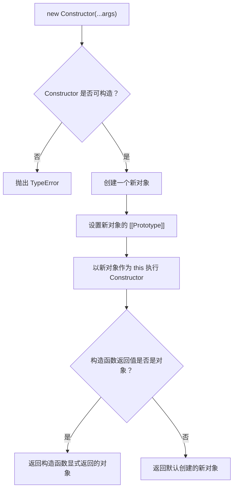
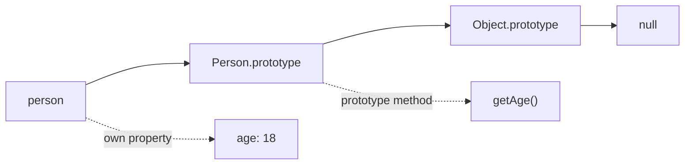

## 前言

最近重新回顾 JavaScript 原型链和构造函数，发现 `new` 是一个很适合拿来串知识点的运算符。

```js
const person = new Person(18);
```

背后同时涉及：

1. 对象是怎么创建出来的。
2. 实例为什么能访问构造函数原型上的方法。
3. 构造函数里的 `this` 为什么会指向实例。
4. 构造函数主动 `return` 时，最终结果到底取哪个。
5. 为什么手写 `new` 可以理解原理，但不能完全替代真正的 `new`。

## 从一个例子开始

首先来看一段最常见的代码：

```js
function Person(age) {
  this.age = age;
}

Person.prototype.getAge = function () {
  console.log('年龄为:' + this.age);
};

const person = new Person(18);

console.log(person.age);
// 18

person.getAge();
// 年龄为:18
```

可以看到，`person` 至少具备两个能力：

1. 可以访问构造函数 `Person` 内部通过 `this` 挂载的属性，比如 `age`。
2. 可以访问 `Person.prototype` 上的方法，比如 `getAge`。

**new 出来的实例，一方面拿到了构造函数里的实例属性，另一方面连上了构造函数的原型对象**。

接下来我们继续看几个返回值相关的例子。

## 构造函数没有 return 会发生什么

先看没有 `return` 的情况：

```js
function Person(age) {
  this.age = age;
}

const person = new Person(18);

console.log(person);
// Person { age: 18 }
```

从代码上看，`Person` 并没有显式返回任何值。

但 `new Person(18)` 最后还是得到了一个对象。这说明 `new` 在执行构造函数之前，已经先准备好了一个新对象。构造函数只是往这个对象上挂属性，最后如果构造函数没有主动返回对象，`new` 就会把这个新对象作为结果返回。

## 构造函数 return 对象会发生什么

如果构造函数主动返回一个对象呢？

```js
function Person(age) {
  this.age = age;

  return {
    name: '手动返回一个对象',
  };
}

const person = new Person(18);

console.log(person);
// { name: '手动返回一个对象' }

console.log(person.age);
// undefined
```

这个时候可以看到，`this.age = age` 确实执行了，但最终返回结果不是默认创建的实例对象，而是 `return` 后面的对象。

也就是说，**构造函数如果返回的是对象类型，这个对象会覆盖 new 默认创建的实例对象**。

这里的“对象类型”不只普通对象，也包括数组、函数等非原始值：

```js
function Person(age) {
  this.age = age;

  return function sayHi() {
    console.log('hi');
  };
}

const person = new Person(18);

console.log(typeof person);
// function
```

这点在手写实现时很重要，因为很多简单实现会只判断 `ret instanceof Object`，但更准确的判断应该是：返回值是否为非 `null` 的 object，或者 function。

## 构造函数 return 基本类型会发生什么

如果构造函数返回的是基本数据类型：

```js
function Person(age) {
  this.age = age;

  return 1;
}

const person = new Person(18);

console.log(person);
// Person { age: 18 }
```

可以看到，返回数字没有影响最终结果。`new` 依然返回默认创建的实例对象。

`null` 也一样：

```js
function Person(age) {
  this.age = age;

  return null;
}

const person = new Person(18);

console.log(person);
// Person { age: 18 }
```

虽然 `typeof null === 'object'`，但它不是一个真正可以作为实例结果返回的对象。实现时也需要把 `null` 排除掉。

`new` 的返回值规则：

| 构造函数返回值            | new 的最终结果             |
| ------------------------- | -------------------------- |
| 没有 `return`             | 返回默认创建的新对象       |
| `return` 基本类型         | 返回默认创建的新对象       |
| `return null`             | 返回默认创建的新对象       |
| `return` 普通对象、数组等 | 返回构造函数显式返回的对象 |
| `return` 函数             | 返回构造函数显式返回的函数 |

## new 到底做了什么

MDN 对 [`new`](https://developer.mozilla.org/en-US/docs/Web/JavaScript/Reference/Operators/new) 的描述可以概括为四步：

1. 创建一个空对象。
2. 把这个新对象的 `[[Prototype]]` 指向构造函数的 `prototype`。
3. 用这个新对象作为 `this` 执行构造函数。
4. 如果构造函数返回对象，则返回这个对象；否则返回第一步创建的新对象。

如果结合 ECMAScript 规范看，`new` 表达式大致会走到 [`EvaluateNew`](https://tc39.es/ecma262/multipage/ecmascript-language-expressions.html#sec-evaluatenew)：

```text
new Person(18)
```

可以拆成：

1. 先求出 `Person` 这个构造器。
2. 收集参数列表 `[18]`。
3. 判断 `Person` 是否是构造器，也就是是否具备 `[[Construct]]` 能力。
4. 调用 `Construct(Person, [18])`。

注意一个细节：**能被调用，不代表能被 new**。

比如箭头函数可以调用，但不能作为构造函数：

```js
const Person = () => {};

Person();
// 可以调用

new Person();
// TypeError: Person is not a constructor
```

所以，真正的 `new` 不是简单判断 `typeof Constructor === 'function'` 就完了。规范里会判断它有没有 `[[Construct]]` 这个内部方法。

不过我们平时手写模拟实现时，主要目标是理解普通构造函数的行为，不可能完全模拟所有内部槽和规范语义。

## 从流程图理解 new

一张图把流程串起来：



## 手搓实现

`new` 是关键字，不能直接覆盖。这里我们用 `create` 来模拟：

```js
function create() {
  const obj = new Object();
  const Constructor = [].shift.call(arguments);

  obj.__proto__ = Constructor.prototype;

  const result = Constructor.apply(obj, arguments);

  return result instanceof Object ? result : obj;
}
```

这版代码可以跑通最基本的例子：

```js
function Person(age) {
  this.age = age;
}

Person.prototype.getAge = function () {
  console.log('年龄为:' + this.age);
};

const person = create(Person, 18);

console.log(person.age);
// 18

person.getAge();
// 年龄为:18
```

1. `new Object()` 创建一个空对象。
2. `[].shift.call(arguments)` 取出第一个参数，也就是构造函数。
3. `obj.__proto__ = Constructor.prototype` 让实例能访问构造函数原型上的属性。
4. `Constructor.apply(obj, arguments)` 让构造函数里的 `this` 指向 `obj`。
5. 判断构造函数返回值，如果返回对象，就用返回对象；否则返回 `obj`。

这已经能说明 `new` 的核心思路了。

但这版实现有几个问题：

1. 直接使用 `__proto__` 不推荐。
2. `arguments` 可读性一般。
3. `result instanceof Object` 对跨 realm 对象不够稳，且表达意图不如直接判断类型。
4. 没处理 `Constructor.prototype` 不是对象的情况。
5. 没说明它和真正 `new` 的差距。

再优化一版。

## 更稳妥的模拟实现

先写一个工具函数，用来判断返回值是否可以作为对象结果：

```js
function isObject(value) {
  return (
    value !== null && (typeof value === 'object' || typeof value === 'function')
  );
}
```

然后实现 `create`：

```js
function create(Constructor, ...args) {
  if (typeof Constructor !== 'function') {
    throw new TypeError('Constructor must be a function');
  }

  const prototype = isObject(Constructor.prototype)
    ? Constructor.prototype
    : Object.prototype;

  const instance = Object.create(prototype);
  const result = Constructor.apply(instance, args);

  return isObject(result) ? result : instance;
}
```

这里改动主要有三点。

先用 `Object.create(prototype)` 创建对象。

`Object.create` 的作用就是创建一个新对象，并把这个新对象的原型指向传入对象。相比直接改 `__proto__`，这样更清晰。

再对 `Constructor.prototype` 做了兜底。

根据规范里的 [`OrdinaryCreateFromConstructor`](https://tc39.es/ecma262/multipage/ordinary-and-exotic-objects-behaviours.html#sec-ordinarycreatefromconstructor)，创建对象时会尝试从构造器的 `prototype` 属性上拿原型；如果这个值不是对象，就使用默认原型。

可以用代码验证：

```js
function Person(name) {
  this.name = name;
}

Person.prototype = 1;

const p = new Person('Jack');

console.log(Object.getPrototypeOf(p) === Object.prototype);
// true
```

所以模拟实现里也做了类似处理：

```js
const prototype = isObject(Constructor.prototype)
  ? Constructor.prototype
  : Object.prototype;
```

结尾，返回值判断不再用 `instanceof Object`。

更直接的判断是：

```js
value !== null && (typeof value === 'object' || typeof value === 'function');
```

这样可以覆盖普通对象、数组、函数，也可以排除 `null` 和基本类型。

## 测试一下手搓代码

### 没有 return

```js
function Person(age) {
  this.age = age;
}

const person = create(Person, 18);

console.log(person.age);
// 18

console.log(person instanceof Person);
// true
```

### return 对象

```js
function Person(age) {
  this.age = age;

  return {
    name: '手动返回对象',
  };
}

const person = create(Person, 18);

console.log(person);
// { name: '手动返回对象' }

console.log(person.age);
// undefined
```

### return 基本类型

```js
function Person(age) {
  this.age = age;

  return 1;
}

const person = create(Person, 18);

console.log(person.age);
// 18
```

### return 函数

```js
function Person(age) {
  this.age = age;

  return function sayHi() {
    console.log('hi');
  };
}

const person = create(Person, 18);

console.log(typeof person);
// function
```

## 为什么不建议用 `__proto__`

很多手写 `new` 的文章会这么写：

```js
obj.__proto__ = Constructor.prototype;
```

这行代码确实能把 `obj` 的原型指向 `Constructor.prototype`，它不适合作为推荐写法。

原因很简单：真正想表达的是“创建一个指定原型的新对象”，而不是“先创建一个对象，再修改它的原型”。从意图上看，`Object.create(Constructor.prototype)` 更直接。

也就是说：

```js
const instance = Object.create(Constructor.prototype);
```

比下面这样更适合出现在模拟实现里：

```js
const instance = {};
instance.__proto__ = Constructor.prototype;
```

更何况我们还需要处理 `Constructor.prototype` 不是对象的情况，所以最后写成：

```js
const prototype = isObject(Constructor.prototype)
  ? Constructor.prototype
  : Object.prototype;

const instance = Object.create(prototype);
```

这样读代码时，意图会更明确。

## new 和 Object.create 的区别

这两个 API 很容易放在一起，但它们不是一回事。

```js
const obj = Object.create(Person.prototype);
```

这行代码只做了一件事：创建一个新对象，并把它的原型指向 `Person.prototype`。

它不会执行 `Person` 构造函数。

也就是说：

```js
function Person(age) {
  this.age = age;
}

Person.prototype.getAge = function () {
  console.log(this.age);
};

const p1 = Object.create(Person.prototype);

console.log(p1.age);
// undefined

p1.getAge();
// undefined
```

而 `new Person(18)` 做得更多：

```js
const p2 = new Person(18);

console.log(p2.age);
// 18

p2.getAge();
// 18
```

所以可以简单记：

| 操作              | 是否创建对象 | 是否链接原型 | 是否执行构造函数 |
| ----------------- | ------------ | ------------ | ---------------- |
| `Object.create()` | 是           | 是           | 否               |
| `new`             | 是           | 是           | 是               |

手写 `new` 时使用 `Object.create`，只是借它完成“创建对象 + 链接原型”这一步。

## 模拟实现的边界

上面的 `create` 能帮助我们理解 `new` 的普通场景，但它并不是完整 polyfill。

接下来几个边界情况，反而更能帮助我们看清真正的 `new` 做了什么。

### 1. 箭头函数不能被 new

箭头函数没有自己的 `this`，也不能作为构造函数：

```js
const Person = () => {};

new Person();
// TypeError: Person is not a constructor
```

但上面手搓只判断了 `typeof Constructor === 'function'`。箭头函数也是 function，所以这一点无法完全模拟。

如果用 `create(Person)`，它不会和真实 `new Person()` 完全一致。

这是因为真正的 `new` 判断的是函数是否具备 `[[Construct]]` 内部方法，而不是简单判断类型。

### 2. class 构造函数不能直接 apply

```js
class Person {
  constructor(age) {
    this.age = age;
  }
}

const person = new Person(18);

console.log(person.age);
// 18
```

但如果用手搓的 `create`：

```js
create(Person, 18);
// TypeError: Class constructor Person cannot be invoked without 'new'
```

原因是 `class` 构造函数必须通过 `new` 调用，不能像普通函数一样通过 `apply` 调用。

这也是手写 `new` 的一个天然边界：**用 apply 只能模拟普通函数构造器，不能模拟 class 构造器的完整语义**。

### 3. new.target 无法被模拟出来

ES6 里可以通过 `new.target` 判断函数是普通调用，还是通过 `new` 调用：

```js
function Person(age) {
  console.log(new.target === Person);
  this.age = age;
}

new Person(18);
// true
```

但如果用 `create`：

```js
create(Person, 18);
// false
```

因为 `create` 里实际执行的是：

```js
Constructor.apply(instance, args);
```

这本质上还是一次普通函数调用，不会设置 `new.target`。

如果确实需要动态调用构造函数，并保留更接近 `new` 的语义，可以使用 [`Reflect.construct`](https://developer.mozilla.org/en-US/docs/Web/JavaScript/Reference/Global_Objects/Reflect/construct)：

```js
function Person(age) {
  console.log(new.target === Person);
  this.age = age;
}

const person = Reflect.construct(Person, [18]);
// true

console.log(person.age);
// 18
```

`Reflect.construct(Constructor, args)` 可以理解成函数形式的 `new Constructor(...args)`。

### 4. 内置对象可能有内部槽

再来看一个更容易忽略的例子：

```js
const date = new Date();

console.log(date instanceof Date);
// true

console.log(date.getTime());
// 正常返回时间戳
```

如果用上面手搓的 `create` 去模拟：

```js
const fakeDate = create(Date);

console.log(fakeDate instanceof Date);
// true

console.log(fakeDate.getTime());
// TypeError: this is not a Date object
```

这里看起来很反直觉：`fakeDate instanceof Date` 是 `true`，但 `getTime()` 依然报错。

原因是 `instanceof` 主要检查原型链，而真正的 `Date` 实例内部还有日期相关的内部槽。手动 `Object.create(Date.prototype)` 只能伪造原型链，不能创建这些引擎内部的数据结构。

所以，手写 `new` 最适合用来理解普通构造函数，不适合拿来模拟所有内置对象。

## new 和原型链的关系

```js
function Person(age) {
  this.age = age;
}

Person.prototype.getAge = function () {
  console.log(this.age);
};

const person = new Person(18);
```

这段代码执行完后，关系大概是：



所以：

```js
person.age;
```

先在 `person` 自身找，能找到 `age`。

而：

```js
person.getAge();
```

先在 `person` 自身找，找不到，再沿着原型链到 `Person.prototype` 上找，于是找到了 `getAge`。

这就是 `new` 和原型链之间的核心关系：**new 不会把原型方法复制到实例上，而是让实例通过原型链访问这些方法**。

## constructor 属性

真正发生的是：实例的 `[[Prototype]]` 指向了构造函数的 `prototype` 对象。而 `prototype` 对象上默认有一个 `constructor` 属性，指回构造函数。

比如：

```js
function Person() {}

const person = new Person();

console.log(person.constructor === Person);
// true
```

看起来像是 `person` 自己有 `constructor`，但其实不是：

```js
console.log(person.hasOwnProperty('constructor'));
// false

console.log(Person.prototype.hasOwnProperty('constructor'));
// true
```

也就是说，`person.constructor` 是沿着原型链找到的。

如果我们手动重写 `Person.prototype`：

```js
function Person() {}

Person.prototype = {
  getName() {},
};

const person = new Person();

console.log(person.constructor === Person);
// false
```

因为新的 `Person.prototype` 对象里没有手动补回 `constructor`。

通常会这样写：

```js
Person.prototype = {
  constructor: Person,
  getName() {},
};
```

所以，`new` 的关键不是设置实例的 `constructor`，而是设置实例的原型链。

## 最终版代码

最后把代码整理一下：

```js
function isObject(value) {
  return (
    value !== null && (typeof value === 'object' || typeof value === 'function')
  );
}

function create(Constructor, ...args) {
  if (typeof Constructor !== 'function') {
    throw new TypeError('Constructor must be a function');
  }

  const prototype = isObject(Constructor.prototype)
    ? Constructor.prototype
    : Object.prototype;

  const instance = Object.create(prototype);
  const result = Constructor.apply(instance, args);

  return isObject(result) ? result : instance;
}
```

这个版本可以覆盖普通构造函数下最核心的 `new` 行为：

1. 创建一个新对象。
2. 设置新对象的原型。
3. 绑定 `this` 执行构造函数。
4. 根据构造函数返回值决定最终结果。

但也要记住它的边界：

1. 不能完整判断一个函数是否具备 `[[Construct]]`。
2. 不能模拟 `class` 构造函数。
3. 不能模拟 `new.target`。
4. 不能创建内置对象需要的内部槽。
5. 不能替代真正的 `new`，只能作为学习原理的实现。

## 总结

`new` 的核心其实可以压缩成一句话：

> **创建一个新对象，把它连到构造函数的原型上，再用它作为 `this` 执行构造函数，最后根据构造函数返回值决定返回谁。**

但真正写模拟实现时，细节就会冒出来：

1. 原型链接不是复制方法，而是设置 `[[Prototype]]`。
2. 构造函数返回对象时，会覆盖默认创建的实例。
3. 返回基本类型和 `null` 时，会被忽略。
4. `__proto__` 可以帮助理解，但实现上更推荐 `Object.create`。
5. `instanceof Object` 不是最好的返回值判断方式。
6. 手写 `new` 理解普通函数构造器足够，但不要误以为它能覆盖 `class`、`new.target` 和所有内置对象。

## 参考文章和规范

- [MDN: new operator](https://developer.mozilla.org/en-US/docs/Web/JavaScript/Reference/Operators/new)
- [MDN: Reflect.construct()](https://developer.mozilla.org/en-US/docs/Web/JavaScript/Reference/Global_Objects/Reflect/construct)
- [MDN: new.target](https://developer.mozilla.org/en-US/docs/Web/JavaScript/Reference/Operators/new.target)
- [MDN: Object.create()](https://developer.mozilla.org/en-US/docs/Web/JavaScript/Reference/Global_Objects/Object/create)
- [ECMAScript: The new Operator](https://tc39.es/ecma262/multipage/ecmascript-language-expressions.html#sec-new-operator)
- [ECMAScript: OrdinaryCreateFromConstructor](https://tc39.es/ecma262/multipage/ordinary-and-exotic-objects-behaviours.html#sec-ordinarycreatefromconstructor)
- [ECMAScript: [[Construct]]](https://tc39.es/ecma262/multipage/ordinary-and-exotic-objects-behaviours.html#sec-ecmascript-function-objects-construct-argumentslist-newtarget)
