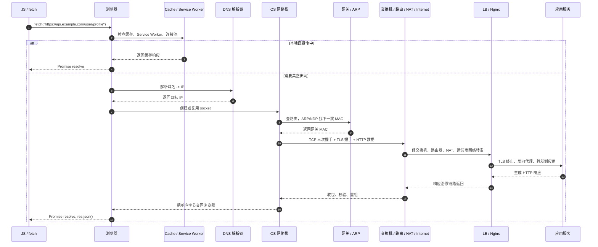
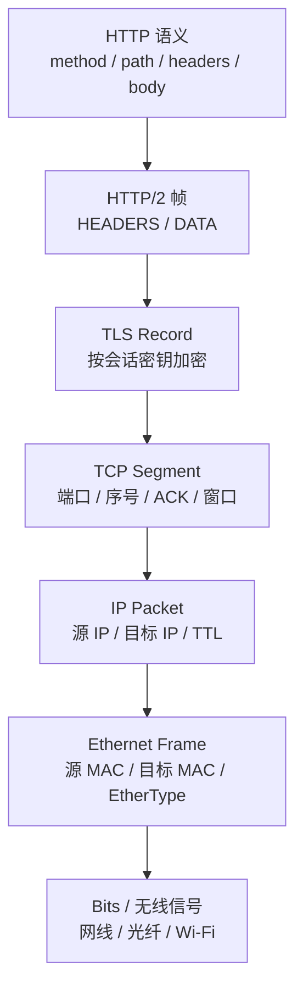

我以前老把 `fetch` 当成 HTTP 的别名。

代码里一句：

```ts
const res = await fetch('https://api.example.com/user/profile');
const data = await res.json();
```

直觉上很容易脑补成一句话：浏览器把一个 HTTP 请求发出去，服务端回一段 JSON，结束。

真把这条链路按时间顺序拆开之后，我就不太敢这么说了。

`fetch` 只是最上面那层 API。它下面先后要经过缓存判断、`Service Worker` 拦截、域名解析、路由决策、ARP 找下一跳、TCP 建连、TLS 协商、HTTP 编码、分段封装、网卡发包、中间设备转发、服务端拆包和应用处理，最后你才会在前端拿到一个 `200 OK`。

网络七层真正有用的地方，也是在这。
不是背表。是当你盯着一次真实请求时，知道每一层到底在什么时候出手。

## 先把主线钉死，不然文章会分叉得没法看

为了把整条链讲透，我先固定一个场景。下面都按这条主线说：

- 浏览器里第一次请求 `https://api.example.com/user/profile`
- 本地内存缓存、磁盘缓存、`Service Worker` 都没有直接命中
- 浏览器里也没有可复用的现成连接
- 目标最终协商成 `HTTP/2 over TLS 1.3 over TCP over IPv4 over Ethernet`
- 远端最先接住请求的不是业务代码，而是负载均衡或 Nginx 一类边界节点

如果你的页面命中了缓存，请求可能根本不会碰网卡。
如果浏览器已经有同域名连接，DNS、TCP、TLS 这些阶段也可能一个都不重来。
如果走的是 `HTTP/3`，传输层又会换成 `QUIC over UDP`。

所以我这里讲的是一条“冷启动、首次出网”的完整链。它最适合把七层落到实物上。

先看总图。



这张图里，真正容易被忽略的有三件事。

第一，请求发出之前，浏览器内部就已经做了一轮决策。
第二，DNS 不是“前置配置”，它自己也是一段网络流程。
第三，远端第一个接你的，通常不是业务服务，而是边界入口。

## 七层先别背，先看它在这条链里分别长什么样

如果把 OSI 七层硬映射到这次请求里，我会更愿意这么理解：

| OSI 层     | 这次请求里真正能对上的东西                       |
| ---------- | ------------------------------------------------ |
| 应用层     | URL、HTTP 方法、Header、Cookie、DNS 查询语义     |
| 表示层     | JSON、UTF-8、压缩、TLS 保护前后的数据表示        |
| 会话层     | TLS session、连接复用、HTTP/2 stream、认证上下文 |
| 传输层     | TCP 或 QUIC，端口、序号、重传、流控、拥塞控制    |
| 网络层     | IP 地址、路由、TTL、分片与 Path MTU              |
| 数据链路层 | Ethernet/Wi-Fi、MAC 地址、ARP/NDP、交换机转发    |
| 物理层     | 电信号、光信号、无线电波、网线、光纤、射频环境   |

现实工程不会真的摆着七个小抽屉给你看。

表示层和会话层，常常是散在 TLS、编码、连接复用、认证状态里的。
但用七层这把刀去切一次真实请求，还是很好用。你会知道“这一步到底是谁的事”。

## 浏览器先决定：这次请求到底用不用真的出网

`fetch()` 被调用之后，第一步不是“把包发出去”。

浏览器先要判断，这事有没有可能在本地就结束。

在这之前，它其实已经先把 URL 拆开了。协议是不是 `https`，host 是谁，端口是不是默认的 `443`，path 和 query 是什么，这些信息会决定后面走哪套协议、同源判断怎么算、连接池能不能复用同一个 origin。

最理想的情况，是内存缓存、磁盘缓存或者 `Service Worker` 直接把响应交回来。`Service Worker` 的 `fetch` 事件就能拦截请求，返回本地缓存、合成响应，或者自己决定要不要往下继续走网络。这也是为什么离线应用、PWA、接口 mock 能做得那么深。

再往下一层，是 HTTP 缓存。

这里有个很容易说糙的点。所谓“命中缓存”，不一定代表完全不出网。强缓存确实可能本地直接结束，但协商缓存会带着 `If-None-Match`、`If-Modified-Since` 再去问一次服务端，服务端回一个 `304 Not Modified`。从前端视角看，好像“资源还是从缓存来的”；从网络视角看，链路其实还是跑了一次，只是 body 不用重下。

浏览器还会看连接池。

如果同一个 origin 已经有可复用的连接，尤其是 `HTTP/2` 连接，新的请求可能直接挂到现成的 stream 上。你在 DevTools 里看到的 `DNS Lookup`、`Initial connection`、`SSL` 这几段，有时候全是空白，原因不是浏览器偷懒，而是这些成本在更早的时候已经付过了。比如 `<link rel="preconnect">`、浏览器预测性预连接、或者刚刚发过同站点别的请求。

还有一个常被漏掉的分支，是 CORS 预检。

如果这是跨域请求，而且方法、Header 或 `Content-Type` 触发了预检条件，浏览器会先额外发一个 `OPTIONS`。也就是说，你以为“页面就发了一次接口”，线上实际可能是两次。第一次在探路，第二次才是业务请求本体。

到这一步，七层里主要在动的是应用层和会话层。
HTTP 语义、缓存策略、连接复用、跨域约束，都还停留在浏览器和高层协议这里，离网卡其实还有一段距离。

## DNS 不是配角，它自己也是一整条链

只有当浏览器确认这次真得出网，它才会继续解决一个更基础的问题：`api.example.com` 到底对应哪个 IP。

这时候请别把 DNS 想成“查一下表”。真实过程通常是这样的：

1. 先看浏览器自己的 DNS 缓存。
2. 没命中，再看操作系统缓存。
3. 还没有，就把查询丢给本机 stub resolver 或配置好的本地 DNS 服务。
4. 本地 resolver 再去问递归解析器。
5. 递归解析器如果自己也没缓存，就顺着根域、顶级域、权威 DNS 一路问下去。
6. 最后把 `A` 记录、`AAAA` 记录、可能的 `CNAME` 链，以及对应 TTL 带回来。

这里有几个细节，真到排障时会很有感觉。

第一，DNS 返回的 IP，很多时候不是你脑子里想的“那台业务服务器”。
它可能是 CDN 边缘节点，可能是云负载均衡 VIP，可能是 Anycast 地址。也就是说，DNS 解决的经常不是“最终机器是谁”，而是“第一站该去哪儿”。

第二，DNS 自己也是网络流量。
传统场景里它常见走 `UDP/53`，响应太大或者特定场景会切到 `TCP/53`。如果你用的是 DoT 或 DoH，那么 DNS 查询本身甚至会再包进 TLS 或 HTTPS。换句话说，你发业务请求之前，系统很可能已经为了“查路”先发过另一轮网络请求了。

第三，返回 IPv4 还是 IPv6，也不是一句话。
现在很多系统会同时拿 `A` 和 `AAAA`，然后结合 Happy Eyeballs 之类的策略，尽量减少“IPv6 看起来可用但实际上很慢”的等待。你最后建立的那条连接，未必是第一个解析出来的地址。

所以从七层看，DNS 语义属于应用层；但它的实现会立即借用下面的传输层、网络层、链路层。
这也是网络栈很有意思的地方。上层协议往往需要先借下层跑一段，才能决定自己下一步怎么走。

## 有了 IP 还不够，操作系统还要先决定“下一跳是谁”

这一步非常关键，也是很多初学者第一次真正把三层和二层分开的地方。

浏览器拿到目标 IP 之后，并不是马上就能“对着服务器发帧”。

它会先把目标 IP 交给操作系统网络栈。操作系统要查路由表，决定这个目标该从哪块网卡出去，下一跳是谁。

如果目标 IP 和自己在同一网段，下一跳就是对端主机本身。
如果不在同一网段，下一跳通常就是默认网关，也就是家里路由器、公司出口网关或者云主机所在子网的网关。

注意，到了这里，真正急着找的已经不是远端服务器 MAC 了。

因为二层只能在本地链路里工作。你不可能直接知道“北京某个机房那台服务器的 MAC 地址”。本机此刻真正需要的是：**下一跳设备在本地链路上的 MAC 地址**。

于是就轮到 ARP 了。

在 IPv4 里，如果 ARP 缓存里还没有这条记录，主机会在局域网广播一个 ARP Request，大意就是：

“谁是 `192.168.1.1`？把你的 MAC 告诉我。”

拥有这个 IP 的网关会回一个 ARP Reply，告诉你它的 MAC。以后短时间内，这条映射会缓存在 ARP 表里，不用每个包都重新问。

如果是 IPv6，这一步通常对应的是 NDP，也就是基于 ICMPv6 的邻居发现，不再叫 ARP。

这一段是很典型的数据链路层动作，但它是被网络层目标地址“触发”出来的。
你也能很清楚地看见分层的边界：IP 决定往哪走，MAC 决定这一跳怎么送。

## 真开始建连接时，传输层才算正式上场

如果目标是 `https://`，而且这里走的是 `HTTP/2 over TCP`，那么接下来一般是两步连着发生：

1. 先建立 TCP 连接。
2. 再在这条 TCP 连接上完成 TLS 握手。

先看 TCP。

客户端会创建一个 socket，选一个临时源端口，然后发出 SYN。
服务端回 SYN-ACK。
客户端再回 ACK。

三次握手做的不是“礼貌性打招呼”，而是同步双方初始序号，确认双向可达，并为后面的可靠字节流打基础。TCP 之后要处理的事很多：分段、排序、重传、ACK、流量控制、拥塞控制。你在应用层只看见“发了一段字节”，但 TCP 实际上一直在和丢包、乱序、窗口大小、RTT 这些现实问题打交道。

服务端这边也不只是“收到 SYN 回一下”这么简单。

内核通常会先把状态放进半连接队列，等第三次 ACK 真到了，连接才算真正 established，然后进入 accept queue，应用进程的 `accept()` 才能拿到它。SYN flood、backlog 打满、SYN 重传这些问题，前端最后感受到的往往就是 `Initial connection` 很慢，或者干脆超时。

TCP 建好以后，TLS 才开始。

这时候客户端会发 `ClientHello`。里面会带上支持的 TLS 版本、密码套件、密钥交换参数，还会带两个在现代 Web 里很重要的信息：

- `SNI`：告诉服务端“我想访问的是哪个域名”
- `ALPN`：告诉服务端“我希望上层协议用 `h2` 还是 `http/1.1`”

这两个东西非常关键。因为同一个 IP 上可能挂了很多域名，同一个 443 端口也可能支持多种 HTTP 版本。没有 SNI 和 ALPN，服务端很难在边界入口做正确的证书选择和协议协商。

服务端回 `ServerHello`、证书链以及后续握手消息。客户端会验证证书链、域名、有效期和信任锚，随后双方导出会话密钥。握手完成之后，后面的 HTTP 数据才会被当成 application data 放进 TLS record 里加密传输。

如果有 TLS session resumption，这一步会更快。
如果换成 `HTTP/3`，路线会再变一次：浏览器不再先做 TCP 再做 TLS，而是直接在 UDP 之上建立 QUIC，把可靠传输、流控和 TLS 1.3 的密钥协商揉进同一层。分层思路没变，只是边界重画了。

## 到这一步，HTTP 才开始真正往网卡方向掉

很多文章一讲“前端请求”，直接就从 HTTP 开始了。

其实 HTTP 到这时才算真的拿到了一条可以发的通道。

而且即便现在轮到 HTTP，也别把线上的内容想成你在教程里看到的那种纯文本报文。浏览器和服务端如果协商成的是 `HTTP/2`，你脑子里那句：

```http
GET /user/profile HTTP/1.1
Host: api.example.com
Accept: application/json
Cookie: sid=abc123
```

更适合被理解成 **HTTP 语义**，不是最终落线的字节形式。真正在线上跑的时候，这些 header 和 body 会被编码成 `HTTP/2` 的 `HEADERS`、`DATA` 等二进制帧，header 还会配合 HPACK 压缩，然后才交给 TLS。

往下再掉一层，结构大概是这样：



这一层套一层的过程，就是大家老说的封装。

同一段内容，在不同层会被不同的人用不同的名字看见：

- 在浏览器代码里，它叫一次 `fetch`
- 在 HTTP 层，它是 request / response
- 在 TLS 层，它是 record
- 在 TCP 层，它是 byte stream 上的一段 segment
- 在 IP 层，它是 packet
- 在二层，它是 frame
- 再往下，就只剩比特和信号了

这里再补一个很实战的细节。

应用层看见的是“连续字节流”，不是“第几个 TCP 包”。
你在 Node、Go、Java 里读 socket，拿到的是字节，不会拿到“这是第 7 个 segment”。TCP 可以把应用写进去的数据拆成很多段发，也可以把多次 write 合并，接收端再按顺序组回字节流。分段边界不是应用语义边界。

这也是为什么 `HTTP/2` 虽然支持多路复用，但只要底下还是 TCP，同一条连接上的丢包和重传还是会影响这条字节流的推进。`HTTP/3` 想解决的，恰恰就有这一层的队头阻塞问题。

## 包离开网卡之后，中间设备没有一个是在“看 HTTP 页面”

走到这里，请求已经从“协议对象”变成一串实际要发送的字节了。

下一步是网卡。

内核会把待发数据放进发送队列，网卡通过 DMA 之类的方式从内存取走数据，再真正发到物理介质上。现代网卡和内核为了省 CPU，还会做一堆 offload，比如 TSO、GSO、校验和卸载。所以你在本机抓包时看到的 segment 大小，不一定等于线上真实从网线里出去的样子。这个坑挺常见，尤其是你一边看 Wireshark 一边怀疑“为什么这里像是一个 64KB 的 TCP 包”。

包出了网卡之后，第一站通常是交换机。

交换机主要看的是二层头，也就是 MAC 地址。它会根据 MAC 地址表判断，这个 frame 应该从哪个端口转出去。在同一个局域网里通信，很多时候主要忙的是交换机，不是路由器。

但一旦要上公网，路由器就开始接手。

路由器看的是 IP 头。它关心目标 IP 属于哪个网段，下一跳该走哪条链路，TTL 还剩多少。每过一跳，TTL 会减一，减到 0 就丢弃，这也是 `traceroute` 能靠递增 TTL 探路的原因。

家里和办公室常见的出口设备还会顺手做 NAT。
你机器上的源地址可能是 `192.168.x.x` 这种私网 IP，公网路由根本不会替你转。NAT 会把源 IP 和源端口改写成出口设备自己的公网地址和一个映射端口，同时连带更新校验信息。响应回来时，再按映射表还原给内网那台机器。

所以一个请求在公网里跑的时候，通常会出现这种情况：

- 源 IP / 目标 IP 大多保持不变，但经过 NAT 时源地址会被改写
- 二层头每过一跳都会重写，因为“下一跳 MAC”一直在变
- 上层 HTTP 和 TLS 数据，中途设备通常并不理解语义，只是在转发字节

还有一个容易被忽略的问题是 MTU。

如果上层交下来的包太大，而路径上某一跳的 MTU 不够，就会涉及分片或者 Path MTU Discovery。现代网络更常见的是尽量避免中途分片，靠 PMTUD 提前发现路径允许的最大包长。这个链路一旦哪儿 ICMP 回不来，你就会遇到那种很烦的“握手好像没问题，但某些接口莫名其妙卡住”的故障。

跨出你家路由器之后，更上游当然还牵涉运营商网络、AS、BGP 这些更大的路由系统。
但对这一个包的每一跳来说，动作其实都很朴素：查本地转发表，选下一跳，改二层头，发走。

## 到了远端，请求还要倒着拆一遍，业务代码只是最后一站

请求走到云上或者机房里之后，第一下接住它的往往不是业务进程。

可能是云负载均衡。
可能是 CDN 边缘。
可能是 Nginx、Envoy、Ingress Controller。
也可能是四层负载均衡先接住，再把流量导给后面的七层代理。

总之，离前端最近的那个“远端服务器”，经常只是入口。

包到达这边之后，流程会倒着来一遍。

网卡先收下 frame。
网卡用 DMA 把数据写进内存。
内核通过中断或轮询把数据捞起来，先看二层头，再看 IP 头，再把 TCP segment 按序拼回字节流。如果有乱序、丢包、重传，这些活先在内核里解决。

接下来，内核会按五元组或四元组加协议把流量交给正确的 socket。
如果 TLS 终止点在 Nginx 或负载均衡，这里会先做解密。`ClientHello` 里的 SNI、ALPN，在边界入口这时也就真正派上用场了：入口知道该拿哪张证书、该按 `h2` 还是 `http/1.1` 跟你说话、该把这条请求路由到哪个虚拟主机或 upstream。

等 TLS 解完，如果这是 `HTTP/2`，代理或应用框架还要把二进制帧重新还原成 HTTP 语义：方法、路径、header、body、stream。
到了这一刻，业务代码才终于看见：

- 这是一个 `GET`
- path 是 `/user/profile`
- `Host` 是 `api.example.com`
- header 里带了 cookie 或 token
- body 是空的，或者是一段 JSON

也就是说，你在 Controller 里写的那句 `return userService.profile()`，其实站在非常靠后的位置。

前面已经有一长串系统替你干完了脏活：
找路、找下一跳、重传、控速、验序、验书、解密、解析协议、做反向代理。

业务代码只是最后接棒的人，不是第一个出手的人。

响应发回去时也一样，只是方向反过来。
应用把 HTTP 响应交给代理，代理编码、加密，内核封装、发包，中间网络转发，客户端网卡收下，内核重组，浏览器解析 header，`fetch()` 对应的 Promise 在“响应头可用”之后 resolve，`res.json()` 再继续把 body 解出来。

## DevTools 里那几个 timing，为什么能和底层对上

我后来再看浏览器 DevTools 的 Network 面板，就不太会把它当纯前端小工具了。

那几个阶段名，其实都能在底层找到影子。

`DNS Lookup`
通常对应域名解析阶段。缓存命中时，它可能几乎是 0；跨域资源如果服务端没给 `Timing-Allow-Origin`，你在 Performance API 里甚至可能根本拿不到完整时序。

`Initial connection`
大致对应 TCP 建连，尤其是三次握手那段。如果 SYN 重传、RTT 高、服务端半连接队列压力大，这一段就会拉长。

`SSL`
是 TLS 握手时间。证书链验证、会话恢复、密钥协商都会体现在这里。

`Request sent`
通常很短。除非上传 body 很大，或者上行链路本身就堵。

`Waiting (TTFB)`
这是最容易被误读的。它看起来像“服务端处理慢”，但实际上可能是代理排队、上游慢、服务端应用慢，也可能是中间链路有重传和拥塞。它只是告诉你“浏览器从发完请求到收到第一个响应字节之间等了多久”，不自动替你判责。

`Content Download`
多半反映响应体下载阶段，受 body 大小、带宽、拥塞窗口、丢包重传和浏览器处理速度共同影响。

前端做性能排查时，如果脑子里没有这条底层时间线，很容易把所有慢都归到“接口慢”。
可一旦把 DNS、TCP、TLS、传输、代理、应用处理、下载阶段分开看，很多问题就不再是一个黑盒。

## 最后再回头看七层，它就不是表了

到这里，你其实已经把一条请求从头跑到尾了。

浏览器先判断能不能本地解决。
不行，再解析 DNS。
有了目标 IP，操作系统查路由表，决定从哪块网卡、把包交给哪个下一跳。
不知道下一跳 MAC，就先 ARP/NDP。
接着 TCP 建连，TLS 握手。
HTTP 语义被编码、加密、分段、包进 IP，再包进二层帧。
网卡把它变成实际信号发出去。
交换机看 MAC，路由器看 IP，NAT 改写地址端口。
远端边界节点收下后，再一层层拆回来。
最后业务代码才看到那句 HTTP 请求。

这时候再看七层，你就不太会把它背成抽象名词了。

应用层不是“HTTP 属于第七层”这种答题句。它就是 URL、Header、Cookie、CORS、缓存策略这些你每天都在碰的东西。
表示层也不是冷门层名，它就在 JSON、字符编码、压缩、TLS 保护前后的数据表示里。
会话层也没有消失，它散在 TLS session、连接复用、`HTTP/2` stream 和认证上下文里。
传输层决定了可靠性、顺序、重传和拥塞。
网络层决定怎么走。
数据链路层决定这一跳怎么送。
物理层最底，但也最诚实，网线抖了、Wi-Fi 干扰重了、光模块出问题了，上面几层都得跟着背锅。

所以我现在再看前端里的一次 `fetch`，已经很难只把它理解成“浏览器发了个 HTTP”。

它当然是 HTTP。
但只说 HTTP，真的太轻了。

它底下拖着的是整条网络栈，和一整套已经跑了几十年的互联网协作机制。
