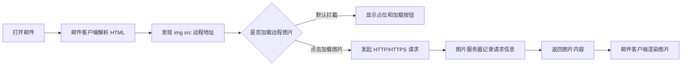

链路大概是这样：



问题就在 `F -> G`。

图片只是载体。真正泄漏信息的是那次请求。

## 实现原理：HTML 邮件里塞一个远程图片

HTML 邮件跟网页差不多。正文里可以放文字、表格、样式，也可以放图片。

图片有两种常见形态。

一种是内嵌图片，图片内容跟着邮件一起发过来。

另一种是远程图片，邮件里只放一个 URL：

```html

```

营销邮件、通知邮件、活动邮件里更常见的是后一种。而且它不会写得这么干净，经常会带上收件人标识：

```html

```

这里的 `open.gif` 可以是一张 `1x1` 的透明图片。你肉眼看不到它，但邮件客户端只要加载它，就会向 `track.example.com` 发起请求。

服务端收到请求以后，正常打日志就行。

它不需要入侵你的电脑，不需要执行脚本，也不需要浏览器漏洞。

因为 HTTP 请求天然就带着一堆上下文。

## 用一个最小服务复现

下面这个例子只用于理解原理。IP、User-Agent、打开时间都属于有隐私属性的访问日志。真在线上做，应该有明确的隐私说明、日志保留策略和合法用途。

先写一个最小的 Node.js 服务。

它做两件事：

1. 记录请求里的关键信息
2. 返回一张 `1x1` 透明 GIF，让客户端以为图片正常加载完成

```js
const express = require('express');

const app = express();
const port = 3000;

const transparentGif = Buffer.from(
  'R0lGODlhAQABAPAAAP///wAAACH5BAAAAAAALAAAAAABAAEAAAICRAEAOw==',
  'base64',
);

function getClientIp(req) {
  return req.socket.remoteAddress;
}

app.get('/pixel.gif', (req, res) => {
  const hit = {
    time: new Date().toISOString(),
    ip: getClientIp(req),
    method: req.method,
    path: req.path,
    query: req.query,
    userAgent: req.get('user-agent') || '',
    accept: req.get('accept') || '',
    acceptLanguage: req.get('accept-language') || '',
    referer: req.get('referer') || '',
    host: req.get('host') || '',
  };

  console.log('[pixel hit]', JSON.stringify(hit, null, 2));

  res.setHeader('Content-Type', 'image/gif');
  res.setHeader('Cache-Control', 'no-store, max-age=0');
  res.setHeader('Content-Length', transparentGif.length);
  res.end(transparentGif);
});

app.listen(port, () => {
  console.log(`pixel server listening on http://localhost:${port}`);
});
```

跑起来：

```bash
npm init -y
npm i express
node server.js
```

然后准备一个最小 HTML。为了方便复现，这里不用真发邮件，浏览器打开也能看到同一条请求链。

```html
<!doctype html>
<html>
  <body>
    <p>这是一封测试邮件的正文。</p>

    
  </body>
</html>
```

只要客户端加载这张图片，服务端就会收到请求。

本机测试时，控制台大概会打出这样的完整记录：

```json
{
  "time": "2026-05-12T10:30:12.891Z",
  "ip": "::1",
  "method": "GET",
  "path": "/pixel.gif",
  "query": {
    "mid": "mail_20260512",
    "uid": "user_7f3a9c",
    "campaign": "privacy_test"
  },
  "userAgent": "Mozilla/5.0 (Macintosh; Intel Mac OS X 10_15_7) AppleWebKit/537.36 (KHTML, like Gecko) Chrome/147.0.0.0 Safari/537.36",
  "accept": "image/avif,image/webp,image/apng,image/svg+xml,image/*,*/*;q=0.8",
  "acceptLanguage": "zh-CN,zh;q=0.9,en;q=0.8",
  "referer": "http://localhost:3000/test.html",
  "host": "localhost:3000"
}
```

这里的 `::1` 是本机 IPv6 回环地址。

如果把服务放到公网，比如：

```html

```

并且邮件客户端没有走隐私代理，那么服务器看到的就通常是你的公网出口 IP。

这就是“点击加载图片，IP 地址被泄漏”的核心。

不是图片有超能力。

是 `` 触发了 HTTP 请求，而服务器处理 HTTP 请求时天然能看到连接来源。

## 完整响应长什么样

服务端最后返回的东西可以非常小。

请求是这样：

```http
GET /pixel.gif?mid=mail_20260512&uid=user_7f3a9c&campaign=privacy_test HTTP/1.1
Host: track.example.com
User-Agent: Mozilla/5.0 (Macintosh; Intel Mac OS X 10_15_7) AppleWebKit/537.36 (KHTML, like Gecko) Chrome/147.0.0.0 Safari/537.36
Accept: image/avif,image/webp,image/apng,image/svg+xml,image/*,*/*;q=0.8
Accept-Language: zh-CN,zh;q=0.9,en;q=0.8
Connection: keep-alive
```

响应可以是这样：

```http
HTTP/1.1 200 OK
Content-Type: image/gif
Cache-Control: no-store, max-age=0
Content-Length: 43

GIF89a...
```

注意这里的响应体不是重点。

重点是请求已经到了服务端。

只要请求到了，访问日志就可以落下来：

```txt
203.0.113.24 - - [12/May/2026:10:30:12 +0000] "GET /pixel.gif?mid=mail_20260512&uid=user_7f3a9c&campaign=privacy_test HTTP/1.1" 200 43 "-" "Mozilla/5.0 ..."
```

这条日志里已经有几件事：

- `203.0.113.24`：请求来源 IP
- `10:30:12`：请求时间
- `/pixel.gif?...`：唯一追踪参数
- `200 43`：服务端成功返回了 43 字节图片
- `Mozilla/5.0 ...`：客户端特征

如果这是发给某个邮箱的一封邮件，`uid=user_7f3a9c` 又能在发件人的系统里映射到具体收件人，那么这条日志就不只是“有人访问了图片”。

它会变成：

某个收件人在某个时间，通过某个网络环境，加载了这封邮件里的远程图片。

## 除了 IP，还能拿到什么

IP 是最直观的，但不是唯一信息。

### 1. 打开时间

服务器收到请求时会有时间戳。

比如：

```json
{
  "time": "2026-05-12T10:30:12.891Z",
  "uid": "user_7f3a9c",
  "mid": "mail_20260512"
}
```

单看时间没什么。

放到邮件追踪里就不一样了：第一次打开是什么时候，过了多久又打开，晚上看还是白天看，工作日看还是周末看，都可以变成用户行为信号。

不过这里要小心。Apple Mail、Gmail、企业邮箱网关都可能预取、代理或安全扫描。图片请求时间不一定等于真人阅读时间。

### 2. 大致位置和网络环境

IP 不能直接定位到门牌号，但可以查出大概归属。

例如服务端记录到：

```json
{
  "ip": "203.0.113.24",
  "geo": {
    "country": "CN",
    "region": "Shanghai",
    "city": "Shanghai",
    "asn": "AS4812",
    "isp": "China Telecom"
  }
}
```

这类 `geo` 信息不是 HTTP 请求里自带的，而是服务端拿 IP 去查 IP 库得到的。

精度不稳定，但足够判断国家、城市、运营商、公司出口、学校出口、云厂商出口。有些公司网络的出口 IP 特征很明显，甚至能看出“这个请求大概率来自某个组织网络”。

### 3. User-Agent

`User-Agent` 会暴露客户端的大概形态。

比如：

```txt
Mozilla/5.0 (Macintosh; Intel Mac OS X 10_15_7) AppleWebKit/537.36 (KHTML, like Gecko) Chrome/147.0.0.0 Safari/537.36
```

从这里可以粗略判断：

- 操作系统是 macOS
- 渲染内核像 Chrome / Chromium
- 可能是浏览器环境，也可能是某些客户端内嵌的 WebView

真实邮件客户端会更复杂。有的会改写 User-Agent，有的会通过代理统一请求，有的会隐藏设备信息。

但只要它不做保护，User-Agent 就是一条很便宜的指纹线索。

### 4. Accept 和图片能力

图片请求里常见这个 header：

```txt
Accept: image/avif,image/webp,image/apng,image/svg+xml,image/*,*/*;q=0.8
```

它可以告诉服务端：客户端大概支持哪些图片格式。

例如支持 `image/avif`、`image/webp`，通常说明客户端比较新。某些老客户端可能只带 `image/*`，或者格式列表更短。

这不是强身份标识，但可以辅助判断客户端类型。

### 5. Accept-Language

语言偏好也可能被带上来：

```txt
Accept-Language: zh-CN,zh;q=0.9,en;q=0.8
```

这至少说明客户端语言环境偏中文，并且英语是备用语言。

单独看没什么，跟 IP、User-Agent、打开时间合起来，就会更像一个画像。

### 6. Referer

在普通网页里，图片请求可能带 `Referer`：

```txt
Referer: https://example.com/newsletter/preview.html
```

邮件客户端里不一定有。很多客户端会去掉 Referer，或者改成空值。

但如果是在网页邮箱、预览页、在线归档页里加载图片，Referer 可能会暴露来源页面。

这也是为什么我不喜欢把邮件追踪说成“只能拿 IP”。真实环境里能拿到什么，取决于客户端怎么发请求。

### 7. URL 里的唯一追踪 ID

这个最关键。

比如这段：

```txt
https://track.example.com/open.gif?mid=mail_20260512&uid=user_7f3a9c&campaign=privacy_test
```

`uid=user_7f3a9c` 可以对应某个收件人。

`mid=mail_20260512` 可以对应某封邮件。

`campaign=privacy_test` 可以对应某次投放。

就算 IP 不准、User-Agent 被隐藏，只要唯一 URL 被请求过，发件人就知道：

这封发给 `user_7f3a9c` 的邮件，里面那张远程图片被加载过。

这就是追踪像素真正有用的地方。

像素本身不重要。

唯一 URL 才重要。

## 代理后面的 IP，不一定是真实用户 IP

这里还有一个坑。

如果服务挂在 CDN、Nginx、负载均衡后面，Node.js 看到的 `req.socket.remoteAddress` 可能只是代理 IP。

链路会变成这样：

```txt
用户设备 -> CDN / Nginx / 负载均衡 -> Node.js
```

代理可能会把原始 IP 放进 `X-Forwarded-For`：

```txt
X-Forwarded-For: 203.0.113.24, 10.0.0.12
```

但不要在裸服务上无条件相信它。

客户端自己也能伪造这个 header。只有当请求确实来自你控制的可信代理时，`X-Forwarded-For` 才有参考价值。

Express 里常见写法是：

```js
const express = require('express');

const app = express();

// 只在服务确实挂在可信代理后面时开启。
// 生产环境应该按实际代理网段配置，不要随手 trust all。
app.set('trust proxy', 'loopback, linklocal, uniquelocal');

app.get('/pixel.gif', (req, res) => {
  console.log({
    ip: req.ip,
    ips: req.ips,
    rawRemoteAddress: req.socket.remoteAddress,
    xForwardedFor: req.get('x-forwarded-for') || '',
    userAgent: req.get('user-agent') || '',
  });

  res
    .type('gif')
    .send(
      Buffer.from(
        'R0lGODlhAQABAPAAAP///wAAACH5BAAAAAAALAAAAAABAAEAAAICRAEAOw==',
        'base64',
      ),
    );
});
```

这段代码的重点不是教你更精准追踪别人。

重点是说明：服务端到底能看到哪个 IP，取决于链路结构。

## 为什么邮件客户端要挡远程图片

到这里就能理解，邮件客户端默认不加载远程图片，不是在矫情。

它挡的是一次外连。

Outlook 经典版比较直接。Microsoft 的说明里写得很清楚，经典 Outlook 默认会阻止从 Internet 自动下载图片，原因包括避免恶意代码、节省低带宽下的下载成本，以及避免 tracking pixel 这种不可见图片告诉发件人你读过邮件。

Apple Mail 是另一套思路。开启“保护邮件活动”以后，它会隐藏你的 IP，并在收到邮件时用私密方式在后台下载远程内容，而不是等你真正查看邮件时才下载。这样发件人很难从图片请求判断你什么时候打开、打开几次、从哪里打开。

Gmail 又不一样。Gmail 默认显示邮件里的图片，但会通过 Google 的安全代理服务器处理邮件图片，并在遇到可疑发件人或可疑邮件时先询问要不要显示。

所以现在不能简单说“所有邮箱都默认不加载图片”。

更准确地说，各家都在拆同一条链：

```txt
收件人打开邮件 -> 邮件客户端请求远程图片 -> 发件人服务器记录行为
```

有的直接拦截。

有的走代理。

有的提前拉取，打乱打开时间。

目的差不多：别让发件人轻易通过一张图知道你来了。

## 我现在怎么点“加载图片”

我的习惯很简单。

银行、账单、验证码、自己订阅的可信服务，一般可以加载。

陌生营销邮件、来路不明的活动邮件、疑似钓鱼的“账号异常”“发票附件”“物流通知”，我基本不点。

如果一封邮件不加载图片就完全看不懂，它本身也挺怪的。交易类、安全类、通知类邮件，关键信息应该在文字里，而不是全靠远程图片撑起来。

对发件人来说，也要接受一个现实：

打开率越来越脏了。

Apple Mail 的隐私保护、Gmail 的图片代理、企业网关和安全扫描，都会让“图片被请求”不再等于“真人在这个时间读了邮件”。

它只能说明某个客户端、代理或安全系统请求过那张资源。

至于是不是用户本人打开，什么时候打开，在哪打开，已经没那么准了。

## 最后

点击“加载图片”这件事，表面上是在补全邮件内容。

底层发生的是一次 HTTP 请求。

只要请求打到发件人控制的服务器，对方就可能拿到：

- 你的出口 IP 或代理出口 IP
- 请求时间
- User-Agent
- Accept / Accept-Language
- Referer
- URL 里的收件人 ID、邮件 ID、活动 ID
- 重复打开次数

所以那句“加载图片”，我现在更愿意翻译成：

**允许这封邮件里的远程服务器记录一次我的访问。**

可信邮件当然没什么。

陌生邮件就别太大方了。

## 参考资料

- [Apple Support: Protect email privacy in Mail on Mac](https://support.apple.com/guide/mail/protect-email-privacy-mlhlp1205/mac)
- [Apple Support: Change Privacy settings in Mail on Mac](https://support.apple.com/guide/mail/change-privacy-settings-mlhlae4a4fe6/mac)
- [Apple Support: If you see “Unable to load remote content privately” at the top of an email](https://support.apple.com/en-gb/102289)
- [Gmail Help: Turn images on or off in Gmail](https://support.google.com/mail/answer/145919)
- [Google Workspace Admin Help: Set up an image URL proxy allowlist](https://support.google.com/a/answer/3299041)
- [Microsoft Support: Block or unblock automatic picture downloads in classic Outlook email messages](https://support.microsoft.com/en-us/office/block-or-unblock-automatic-picture-downloads-in-email-messages-15e08854-6808-49b1-9a0a-50b81f2d617a)
