## 文内导航

- [快速对照表](#快速对照表)
- [Gmail 邮箱怎么添加](#gmail-邮箱怎么添加)
- [Yahoo 邮箱怎么添加](#yahoo-邮箱怎么添加)
- [阿里邮箱怎么添加](#阿里邮箱怎么添加)
- [电信 189 邮箱怎么添加](#电信-189-邮箱怎么添加)
- [搜狐邮箱怎么添加](#搜狐邮箱怎么添加)
- [QQ / Foxmail 邮箱怎么添加](#qq-foxmail-邮箱怎么添加)
- [网易邮箱怎么添加](#网易邮箱怎么添加)
- [Outlook / Hotmail 邮箱怎么添加](#outlook-hotmail-邮箱怎么添加)
- [新浪邮箱怎么添加](#新浪邮箱怎么添加)
- [移动 139 邮箱怎么添加](#移动-139-邮箱怎么添加)
- [21CN 邮箱怎么添加](#21cn-邮箱怎么添加)
- [完美邮箱怎么添加](#完美邮箱怎么添加)
- [iCloud 邮箱怎么添加](#icloud-邮箱怎么添加)
- [AOL 邮箱怎么添加](#aol-邮箱怎么添加)
- [Yandex 邮箱怎么添加](#yandex-邮箱怎么添加)
- [Mail.ru 邮箱怎么添加](#mailru-邮箱怎么添加)
- [添加后怎么验证](#添加后怎么验证)

## 快速对照表

| 邮箱                   | 密码框填写   | IMAP                        | SMTP                              |
| ---------------------- | ------------ | --------------------------- | --------------------------------- |
| Gmail `@gmail.com`     | 应用密码     | `imap.gmail.com:993`        | `smtp.gmail.com:465`              |
| Yahoo `@yahoo.com`     | 应用程式密码 | `imap.mail.yahoo.com:993`   | `smtp.mail.yahoo.com:465`         |
| 阿里邮箱 `@aliyun.com` | 登录密码     | `imap.aliyun.com:993`       | `smtp.aliyun.com:465`             |
| 电信 189 `@189.cn`     | 登录密码     | `imap.189.cn:993`           | `smtp.189.cn:465`                 |
| 搜狐邮箱 `@sohu.com`   | 独立密码     | `imap.sohu.com:993`         | `smtp.sohu.com:465`               |
| QQ / Foxmail           | 授权码       | `imap.qq.com:993`           | `smtp.qq.com:465`                 |
| 网易邮箱               | 客户端授权码 | `imap.163.com:993`          | `smtp.163.com:465`                |
| Outlook / Hotmail      | 应用密码     | `outlook.office365.com:993` | `smtp.office365.com:587` STARTTLS |
| 新浪邮箱               | 客户端授权码 | `imap.sina.com:993`         | `smtp.sina.com:465`               |
| 移动 139 `@139.com`    | 客户端密码   | `imap.139.com:993`          | `smtp.139.com:465`                |
| 21CN `@21cn.com`       | 登录密码     | `imap.21cn.com:993`         | `smtp.21cn.com:465`               |
| 完美邮箱 `@88.com`     | 专用密码     | `imap.88.com:993`           | `smtp.88.com:465`                 |
| iCloud `@icloud.com`   | App 专用密码 | `imap.mail.me.com:993`      | `smtp.mail.me.com:587` 或 `465`   |
| AOL `@aol.com`         | 应用程序密码 | `imap.aol.com:993`          | `smtp.aol.com:465`                |
| Yandex `@yandex.com`   | 应用密码     | `imap.yandex.com:993`       | `smtp.yandex.com:465`             |
| Mail.ru `@mail.ru`     | 应用专用密码 | `imap.mail.ru:993`          | `smtp.mail.ru:465`                |

下面按服务商一个个写。

## Gmail 邮箱怎么添加

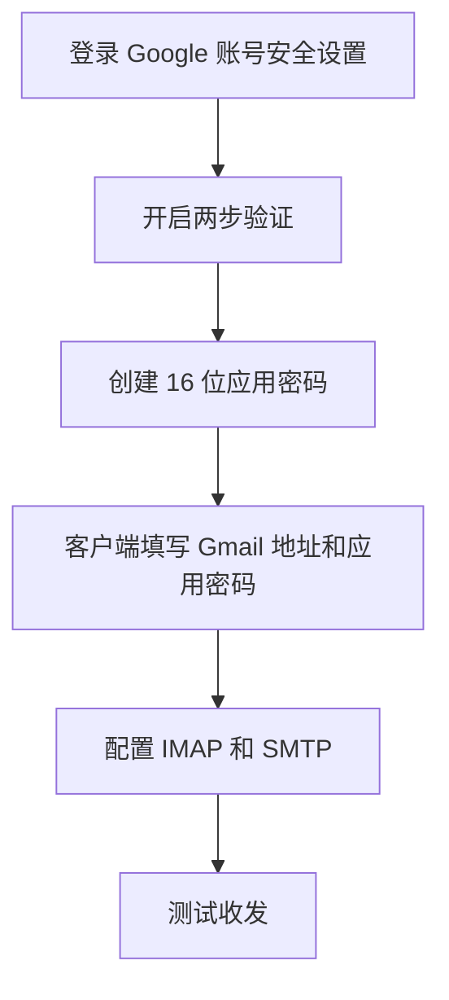

适用邮箱：`@gmail.com`

Gmail 不能直接拿 Google 账号主密码去登录第三方客户端。正确方式是先开启两步验证，再生成应用密码。

### 服务器参数

| 类型      | 服务器           | 端口          |
| --------- | ---------------- | ------------- |
| IMAP 收信 | `imap.gmail.com` | `993` SSL/TLS |
| SMTP 发信 | `smtp.gmail.com` | `465` SSL/TLS |

### 添加步骤

1. 打开 Google 账号安全设置页面。
2. 找到“两步验证”，按页面提示开启。
3. 开启两步验证后，进入“应用密码”页面。
4. 新建一个应用密码，名称可以写成“onemail”或你正在使用的客户端名称。
5. Google 会生成一个 16 位应用密码，立即复制保存。
6. 回到邮件客户端添加 Gmail。
7. 用户名填写完整 Gmail 地址。
8. 密码填写刚刚生成的 16 位应用密码，不要填 Google 登录密码。
9. 如果客户端要求手动配置服务器，就填上面的 IMAP/SMTP 参数。

### 操作截图

### 容易出错的地方

如果提示 `IMAP not enabled`，说明 Gmail 的 IMAP 访问还没开。进入 Gmail 网页版的“转发和 POP/IMAP”设置，把 IMAP access 改成 Enable，然后保存。

如果你找不到“应用密码”，通常是两步验证还没开启，或者账号策略不允许创建应用密码。

## Yahoo 邮箱怎么添加

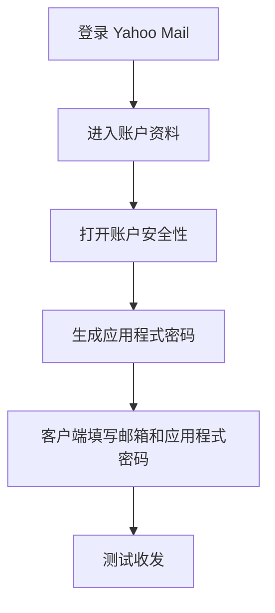

适用邮箱：`@yahoo.com`

Yahoo 添加到第三方客户端时要使用“应用程式密码”，不是 Yahoo 登录密码。

### 服务器参数

| 类型      | 服务器                | 端口          |
| --------- | --------------------- | ------------- |
| IMAP 收信 | `imap.mail.yahoo.com` | `993` SSL/TLS |
| SMTP 发信 | `smtp.mail.yahoo.com` | `465` SSL/TLS |

### 添加步骤

1. 登录 Yahoo Mail。
2. 点击右上角头像或姓名，进入“账户资料”。
3. 进入“账户安全性”。
4. 找到“产生应用程式密码”或“管理应用程式密码”。
5. 输入应用名称，比如“onemail”。
6. 点击生成，复制 16 位应用程式密码。
7. 在邮件客户端里添加 Yahoo 邮箱。
8. 用户名填写完整邮箱地址。
9. 密码填写应用程式密码。
10. 手动配置时填写上面的 IMAP/SMTP 参数。

### 操作截图

### 容易出错的地方

如果账户安全性里找不到生成应用程式密码的入口，先检查 Yahoo 账号是否已经开启两步验证。部分账号需要先完成两步验证，才会显示应用密码入口。

## 阿里邮箱怎么添加

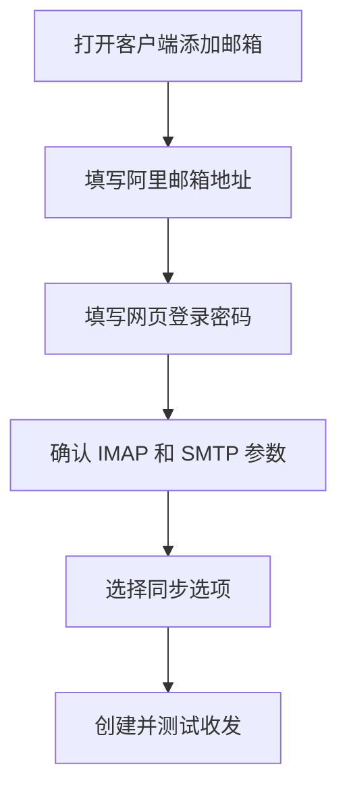

适用邮箱：`@aliyun.com`

阿里邮箱的添加方式比较直接，通常使用邮箱登录密码即可。

### 服务器参数

| 类型      | 服务器            | 端口          |
| --------- | ----------------- | ------------- |
| IMAP 收信 | `imap.aliyun.com` | `993` SSL/TLS |
| SMTP 发信 | `smtp.aliyun.com` | `465` SSL/TLS |

### 添加步骤

1. 在邮件客户端里选择添加邮箱。
2. 邮箱地址填写完整的阿里邮箱地址。
3. 密码填写阿里邮箱网页登录密码。
4. 如果客户端可以自动识别服务器，确认识别结果是否为上面的 IMAP/SMTP 参数。
5. 如果不能自动识别，就手动填写 `imap.aliyun.com` 和 `smtp.aliyun.com`。
6. 保存后测试收信和发信。

### 操作截图

### 容易出错的地方

如果登录密码确认没错但仍然失败，去阿里邮箱网页版检查 IMAP/SMTP 服务是否被关闭。它通常默认可用，但也可能被手动关掉。

## 电信 189 邮箱怎么添加

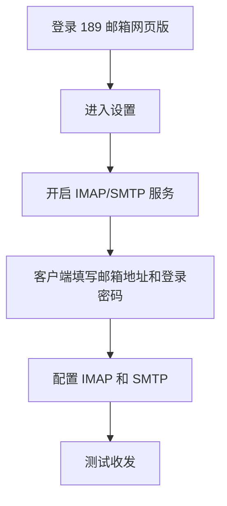

适用邮箱：`@189.cn`

189 邮箱使用登录密码添加，但需要先在网页端开启 IMAP/SMTP 服务。

### 服务器参数

| 类型      | 服务器        | 端口          |
| --------- | ------------- | ------------- |
| IMAP 收信 | `imap.189.cn` | `993` SSL/TLS |
| SMTP 发信 | `smtp.189.cn` | `465` SSL/TLS |

### 添加步骤

1. 登录 189 邮箱网页版。
2. 点击页面右上角“设置”。
3. 进入 `IMAP/POP3/SMTP服务` 标签页。
4. 勾选 `IMAP/SMTP服务`。
5. 回到邮件客户端添加邮箱。
6. 用户名填写完整 `@189.cn` 邮箱地址。
7. 密码填写 189 邮箱网页登录密码。
8. 手动配置时填写 `imap.189.cn:993` 和 `smtp.189.cn:465`。

### 操作截图

### 容易出错的地方

189 邮箱不需要授权码。你要查的是 IMAP/SMTP 服务有没有开启，以及登录密码是否能正常登录网页版。

## 搜狐邮箱怎么添加

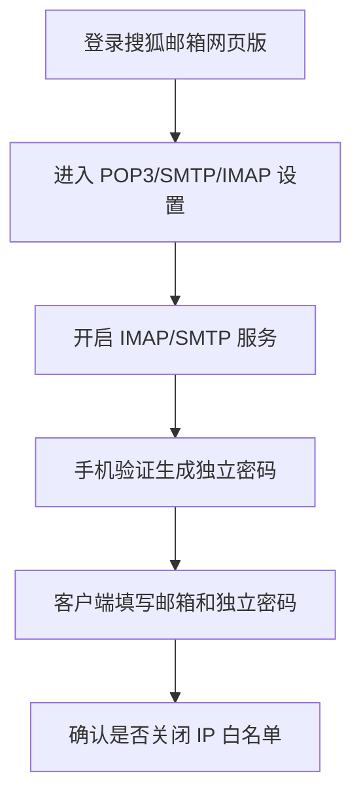

适用邮箱：`@sohu.com`

搜狐邮箱需要先开启 IMAP/SMTP，再生成“独立密码”。客户端里填独立密码，不填登录密码。

### 服务器参数

| 类型      | 服务器          | 端口          |
| --------- | --------------- | ------------- |
| IMAP 收信 | `imap.sohu.com` | `993` SSL/TLS |
| SMTP 发信 | `smtp.sohu.com` | `465` SSL/TLS |

### 添加步骤

1. 登录搜狐邮箱网页版。
2. 点击页面顶部“选项”。
3. 进入“设置”。
4. 打开 `POP3/SMTP/IMAP` 标签页。
5. 勾选 `IMAP/SMTP服务`。
6. 按页面提示获取手机验证码，完成安全验证。
7. 验证成功后，系统会生成“独立密码”。
8. 立即复制独立密码并保存。
9. 回到邮件客户端添加搜狐邮箱。
10. 用户名填写完整邮箱地址。
11. 密码填写独立密码。
12. 手动配置时填写 `imap.sohu.com:993` 和 `smtp.sohu.com:465`。

### 操作截图

### IP 白名单要不要开

普通用户建议关闭 IP 白名单模式。

如果你没有固定公网 IP，开启白名单后，很容易因为网络变化导致客户端突然无法收发邮件。只用独立密码验证，通常更稳。

## QQ / Foxmail 邮箱怎么添加

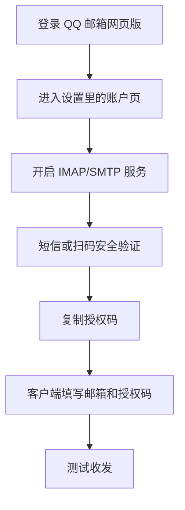

适用邮箱：`@qq.com`、`@foxmail.com`

QQ 邮箱和 Foxmail 邮箱走同一套腾讯邮箱后台。添加第三方客户端时必须使用授权码。

### 服务器参数

| 类型      | 服务器        | 端口          |
| --------- | ------------- | ------------- |
| IMAP 收信 | `imap.qq.com` | `993` SSL/TLS |
| SMTP 发信 | `smtp.qq.com` | `465` SSL/TLS |

### 添加步骤

1. 登录 QQ 邮箱网页版。
2. 点击顶部“设置”。
3. 切换到“账户”标签页。
4. 找到 `POP3/IMAP/SMTP/Exchange/CardDAV/CalDAV服务`。
5. 如果 IMAP/SMTP 服务未开启，点击“开启”。
6. 按页面提示完成安全验证，通常需要绑定手机发送短信。
7. 某些账号还可能要求微信扫码二次验证。
8. 验证成功后，页面会显示授权码。
9. 立即复制授权码并保存。
10. 回到邮件客户端添加 QQ 或 Foxmail 邮箱。
11. 用户名填写完整邮箱地址。
12. 密码填写授权码，不要填 QQ 密码。
13. 手动配置时填写 `imap.qq.com:993` 和 `smtp.qq.com:465`。

### 操作截图

### 容易出错的地方

如果你之前开启过 IMAP 服务，但忘记了授权码，不能找回旧授权码。回到 QQ 邮箱账户设置里重新生成即可。

`@qq.com` 和 `@foxmail.com` 的配置流程一样，服务器参数也一样。

## 网易邮箱怎么添加

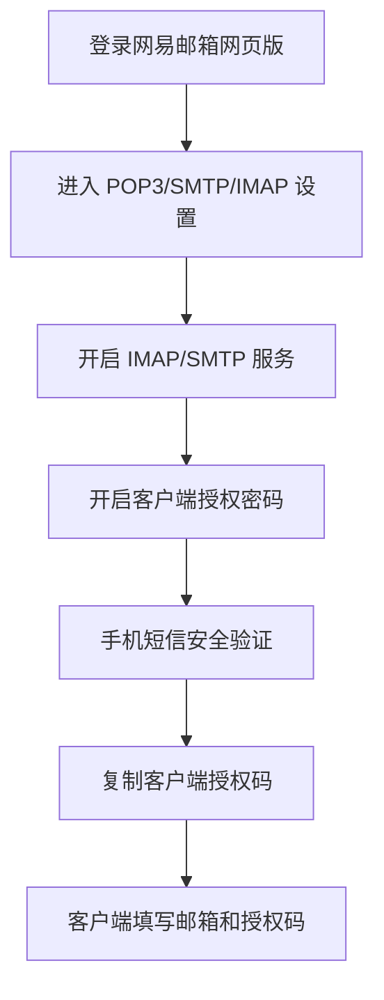

适用邮箱：`@163.com`、`@126.com`、`@yeah.net` 等网易个人邮箱

网易邮箱需要开启 IMAP/SMTP 服务，并生成“客户端授权码”。

### 服务器参数

| 类型      | 服务器         | 端口          |
| --------- | -------------- | ------------- |
| IMAP 收信 | `imap.163.com` | `993` SSL/TLS |
| SMTP 发信 | `smtp.163.com` | `465` SSL/TLS |

### 添加步骤

1. 登录网易邮箱网页版。
2. 点击顶部“设置”。
3. 从左侧菜单进入 `POP3/SMTP/IMAP`。
4. 确认 `IMAP/SMTP服务` 已开启。
5. 确认 `POP3/SMTP服务` 已开启。
6. 找到“客户端授权密码”，点击开启或生成。
7. 按页面提示完成手机短信等安全验证。
8. 验证成功后，系统会生成客户端授权码。
9. 立即复制授权码并保存。
10. 回到邮件客户端添加网易邮箱。
11. 用户名填写完整邮箱地址。
12. 密码填写客户端授权码，不要填网易邮箱登录密码。
13. 手动配置时填写上面的 IMAP/SMTP 参数。

### 操作截图

### 多个网易后缀怎么处理

`@163.com`、`@126.com`、`@yeah.net` 的授权码流程一样。

文档里建议使用 `imap.163.com` 和 `smtp.163.com` 作为通用配置，兼容性较好。如果你的网页版后台给出了当前后缀专属服务器，也可以按后台提示填写。

## Outlook / Hotmail 邮箱怎么添加

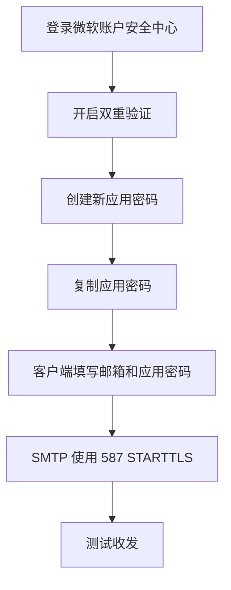

适用邮箱：`@outlook.com`、`@hotmail.com`

微软邮箱需要开启双重验证，然后生成应用密码。这里最容易错的是 SMTP：它用 `587 + STARTTLS`。

### 服务器参数

| 类型      | 服务器                  | 端口           |
| --------- | ----------------------- | -------------- |
| IMAP 收信 | `outlook.office365.com` | `993` SSL/TLS  |
| SMTP 发信 | `smtp.office365.com`    | `587` STARTTLS |

### 添加步骤

1. 登录微软账户安全中心。
2. 找到“双重验证”，按提示开启。
3. 在同一安全设置页面找到“应用密码”。
4. 点击“创建新应用密码”。
5. 系统会生成一个应用密码。
6. 立即复制保存，因为之后通常无法再次查看。
7. 回到邮件客户端添加 Outlook 或 Hotmail。
8. 用户名填写完整邮箱地址。
9. 密码填写微软应用密码，不要填微软账号主密码。
10. 手动配置 IMAP 为 `outlook.office365.com:993`。
11. 手动配置 SMTP 为 `smtp.office365.com:587`，加密方式选择 STARTTLS。

### 操作截图

### 容易出错的地方

不要把 Outlook 的 SMTP 配成 `465 + SSL/TLS`。很多邮箱都是 465，但微软这里是 `587 + STARTTLS`。

如果关闭双重验证，之前创建的应用密码会失效。

## 新浪邮箱怎么添加

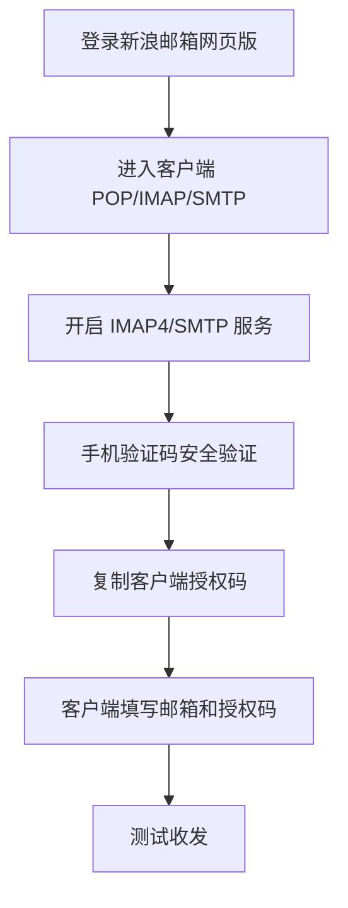

适用邮箱：`@sina.com`、`@sina.cn`

新浪邮箱不能直接用登录密码添加。要先开启 IMAP4/SMTP 服务，再获取“客户端授权码”。

### 服务器参数

| 类型      | 服务器          | 端口          |
| --------- | --------------- | ------------- |
| IMAP 收信 | `imap.sina.com` | `993` SSL/TLS |
| SMTP 发信 | `smtp.sina.com` | `465` SSL/TLS |

### 添加步骤

1. 登录新浪邮箱网页版。
2. 点击页面右上角“设置”。
3. 进入 `客户端POP/IMAP/SMTP`。
4. 找到 `IMAP4/SMTP服务`。
5. 将服务状态设置为开启。
6. 按提示输入绑定手机号并填写短信验证码。
7. 验证成功后，系统会弹出 16 位客户端授权码。
8. 立即复制并保存。
9. 回到邮件客户端添加新浪邮箱。
10. 用户名填写完整邮箱地址。
11. 密码填写客户端授权码，不要填邮箱登录密码。
12. 手动配置时填写 `imap.sina.com:993` 和 `smtp.sina.com:465`。

### 操作截图

### 容易出错的地方

新浪授权码只显示一次。如果忘记了，只能重新走一遍开启和验证流程获取新的授权码。

如果绑定手机号已经不可用，需要先在新浪邮箱账户安全设置里更新密保手机。

## 移动 139 邮箱怎么添加

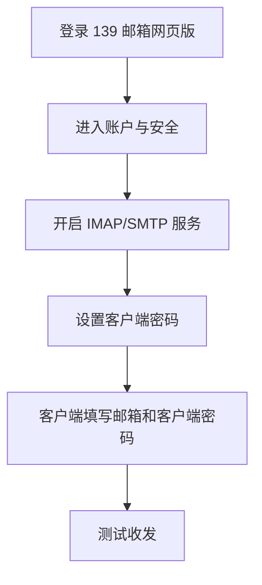

适用邮箱：`@139.com`

139 邮箱要先开启 IMAP/SMTP，然后设置“客户端密码”。它不是随机生成，而是让你自己设置一个客户端专用密码。

### 服务器参数

| 类型      | 服务器         | 端口          |
| --------- | -------------- | ------------- |
| IMAP 收信 | `imap.139.com` | `993` SSL/TLS |
| SMTP 发信 | `smtp.139.com` | `465` SSL/TLS |

### 添加步骤

1. 登录 139 邮箱网页版。
2. 进入页面顶部“设置”。
3. 在左侧菜单选择“账户与安全”。
4. 找到“邮箱协议设置”。
5. 确认 `IMAP/SMTP服务` 已开启。
6. 回到“账户与安全”，进入“客户端密码”。
7. 按页面提示设置一个新的客户端密码。
8. 过程中可能需要短信验证码等安全验证。
9. 设置成功后保存这个客户端密码。
10. 回到邮件客户端添加 139 邮箱。
11. 用户名填写完整 `@139.com` 邮箱地址。
12. 密码填写刚刚设置的客户端密码，不要填主登录密码。
13. 手动配置时填写 `imap.139.com:993` 和 `smtp.139.com:465`。

### 操作截图

### 容易出错的地方

139 邮箱的客户端密码是“设置”出来的，不是页面自动生成随机密码。忘记后可以回到“客户端密码”页面重新设置。

## 21CN 邮箱怎么添加

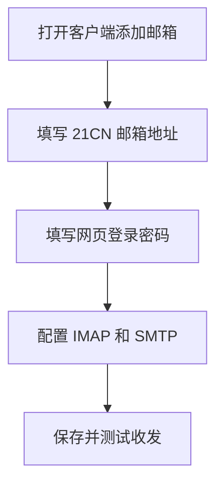

适用邮箱：`@21cn.com`

21CN 邮箱比较简单，IMAP/SMTP 默认开启，直接使用邮箱登录密码添加。

### 服务器参数

| 类型      | 服务器          | 端口          |
| --------- | --------------- | ------------- |
| IMAP 收信 | `imap.21cn.com` | `993` SSL/TLS |
| SMTP 发信 | `smtp.21cn.com` | `465` SSL/TLS |

### 添加步骤

1. 打开邮件客户端，选择添加邮箱。
2. 邮箱地址填写完整 `@21cn.com` 地址。
3. 密码填写 21CN 邮箱网页登录密码。
4. 如果需要手动配置，填写 `imap.21cn.com:993` 和 `smtp.21cn.com:465`。
5. 保存后测试收信和发信。

### 操作截图

### 容易出错的地方

21CN 和 189 都属于电信相关邮箱，但配置策略不一样。21CN 默认允许密码直连，189 需要先在网页端开启 IMAP/SMTP。

## 完美邮箱怎么添加

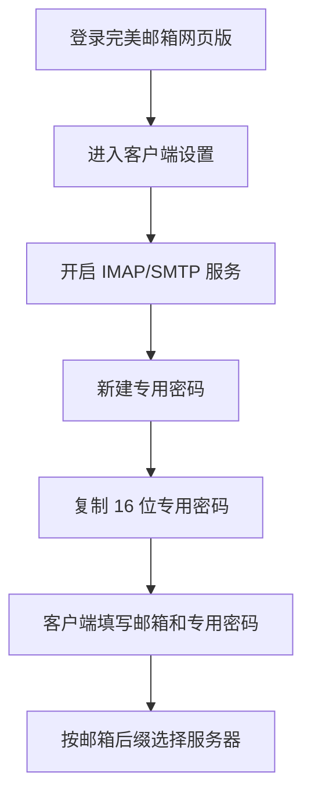

适用邮箱：`@88.com`、`@111.com`、`@email.cn`

完美邮箱需要开启客户端访问服务，并生成“专用密码”。

### 服务器参数

| 后缀        | IMAP                | SMTP                |
| ----------- | ------------------- | ------------------- |
| `@88.com`   | `imap.88.com:993`   | `smtp.88.com:465`   |
| `@111.com`  | `imap.111.com:993`  | `smtp.111.com:465`  |
| `@email.cn` | `imap.email.cn:993` | `smtp.email.cn:465` |

### 添加步骤

1. 登录完美邮箱网页版。
2. 进入“设置”。
3. 在左侧菜单选择“客户端设置”。
4. 确认 `IMAP/SMTP` 服务已开启。
5. 确认 `POP3/SMTP` 服务已开启。
6. 在同一页面下方找到“专用密码”。
7. 点击“新建专用密码”。
8. 输入一个容易识别的名称，比如“onemail客户端”。
9. 点击确定后，系统会生成 16 位专用密码。
10. 立即复制并保存。
11. 回到邮件客户端添加邮箱。
12. 用户名填写完整邮箱地址。
13. 密码填写 16 位专用密码。
14. 服务器按邮箱后缀选择上面的对应参数。

### 操作截图

### 容易出错的地方

不要把 `@111.com`、`@email.cn` 都强行填成 `imap.88.com`。完美邮箱不同后缀对应不同服务器。

## iCloud 邮箱怎么添加

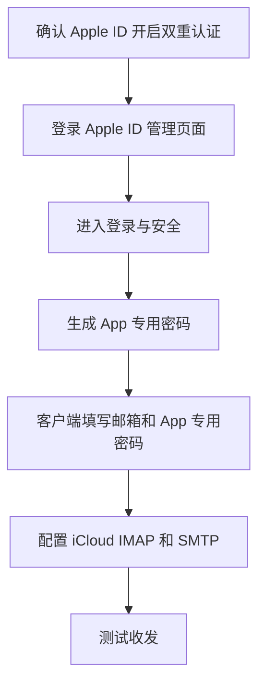

适用邮箱：`@icloud.com`、`@me.com`、`@mac.com`

iCloud 邮箱必须使用 Apple ID 的 App 专用密码。直接填 Apple ID 主密码无法登录。

### 服务器参数

| 类型      | 服务器             | 端口           |
| --------- | ------------------ | -------------- |
| IMAP 收信 | `imap.mail.me.com` | `993` SSL/TLS  |
| SMTP 发信 | `smtp.mail.me.com` | `587` 或 `465` |

### 添加步骤

1. 确认 Apple ID 已开启双重认证。
2. 打开 Apple ID 管理页面：`https://appleid.apple.com/`。
3. 使用 Apple ID 登录，并完成双重认证。
4. 进入“登录与安全”。
5. 找到“App 专用密码”。
6. 点击生成 App 专用密码。
7. 输入标签，比如“onemail”。
8. Apple 会生成类似 `xxxx-xxxx-xxxx-xxxx` 的专用密码。
9. 立即复制保存。
10. 回到邮件客户端添加 iCloud 邮箱。
11. 用户名填写完整邮箱地址。
12. 密码填写 App 专用密码，包括连字符。
13. 手动配置时填写 `imap.mail.me.com:993` 和 `smtp.mail.me.com:587`。

### 操作截图

### 容易出错的地方

App 专用密码忘记后不能查看，只能撤销旧密码后重新生成。

同一个 App 专用密码可以复用，但不建议。最好一个客户端一个密码，后续撤销时不会影响其他客户端。

## AOL 邮箱怎么添加

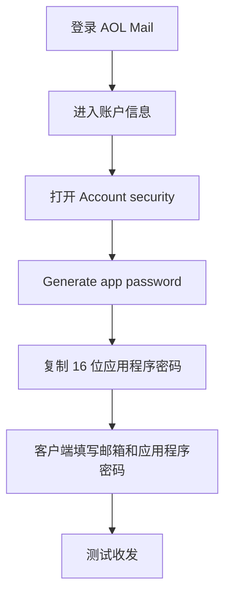

适用邮箱：`@aol.com`

AOL Mail 要生成“应用程序密码”。它的流程和 Yahoo 很像。

### 服务器参数

| 类型      | 服务器         | 端口          |
| --------- | -------------- | ------------- |
| IMAP 收信 | `imap.aol.com` | `993` SSL/TLS |
| SMTP 发信 | `smtp.aol.com` | `465` SSL/TLS |

### 添加步骤

1. 登录 AOL Mail：`https://mail.aol.com/`。
2. 进入账户信息页面。
3. 从左侧菜单选择 `Account security`。
4. 找到 `Generate app password`。
5. 输入应用名称，比如“onemail”。
6. 点击生成。
7. 系统会显示 16 位应用程序密码。
8. 立即复制并保存。
9. 回到邮件客户端添加 AOL 邮箱。
10. 用户名填写完整邮箱地址。
11. 密码填写应用程序密码。
12. 手动配置时填写 `imap.aol.com:993` 和 `smtp.aol.com:465`。

### 操作截图

### 容易出错的地方

AOL 的应用程序密码无法找回。忘记或泄露后，回到账户安全页面重新生成。

## Yandex 邮箱怎么添加

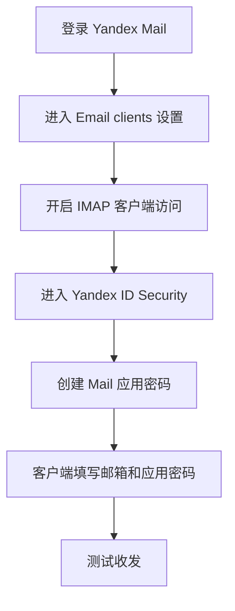

适用邮箱：`@yandex.com`

Yandex 要先开启 IMAP/POP3 客户端访问，再生成应用密码。

### 服务器参数

| 类型      | 服务器            | 端口          |
| --------- | ----------------- | ------------- |
| IMAP 收信 | `imap.yandex.com` | `993` SSL/TLS |
| SMTP 发信 | `smtp.yandex.com` | `465` SSL/TLS |

### 添加步骤

1. 登录 Yandex Mail：`https://mail.yandex.com/`。
2. 进入邮箱设置。
3. 打开 `Email clients`。
4. 勾选 `From the imap.yandex.com server via IMAP`。
5. 如有需要，也可以同时开启 POP3。
6. 点击 `Save changes` 保存。
7. 进入 Yandex ID 账户管理。
8. 打开 `Security` 标签页。
9. 找到 `App passwords`。
10. 选择为 Yandex Mail 创建新密码。
11. 输入名称，比如“onemail”。
12. 点击 `Create`。
13. 复制系统生成的应用密码。
14. 回到邮件客户端添加 Yandex 邮箱。
15. 用户名填写完整邮箱地址。
16. 密码填写应用密码。
17. 手动配置时填写 `imap.yandex.com:993` 和 `smtp.yandex.com:465`。

### 操作截图

### 容易出错的地方

Yandex 的应用密码生成前，必须先打开邮件客户端协议。只生成密码但没开 IMAP，第三方客户端仍然无法同步邮件。

## Mail.ru 邮箱怎么添加

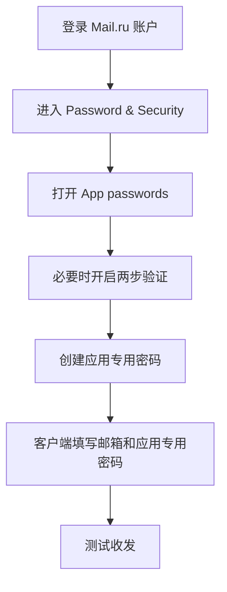

适用邮箱：`@mail.ru`

Mail.ru 建议开启两步验证，并使用应用专用密码登录第三方客户端。

### 服务器参数

| 类型      | 服务器         | 端口          |
| --------- | -------------- | ------------- |
| IMAP 收信 | `imap.mail.ru` | `993` SSL/TLS |
| SMTP 发信 | `smtp.mail.ru` | `465` SSL/TLS |

### 添加步骤

1. 登录 Mail.ru 账户。
2. 进入 `Password & Security`。
3. 找到 `App passwords`，部分账号可能显示为 `External application passwords`。
4. 如果页面要求先开启两步验证，先按提示完成。
5. 创建应用密码前，可能需要完成人机验证。
6. 输入一个便于识别的应用名称，比如“onemail”。
7. 点击创建。
8. 系统会生成应用专用密码。
9. 立即复制并保存。
10. 回到邮件客户端添加 Mail.ru 邮箱。
11. 用户名填写完整邮箱地址。
12. 密码填写应用专用密码。
13. 手动配置时填写 `imap.mail.ru:993` 和 `smtp.mail.ru:465`。

### 操作截图

### 容易出错的地方

如果你所在网络访问 Mail.ru 官网不稳定，收发服务器也可能连接慢。第一次配置仍然需要进官网拿应用专用密码，之后客户端收发再看服务商连接情况。

## 添加后怎么验证

每个邮箱添加完后，最好不要只看“保存成功”。

按这个顺序测一遍：

1. 刷新收件箱，看 IMAP 是否能同步。
2. 给自己发一封测试邮件，看 SMTP 是否能发出。
3. 从网页登录邮箱，确认测试邮件是否真的进入“已发送”。
4. 如果能收不能发，优先查 SMTP 服务器、端口和加密方式。
5. 如果认证失败，优先查密码类型是不是填错了。

最常见的错误还是那几个：

| 现象                   | 优先检查                                |
| ---------------------- | --------------------------------------- |
| 一直提示密码错误       | 是否把登录密码填进了授权码/应用密码位置 |
| 能收不能发             | SMTP 服务器、端口、加密方式             |
| Gmail 提示 IMAP 未启用 | Gmail 网页版是否开启 IMAP access        |
| Outlook 发信失败       | 是否使用 `587 + STARTTLS`               |
| 搜狐换网络后不能用     | 是否开启了 IP 白名单                    |

邮件添加看起来只是填账号密码，实际每家邮箱的安全策略都不一样。

按服务商一步一步来，比盲试密码快得多。
